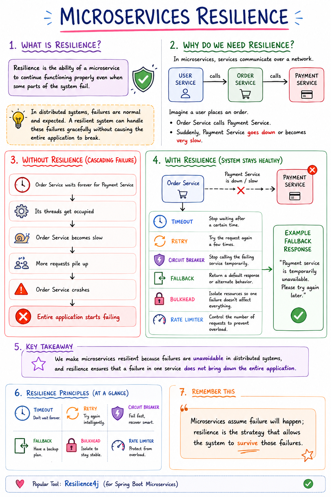

# Making Microservices Resilient:
* In a microservices environment there can be many challenges that are faced by the microservices .
  * Be it network or internal factors like slow processing or server overload etc.
* In monolithic application the entire product was a single app and any issues caused inside the same app could hamper the entire app .
* That is the reason why microservices were introduced so that individual responsibilities of a big app can be broken down to simpler smaller apps.
* But that doesn't mean microservices architect will be perfect , offcourse there will be issue's.
* 
* If you look at the image above then you can understand better.

### Scenario:
* Suppose we have a product and inside that product there are going to be multiple microservices running.
* Suppose we have Users service ,orders Service and payments Service .
* We know that each service has its own set of threads , and these threads are host system independent.
* Suppose the flow of control goes like : User places some order but before placing the order the payments service is called to make the payment.
* Now order is only placed and successful only when payment is done and a positive response is sent back by the payments service to the orders service.
* Suppose for some xyz reasons the payment service is working very slowly:
  * Maybe due to some network issue like orders is calling payment service hosted on some other machine but the machine on which payment service is hosted has a internet or network which has got slowed.
  * Maye due to some large chunk of code getting executed inside the payment service.
  * Maybe the payment service threads are all occupied and are working.
  * Maybe the machine on which payment service is hosted has all of its resources occupied by other services or apps due to which payment service threads are not getting the required allocation.
  * There can be multiple reasons.
* Now what will happen is orders service will keep sending new new orders request to the payment service which is already slow or is fully occupied .
* Due to this what will happen is slowly with time threads of orders service will also start getting occupied .
* Well it is not made using some NETTY Server like gateway that its threads will get freed easily.
* Obviously its threads will remain occupied due to which after some time due to payments service working slowly and sending a response back to the orders service either very slowly or not at all , this will cause the orders service to also become slow and loaded .
* Due to which at last the server might just crash .
* See how because of one microservice other services are also getting affected .
* This event is known as cascading failures.
* So we need to find and learn ways in which we can counter this issues so that our services work properly.

### Questions:
* How do we avoid cascading failures ?
  * -> One failed or slow service should not have a ripple effect on the other microservices.
  * -> Like in the scenario of multiple microservices are communicating , we need to make sure that the entire chain of microservices does not fail with the failure of a single microservice.

* How do we handle failures gracefully with fallbacks ?
  * -> In a chain of multiple microservices, how do we build a fallback mechanism like if one of the service is not working as expected , then what should we do so that the incoming requests start getting back a default response , like be it calling some other service or fetching some other record.

* How to make our services self-healing capable ?
  * -> In the cases of slow performing services , how do we configure timeouts , retries and give time for a failed service to recover itself.

### Methods in which we can implement Resiliency:
* 
* We will be using a popular library Resilience4j to implement all of the above.
* We will learn more about these methods in the upcoming lecture.
* Link: ``https://resilience4j.readme.io/docs/getting-started``
* You can go to the above link and study more about the different methods.

### 1st Commit: "Introduction to Resiliency | Ways to implement it | Importance of Resiliency in a microservices based architect"
___

### Circuit Breaker Pattern:
* It is a very famous pattern followed by most of the microservices across the world.
* It is similar to a electric circuit.
* Suppose there are several devices connected in a circuit and at the beginning of the circuit sits a fuse/breaker .
* The task of the fuse/breaker is to detect if there is any excess current flowing .
* If excess current flows so the fuse breakers causing the current to stop flowing.
* It has 2 states : closed when the circuit is ok , open when the circuit is faulty and needs time to recover.
* Well now let's understand how circuit breaker pattern works in the microservices environment.
  * Suppose 2 services are there Service A and Service B .
  * Suppose the task of service A is to send requests to service B .
  * Now due to some reason be it due to network reasons or internal reasons of service B , the service A is getting affected .
  * Slow response by service B due to which threads of service A are waiting or are getting occupied for longer period of time due to which the load on service A is also increasing.
  * So if the service B doesnt get back to its normal working state then it will cause the failure of service A also.
  * So we need to do something .
  * Solution:
    * We have to monitor the response time and other factors of service B , And we will do all this by sitting at service A.
    * Service A will keep monitoring service B and it will decide whether to send any furthur requests to B or not.
    * And also if Service A is not sending any requests to service B then definitely it has to handle them either by rejecting the requests or by calling some other fallback methods.
    * And also After some time duration when Service A feels that maybe service B would have recoverd by now so it starts sending the incoming requests to service B but in a specific defined and lesser numbers to test if service B can properly process and send back the response or not.
    * If again the service B is failing to send back responses properly then Service A again will stop sending requests to service B.
    * All the above things which i mentioned under the Solution: This is know as the circuit breaker pattern.
* Circuit Breaker Pattern:
  * In a distributed environment , calls to remote resources and service can fail due to transient faults , such as slow network connections , timeouts or the resources being overcommitted or temporarily unavailable.
  * These faults typically correct themselves after a short period of time and a robust cloud application should be prepared to handle them.
  * The circuit breaker pattern which is inspired from electrical circuit breaker will monitor the remote calls . If the calls take too long and the no of failed call attempts cross a certain threshold then the circuit breaker will intercede and kill the call.
  * Also, the circuit breaker will monitor all calls to a remote resource , and if enough calls fail , the circuit break implementation will pop , failing fast and preventing future calls to the failing remote resource.
  * The circuit breaker pattern also enables a application to detect whether the fault has been resolved . If the problem appears to have been fixed, the application can try to invoke the operation.
  * Advantages of circuit breaker pattern:
    * Fail fast.
    * Fail gracefully.
    * Recover seamlessly.
* There are 3 states : 
    * Closed when everything is fine and working.
    * Open when the other service is healing or handling its prebooked or other exisiting requests and in this stage calls are not made to the healing service so that it first solves its existing requests and after that let it heal.
    * Half-Open state when the service is tested by sending a limited no or actual requests rather than sending so many.

### Circuit breaker can be implmented both in service to service call and Gateway Server too.
### Difference is incase of gateway server we will have to write the Reactive coding syntax's .

### Diagram of a Circuit Breaker in terms of Electric Circuit:
* 

### Diagramatic Flow of Circuit Breaker in terms of microservices Calls and Gateway Server:
* 

### Circuit Breaker Flow and Sliding window:
* Image 1:
    * 
* Image 2:
    * 

### 2nd Commit: " Circuit Breaker Pattern Introduction and Cases"

___
