## Rate Limiter inside a Service:
* Many times we need to apply requests processing limitations to the API's inside the app .
* If you go to google or chatgpt and ask how can we apply RateLimiter to the API's inside the app then it will give you many results and ways.
* But one of the easiest way is to use the Resilience Rate limiter inside the spring boot app which is very easy to use and configure.
* Let me show you how to use it :
* Suppose i want a rate Limiter to be added to the get-java-version api of the accounts controller:
* 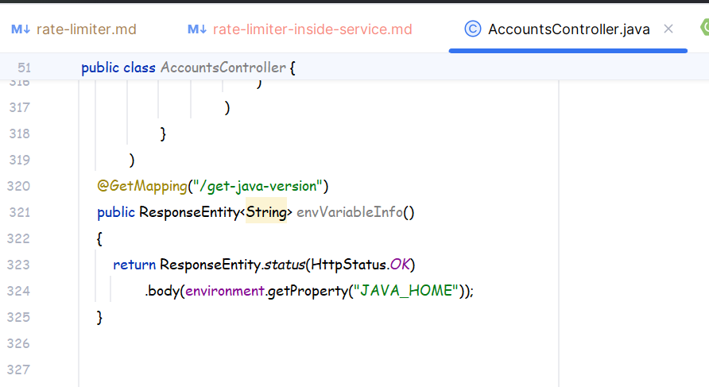
* Now the first thing that we need to do is :
* 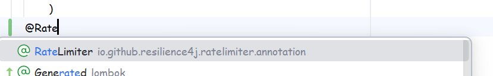
* Use the above annotation.
* 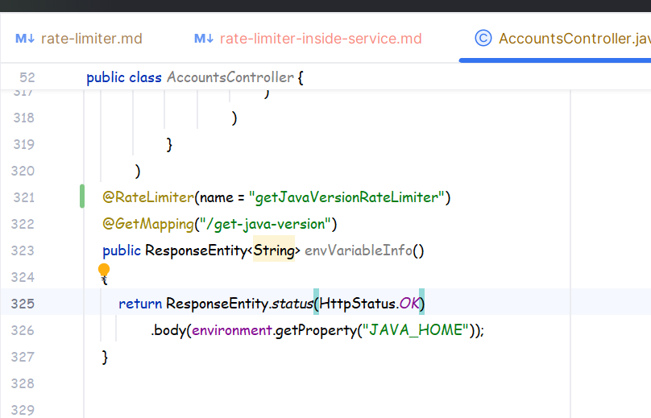
* Then we gave it a name .
* Now what we have to do is create some configs for the above RateLimiter in the application.yml :
* Open the Application.yml of the accounts' app:
* 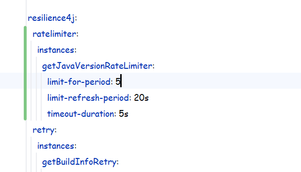
* This is the config that we used now:
* Let me explain the parameters and the values:
  * ``limit-for-period: 5`` : This means a total of 5 requests are allowed or permitted , within a time period of whatever is the value inside ``limit-refresh-period``.
  * ``limit-refresh-period: 20s``: This means that it will take 20s to fill the limit-for-bucket back to 5 , or even if there were only 3 tokens inside that limit-for-period then after 20s it will become 5 again.
  * ``time-out-duration: 5s``: This means suppose 5 requests came within a sec or anytime duration to the api then it will use all the tokens , and now when the 6th request comes in there are no more tokens left which can allow it for furthur processing and in this case the time-out-duration means how long will this 6th request wait till it sends back a 429 Too many requests.

* We are not using any Fallback right , we will use fallback ahead . But let me be very clear.
* ``Mostly for this type of Rate Limiter where it is being used inside the App , usually Exceptions are thrown rather than calling fallback and the default exception is 429 Too many Requests``

## Testing 1:
* Now start the apps configServer->Eureka->Accounts->Gateway .
* Now open Postman:
* 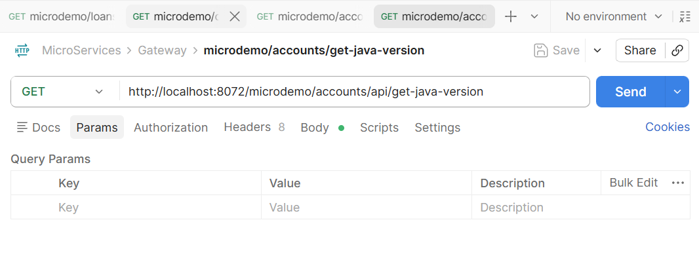
* Hit the above API Continuously:
* Wait since we have circuitBreaker and timeout in the Routes for accounts so we will get the fallback response as it will open the ciruit soon enough and we cant even try again and again .
* Lets just do one thing for this one time lets disable the CiruitBreaker for the Accounts Route inside the gatewayConfig:
* 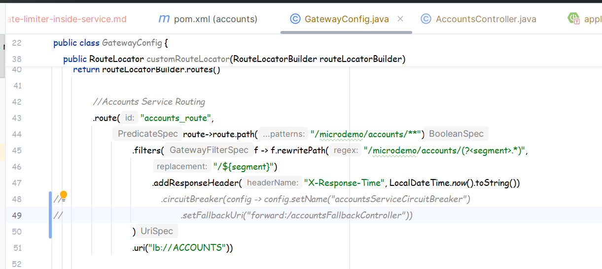
* Now again start all the apps in the above order and this time lets do the testing.
* 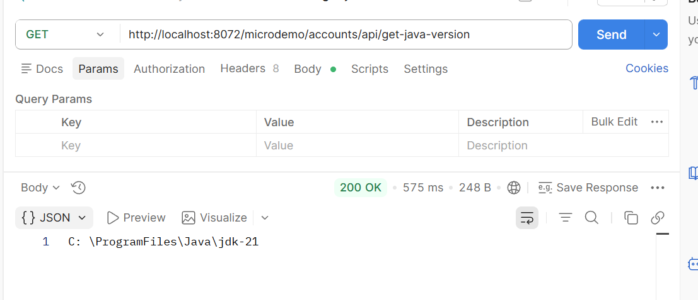
* This is the normal respone .
* But if you keep spamming requests then in that case:
* 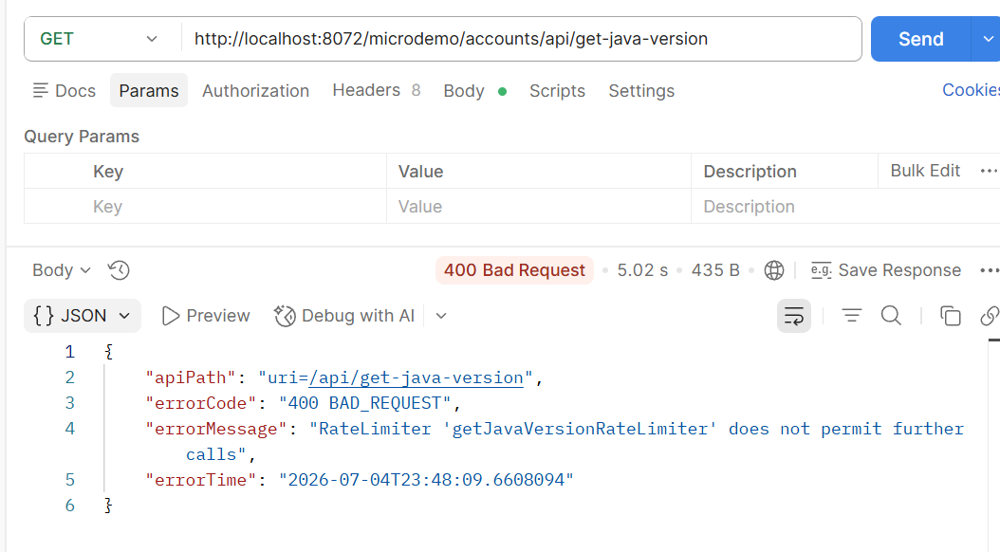
* We get this response which is coming from the accounts app itself.

## Making a Fallback:
* 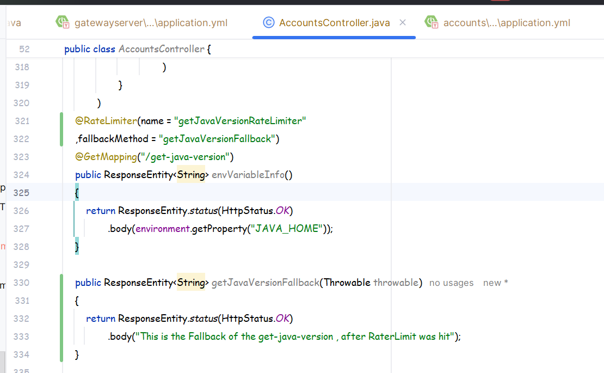
* We have created the fallback method , now again follow the steps of Testing 1.
* 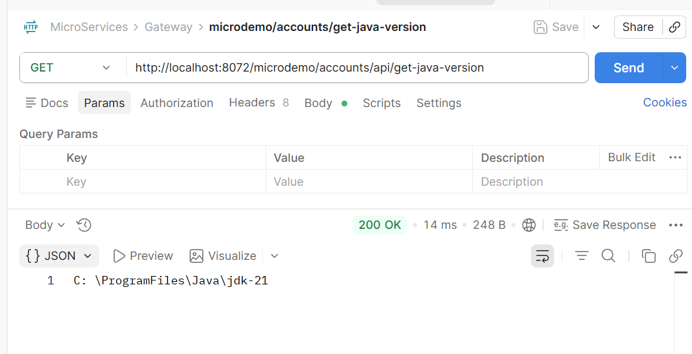
* 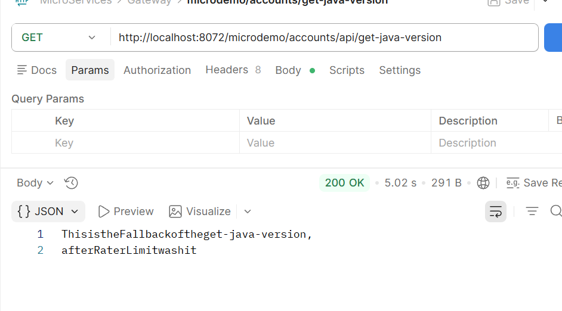
* This works but in production apps in case of Rate Limiter we don't use he fall back , rather we send the Error Trace only.