# Rate Limiter:
* In this lecture we will learn about the Rate Limiter.
* Attaching below a image describing the rate limiter .
* 
* There are various criterias on the basis of which rate limiting can be implemented:
* 
* Official Blogs to understand more about rate limiting:
  * ``https://docs.spring.io/spring-cloud-gateway/reference/spring-cloud-gateway-server-webflux/gatewayfilter-factories/requestratelimiter-factory.html``
  * ``https://spring.io/blog/2021/04/05/api-rate-limiting-with-spring-cloud-gateway``

    

## Rate Limiter At the Gateway:
* Here we will be using the Redis Rate Limiter .
* For this we will have to use a dependency.
* It has 3 main components and the Redis Rate Limiter uses the Token Bucket Algorithm.
* Token Bucket Algorithm basically means there will be Bucket/Balti inside which there will be tokens .
* This tokens will be used per request , maybe 1 token per request or 5 tokens per requests whatever.
* And this Bucket will also get backfilled with new tokens every second.
* A User/Client can send any no of requests at a time it can be 1 request or n requests .
* But the maximum no of requests that can be processed will be: The number of tokens present inside the bucket divided by the token per request.
* The User can also send so many requests that the bucket can also get empty within a second but in the very next second the bucket will get filled again .
* Suppose if the user is sending 10 requests per second and bucket has a capacity to hold 20 tokens but the price per request is 5 tokens then , out of 10 requests only 4 requests can be processed and the remaining requests will not get processed as the bucket has 0 tokens left.
* How 0 tokens : it is because price per token 5 , maximum no of tokens in the bucket is 20 , so 20/5 = 4 , only 4 requests can be processed the remaining 6 may not get processed .
* Another thing is after 1 sec the bucket will again get filled with some no of tokens as mentioned by the developer.
* ``BurstCapacity``: The maximum no tokens that the bucket can hold . Beyond this if the new tokens are given to it , it will not hold .
  * It can only hold 20 at max.
  * A client request or requests can also use all the 20 requests per second if needed.
* ``ReplenishRate``: The rate at which the buckets gets refilled per seconds. In other words the speed at which a specific no of new tokens are filled in the bucket.
  * The rate can be 1 token per second or 10 or 20 or anything but , even if replenish rate is more than burstCapacity still the bucket will only have whatever is mentioned in the burstCapacity.
* ``RequestedTokens``: The no of tokens that are going to get used from the bucket per request . It can be 1 token per request or 2 or 3 or 10 or 20 or whatever , but dont make it bigger than the burstCapacity otherwise if BurstCapacity is 20 and RequestedTokens is 30 then your request will never get accomplished.
* If you set the BurstCapacity to 0 , and other factors as non zero then all the incoming requests will be blocked , because if there are no balls inside the bucket then how are you going to play.
* If you set the ReplenishRate as 0 then the Bucket will only have no of tokens whatever is mentioned inside the BurstCapacity and it will never get refilled.
* If you set RequestedTokens as 0 then all requests will be allowed without any rate limiting action.
* Attaching below a image to demonstrate the above better:
* ``IMAGE``: 
* Another thing if you do the below config:
* 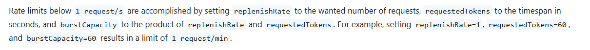
* Prabhu 1 request will get accomplished in 1 minuite rest of the requests will be blocked.
* 1 req/min will happen because replenish rate is 1 token per second then burstCapacity is 60 and requestedTokens is 60.

### 429 for too many request attempts:

## KeyResolver:
* It is a very important part of the Redis Rate Limiter .
* It is the dictionary which actually keeps the info of different users or requests.
* Like it maintains "on what basis are the tokens going to be allocated or you can say Token Buckets are going to be created and maintained but on what basis".
* For example : Buckets are created for every request but multiple buckets dont get created again and again for the request coming from the same place.
* What i mean by this is everyrequest comes from an IP , by a user , and every request can have a JWT Token too.
* So are we going to create buckets on the basis of User , i mean while sending the request to the Gateway in the URL we will have a QueryParam ?user=name.
* So the KeyResolver will create the dictionary and maintain the records about buckets there on the basis of user name but usernames can be tampered while sending a URL , that is the reason why it is not recommended to create KeyResolver on the basis of user.
* There are other ways like you can create KeyResolver on the basis of IP Addresses or you can take user info from the JWT Token too.
* So by doing this buckets will be created on the basis of IP Addresses or on the basis of JWT.
* Attaching below a image which can help you understand the above:
* ``IMAGE  1 ``:  
* ``IMAGE 2 `` :  

## Implementing Redis Rate Limiter in the Gateway Server:
* First lets add the dependency to the pom.xml of the gateway server.
* 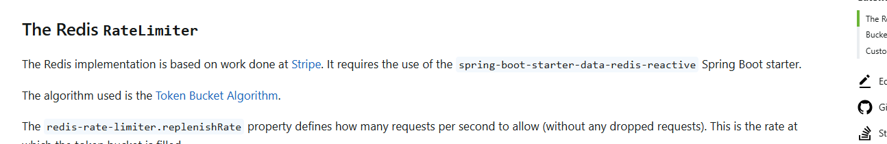
* As mentioned here we will have to include the ``spring-boot-starter-data-redis-reactive``:
* 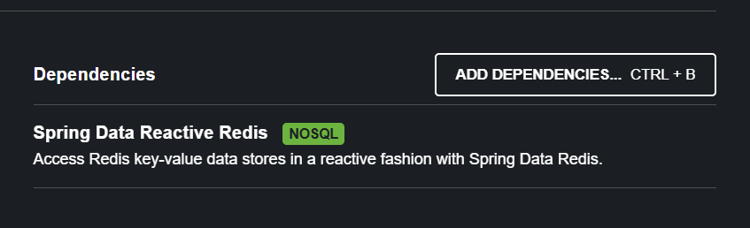
* The above dependency.
* 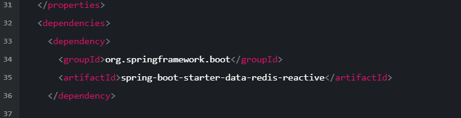
* This particular lines of code we will have to copy to our pom.xml .
* Now lets create the beans of KeyResolver and RedisRateLimiter then we will inject them into the route definitions .
* IF you ask google ``redis rate limiter spring cloud gateway using java DSL style , implementation`` .
* It will give you all the details how to implement that thing.
* Let's proceed:
* Either create a config class in th gateway app ex: RateLimiterConfig or you can create the beans inside the RouteConfig class too which we have been doing so far.
* 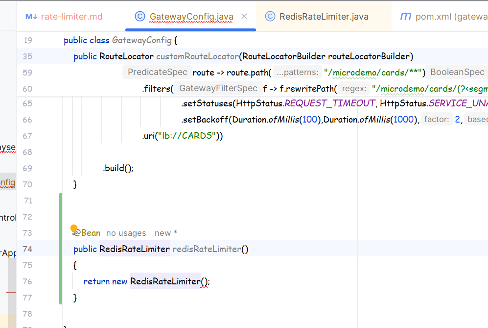
* Now if you go inside the RedisRateLimiter class then you will see multiple types of constructors being defined there, but we will be using the below one.
* 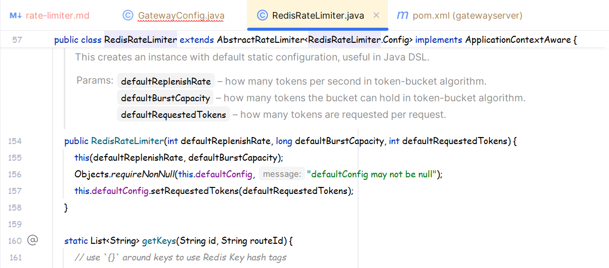
* The first parameter would be replenishRate then 2nd one is BurstCapacity and then the 3rd one is RequestedTokens.
* 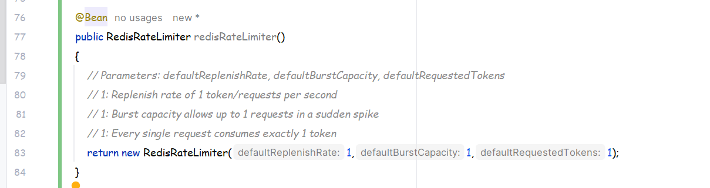
* Now as can be seen we have mentioned our parameters and this are all working per seconds.
* Now lets create the KeyResolver function.
* 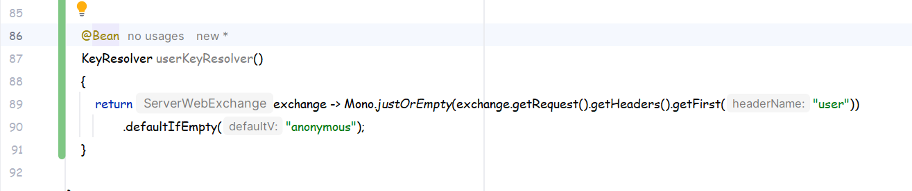
* Well what this keyResolver will do is from the incoming exchange requests to the gateway it will get the request then get all the headers and try to find a header with name as user and if there is no header with the name user then a empty Mono object will be created with NULL Value .
* And if there are no headers with headerName as user then Mono.empty() will get exectued and as soon as this gets executed the default behaviour will take place which we have written as defaultIfEmpty("anonymus").
* Which means Buckets will be created with the name anonymus that's it.
* Now since we have created the RateLimiter function as well as the key resolver so now it is time for us to inject into some route.
* 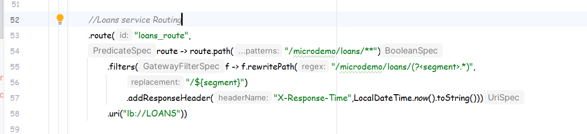
* Suppose we want to add it to the loans route so lets get on it.
* 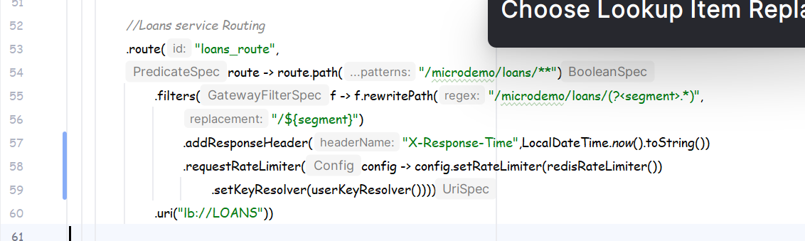
* See how inside the filters we have included the requestRateLimiter and inside that we are writing a lambda expression where we are giving it the name of the rateLimiter function and also the name of the keyResolver that's how you do it.
### ``Tomorrow if you want then you can have multiple beans of RedisRateLimiter as well as multiple KeyResolvers which you configure as per different paths``

* Now we are done with the implementation part . Now we will proceed with the testing part .
* Another thing that we need to do is Since we are using Redis Rate Limiter whos implementation and codes are present inside the downloaded library but we need to Run a Redis either locally or provide it the Redis URL so that it can perform its Token Bucketing thing there .
* The bucket and tokens information will be stored in the Redis Server but the filter's and internal work will be done here in the app only .

## Configuring the Redis:
* Look at the docs of Redis , how to start a docker container of redis on local system.
* From there you will get the details of the port no and all.
* 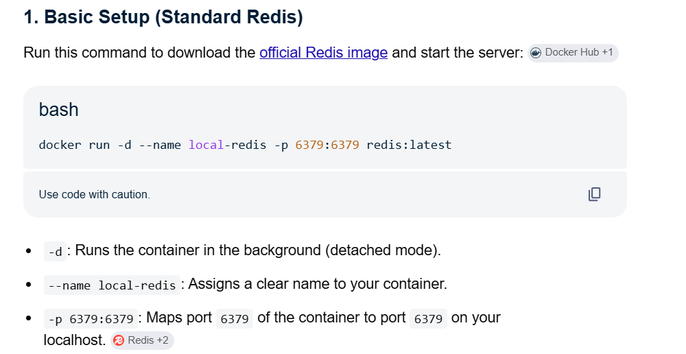
* Now once we have got this thing you can execute the command .
* But lets also configure the GatewayServer so that it knows which Redis Server it has to connect to .
* Go to application.yml of GatewayServer : 
* 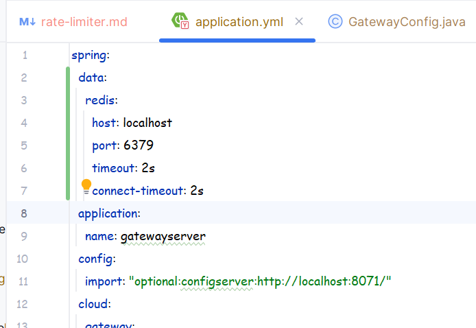
* There we will have to do the above setup.
* You can ask this to googleAI also like how to connect the Redis local Server to the Spring Reactive Gateway and it will tell you the steps and you can follow it.
* Now once this is ready we can start the apps in the sequence : configServer->EurekaServer->Loans app->GatewayServer Make Sure you have started the Redis docker container .
* Now inorder to perform the testing we need to have some Load Testing tool , which will send lots of request concurrently with a short time that is how we can test the Rate limiter.
* Make Sure to start the Redis before following the below steps:

## Preparing the Load test:
* We will be using the apache benchmark tool for the testing .
* If you go to its official site then you may not understand anything so it is better to ask google AI how to download and install it locally in your for your OS.
* https://www.apachelounge.com/download/
* Go to this link and download the first ZIP and then extract it and you will find a ab.exe , you have to add that to the Env variables so that you can run the command.
* 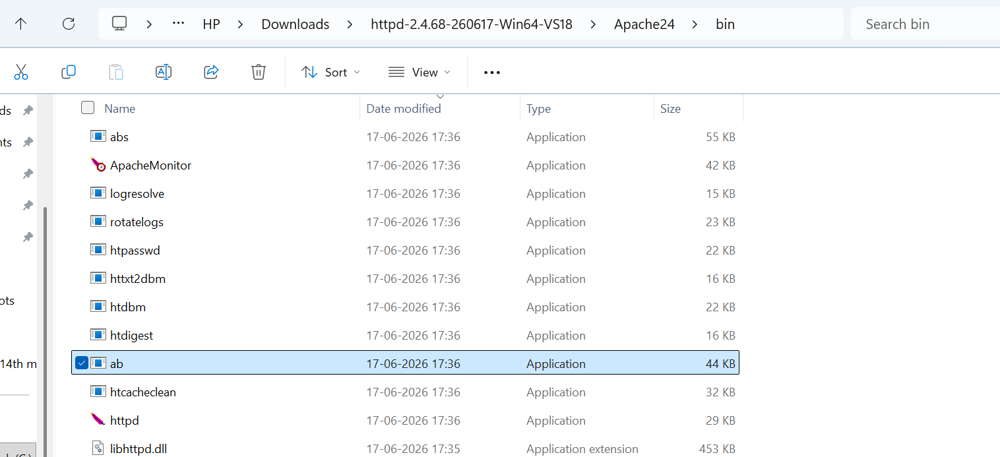
* Lets set the env variable for this.
* Copy the path where the ab.exe is present and then open edit system env variables then click on environement variables 
* Then click the Edit after selecting the path inside the system variables:
* 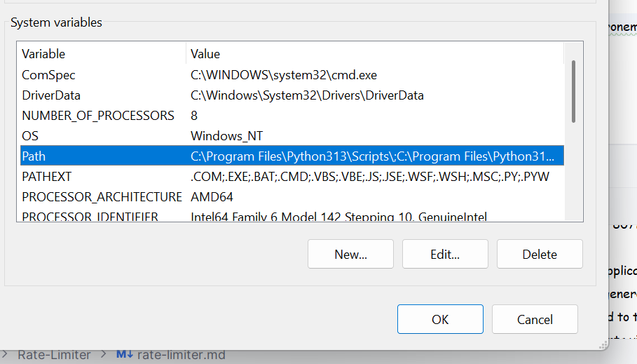
* 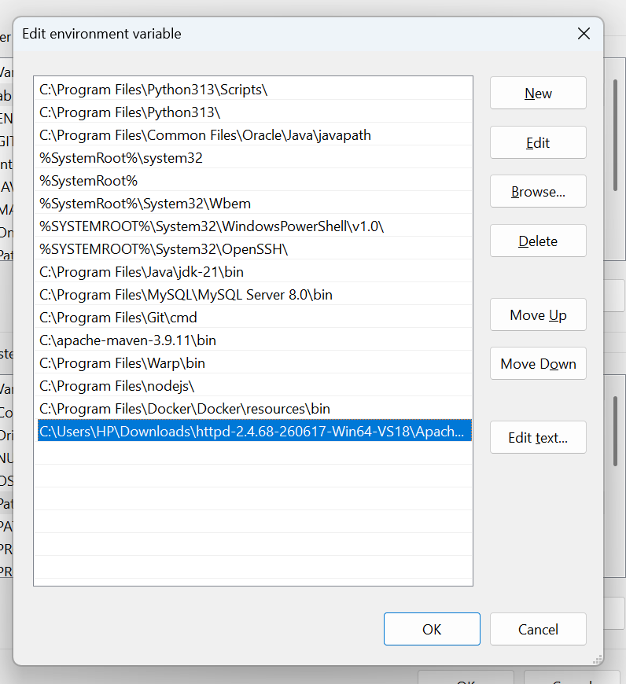
* Here click on New and add the path .
* Now inorder to check whether it is recognized by the system or not , open the terminal and type ab --version .

## Testing the load:
* Now as all our apps are live : configServer , EurekaServer , Loans app and GatewayServer and also the Redis container is running so lets execute a command.
* Open terminal and execute ``ab -n 10 -c 2 -v 2 http://localhost:8072/microdemo/loans/api/get-contact-info ``
* What does the above line mean , -n 10 means sends in total we will fire 10 http requests .
* c 2 means concurrently we will send 2 requests at a time , and these c 2 means 2 different users or different IP's .
* so in total one user will send 5 requests.
* v stands for verbose means showing the information of the request and response and v -2 means limit the response to 2 lines only otherwise it will print so many things.
* Now lets execute the cmd:
* 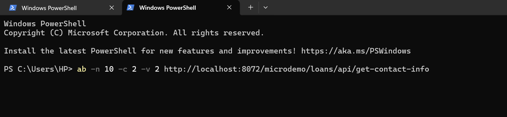
* As soon as we press enter we can see : 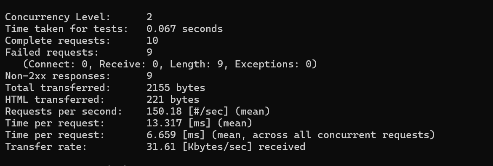
* It says 10 complete requests and 9 failed and 2 concurrent ok.
* 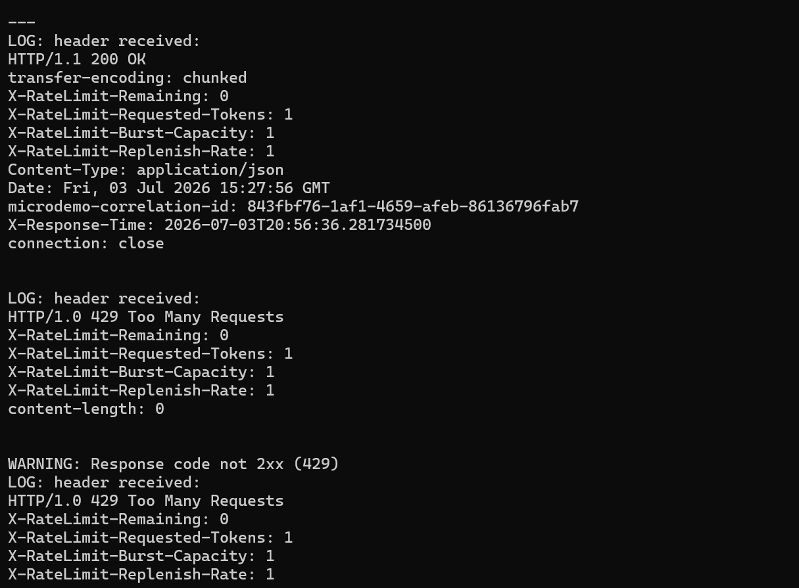
* We can also see that only 1 request had response 200 OK and others had 429 status.
* Which means rest of the requests were not allowed and our Rate Limiter worked perfectly as it has a burstCapacity of 1 and requestedToken of 1 and ReplenishRate of 1 token per second so in that 1 sec all the 10 requests were fired and 1 token from the burst was used and it Burst Got emptied .

* ``But as i said we had set the -c 2 , which means 2 concurrent users/ parallel connection then in that case we are supposed to see 2 success and 8 failed request but still why we saw only 1 ?``
* As suppose 2 concurrent requests and n 10 means 5 requests per parallel connection .
* So if we look at the KeyResolver then we can see that: 
* 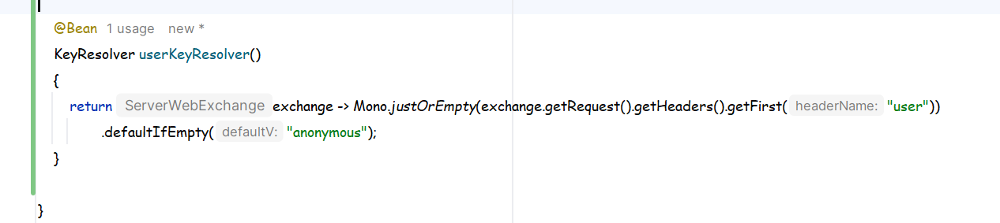
* We had mentioned if the requests are having a header ``user`` then please create bucket as per the value inside ``user`` otherwise mark them ``anonymus``.
* And if we look at the cmd which we are executing then we can see that in none of the requests we are not sending any header with the name ``user`` because of which no mattern how many concurrent requests from different parallel connections are being fired still they lack the header ``user`` so they are getting tagged as anonymus because of which , all the incoming requests are dependent on the same bucket which is anonymous bucket.

``If you want to properly test 2 concurrent requests then we have to open two different terminals and set some user value there and also make changes to the RateLimiter parameters which we will do ahead``.

## Concurrent Request Testings:
* First lets make changes to the parameters of the RateLimiter .
* 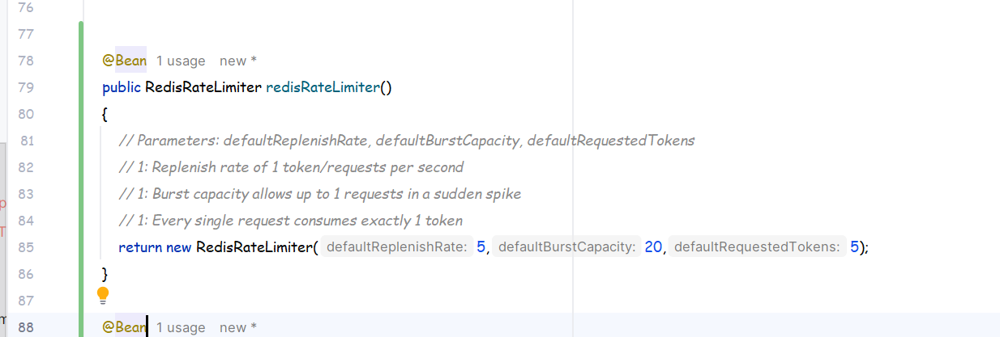
* With the above config each request will consume 5 tokens and it will take around 4s for the bucket to get filled again.
* Why i did this is now we will run the same cmd in two different terminals one after the other immediately within a sec .
* And see the no of requests which are executed for USER_A and no of requests executed for USER_B.
* 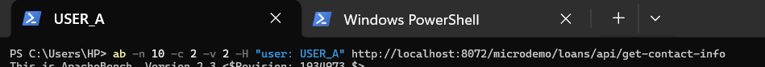
* 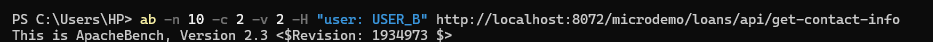
* We will be using the above two commands , so lets get started.
* First i will execute for USER_A then USER_B , and as soon as i press enter for USER_A i will switch tab and do the same for USER_B TOO:
* ``USER_A``: 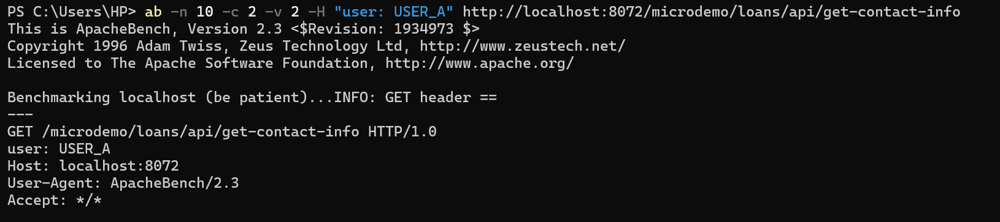
  * 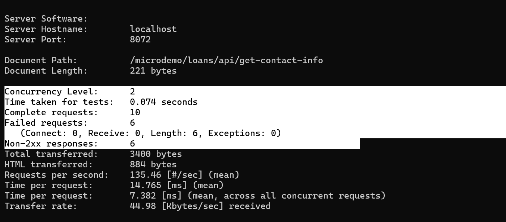
  * If you see above 10 complete request out of which 6 failed because , our RequestedToken was 5 and burstCapacity was 20 and Replenish was 5 per second.
  * 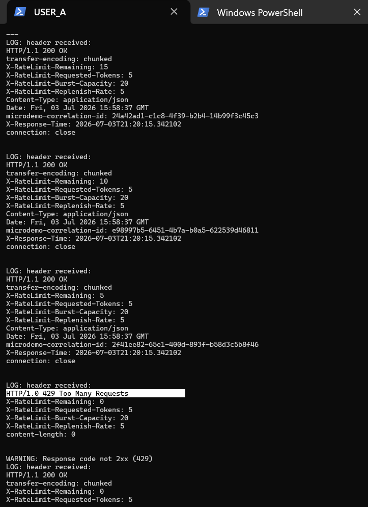
  * If you observe in the above image then you can see that the 4th request ended with 429 while 5th ended with 200 OK , How ?
  * It is because we are using c -2 in the cmd which means 2 parallel connections with the same header value user:USER_A firing 5 5 requests so one of the connections would have received a 429 because another connection would have already used the last remaining 5 tokens , and that might be the 5th Request that's it.
  * Even if they are 2 parallel connections still they use the same USER_A that's why.
  * The same thing has happened with USER_B too.
* ``USER_B``: 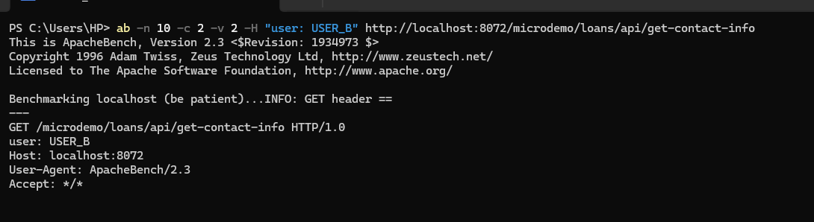
  * 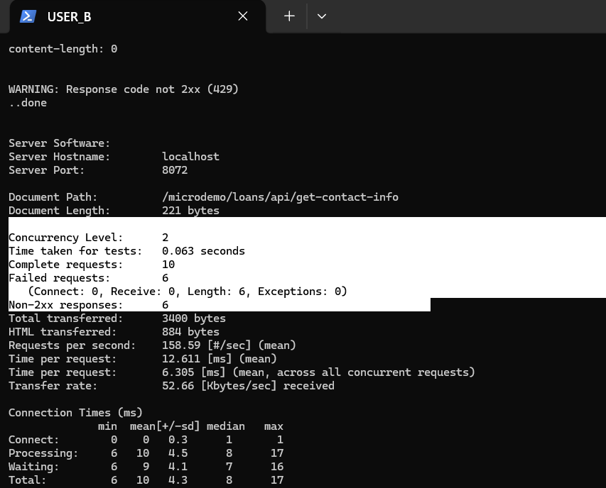
  * If you see above 10 complete request out of which 6 failed because , our RequestedToken was 5 and burstCapacity was 20 and Replenish was 5 per second.
  * 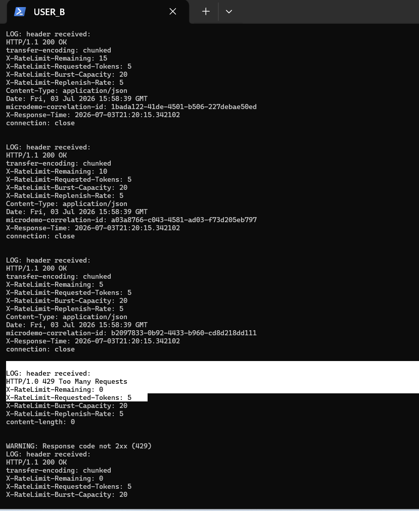
  * If you observe in the above image then you can see that the 4th request ended with 429 while 5th ended with 200 OK , How ?
  * It is because we are using c -2 in the cmd which means 2 parallel connections with the same header value user:USER_B firing 5 5 requests so one of the connections would have received a 429 because another connection would have already used the last remaining 5 tokens , and that might be the 5th Request that's it.
  * Even if they are 2 parallel connections still they use the same USER_B that's why.

``If you want to see what happens when we set the -c to 1 then have a look:``
* ``USER_A``:  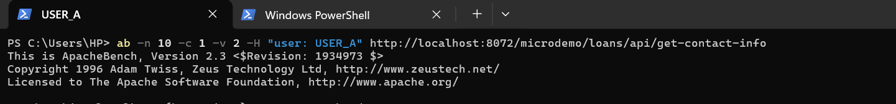
  * 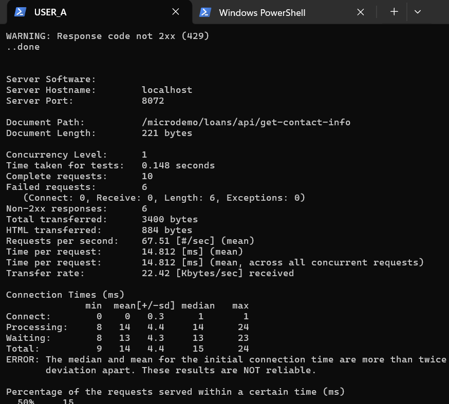
  * 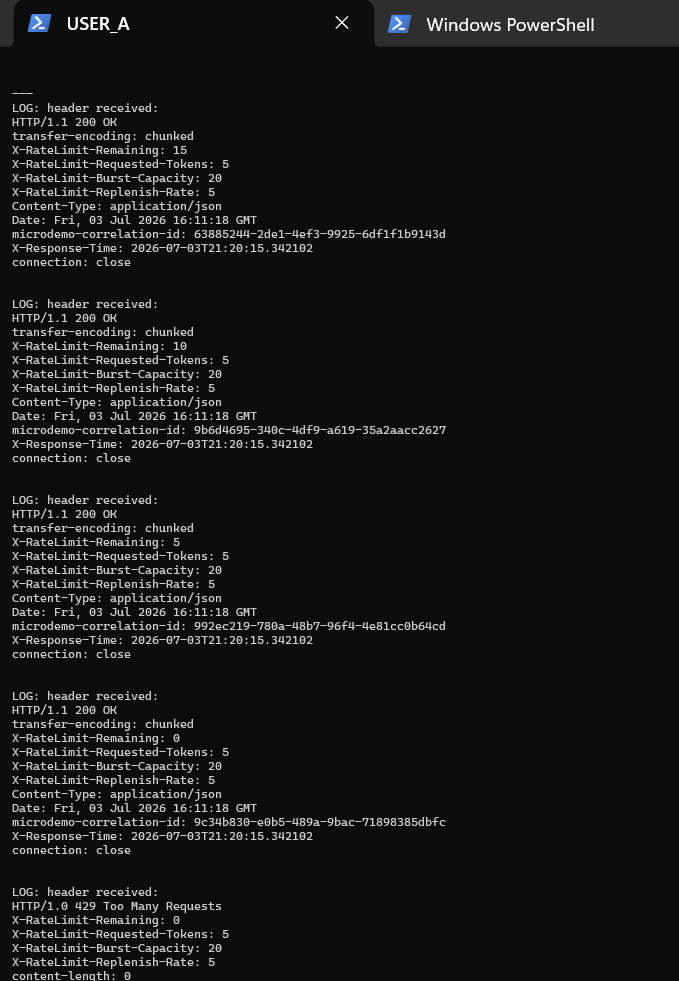

* ``USER_B``: 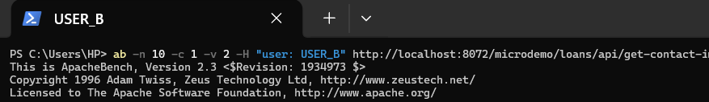
  * 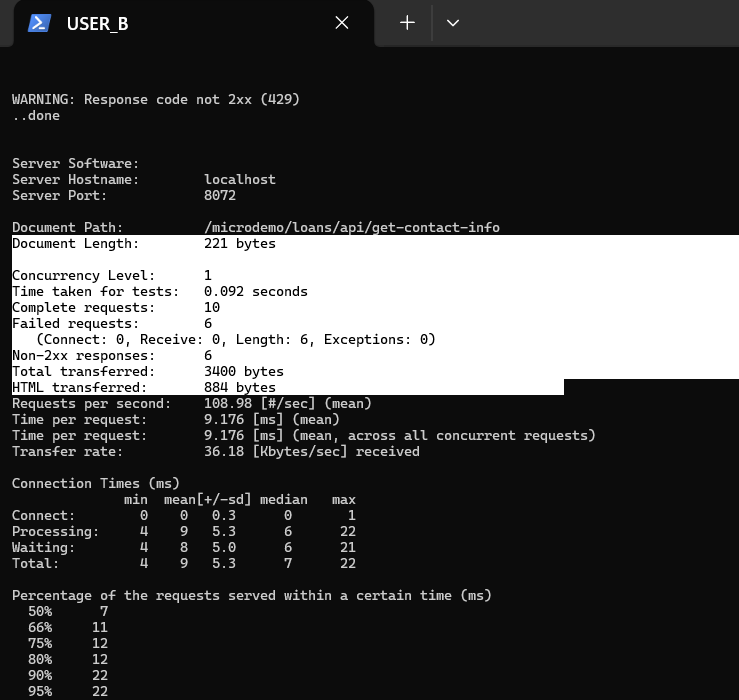
  * 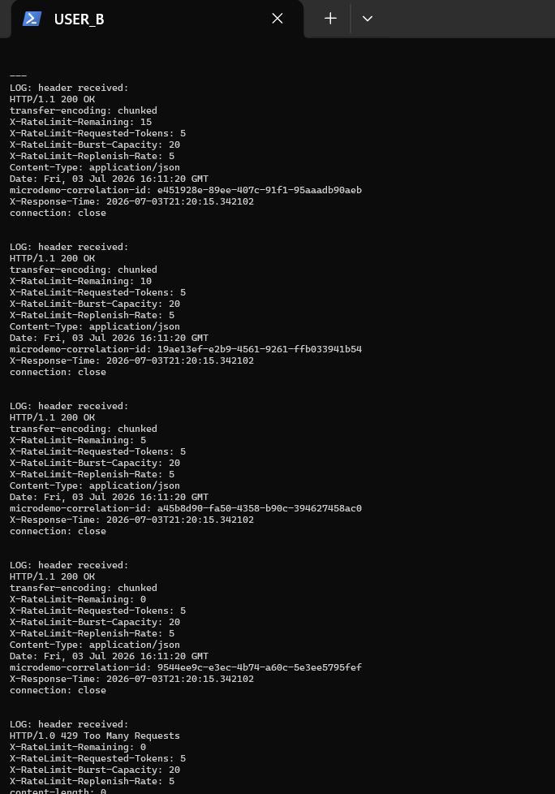

* Now compare both of their logs , now since there is only 1 parallel connections to fire all the 10 requests so you won't be finding logs like c 2 .
* One thing for sure it would have been easy if we had the privilage to observe the parallel connections id then it would have made more sense, anyway we will learn that ahead with better Platforms for testing the server load.
  

## ``Rate Limiting Pattern in Gateway is used to limit the requests from a User/Client but Rate Limiting Pattern inside a Service is used to limit the total no of requests doesnt mattern coming from how many users``
