# Retry Pattern Implementation inside Services:
* We will learn how Retry pattern is implemented inside services.
* You can check the URL ``https://medium.com/@araviku04/retry-pattern-in-microservices-with-spring-boot-and-resilience4j-bbb9fbd47438``
* For better understanding of Retry Pattern.
* We have already seen how retry pattern is used inside gateway.
* Now we will see how retry pattern is used inside a service .
* Cases can be where we are normally trying to invoke a api of the same app or maybe we are trying to invoke API of some other services.
* One thing to be kept in mind is : ``Never use the Retry or CircuitBreaker annotation on top of FeignClient interfaces directly``
* Since we have a accounts app inside which we are have a CustomerServiceImpl class which is responsible to call the cards and loans feign client and return the consolidated information.
* But in production grade application we have to create two more service classes inside the same accounts app that are CardsService and LoansService and allow this service classes to connect with the feignClient and return us the result .
* Attaching a image below for better understanding:
* ``Image``: 
* In the above image if you see then you can get a clear idea of what i am trying to convey like how is our code and how our code needs to be if we want to use retry and circuit Breaker together on our feignClient calls.
* We must not use Retry and CircuitBreaker annotations directly on top of them .
* Another thing is we are not writing or mentioning circuitbreaker annotations on top of any of our feignclients because they are auto-generated , they are by default getting wrapped by the circuit breaker which are created because we are using the below config inside the accounts application.yml:
* 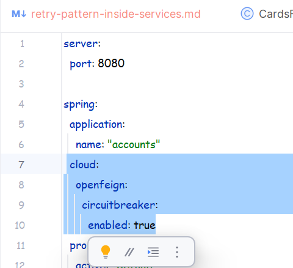
* And using the above will craete ciruit breaker for all the feignclients using the name : feignClientName_functionName .
* 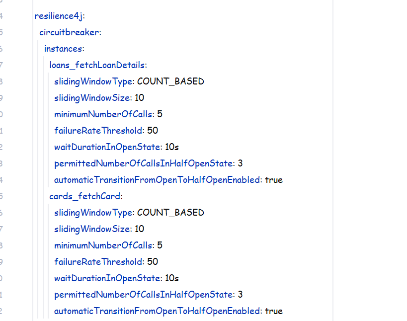
* 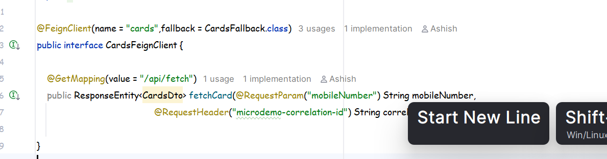
* See the name here cards_fetchCard .
* But if we want to have retry as well as circuitBreaker for all the feignclients then we will have to create seperate services for cards and loans and do what i have mentioned inside the image that i have attached above.

## Retry pattern on a normal basic api:
* Open the accounts app directory and go to AccountsController , there you will find the ``get-build-version`` api.
* We need to set a Retry mechanism to this api.
* 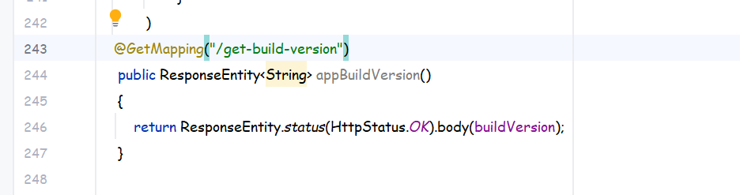
* Now lets make the changes:
* 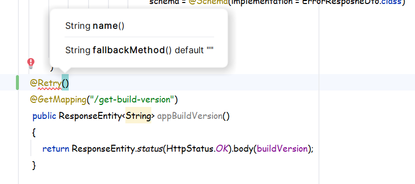
* Now it says to have two parameters one is give it a name and another is give it the name of the fallback method.
* 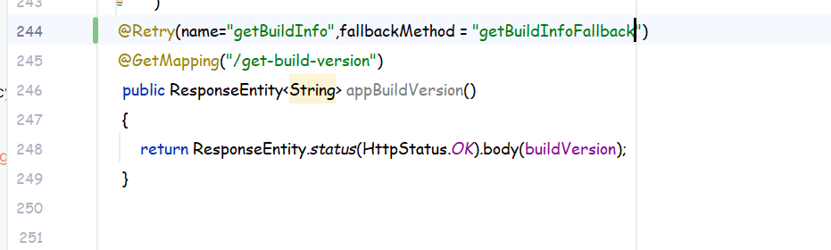
* Now lets create a fallback function with the given name inside the same controller class , and yes make sure the fallback methods return type and signature list is same as the actual function .
* Now if the return type is also same then we have to return the same things that were earlier returned by the original function but with tampered or alternate values.
* 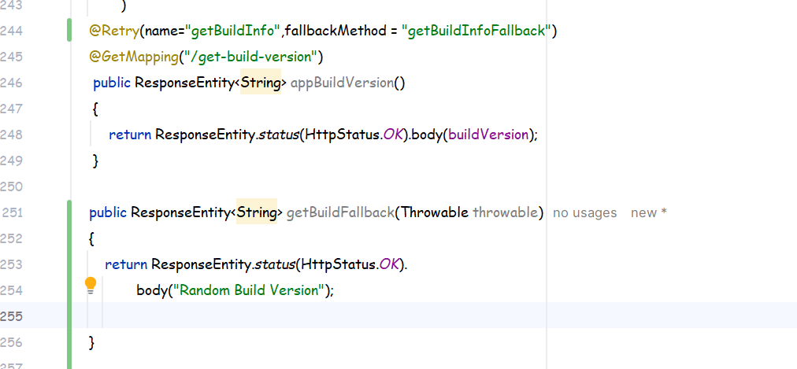
* See How the fallback function as well as the original one looks , and as i said we need to return the same type as well as the parameters list had to be similiar but we have to also add one extra parameter that is ``Throwable`` in the fallback method parameter list.
* Thats it we are ready with our fallback method.
* Now since we have used the retry pattern so we need to have some configs for our retry too right.
* Goto the application.yml of the accounts:
* 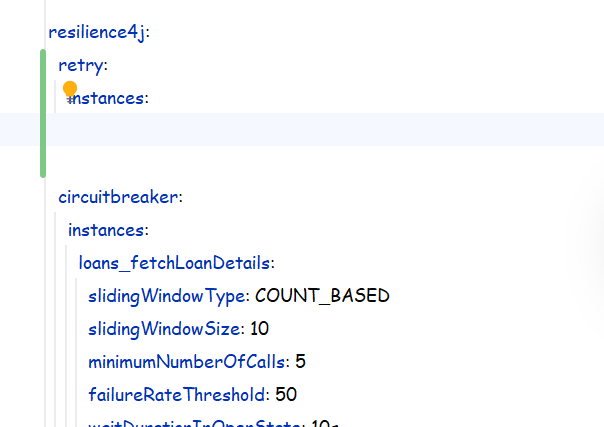
* Since we already had the circuitbreaker configs here so we will simply write retry under the resilience4j and proceed.
* 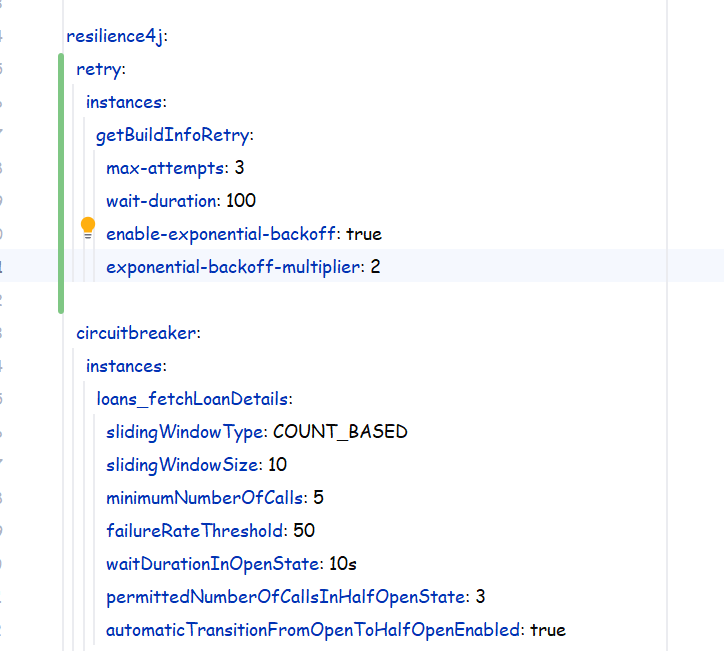
* This is going to look somewhat like this and yes i have also changed the name on top of the function .
* 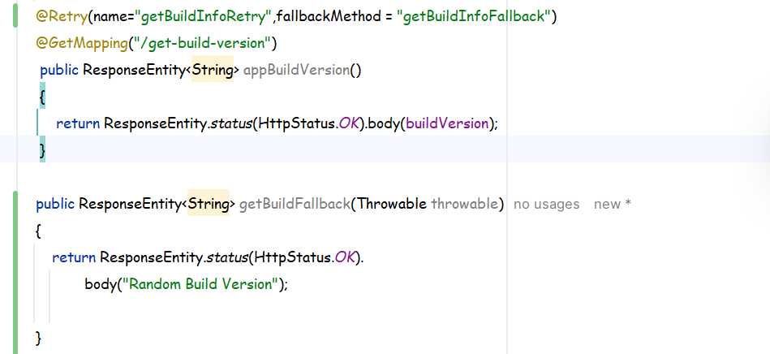
* Now we will add some logger statements so that we can track how our code is flowing:
* 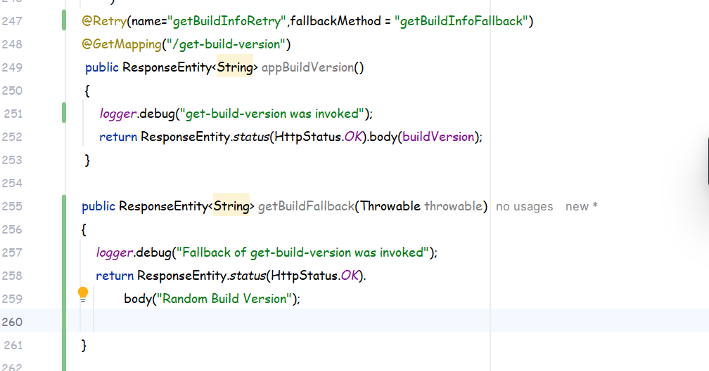
* Now inroder to test the working we will have to throw some error intentionally so that we can see how the retry is working so for this:
* 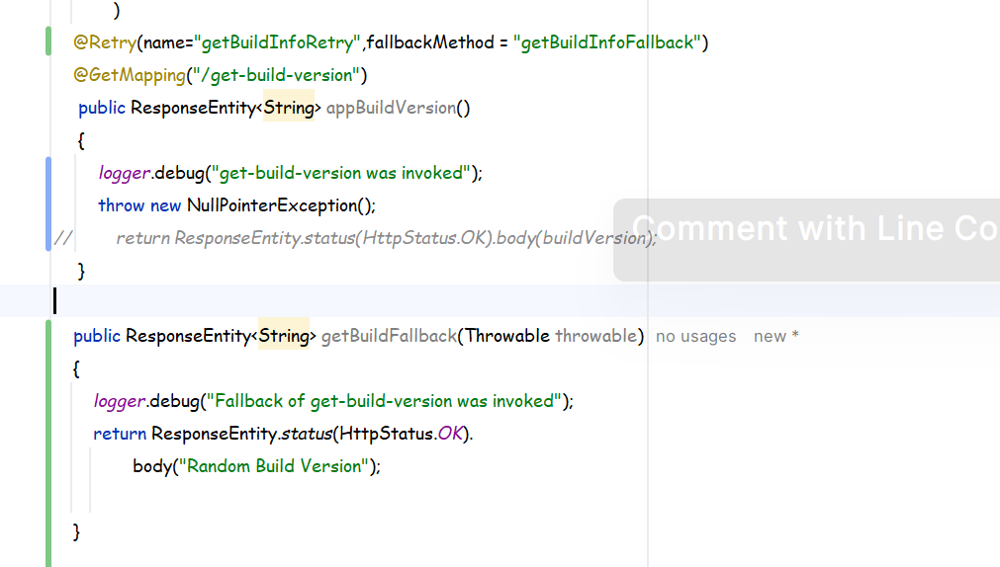
* You can also throw a normal run time exception if you want .
* Now lets start the applications :
* configserver->eureka->accounts->gateway .
* Now in Postman hit the api:
* 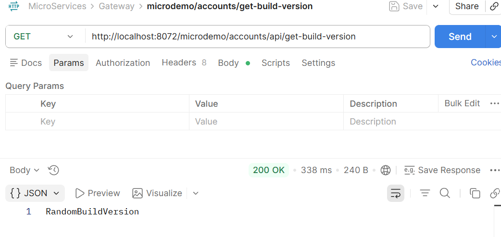
* we got the above response now lets see the console of accounts app.
* 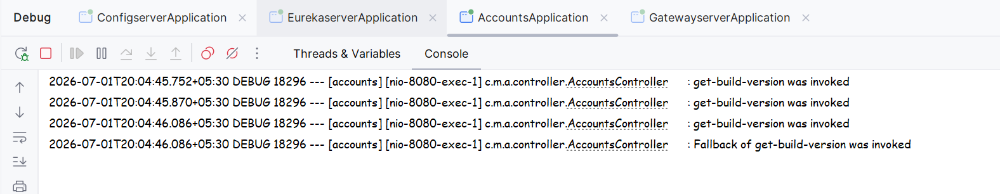
* See here 3 times the actual api get-build-version was invoked but since it was throwing NullPointerException error so it kept trying then finally it went to the fallback function as can be seen.
* Now let me show you another thing.

## What if our wait duration was higher what would have happened in that case.
* 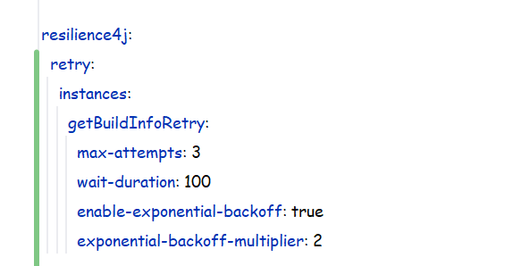
* lets make the wait duration as 500ms.
* 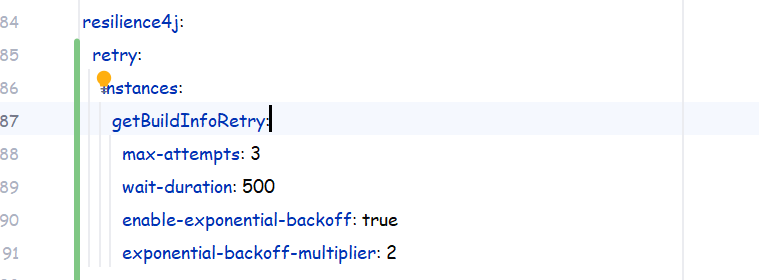
* Now lets hit the same api again:
* configserver->eureka->accounts->gateway .
* Now in Postman hit the api:
* 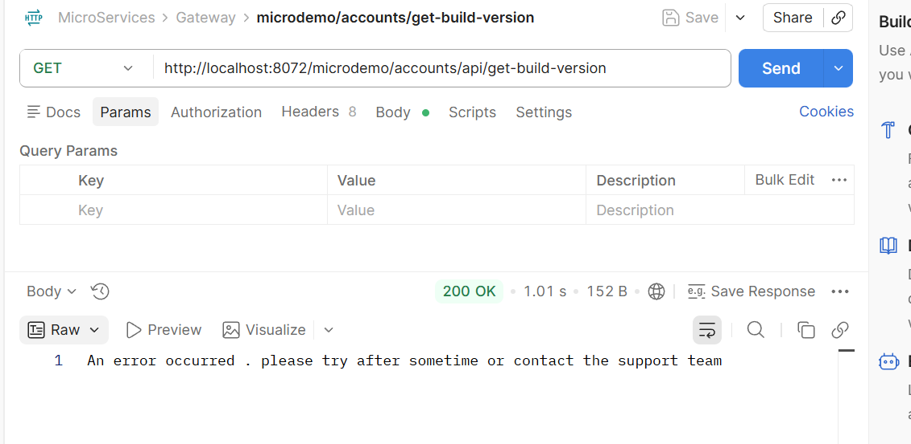
* We are getting the fallback response from by the ciruitbreaker which we had added to the accounts route at the gateway.
* By-default the maximum default wait time for response is 1 sec that is why even before we get the response from the accounts microservice we are getting a response by the gateway itself.
* 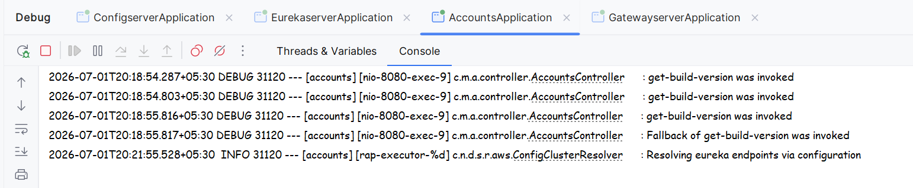
* Another thing we are getting this in the logs of the accounts ms.
* And if you look at the time difference between the logs then 54.287 was for 1st request then 54.803 for the 2nd request or 1st retry and so on and like this by the Fallback of get-build-version was invoked statement was executed it was already more than 1.5-2 secs thats why fallback of the circuitbreaker of the accounts route was invoked .
* Now we will see how we can overcome this challenge.

## Customizing the time for the Default timeout of CircuitBreaker:
* You can ask in google ``How to customize the default time limiter of the ciruit breaker in spring gateway if we are using Spring Reactive Gateway``.
* It will show you results too and you can follow them.
* In our case lets see what we can do.
* 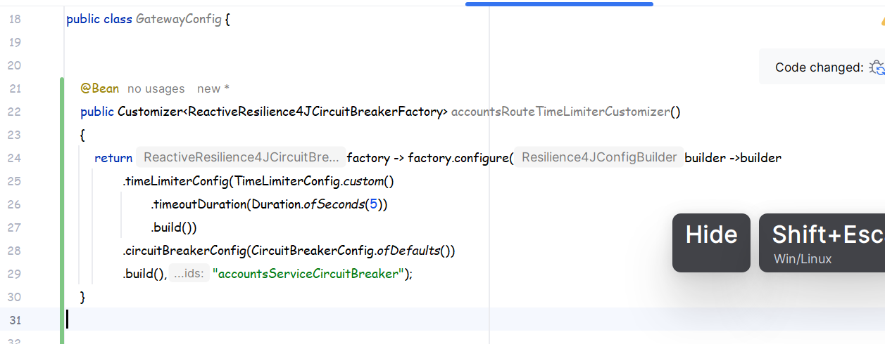
* Inside the same GatewayConfig class we craeted another bean which will override the default value of timeout duration for our ``accountsServiceCircuitBreaker``
* We can create a default custom timeout duration too but lets settle with this.
* Now our default timeout duration for the accountsServiceCircuitBreaker is set to 5 sec which is a longer time now lets again hit the same api and see what is the response that we are getting.
* start : configServer->eurekaServer->accounts->gateway .
* Now hit the same api again:
* 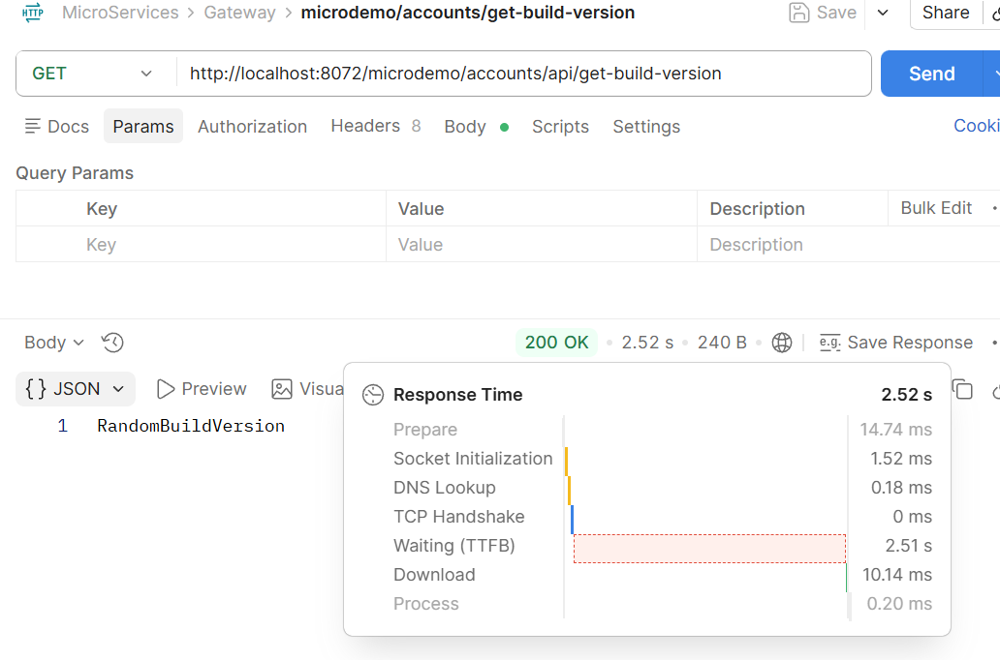
* See this time it took around 2 sec still we got the response .
* 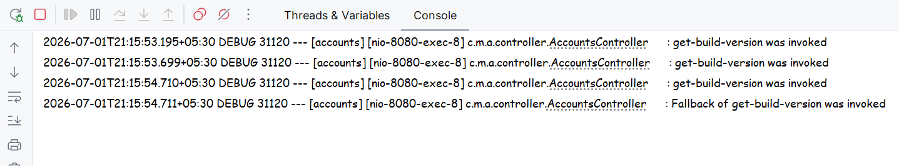
* Also here we can see how the retry pattern was working.

## Implementing Retry Pattern on the basis of some specific types of exceptions:
* We will learn how we can tell the app to perform retries only when certain types of exceptions occur.
* 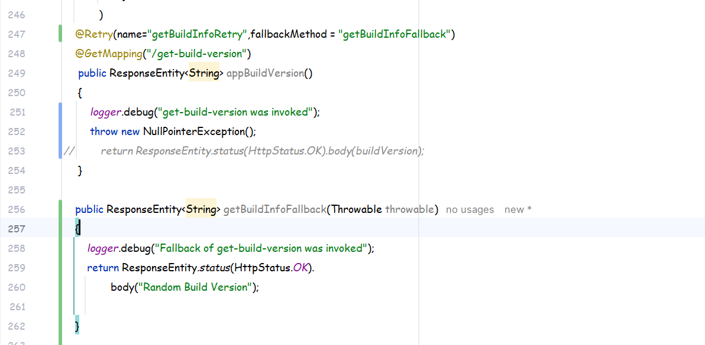
* Suppose we are throwing here NullPointerException .
* Now suppose i want the app to ignore this NullPointerException that means if we are getting NullPointerException then no need to retry and directly call the fallback .
* So lets make some changes in the application.yml of accounts:
* 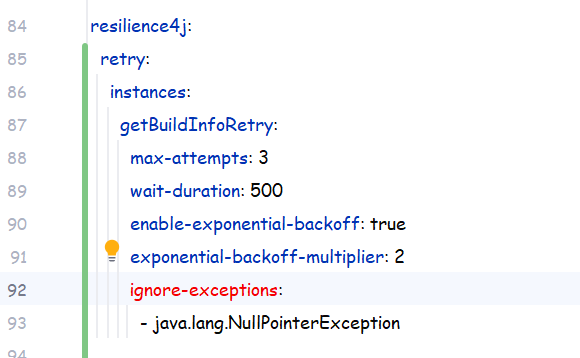
* Now when we hit the api:
* 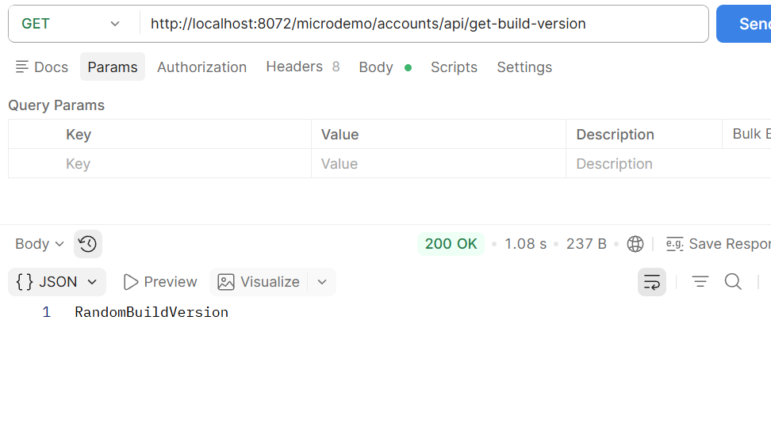
* We are getting this OP .
* And now when we see the logs of accounts app then we observe that:
* 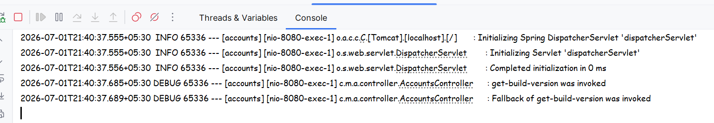
* First the main api was invoked then the NullPointer error occured then instead of retrying it invoked the fallback function and this happened because we added ignore-exceptions to the config .
* So NullPointerException got ignored for the retry process.

## Retry pattern to only perform retry for specific type of exceptions:
* Now we need to make changes to the application.yml .
* 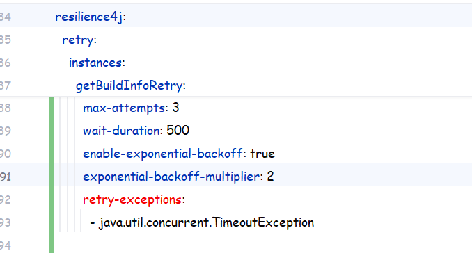
* We are allowing retry for only TimeoutException .
* And one important thing is when we mention retry-exceptions then we dont need to mention ignore-exceptions as all other exceptions will be ignored.
* Now lets make some changes in the get-build-version api too.
* 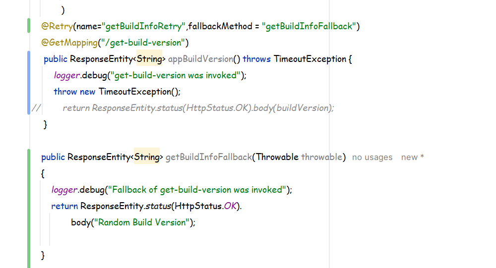
* We introuduced Timeout Exception which is a check exception now lets start the testing.
* Again start configServer->eureakServer->accounts->GatewayServer.
* Now upon hitting the API :
* 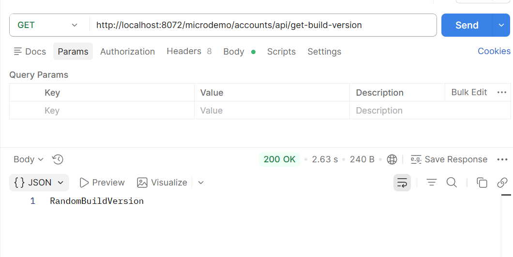
* See the response time is 2.63 s and if we look at the accounts logs.
* 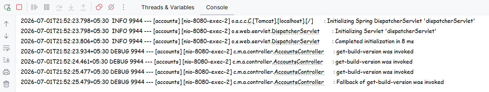
* See retries have happened because we mentioned the retry-exceptions and the type of exceptions now suppose we try to throw a NullPointerException and see whether we are having any retries or not.
* Lets make the necessary changes:
* 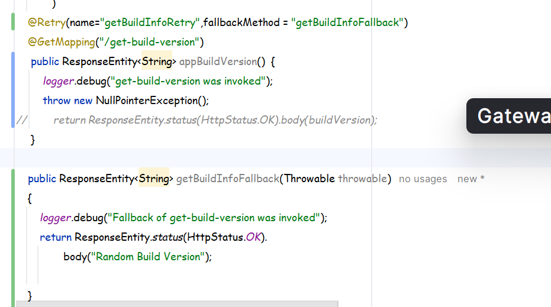
* Now when we hit the api:
* 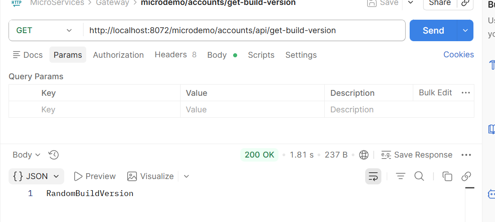
* When we see the logs :
* 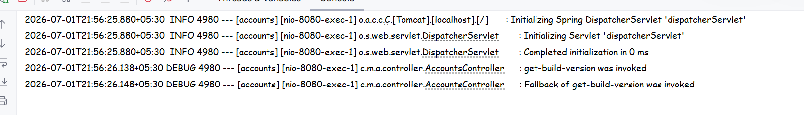
* See after the first try it got the NullPointerException and then it never went back for the retry instead it went for the fallback function.

``End of the Lecture``
___

