# Retry Pattern:
* In this document we will see how we can implement retry pattern both in Gateway and inside services.

## Introduction of Retry Pattern:
* The retry pattern will make configured( settings done by developer ) multiple retry attempts when a service has temporarily failed.
* This pattern is very succesful in scenarios like network disruption or service overload where one service/client may send the request multiple times to a service which is not responding or maybe failing.
* ### Key components of Retry pattern:
    * ``Retry Logic``: Determine how many times to retry an operation . This can be based on factors such as error codes, exceptions, or response status.
    * ``Backoff Strategy``: Define a strategy for delaying retries to avoid overwhelming the system or increasing load on the system. This strategy involves gradually increasing the delay between each retry known as exponential backoff.
        * Ex: Suppose we want to retry 3 times : We will go for the first retry after 1 sec of the actual request , then the second request will be done after 4 sec or maybe some exponential time after the 1st retry and the 3rd retry maybe done after 8 secs or so after the 2nd retry.
        * The goal is to not keep a static time delay between retries.
    * ``Circuit Breaker Integration``: We can combine Circuit Breaker with the retry pattern , like if a certain number of retries fail for any particular request then we can Open the circuit to prevent furthur attempts and then give a Reset time to the other service.
        * Actually incase of using circuit breaker the sequence in which circuit breaker is added to the service call be it in the gateway or the in service call matters a lot.
        * If circuit breaker is used inside the retry pattern then the normal request will be registered inside the circuit breaker window , as well the retries too like 1st , 2nd and 3rd etc.
        * And suppose a new fresh request comes in the for this the normal request will be registerd inside the circuit breaker window and its retries too .
        * Like this the circuit might get OPEN easily.
        * But if the circuit breaker comes first and inside it we have the retry pattern then no matter how many retries is done by the retry pattern only the final response be it failed or successful will be registered inside the circuit breaker.
    * ``Idempotent Operation``: Make sure no matter the number of retries it always produces the same result.
        * Because if the http request contains some kind of operations which might disturb the DB and we are doing it again and again then brother peace out the DB records will get GG.
        * Ex: You can retry GET operations again and again no matter how many times you try it the result will always be the same.
* ``Notes of Retry``: 

## Implementing Retry Pattern inside Gateway:
* As we have made the Gateway using Spring Reactive Gateway and also we have defined routes using the route-locator so we will be making changes inside the route locator bean class.
* 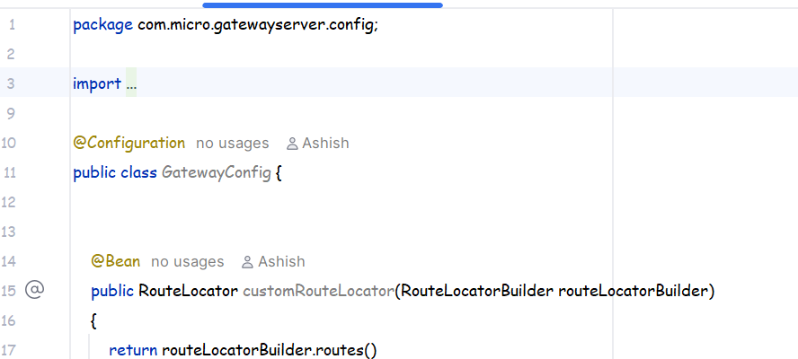
* First we will go to this class inside which we have the RouteLocator bean .
* 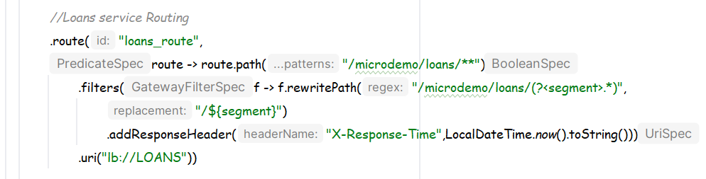
* Now we will make changes here in the Cards route definition:
* 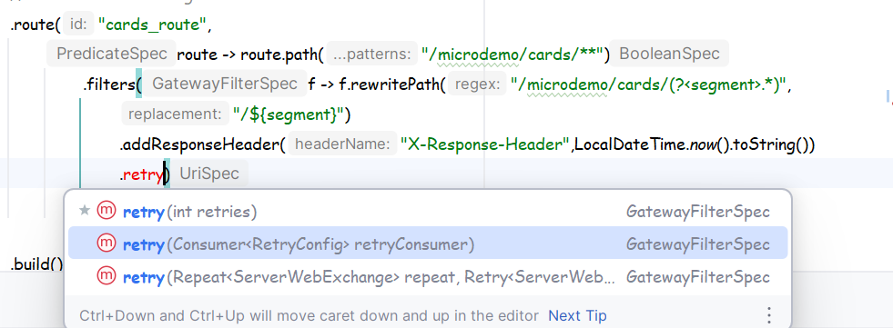
* Select the 2nd one .
* 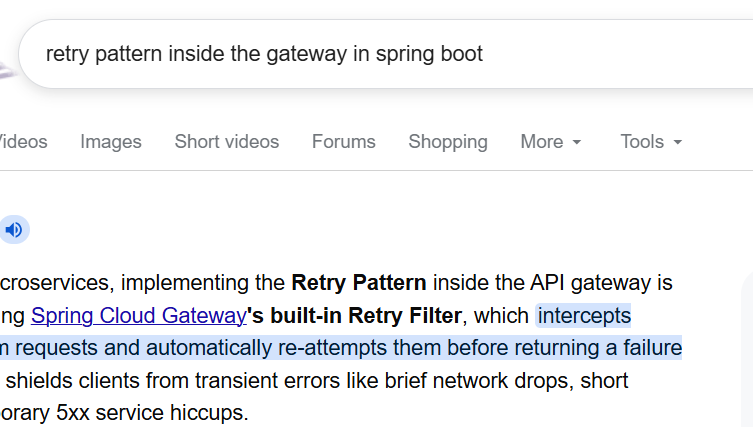
* You can also google the same thing and google will give you the dsl configs:
* 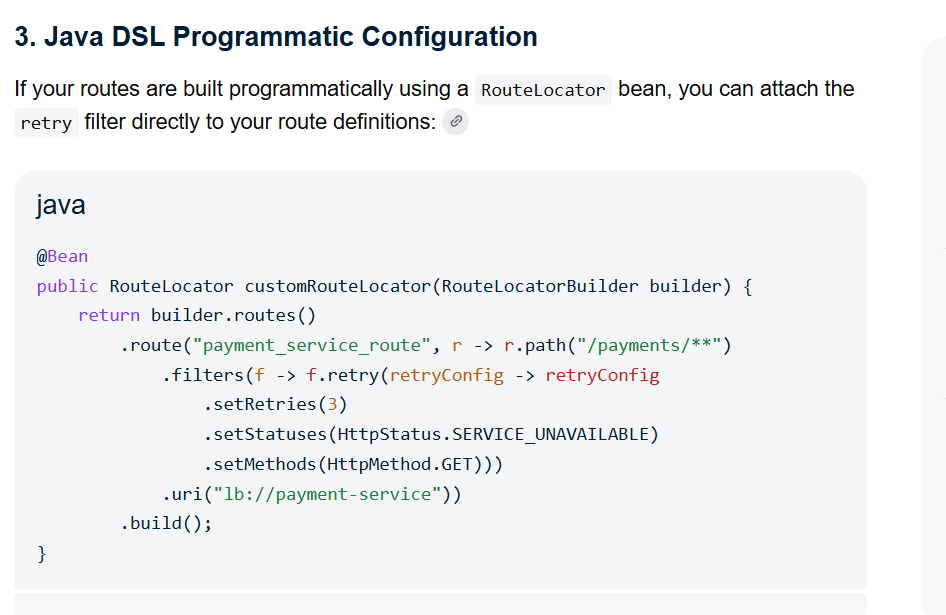
* Now we need to set backoff:
* 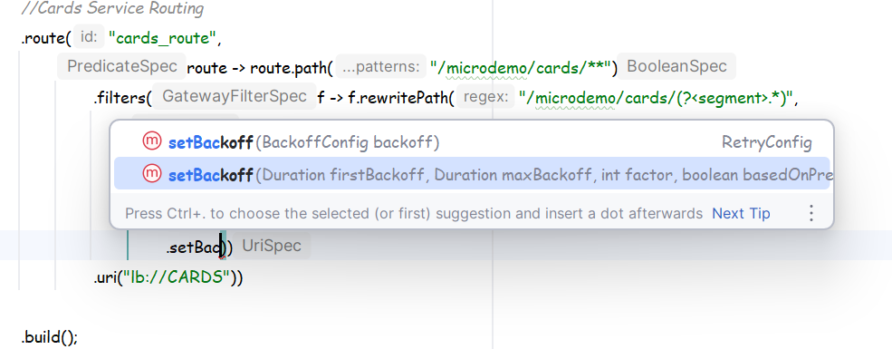
* Select the 2nd one as it can contain multiple parameters.
* 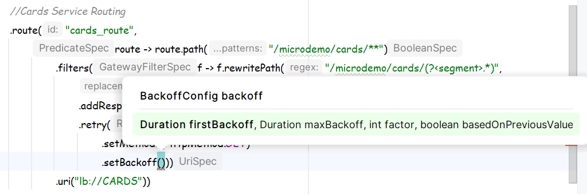
* You can see here the list of parameters like: firstbackoff means delay between the actaul reqeust and the first retry , 
* maximumbackoff means the maximum delay between 2 consecutive retries.
* factor means the integral factor by which you want to multiply the last delay so that the delay becomes exponential.
* It means suppose first backoff was 1sec then if factor was 3 then , then next retry will happen after 1*3 sec which is after 3 secs of the 2nd retry , now the 3rd one will happen after 3*3 which is 9 secs thats it.
* basedOnPreviousValue means based on the last delay time thats it.
* 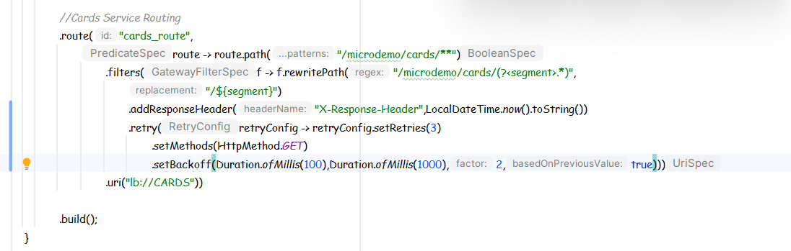
* The parameters we are sending as Duration.ofMillis as it accepts numbers in the form of milli seconds , we can also send numbers rather than typing duration in millis because it accepts in milli seconds even if you had written 900 then it would have simply considered it 900 ms.
* Ok in the parameter list 100 means first retry will happen after 100ms delay .
* 1000 means the maximum delay between 2 retries cannot exceed 1000ms no mattern the factor multiplication.
* 2 is the factor and true means consider the previous delay time.
* 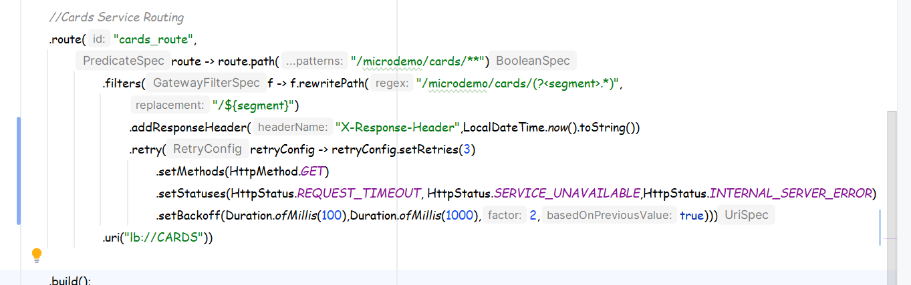
* See we have also added statuses too.
* Retries will only be done for the http requests where methods are of type same as mentioned inside the setMethods.
* Retries will be done in those cases where the incoming response status has statuses similiar to what is mentioned inside the setStatuses.
* And about set back off i have already mentioned .
* Btw if you are not using Java DSL style of programming then you can have all the things in the application.yml as:
* 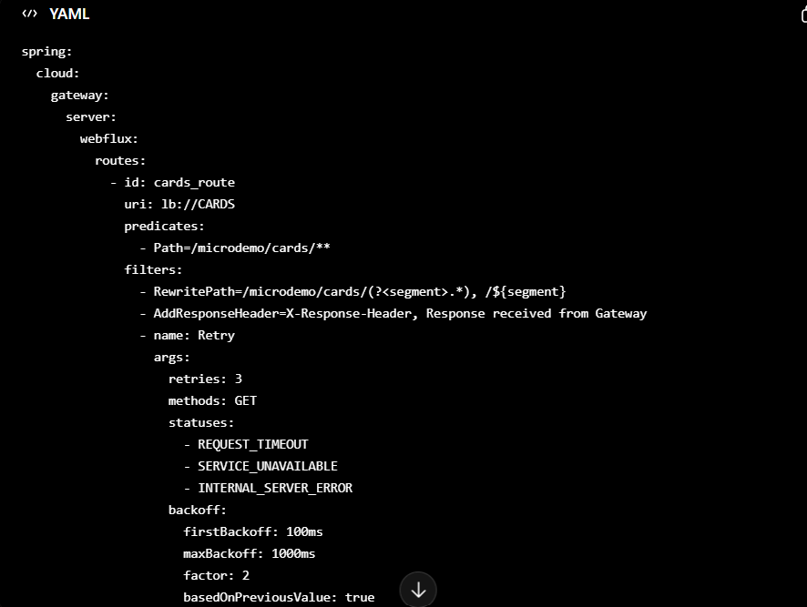
* But we use the DSL style as it gives us flexibility to use multiple types of if else conditioning.

## Testing the Retry Pattern:
* We will be Testing it in two different ways:
* ### 1st Test:
  * Since we have added Retry Pattern to the Cards Microservice Routes in the Gateway so we will add a break point to one of the API.
  * 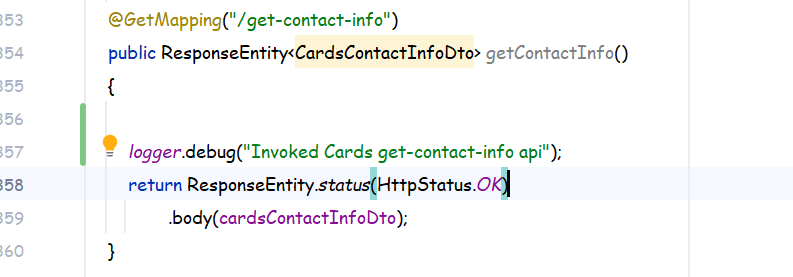
  * First we added the logger.debug then we added the break point now we will try to hit the same api.
  * But 1st lets remove that break point and see the response time in the postman:
  * Now start configserver->serviceDiscovery->CardsApp -> Gateway :
  * 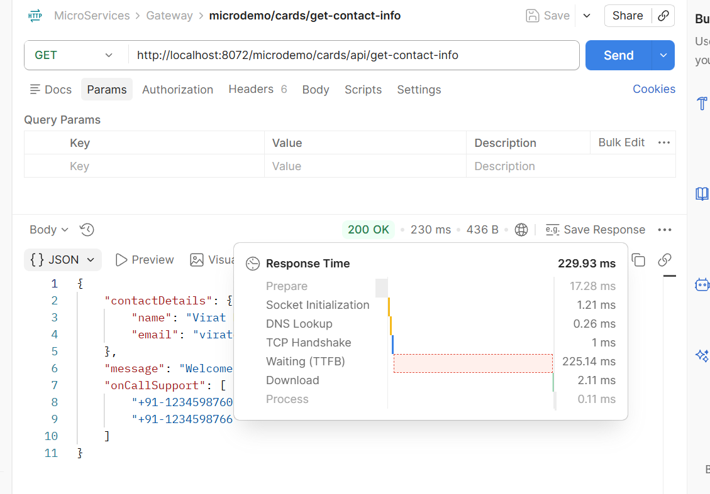
  * See the response time here 230ms  without the breakpoint now lets add a break point and again hit the same api.
  * 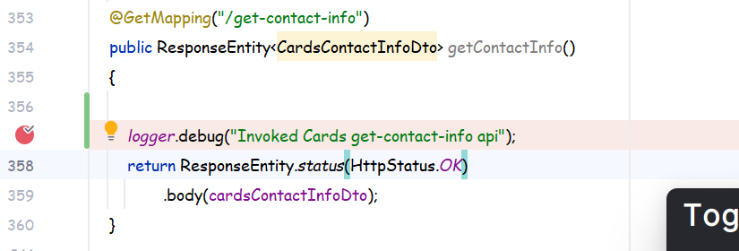
  * 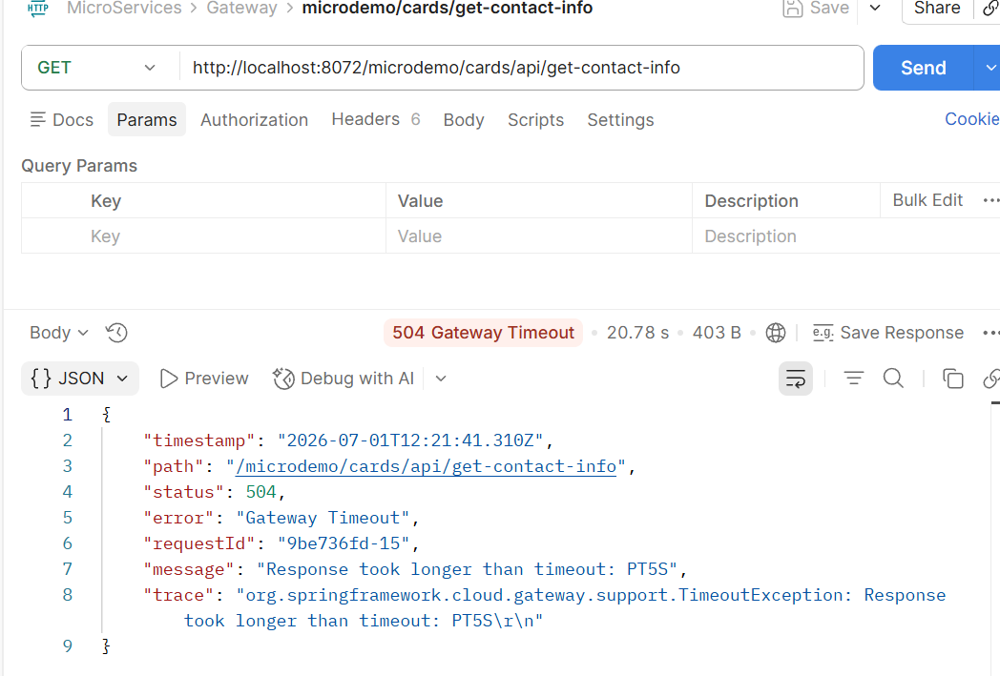
  * See here we got the API Gateway Timeout error and the response time is also 20.78 seconds.
  * Another thing lets again send the request via postman and then as soon as we get the timeout error we will resume the program and see whats there in the console of Cards application:
  * Remember one thing even if there is any response in the Cards application console we wont get that response back to the caller as the thread of the caller is different than the thread of the Service.
  * I mean postman or any other service thread will get killed as soon as it gets timeout while the thread which handled the request inside the Cards might not get killed even for a longer period of time but even if it returns anything back to the original service which called it still the original service wont recieve anything as the thread inside the orignal service is no more available .
  * 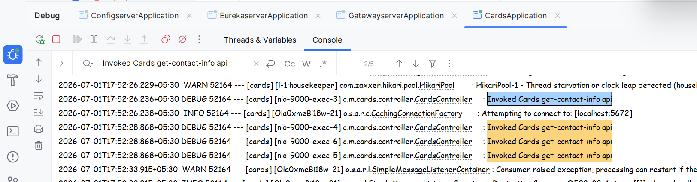
  * See how 4 different threads are logging the same statement .
  * Actual request along with 3 retries handled by different threads.
  * See here we're still getting the logger statement as i said there are threads inside this Cards application which are handeling the flow of code here but even if they try to return something back to the postman there wont be any visible results as the threads inside the caller are dead.
* ### 2nd Test:
  * Now instead of using some simple logger statement we will try to throw some run time exception.
  * As the retry pattern will try to send the request again and again to the UPStream service even if there are any error or exception response by the UPstream service.
  * For this first lets change the code inside that get-contact-info of the Cards controller:
  * 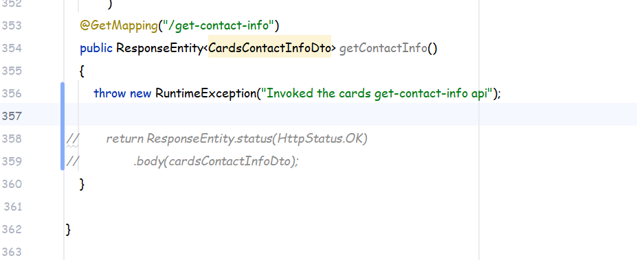
  * So as can be seen voluntarily we are throwing a exception.
  * And if you ask google that what type of http error do we get if we are throwing a run time exception then it says INTERNAL_SERVER_ERROR code: 500.
  * 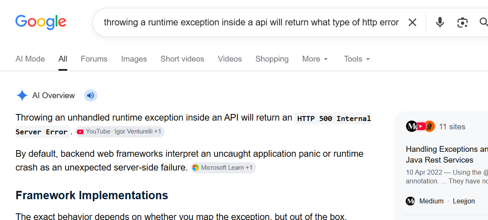
  * And if you remember in the routes we had written:
    * 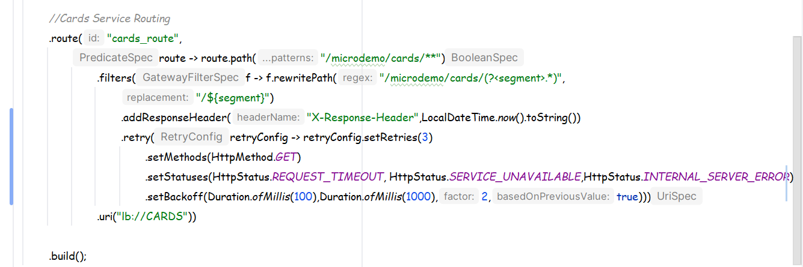
    * We had mentioned here in the statuses HttpStatus.INTERNAL_SERVER_ERROR .
  * Now lets again test the same using the POSTMAN:
  * start the configserver->eureakServer->Cards app -> GatewayServer .
  * Now lets again hit the api:
  * Without adding any breakpoint:
  * 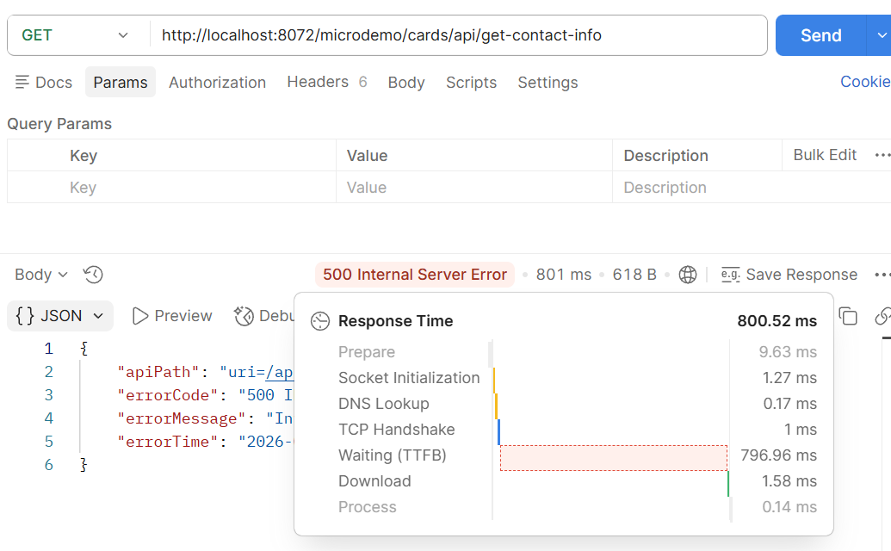
  * 800 ms only with Error code 500 INTERNAL_SERVER_ERROR .
  * Now when we add the break-point:
  * 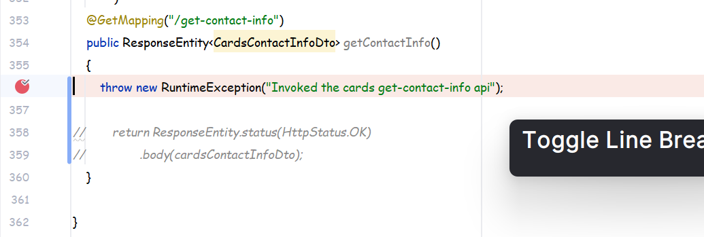
  * Now again hit the same api:
  * 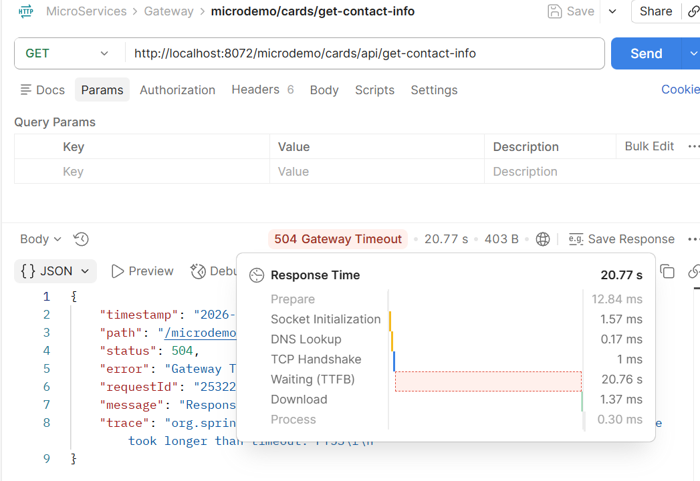
  * See the response time this time it is 20 seconds along with the GATEWAY_TIMEOUT Error and now as soon as we lift the break point and resume the code:
  * 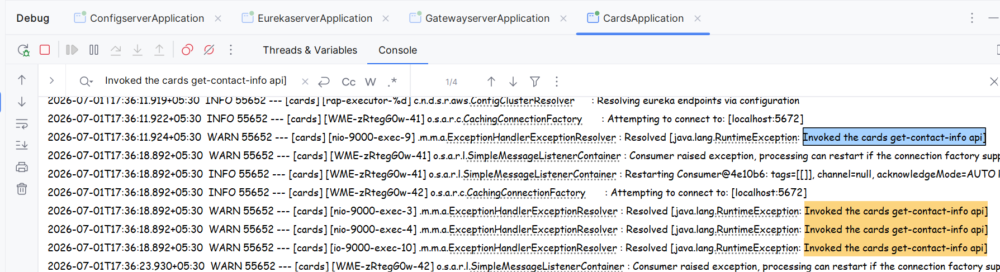
  * If you look at the logs then the exception was throwed 4 times , 1 for the actual request and 3 are the retries incase of GATEWAY_TIMEOUT .
  * This is how retry works .
  * Here the actual request as well as the retry requests were handled by different threads of the cards app thats why we are able to get the exception 4 times and as i had mentioned earlier that the POSTMAN threads or Service which is calling its threads are already dead so they won't be receiving any response .

## Doubt :
* You may be having a doubt in your mind that when we are adding break point it takes 20s while without breakpoint it takes only 800ms , where as we had mentioned that retry will be done for timeout as well as INTERNAL_SERVER_ERROR:
* SO let me clear that doubt do one thing without any break points just simply send the postman request:
* 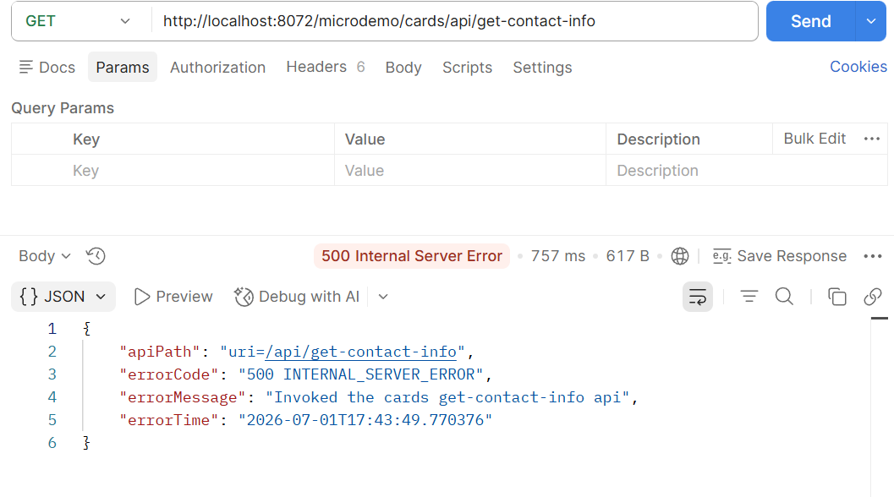
* Still the response time is 757ms does it mean there were no retries ?
* Now if you go to the console of cards then you can see:
* 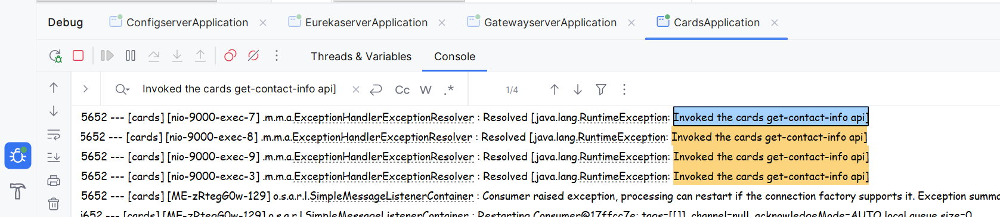
* Which confirms there were retries definitely.
* The difference is when we added a breakpoint we were able to connect to the cards app but the execution was not moving ahead due to which instead of throwing a INTERNAL_SERVER_ERROR Cards was throwing a TimeOUT ERROR which usually has a longer duration thats it.
* 