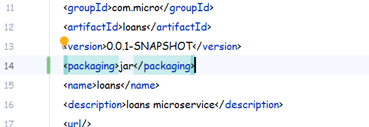
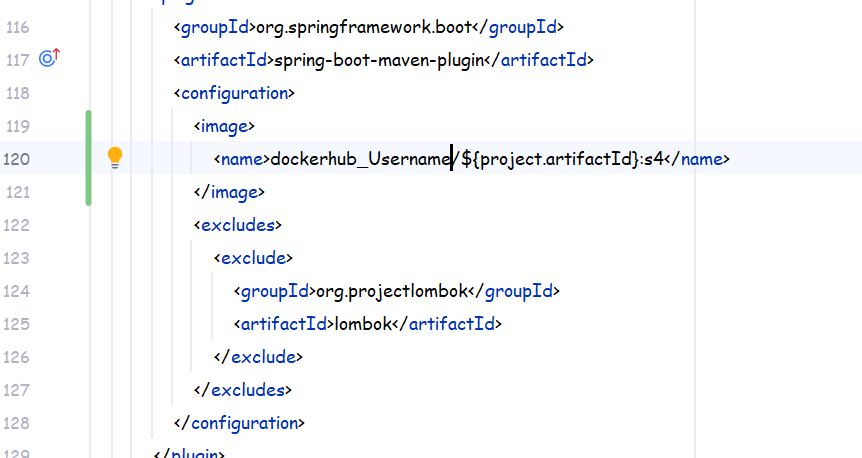

# 💳 Loans Microservice

This is the **Loans Microservice**, responsible for handling all loan-related operations within the system.

It provides APIs for:

* ✅ Creating a loan
* 🔍 Fetching loan details
* ✏️ Updating loan information
* ❌ Deleting a loan

---

## 🐳 Running the Application (Using Buildpacks)

Since the **Docker image** and **`target/` folder** are not included in this repository, you can build and run the application locally using **Buildpacks**.

---

### 🚀 Step 1: Build the Docker Image
first make sure you have not created your own jar already in the target folder.
you have to do some modifications in the pom.xml too if the changes are already reflecting then no need to do.

make sure packaging is set to jar
---
Now create a image tag below the configuration tag and there 
create the name tag too and inside the name tag 
provide your dockerhubuserName/artifactName:version
i have used here ${project.artifactId} beacuse this will detect what is my
artifactId or project name and simply use it here.

```bash
mvn spring-boot:build-image 


```
Make sure your terminals current working directory is the working directory of your project 
where the pom.xml file is present

---

### ▶️ Step 2: Run the Container

```bash
docker run -p 8090:8090 imageName
```
example:
docker run -p 8090:8090 dockerhubUsername/appName:version

---

## 📸 Build & Run Screenshots

Below are the steps demonstrated visually:

Haven't attached any images

---

## Working:
once your image is in running state check in the container section of the docker dashboard or 

```bash
         docker ps
```

This will show you all the running containers
now open your postman and hit the APi's

http://localhost:8090/api/create
http://localhost:8090/api/fetch
http://localhost:8090/api/update
http://localhost:8090/api/delete

create/fetch and delete will ask you for a mobileNumber 
You can read the swagger documents once your container is in running state
to better understand the API workings

## ⚙️ Tech Stack

* Java 21
* Spring Boot
* Docker
* Maven

---

## 📌 Note

Make sure you have:

* Docker installed and running 🐳
* Java 21 configured ☕

---
