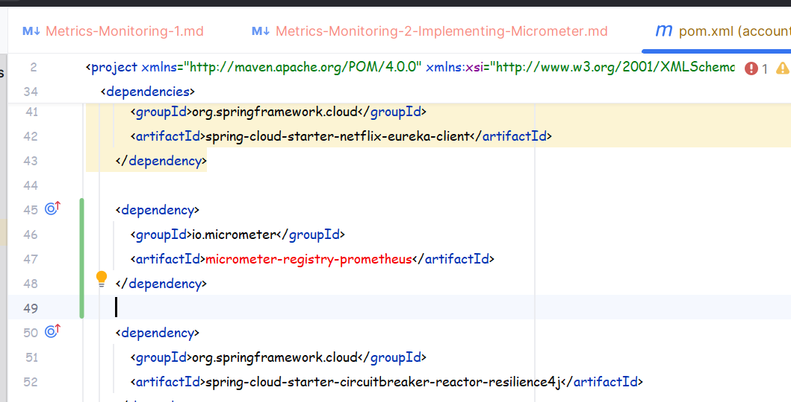
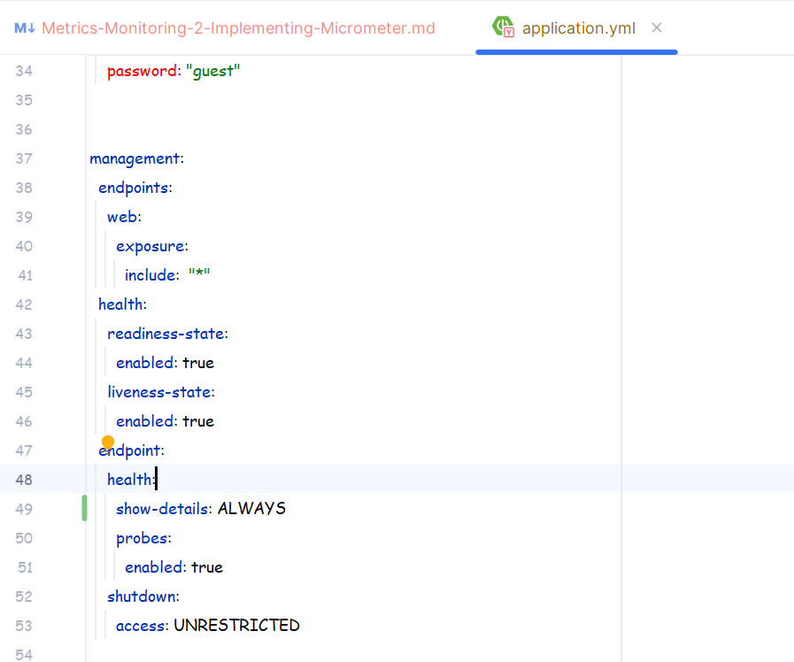
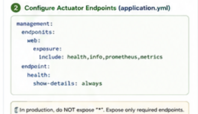
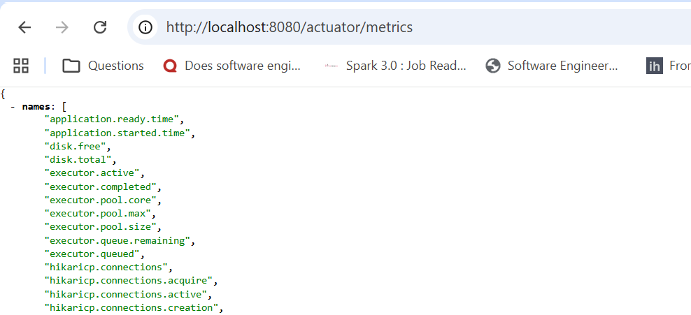
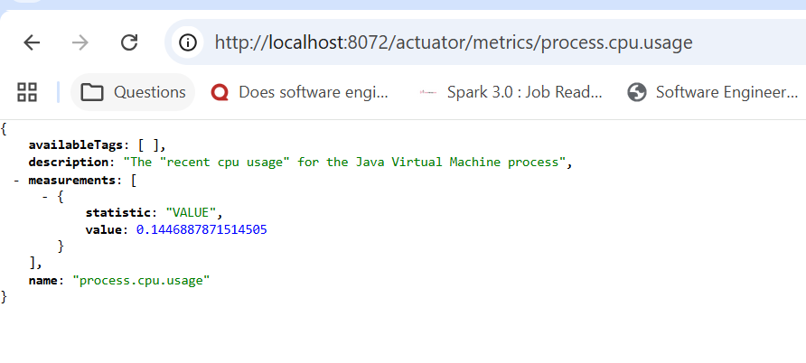
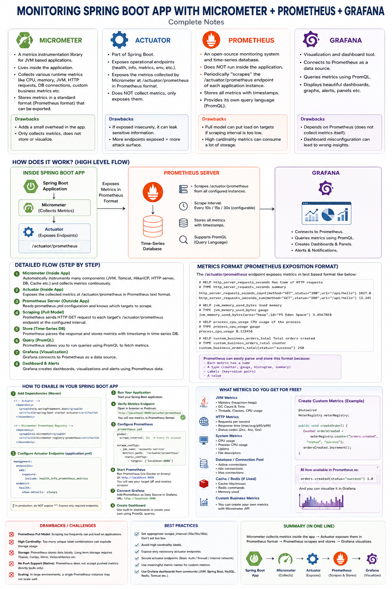
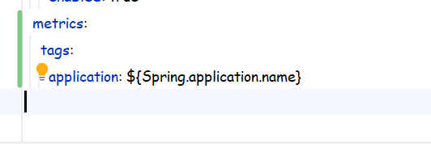

## Implementation of MicroMeter:
* We implement this thing inside the app's.
* We dont make so many changes but we simply just add some dependencies.

``Documentation Link``: https://medium.com/@AlexanderObregon/tracking-metrics-in-spring-boot-with-micrometer-and-prometheus-d61b97520477

## Steps:
* First of all we will have to add the dependency of spring boot actuator .
* After that we will have to add the micrometer-prometheus dependency .
* What the above dependency will do is : the micrometer being on the side of the app will expose a actuator link for the prometheus client , so if you try to hit that link ex: localhost:app_port/actuator/prometheus then you will see the data in a format which can be easily understood by prometheus.
* Suppose just open the accounts app pom.xml:
* 
* Add the above dependency in rest of your microservices as well.
* Tomorrow if there is any requirement where you have some other metrics aggregation system other than prometheus then you can change it too simply replace the name prometheus to your new selected aggregator name.
* Now we need to make sure that the actuator end-points are exposed :
* Open the appliation.yml and check there:
* 
* management.endpoints.web.exposure.include: "*" which includes all the endpoints otherwise inside that include: health , info , prometheus , metrics .
* You can do that too.
* Now another important thing that you need to do is:
* 
* Make sure health.show-details: always
* Ok so now make sure you have done this exposing the end-points and the health.show-details:always in all of your apps.
* Now once all of them are ready now just do one thing start all your apps in order .
* configServer->eurekaServer->accounts->loans->cards->GatewayServer .
* Once all of them have started then hit the below endpoints:
* localhost:port_no_of_your_app/actuator/metrics
* localhost:port_no_of_your_app/actuator/prometheus
* 
* Now if you want to check furthur then pick any of the below listed names and add it to the URL:
* 
* Now lets check whats there in the /actuator/prometheus:
* 
* See the above URL exposed by the micrometer via actuator contains info which can be understood by prometheus thats it.
* Now do the same checks for all of your other apps.
* We have checked everything is working fine , Now in some other lecture we will learn about how we can use prometheus .
* 

Open Lecture Metrics-Monitoring-3-Implementing-Prometheus.md :

### IMPORTANT:
* make sure to include the below config in all of your apps :
* 
* management:metrics.tags.application: ${Spring.application.name}
* It will pick up the name from the Spring:application:name whatever name you have given to your application at the starting of the application.yml .
* Because if you don't provide this then in that case your application will have the micrometer exposing the prometheus format metrics info but without the application name which will make it difficult for you to understand later on.