## Prometheus:
* 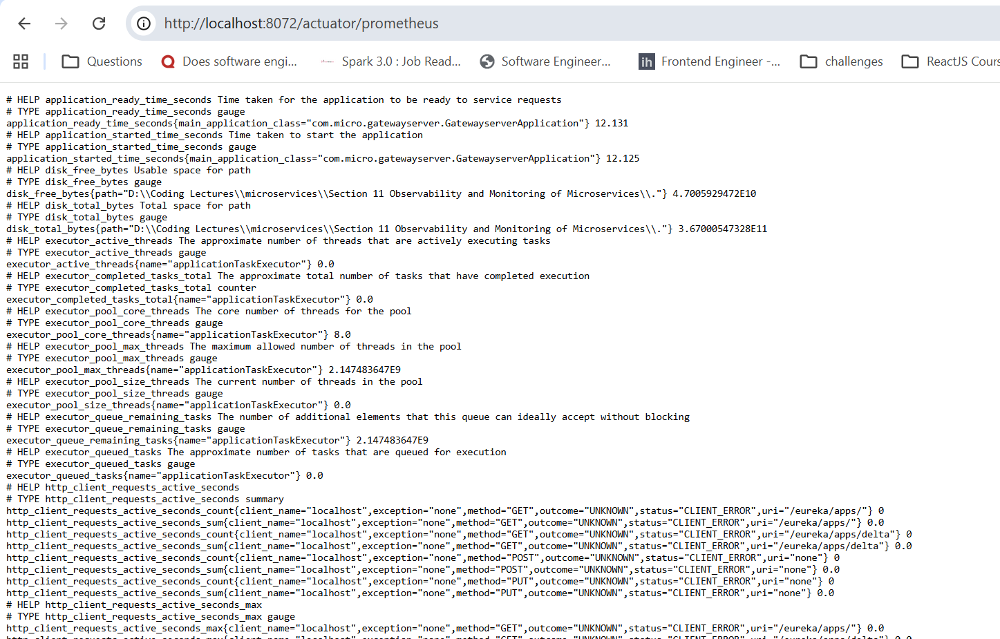
* You may ask what will happen if we dont give the image details or start prometheus in the same docker compose.
* Then in that case in the config file of Prometheus we will have to mention the local systems ports where the containers of different services are running thats it.
* Even in Distributed systems suppose there are 5 servers in EU region where you have hosted the instances of your services now it is not necessary that you need to install the prometheus there only .
* You can simply install your prometheus in some ASIA Server and still in the prometheus config provide the details of all your running instances like their URL.
* And yes prometheus is itself responsible to scrap the metrics data from the apps instances at some regular intervals , here the apps dont poke prometheus.

## Steps to implement Prometheus:
* First create a folder with the name prometheus which is responsible to store the prometheus config file.
* 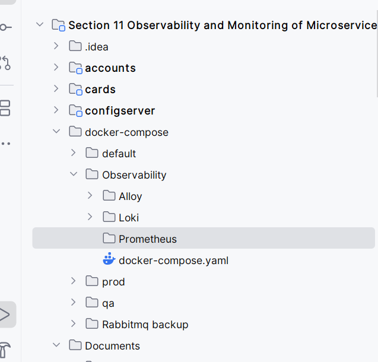
* We created the Prometheus folder here because it will be easy to write the prometheus config file info inside the docker compose.yml Other wise we will have to write a long path info to find that small simple prometheus config.yml .
* Now create a file prometheus.yml and inside that we will write down all our configs.
* 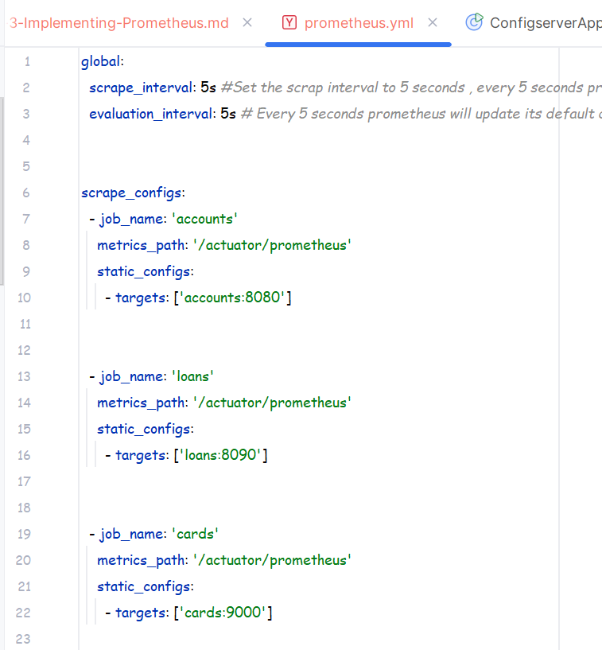
* 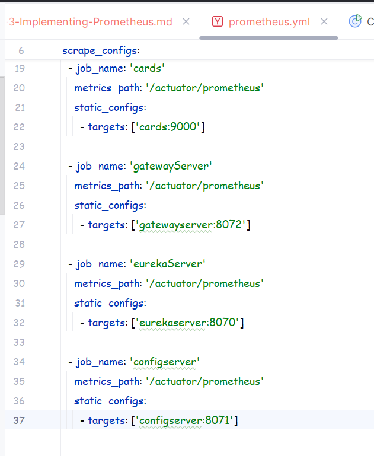
* See the above 2 images this is how the prometheus.yml looks.
* Under global we have scrape_interval which tells that after every 5 seconds the prometheus will scrap the details from the services mentioned below.
* evaluation_interval tells after how many seconds the default dashboards inside the prometheus will keep updating the dashboards with new records.
* Then under the scrape_configs we write down the details of the services from which we want to scrape.
* - job_name is a random name that we can give so that we can identify which job is having what metrics.
* metrics_path is the path where we need to go inorder to scrape the info and this is why its written '/actuator/prometheus'
* `static_configs : - targets: ['']` This is where we mention the Service name of the running docker container in a specific env and also provide the port where the app is running inside that container.
 
* Now we are done with the prometheus.yml now we need to include the prometheus service inside our docker compose file.
* This time we choose the docker-compose.yml under the prod folder.
* 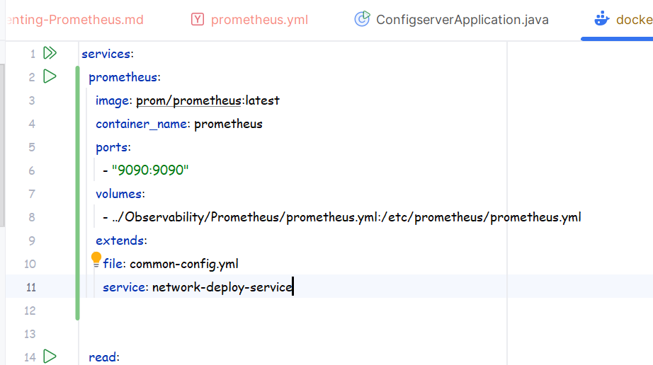
* This is the service config that we have given inside the docker-compose.yml .
* You can also google and ask to any of the AI like how is the prometheus service config written inside the docker compose .yml .
* 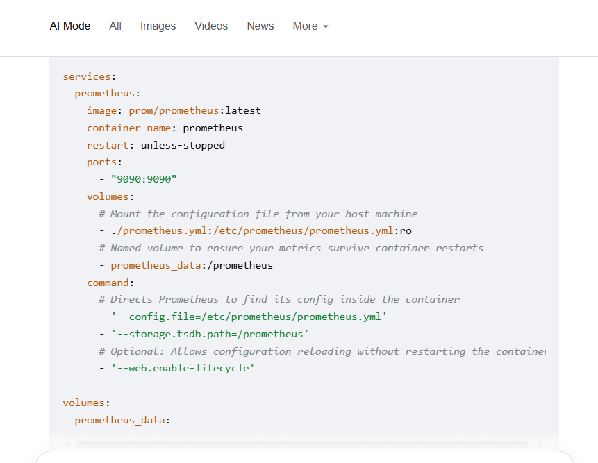
* You can also follow the above image .

`We have implemented Prometheus successfully but now there are two option either we will have to give grafana the details of prometheus service while creatation of grafana service or we will have to give the dataSource details manually`

## Creating DataSources inside the grafana Service config:
* Have a look on the below attached image:
* 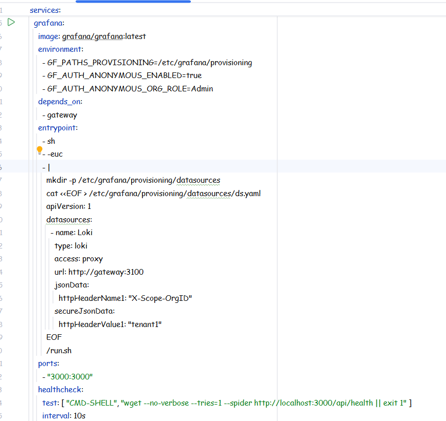
* If you look here then at line 110 datasources is written and inside that we have pre-configured the loki datasource info like that we will have to preconfigure the prometheus datasource too.
* 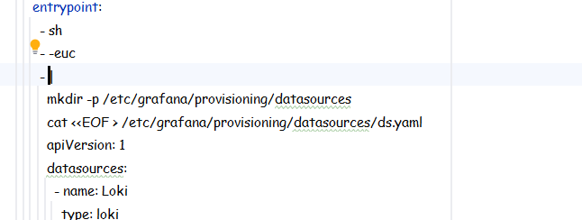
* See here we are making a directory with the name datasources inside the /etc/grafana/provisioning .
* And inside that folder we are writing a ds.yaml file with the configs as shown below .
* 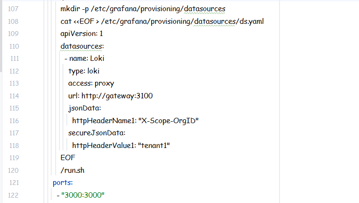
* Ok so we need to create another datasource inside this datasources tag that is for the prometheus but if we make it here then it might look very ugly so lets create a external ds.yaml and then we will simply mount it into the /etc/grafana/provisioing/datasources .
* 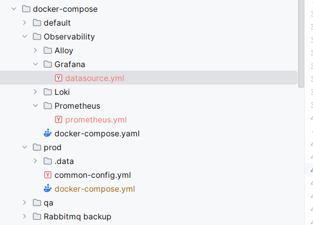
* See here inside the Observability folder we have created a Grafna folder and there we have created a datasource.yml file.
* 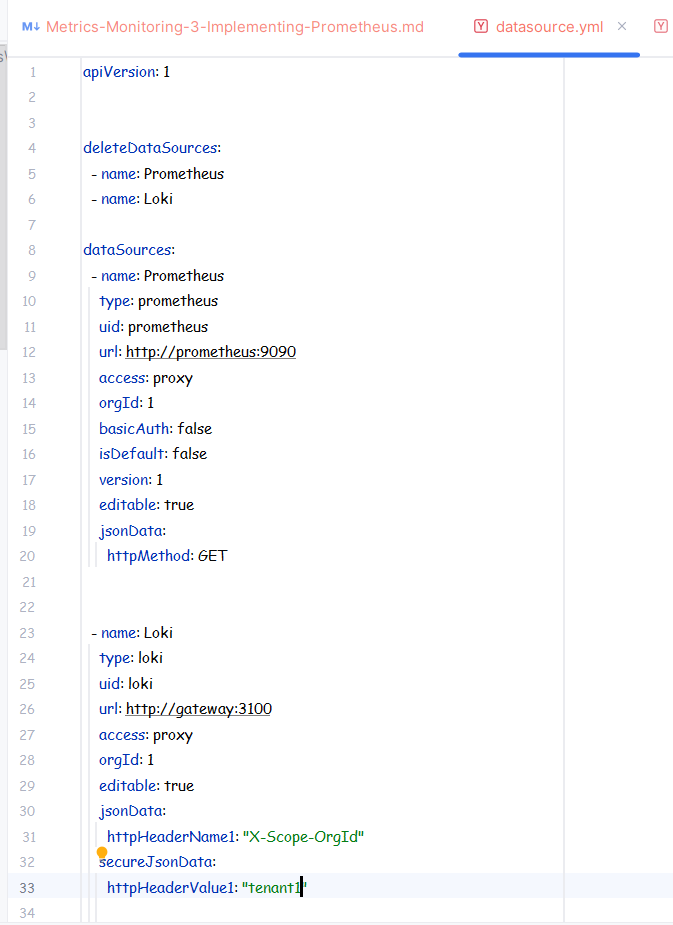
* The above image show what is inside that file now we need to make changes to the docker compose for the grafana service.
* 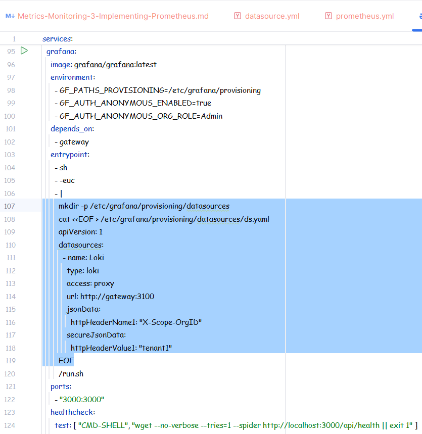
* Remove the selected part and then include some volume related info to the file.
* 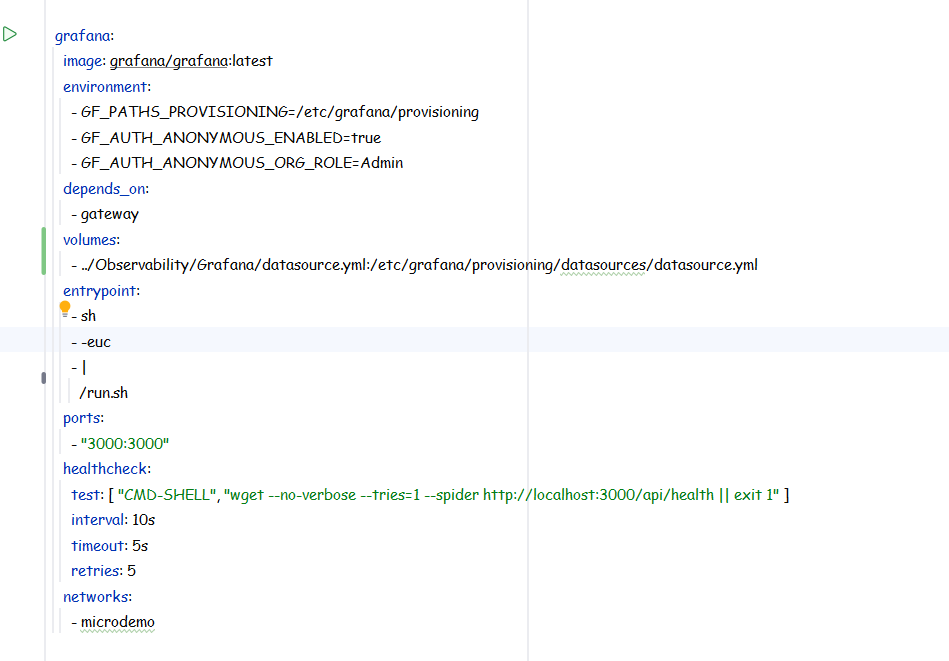
* Now look at the volumes part .
* ``Host Path : Container_Path``
* Earlier we were creating the datsources path using the mkdir now we are simply copying the file from the host path to the container path.

## Scenario if Service instances are getting created and destroyed again and again due to kubernetes:
* In this scenario we never hardcode the config of the prometheus beforehand just like we did in case of docker compose .
* I will attach below what is done in this situation .
* 

## Multiple Architects in which Prometheus can be used:
* 