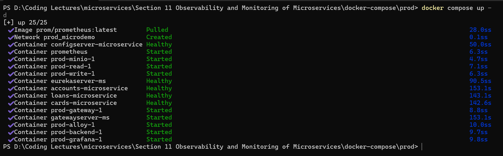
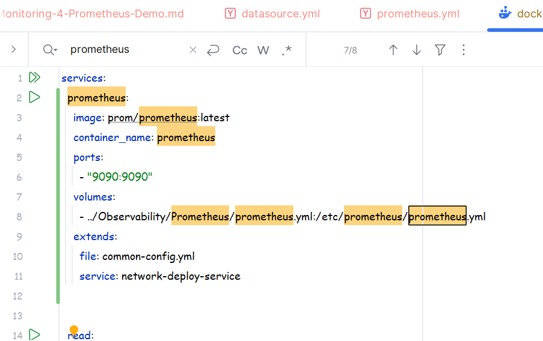
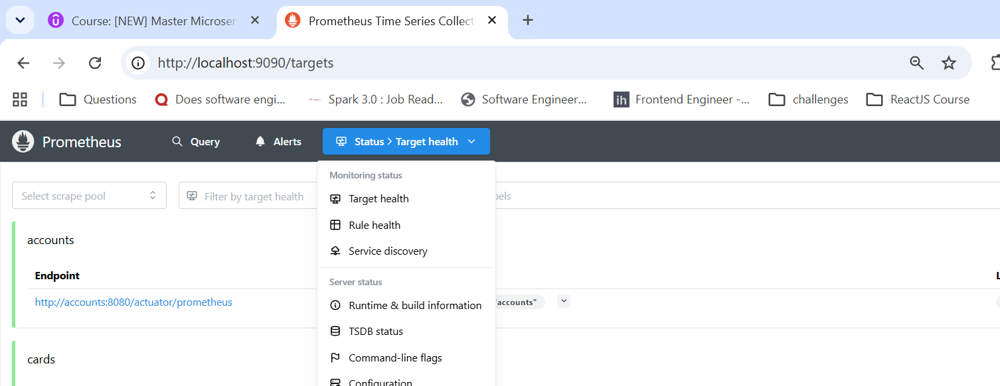
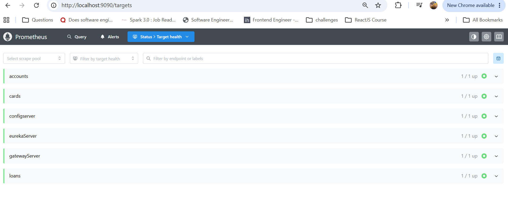
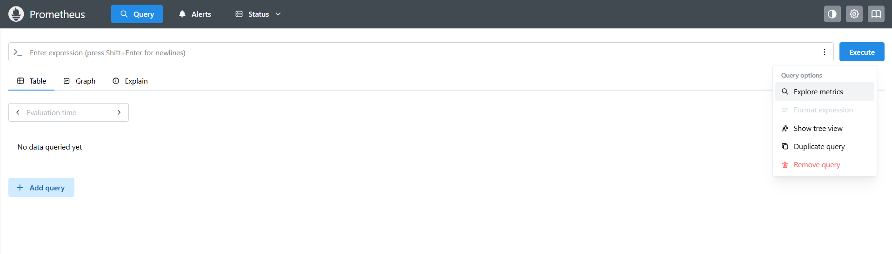
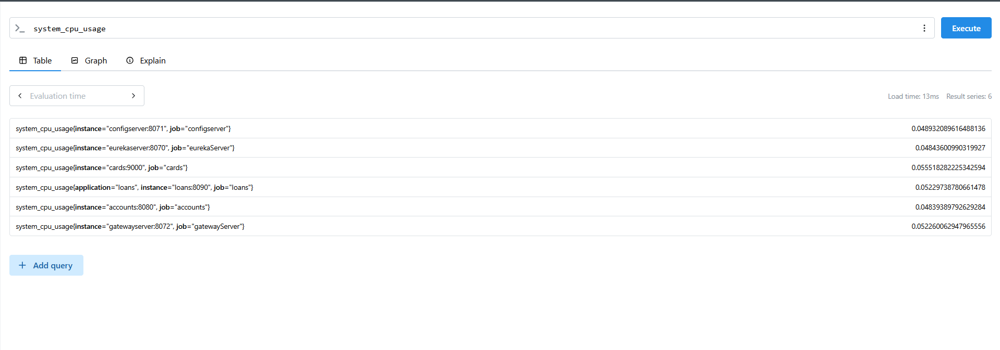
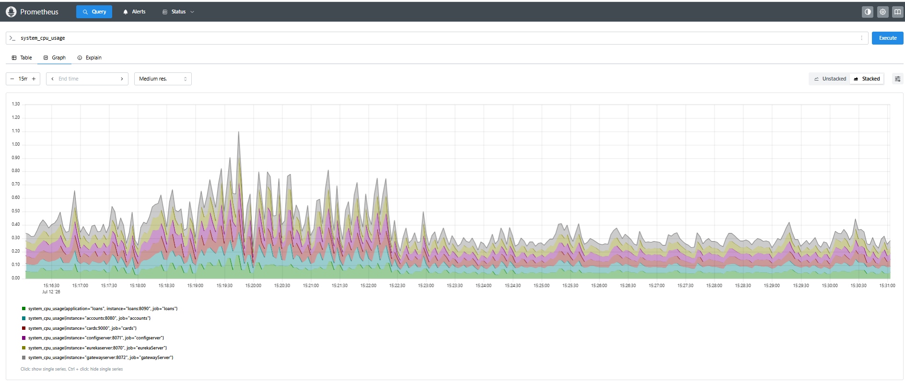
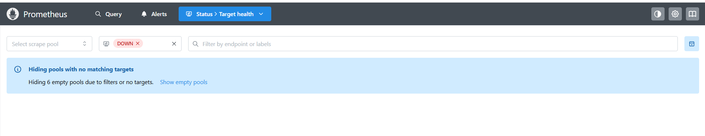
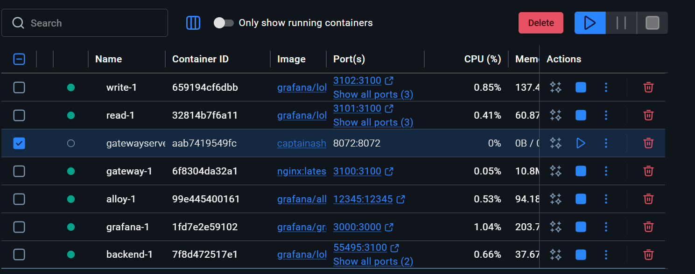
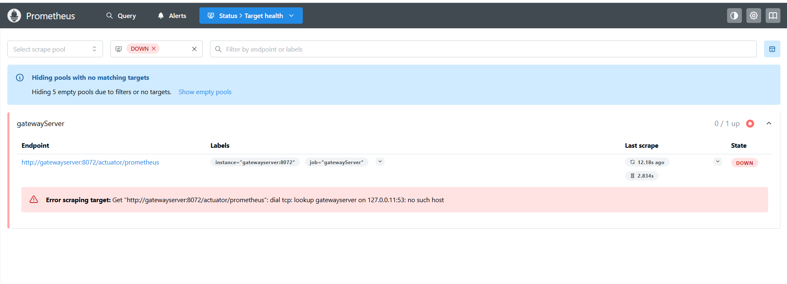

## Prometheus Demo:
* Now as we have included the proper micrometer dependency and also exposed the api end points under management .
* We have also done changes in the docker-compose.yml under that prod folder where we have externalized the pre-made configs for the datasources.
* Now we have also created service for the prometheus now we shall start the docker compose file but before that lets first create all the images of all the apps with tag s11.

## Running the docker compose:
* Now open the terminal at the prod folder which is under docker-compose folder .
* And run the command 
* ``docker compose up -d``
* 
* Took some time but it started .
* 
* As can be seen here we have to goto localhost:9090 to witness this prometheus thing .
* But before this make sure the normal prometheus endpoint of the other apps is working fine.
* for this simply go to any app and hit /actuator/prometheus , if it is giving data in the prometheus format then it is fine.
* 
* Either hit the url localhost:9090/targets or hit localhost:9090 and then navigate to status -> target health .
* Now inorder to see all the running jobs and instances :
* 
* If you want to monitor a particular metric then :
* select query then click on explore metrics .
* 
* From there select which ever metric you want to monitor .
* 
* Then simply click on execute .
* 
* You can select the Graph Option if you want to see the details in a graphical representation .
* 
* We are not getting details of any instance or jobs upon selecting this DOWN Option .
* Now suppose we stop a instance in the docker , the gateway Server instance .
* 
* 
* This is what we got in the prometheus client , now if you start/Resume the same gatewayServer again then it will show UP in the prometheus client.

`` We will learn about Grafana and Prometheus Integration in the next lecture``