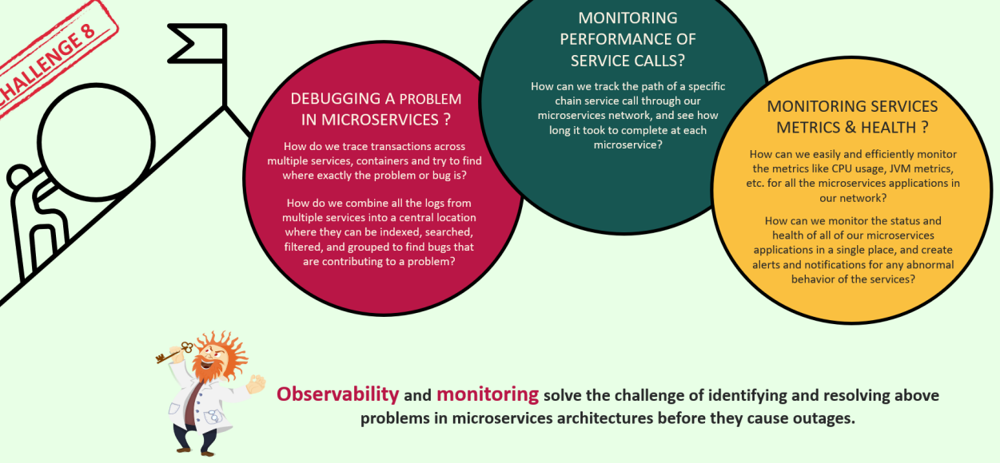

## Challenges which we face in a microservices' architecture:

### Challenges:
* 

### 1st Challenge: ``Debugging a problem in microservices``:
* In monolithic applications all the requests are handled by the same app so looking at the logs and debugging is easy.
* In monolithic applications all the logs of the app can be stored in a single file location and there it can be easily traced , debugged etc.
* In case of microservices there are multiple apps running in multiple containers and if any problem occurs or there is a need to debug then we will have to go and check the logs produced in each container which is a tedious job.
* Suppose we need to trace transactions across multiple services running in multiple containers and try to find where exactly the problem is then in that case is it a good option to individually go to each individual container and look for the bug ?
* How can we combine the logs from multiple services into a central location where they can be indexed , searched , filtered and grouped to find bugs that are contributing to a problem.

### 2nd Challenge: ``Monitoring Performance of Service Calls``:
* As can be seen from the attached image.
* A single request may travel multiple microservices .
* So tomorrow if any performance issue happens then how are we going to debug it and know which microservices is taking how much time so that we can improve its performance.
* So getting the info like time spent at each microservice is very crucial to us.

### 3rd Challenge: ``Monitoring Services Metrics & Health``:
* As can be seen from the above image:
* Do you think you are always going to invoke that actuator api of different services inorder to monitor their health metrics ?
* We need a single place where we can monitor the health of all of our apps , their metrics , their cpu usage .
* A place which can create alerts and send notifications in case of some abnormal behaviour of the services , do you think people are going to monitor everything 24/7 .

### Solution:
``Observability and Monitoring``