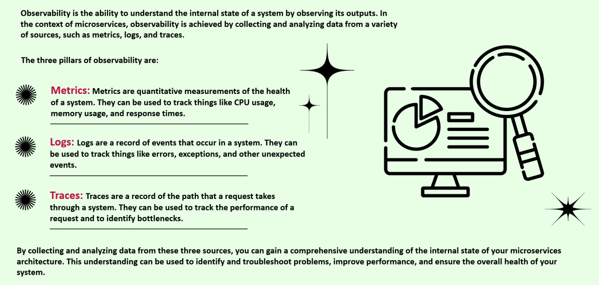
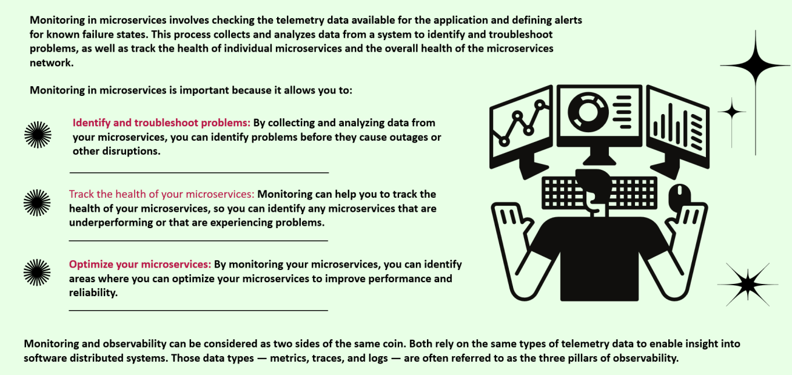
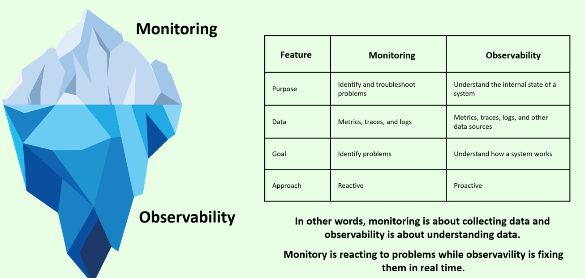

## Definitions and Scenario Examples:

### Observability:
* 

### Monitoring:
* 

### Observability vs Monitoring:
* 
* ``Image 1``: 
* ``Image 2``: 

``Monitoring is reactive as it can be easily seen and action can be taken , where as observabiltiy is reactive as now one keeps on looking at the logs and internal state 24/7 unless there is a monitoring alert by the monitoring tools``.
