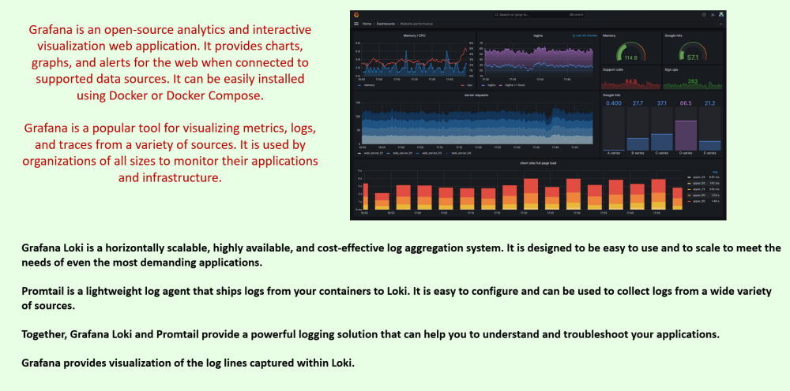
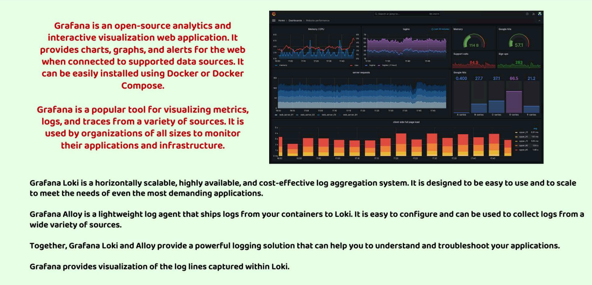
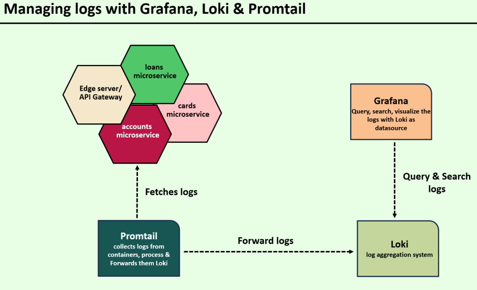
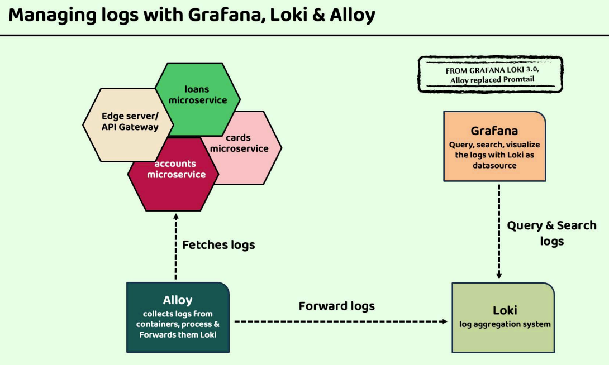

## In this ReadFile we will have details about Grafana, Loki and Promtail:
* 
* 
* Well in the current version of grafana loki we no more use promtail rather we use grafana alloy because promtail had some limitations.
* So grafana labs created grafana alloy .

``In this project we will use promtail as it is still in use but we will also learn about grafana alloy``
* As the name suggests ``alloy`` it means a mixture of different things.
* Promtail was used to extract the logs and then send all the logs to loki.
* The limitations is for different type of monitoring and observability we have to rely on different types of stuffs:
* For log's monitoring we needs logs.
* For metrics monitoring we need metrics.
* And promtail neither collected metrics nor traces for that we had to use prometheus and Tempo Agent.
* So this is the reason why grafana labs created one single agent which can collect all the necessary details be it logs , metrics , traces etc.

## What is Grafana Alloy:
* 

### Managing Logs with Grafana , Loki & Promtail:
* 

### Managing Logs with Alloy:
* 

