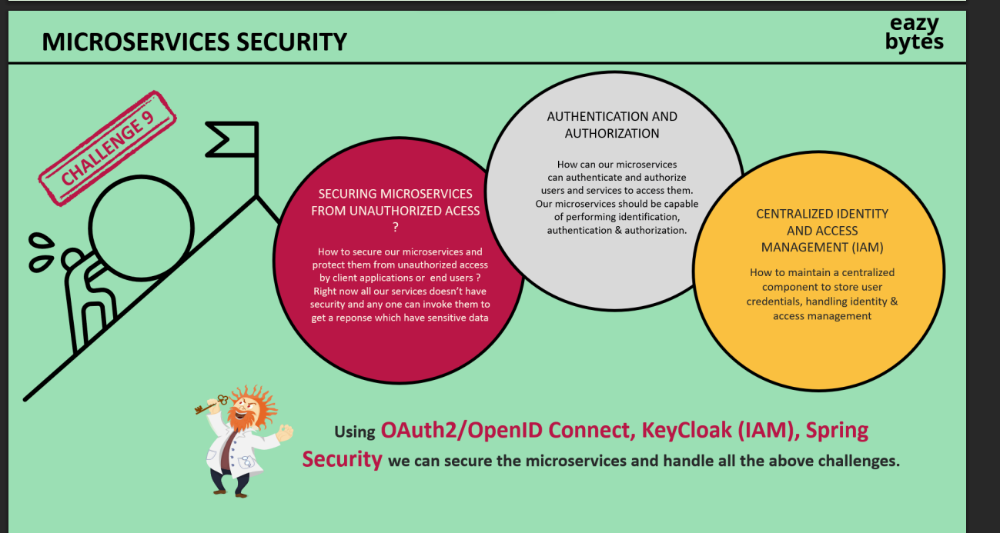
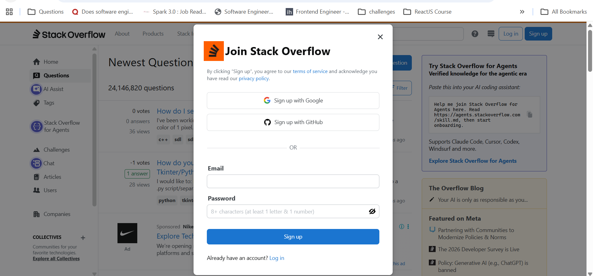
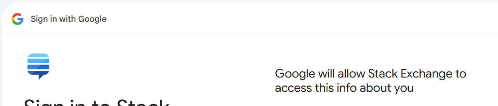

# MicroService Security:
* 
* Do you think we are going to secure our individual microservices by coding different security configs in all of them ?
* Suppose tomorrow if you have 1000's of microservices then what will you do in that case.
* Another problem is everytime a request travels across multiple microservices we will have to provide the creds again and again which is not at all a good thing to do.
* There should be a central service or repository which will be responsible for the authentication and authorization as well as store user credentials .

## Solution:
* Inorder to solve this problem there is a standard which every organisation follows irrespective of the type of app , be it web app or mobile app or ios app.
* That standard is known as ``OAUTH2``: OPEN AUTHORIZATION 2.

## What problem does OAUTH2 Solve ?
* There were so many drawbacks with Basic Authentication because of which OAUTH2 Protocol had to be implemented.
* Early websites used a basic html form where the clients would enter their creds and the creds were sent to the backend server.
* The server would authenticate and then would send a session_value in the cookies and as long as the session is marked active the user was able to access the protected features and resources.
* But there were many drawbacks of this Basic Authentication .
  * Backend server or business logic were tightly coupled with the authentication/authorization logic .
  * Not mobile flow /REST API Friendly .
  * Basic Auth flow doesn't accommodate well with the use cases where the users of one product or service would like to grant third-party clients to access to their information on the platform.
  * 
  * 
  * 
  * A major problem which earlier used to happen with basic auth was : suppose you opened adobe studio inorder to edit some photo now if you want to have all the images stored inside the Google Drive then in that case you have to login to google drive inside adobe studio where you will have to provide the actual reds of Google Drive into the adobe studio do you think this thing is trustworthy

## Lets talk about Google:
* Have you ever noticed how logging into google accounts only you get access to gmail , YouTube , drive , maps and photos.
* It is all possible because instead of Google creating separate auth servers for different apps , it created a central server which servers as the auth server for all the apps.
* You login into youtube using your google accounts creds and magically gmail also gets logged in with the same with the same creds .
* Imagine drive , youtube , maps and photos and gmail as different backend services whos endpoints all of them lie in the same gateway and the gateway is secured , Now inorder to access the services you have to login , so when you login once into any on of the app then the token sent by the auth server gets stored in the browser and the same token gets picked up when you are trying to access other apps or sites too.

## Let's talk about sigin using google/facebook/GitHub etc.:
* Suppose you open stack OverFlow .
* Now when you click on SignUp :
* 
* Now you will see space for filling Email and Password as well as sign up using google or github .
* If you fill the spaces then you will give password and after clicking the signup a new account will get created but on the other side if you click on google then also a new account will be created.
* 
* You get are redirected to google Auth server if you look at the URL then you can see a client_ID and a redirect_URL about which we will learn ahead.
* Now you also get the option to choose any account once you choose any account it will ask you that stack exchange which is the name of the client who is requesting the details .
* 
* Is asking you to access info about name and email id.
* Once you press continue then the google Auth server will allow the requested info in a READ Manner and then you will also see soon you are redirected back to the stack overflow page but this time the stack overflow web page will show you the signup page with prefilled fields like email and name sent by the google .
* The redirect link you saw on the URL is actually google auth redirecting the request back .
* And the client_id that you saw on the URL is actually the client_id given for the Stack Overflow Server/Auth Server and the name of the client_id is Stack Exchange as what was shown by google Auth Server page.
* We will learn more about siging in and loggin in using socials like google , facebook etc.

## Delegated Authorization:
* You authorize one app to access your data , or use features in another application on your behalf , without giving them your password.
