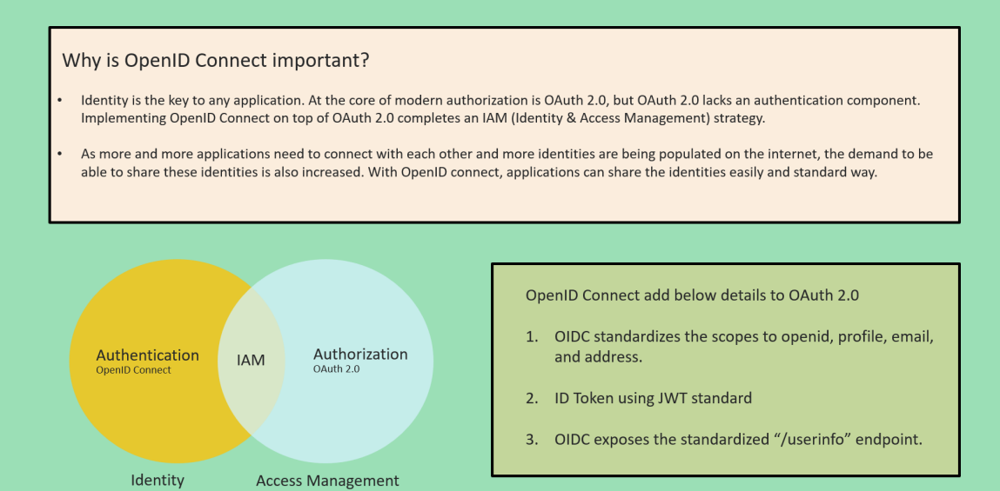

# OPENID Connect:
* We had OAUTH so everyone was using it earlier to access the protected resources .
* Access to the protected resources was granted only after the authentication and authorization was executed at the Auth Server .
* In return everyone used to get the token which contained the information like the access token which contained so much info including roles etc.
* But it lacked one thing that was the token granted or given by the auth server never had information regarding who is the user ?
* Like at a point it became necessary for every org to see who is the user like who is the owner of this resource .
* So this is where OPENID Connect came into picture .

* ``OPENID CONNECT``: It is a wrapper build on top of OAUTH2 framework/protocol which says we need to share another token that contains the user/resource owner details.
* After the introduction of this standard now the JWT Token which was returned by the Auth Server contained Access token as well as a new token which is the ID Token which contained the user details.
* ID Tokens share the identity among the applications.
* ``The OPENID CONNECT flow looks the same as OAUTH . The only differences are in the initial request , a specific scope of OPENID is used and in the final exchange the client recieves both and ACCESS TOKEN and ID TOKEN . IF you dont mention the scope then you will only get ACCESS TOKEN and not the ID Token ``
* 
* OIDC Exposes the standardized "/userinfo" endpoint : What it means is anytime any Client wants to know or get the details of the logged in user then in that case it can simply invoke this api and get the user info .
* By combining the OAUTH2 and OIDC for identity and Access Management we introduced a new concept that is IAM , IDENTITY and ACCESS MANAGEMENT.
* 