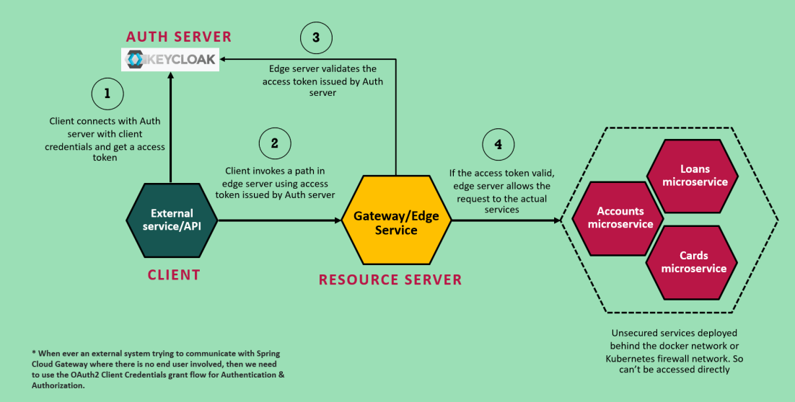
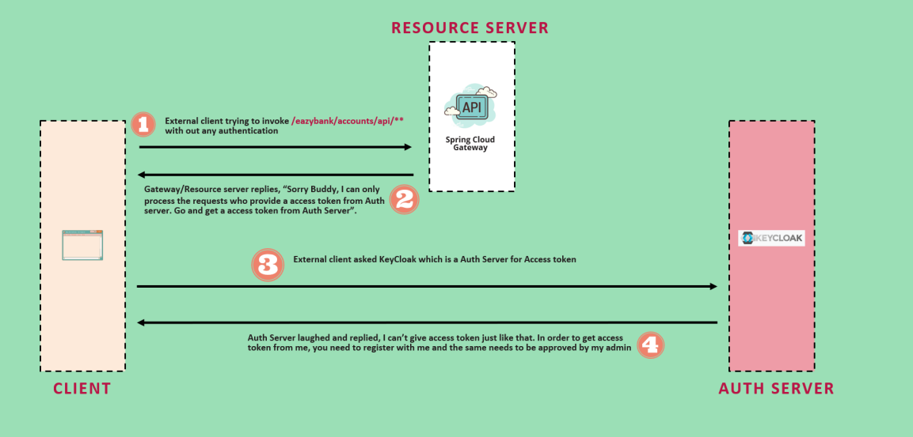
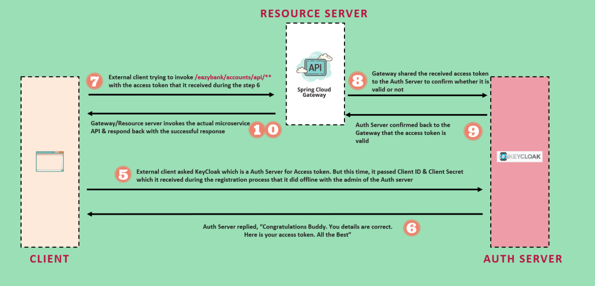

# Gateway as a Resource Server:
* If you have gone properly through the Microservices-Security-6 document then you know how the Client Credentials Flow works.
* This time lets secure the gateway , consider the gateway to be the Resource Server.
* 

## High level Architect Diagram:
* 

## Explanation from lecture:
* 
* 
* 