# KeyCloak Setup:
* Inorder to setup a keycloak server in your local.
* First open the official website of keycloak.
* 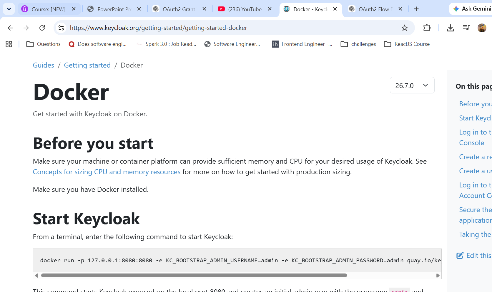
* From there click on getstarted then go to docker and there you will see the command to pull the docker image of the keycloak .
* 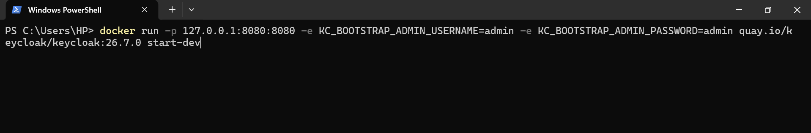
* As can be seen here the port mapping is 8080:8080 but we will change it to 7080:8080 beacuse we have one of our app running at 8080 of our local system.
* Now simply run the command.
* 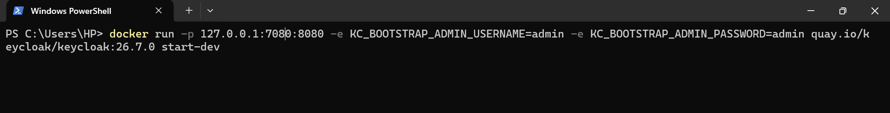
* Make sure you are looking at the logs , and then once it starts then ...
* Now goto the localhost:7080 on your browser .
* 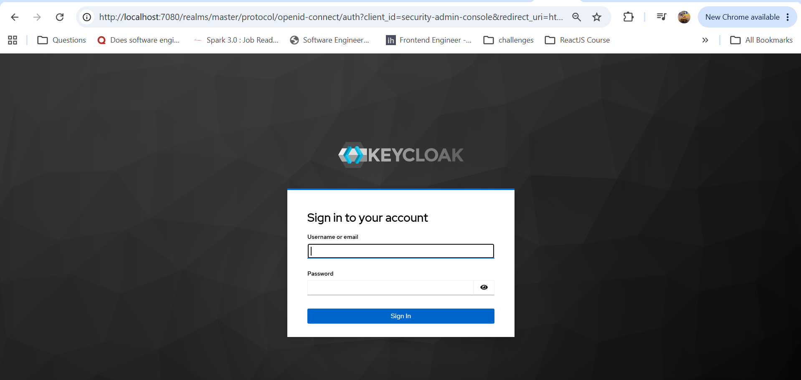
* Now as you have configured in the env variable that the username and password both are admin so put them.
* 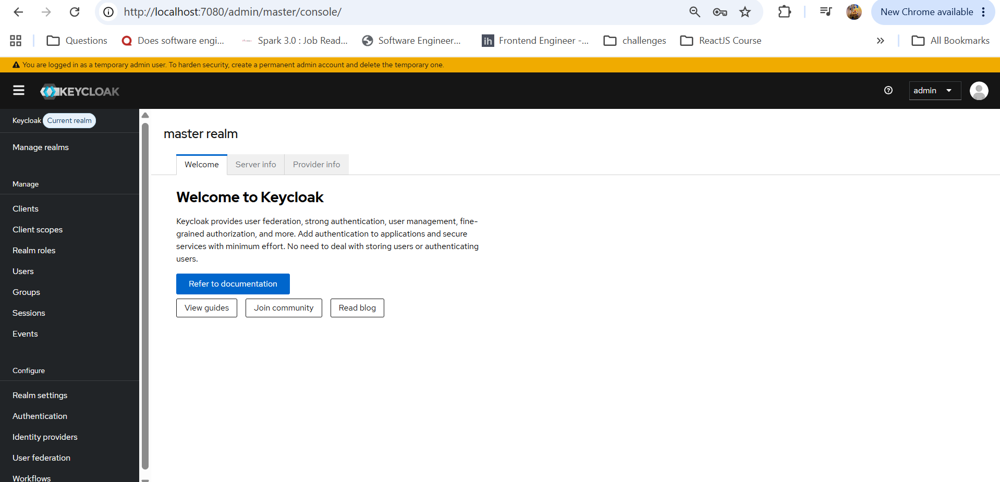
* You will see this page.
* Inside KeyCloak there are so many things that you need to understand.
* 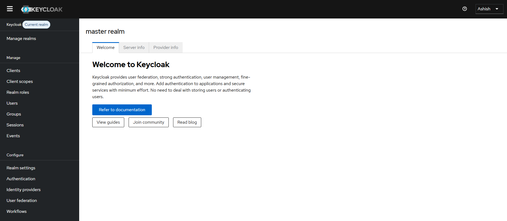
* If you see on the left hand side then you can see manage realms , Clients , Client Scopes , Realm Scopes , Users , Groups , Session , Events etc.
* We will learn about this in another lecture like what are they but before that lets create a client .
* You can either create a client in the master realm or you can create a new realm and there you can create the client , the overall process is same.
* I have already created a realm under which i am going to create a client , the process of creating a realm will to shared in the next lecture.

## Creating a Client to demonstrate the client credentials grant type flow:
* 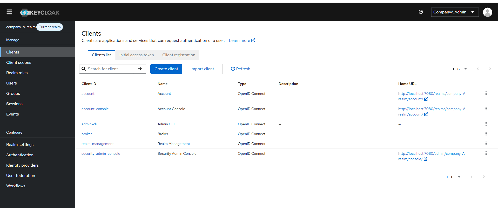
* select the clients and then click the Create Client.
* 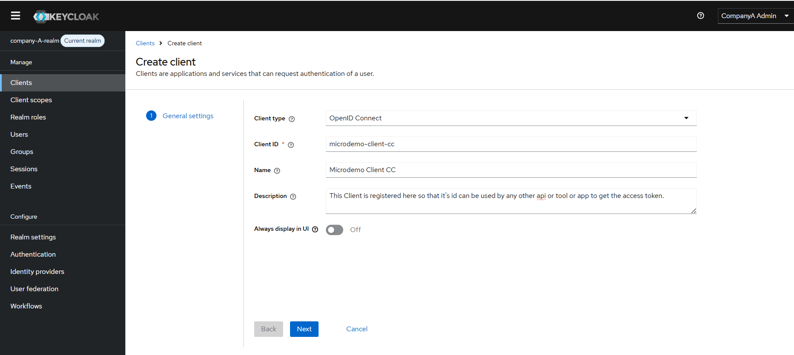
* Now as can be seen we have filled the details now click next.
* Initially it will look like this but we need to make some changes here: 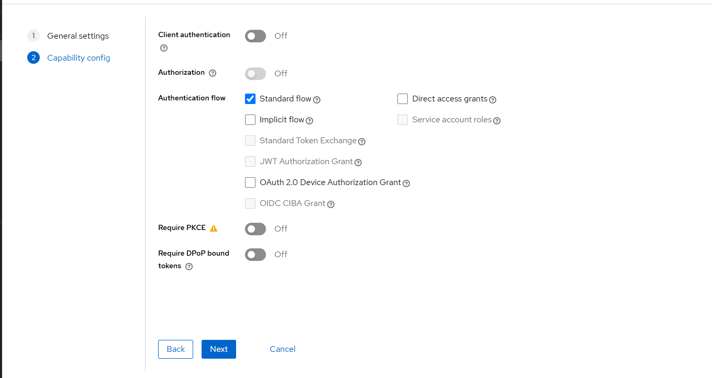
* 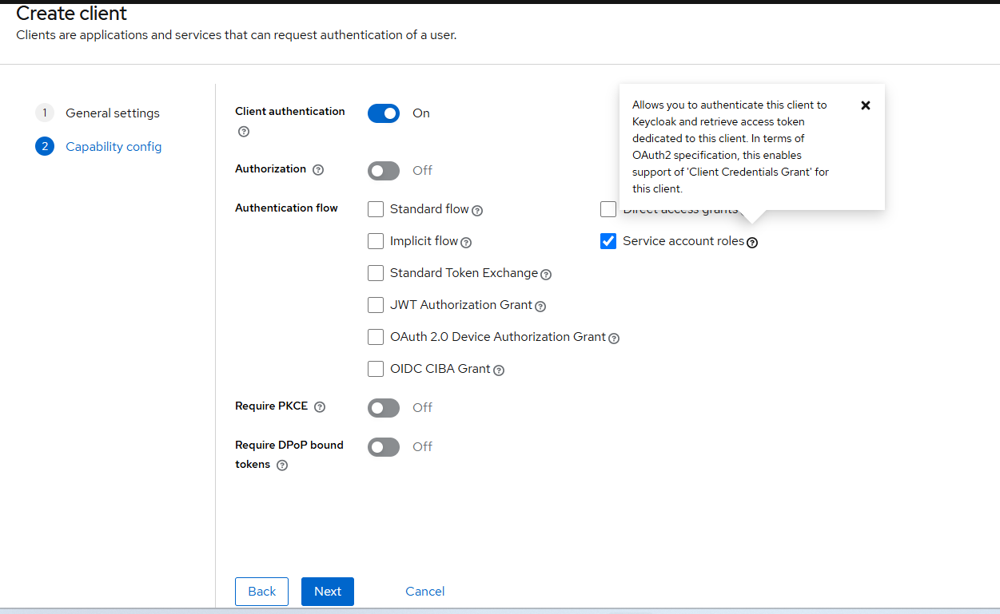
* Make sure to select the Client Authentication so that it will expect the client to send the client_id and the client_secret for authentication .
* And make sure Service account roles is ticked , as it will enable the client credentials grant type flow.
* Now click on next.
* 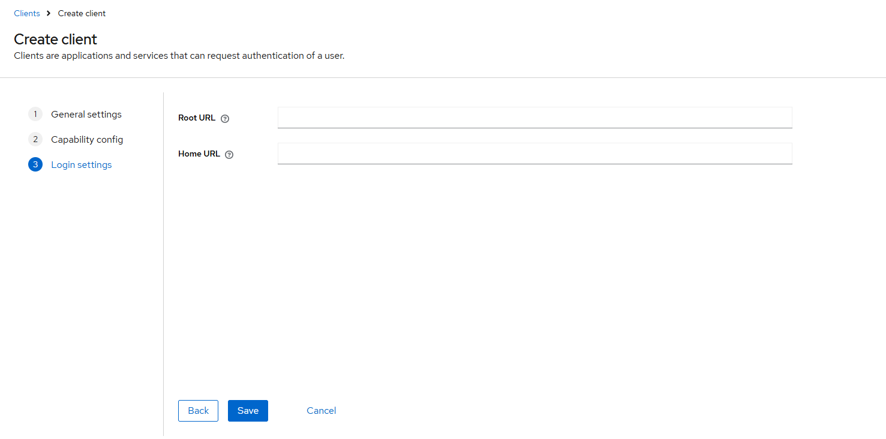
* Keep this page blank as we are not going to use any login page , this page will help in the case of Authorization Code grant type flow.
* Now save.
* Now goto clients and open your created client:
* 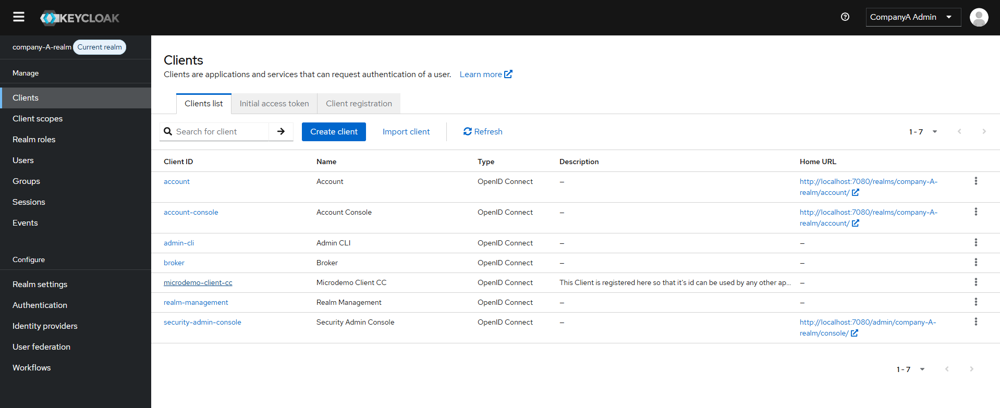
* 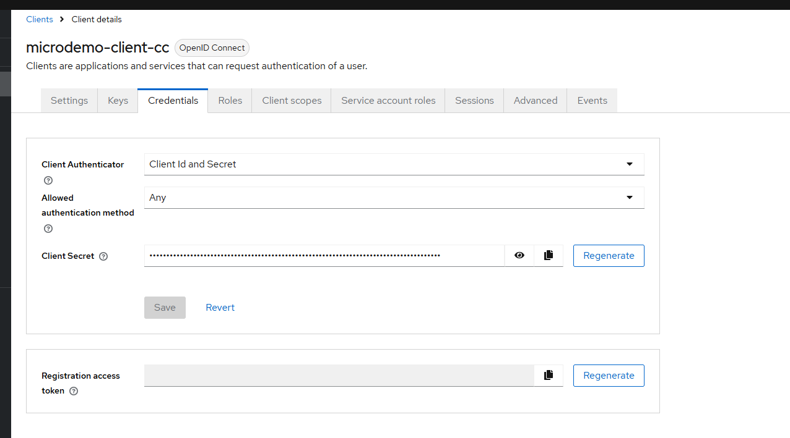
* Now here if you see the client secret then it is the one that is autogenerated by the keycloak and this secret has to be used by the client inorder to get the access token .
* You can also assign role to the Client if you get inside the Service Account Roles , so that whenever the client asks for the access token then in that case it will use its role and it will be verified at the keycloak server.

## Testing the Auth Server for Access token using Postman:
* 
* Well in case of getting the Access token using Postman we will recreate or simulate the behaviour of a normal backend service .
* For this first we will have to send a post request to the URL of the AuthServer which verifies the creds and grants access token.
* And while sending the POST Request we will have to make sure we are sending the details in the ``x-www-form-urlencoded`` format.
* After we receive the access token back after verification then we can use the same token to access our resource Server.
* While in case of Backend to Backend communication all the above steps are done automatically with the help of certain dependencies which need to be added.
* Backend Service A will automatically load the client_id and the client_secret in the POST Request to the auth server and once it receives a positive response then it will also send the request to the Resources Server along with the token.
* ``End-Point URL for the access token``: To get the endpoint URL for getting the access token .
  * First login into your KeyCloak realm .
  * 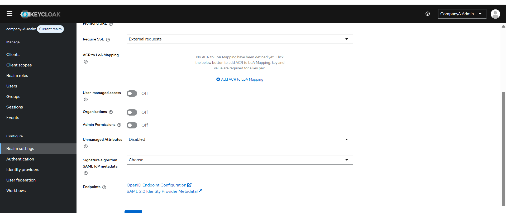
  * Then select the Realm Settings and then click on the OpenID Endpoint Configuration link.
  * 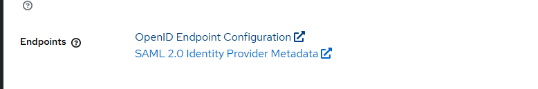
  * 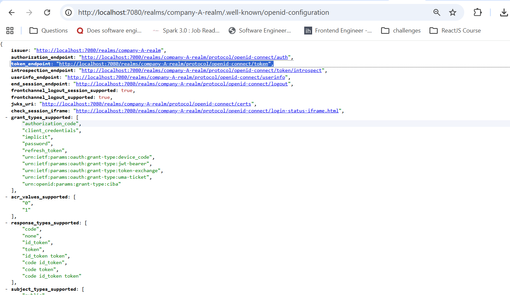
  * If you see here then there are so many endpoints here , from these we need to invoke the token_endpoint since we are expecting a access token.
  * 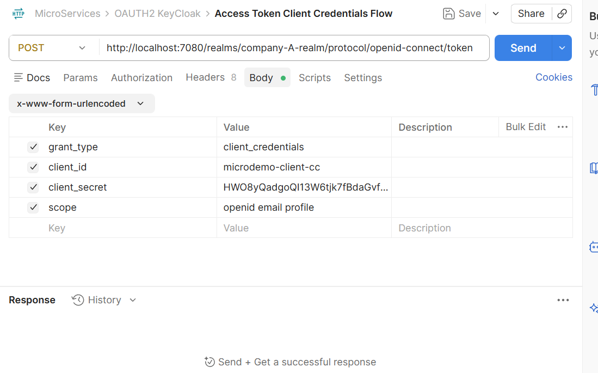
  * We copied the token_endpoint now we are going to send a POST request here via the POSTMAN and as can be seen above we have a body in the x-www-form-urlencoded .
  * We have some Key and Value as can be seen .
  * we mentioned he grant_type which is going to be client_credentials so that the endpoint knows by which way it has to verify.
  * Then we have given it the client_id which was set by us only in the clients of the Respective realm of the Keycloak.
  * Then we have the client_secret which was generated and give to us by the Keycloak itself if you remeber.
  * And then we have mentioned the scopes which means what are the things that we are requesting the keycloak server other than the access token.
  * client_id: 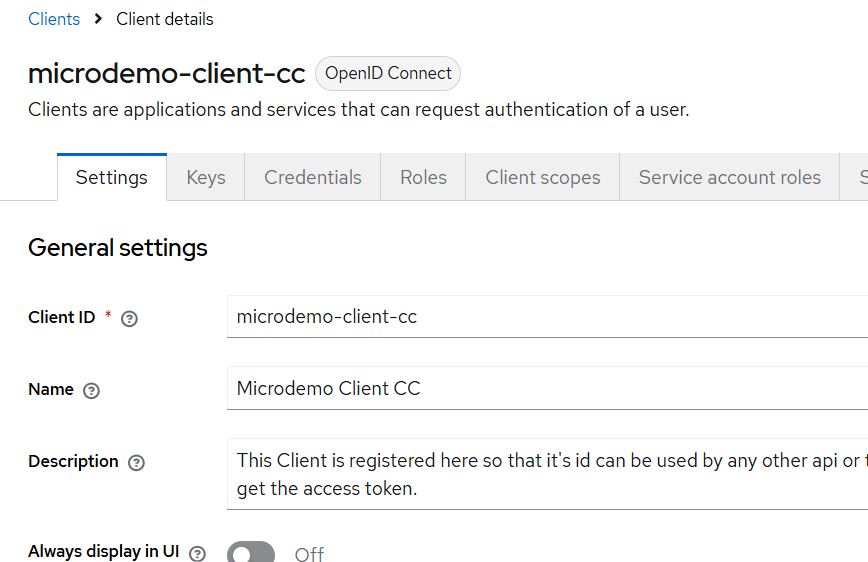
  * client_secret: 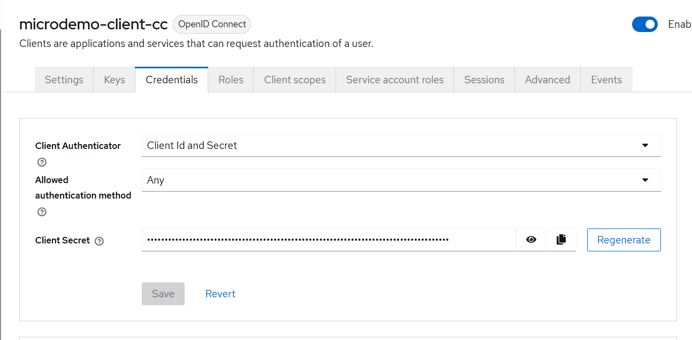
  * Now lets send the request and see what we are getting in response.
* Response:
  * 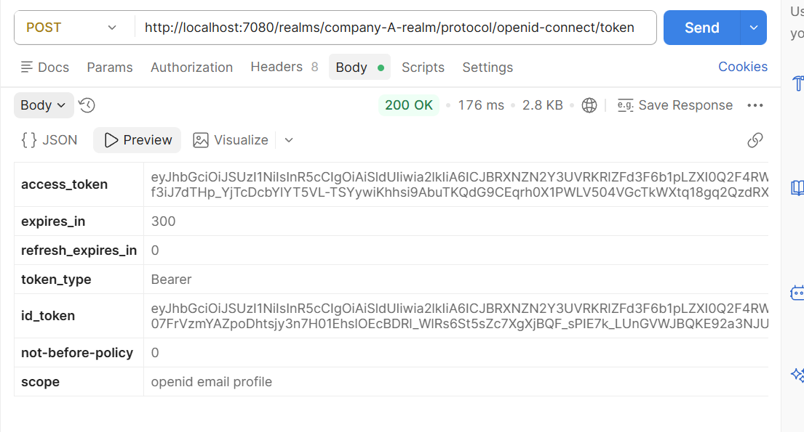
  * We got access token as well as the id_token and some other things as well like token_type bearer means jwt.
  * expire_in which is the duration of life of this token.
  * Now lets see what is inside the token .
  * To see that we have to copy the jwt and go to the jwt.io page.

## Deep dive into the response:
* simply copy the access token and paste it in the jwt.io website .
* 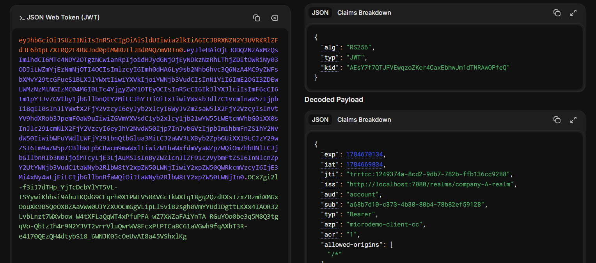
* You will get this response and well you can ask chatgpt what does all of these mean.
* Now lets see what is there in the id-token:
* 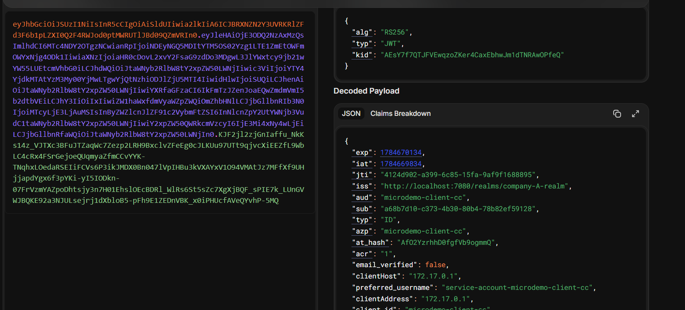
* See on the right hand side we got the identity details of the client .

## Scenarios:
* ``What if you dont pass the openid in the scope ?``
*  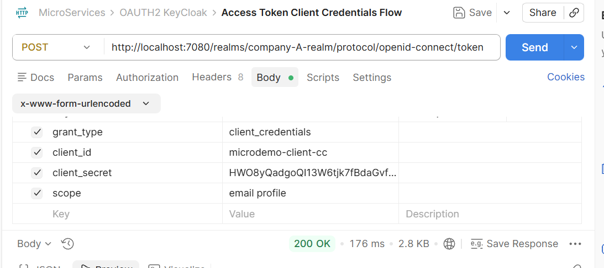
*  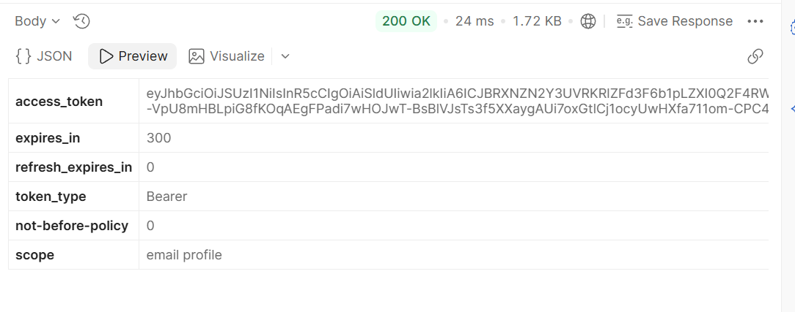
* See you will only get the access token and not the id_token.

* ``What if we alter the client_secret a little bit , do one thing change any one charater to some random value or character ?``
* 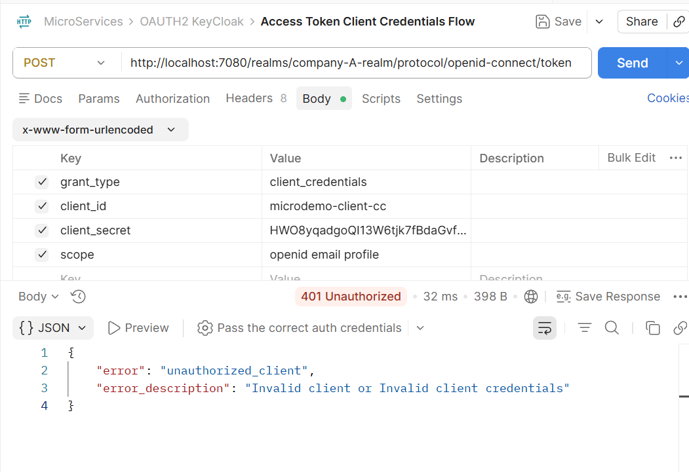
* Well you will get this response 401 Unauthorized .