# Authorization Code Grant Type Flow:
* In OAUTH this the grant type flow where a authorization code is sent back by the auth server before finally giving the access tokens to the user.
* This is the type of flow where user is involved .
* Suppose there are some backend services and to access them there is a FE app maybe a react app , take example of a shopping app or amazon.
* Well there are some resources which are not protected and those resources can be accessed directly by the FE APP.
* But there are certain resources which are protected at the gateway layer and which need a authorized and authenticated user to access them.
* In this case the user is going to login into the FE APP and in return they will be given permission to access to protected resources .
* In high level detail what happens behind when the user provides the creds and gets access to the protected resources , the entire mechanism that goes behind is the authorization code grant type flow.

### Authorization Code Grant Type flow :
* 
* 
* 
* Explanation:
  * Suppose there is a FE application like amazon.
  * You open the application , now you will see some of the things are hidden or are only visible to the authenticated or logged in user.
  * Now when the user clicks on the login icon or button what happens ?
  * They are redirected to a new page where it asks for username and password and there are other options like forgot password or signup or sigin using google/fb/etc .
  * Suppose the user already is a registered user then in that case what he/she will simply provide their creds like username and password .
  * Now this creds will be recieved by the auth server ,where these creds are going to get vaidated .
  * Once they are validated the user will be redirected back to the amazon or which ever site with a Authorization Code : Here what happens ?
  * The FE app is coded in such a way that even the user doesnt realise this but behind the scenes the authorization code recived by the Auth Server is sent back to the Auth Server as a POST Request from the FE app .
  * In exchange of which the auth server after seeing the authorization codes gives back the required tokens like access token , ID Token and Refresh token.
  * Each one servers a different purpose .
  * Read more about which token servers what purpose by urself.
  * Well now again the user wont even realise but behind the scenes the tokens are received inexchange of the Authorization Code and again behind the scenes what ever were the protected resources the FE App will use the access tokens to make a call to the backend to get back the data .
  * And this is the entire flow of Authorization Code Grant Type.

### NOTE: ```The Login Page where you provide the creds are provided by the Auth Server only , it can be customized as per the business : Also you can create your own login page```
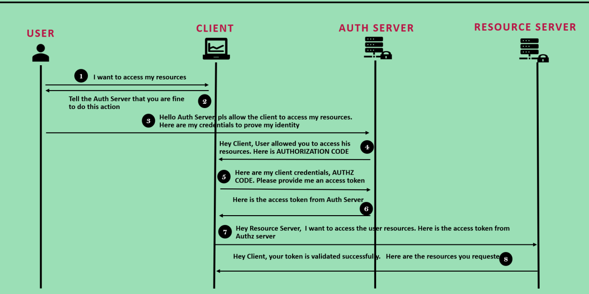
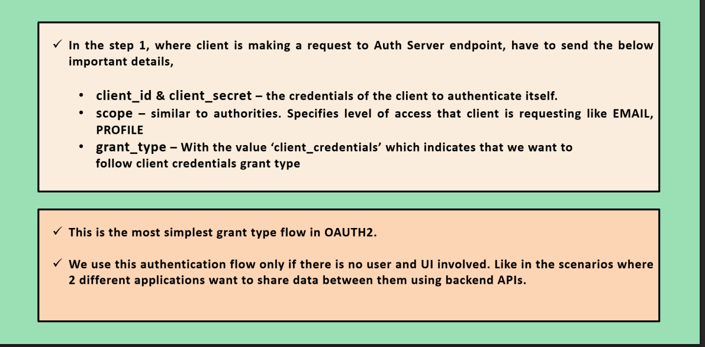

### Tutorial of OAUTH2:
* There is a website that simulates the OAUTH2 Authorization Code Grant Type flow :
* ``https://www.oauth.com/playground/``
* Hit the above link and then follow the steps which i am telling .
* 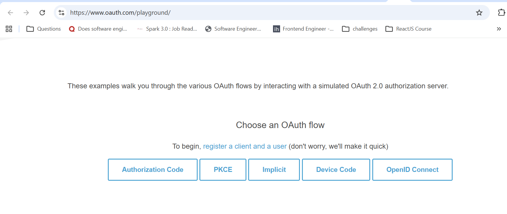
* Select the Authorization Code Option:
* 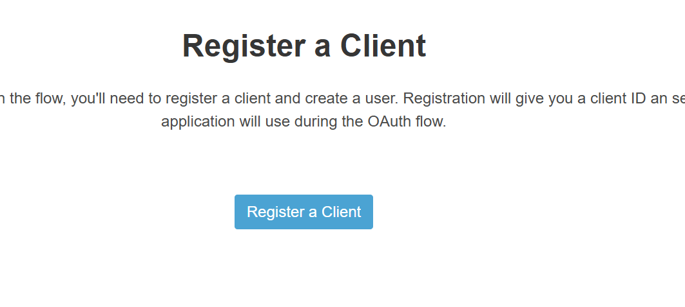
* Click on register a client which means in real in our auth server we will be manually registering a client , suppose a frontend app.
* 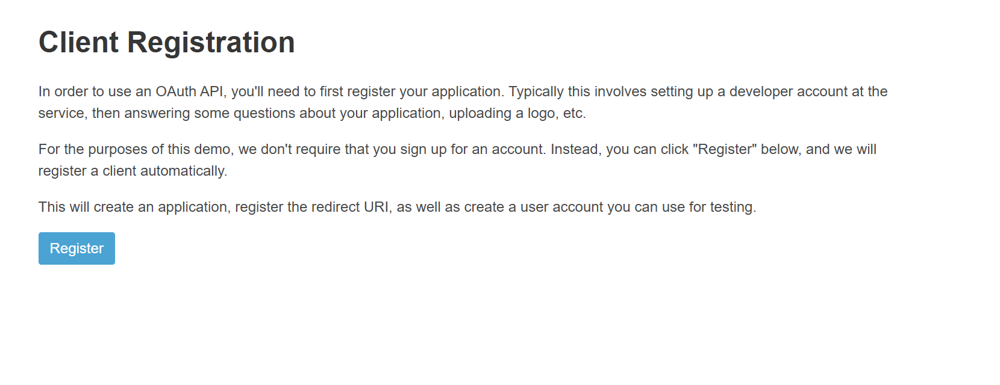
* 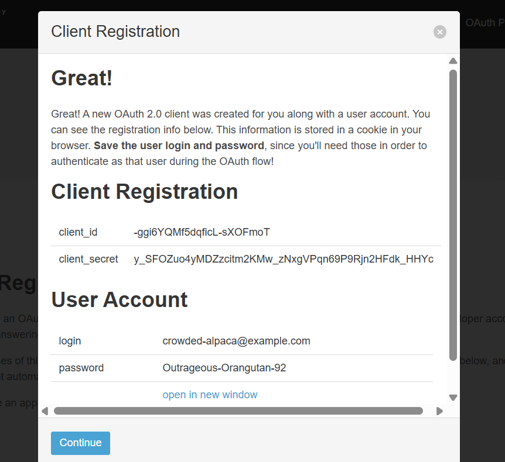
* See above a client with client_id and client_Secret was created and also a user Account was created.
* Now click on continue.
* 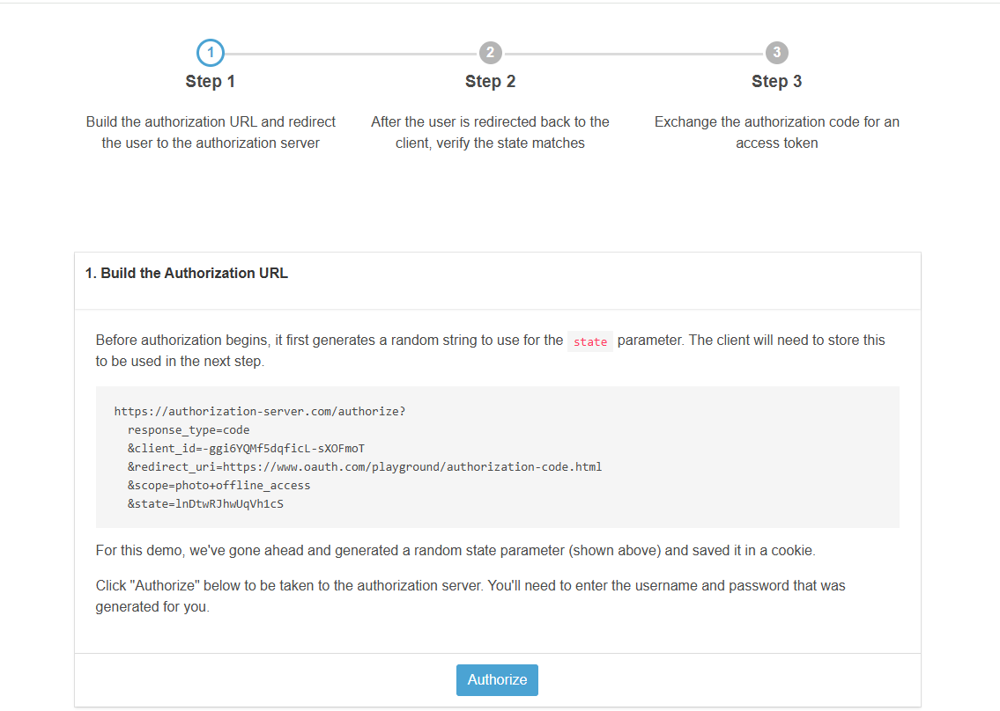
* If you look at the steps then we are at the step 1 where we are building the Authorization URL means our FE app will build this authorization URL , which is going to lead us to the auth server login page.
* 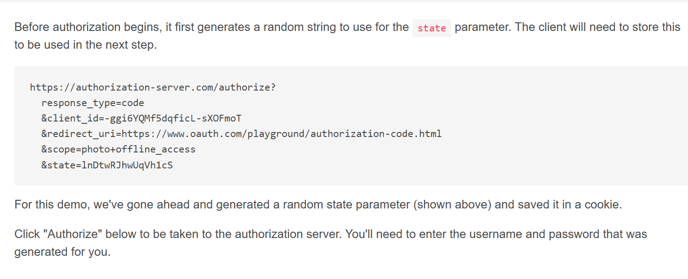
* See here we are just using the client_id not the client_secret in this step.
* also we have the redirect_uri which means after validation we will be redirected back to our FE App.
* The client_id is same as what was the registerd client's id.
* Now the state is a randomly generated string , generated by the FE App to maintain the security for the CSRF attacks , tampering of this value will restrict the FE app from opening the protected resources even if the users creds were valid , it is to protect against hackers.
* Now click on Authorize.
* 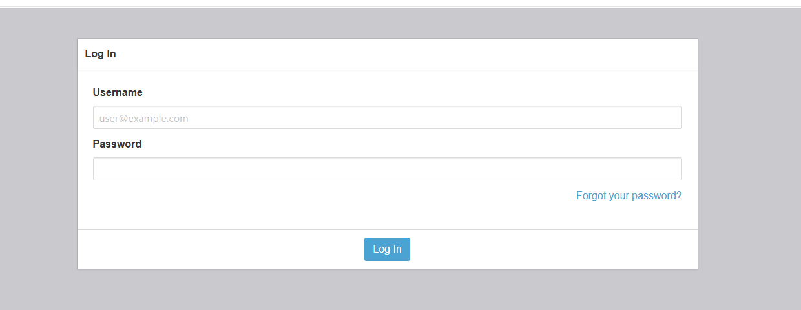
* Now here provide the registered user details.
* Fill the details and then click on login.
* 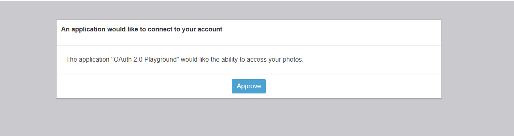
* 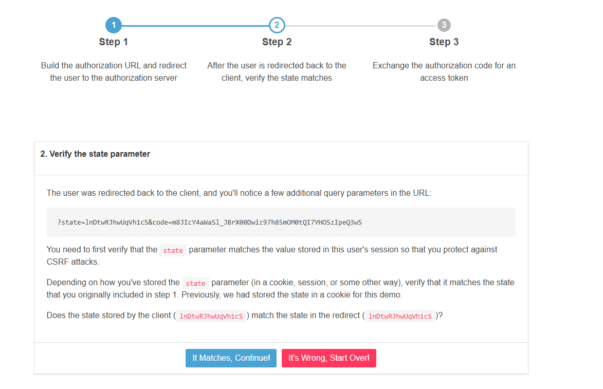
* Now in step 2 we are already redirected back to the FE APP , but behind the scenes now the app is validating whether the state value is same as what it had sent initially or not and also in the url there is a code that is the authorization code.
* It is the responsibility of the FE app to check the state value if it is tampered then fail the login request and dont send the Authorization code also.
* Now since the state is same so , again the FE APP Will send a new POST Request to the Auth Server seeking for tokens.
* As soon as you click it matches continue .
* 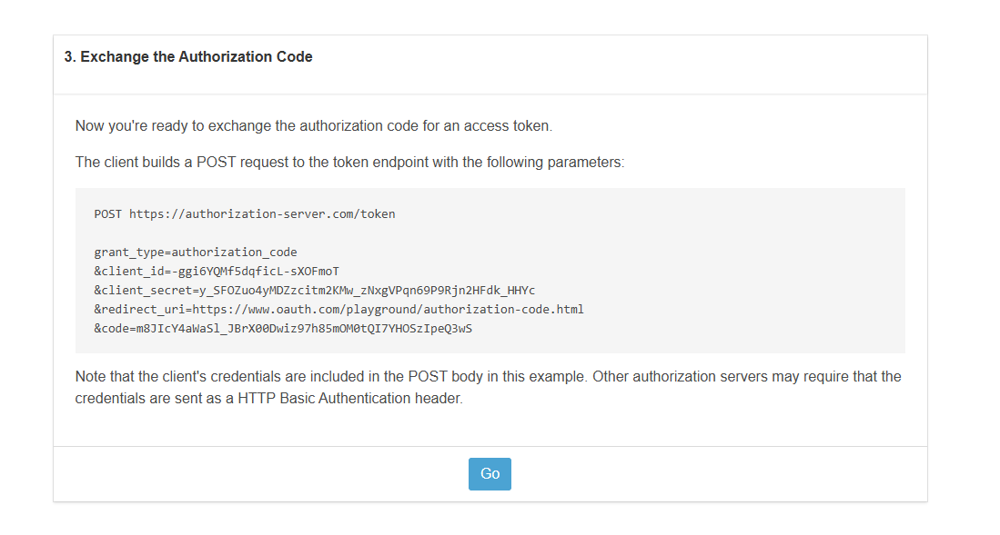
* see in this post request he URL Endpoint is /token and grant_type is authorization_code .
* This time we are sending both the client_id and the client_secret.
* Along with the redirect URI which is the same FE APP.
* code carries the Authorization code.
* Click on go .
* 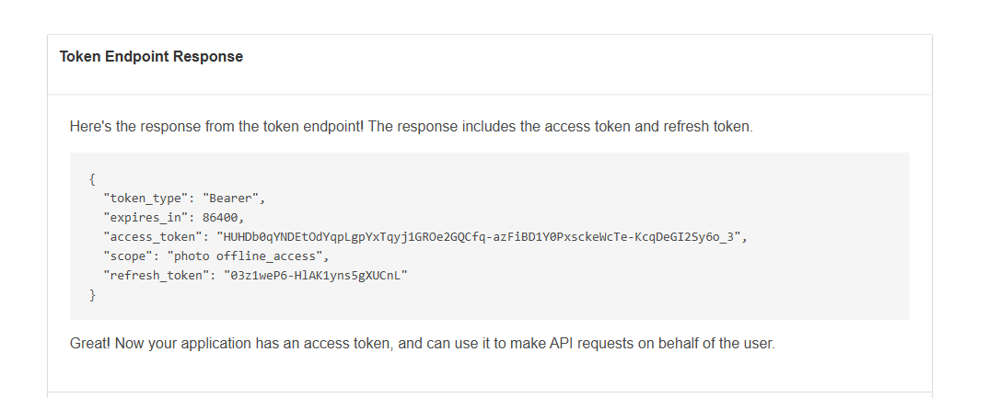
* See in response we got the access token and refresh token and other additional responses using this access token now the FE APP can call any protected api of the backend.

### Flow Diagrams:
* 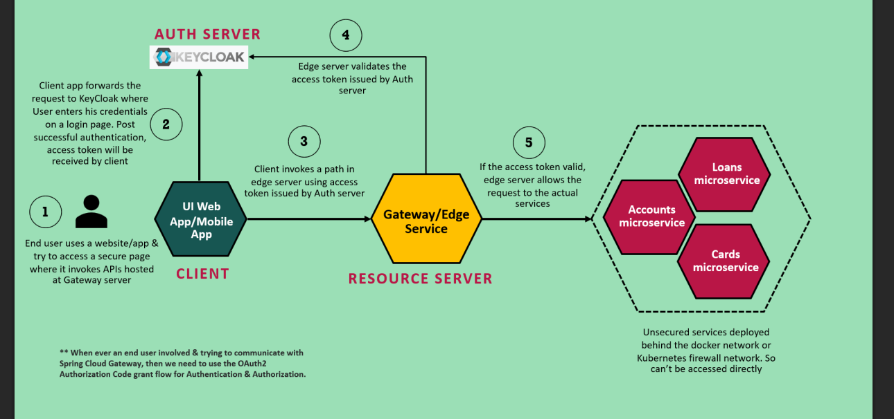
* 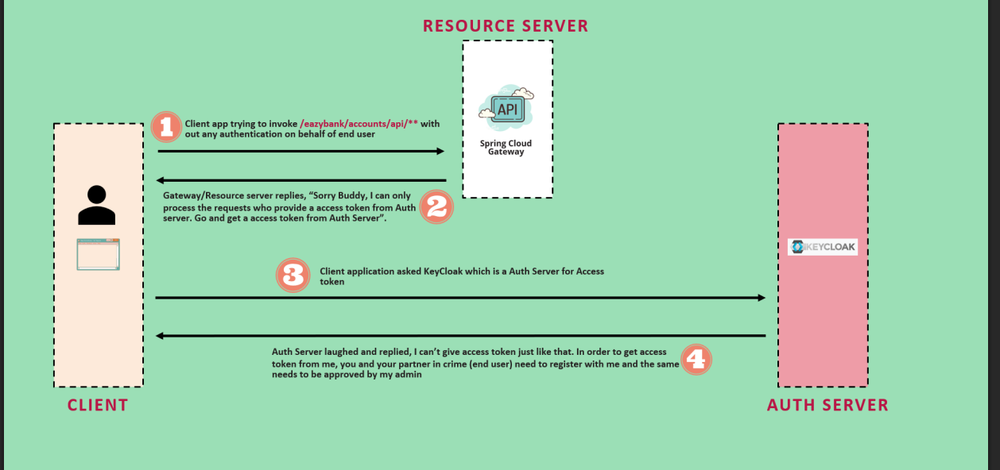
* 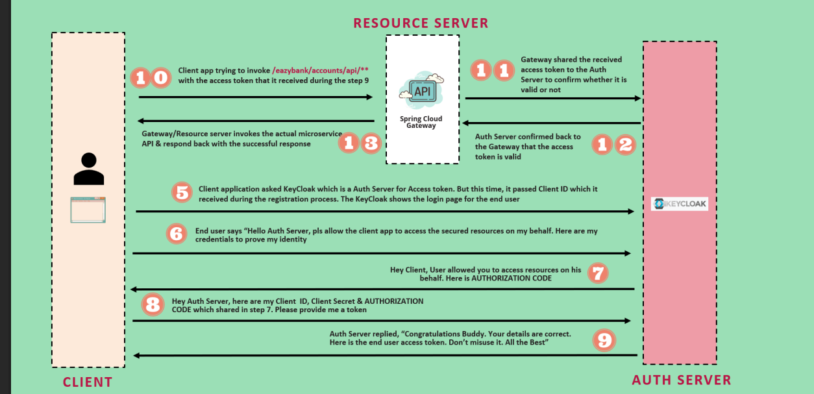

### Steps :
* 
* 

