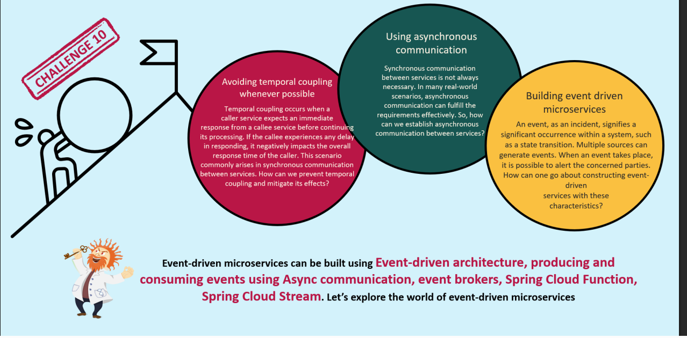

# What were the challenges because of which we had to adapt to the event Driven Microservices architecture:
* 
* Well there are two types of synchronous communication:
  * Imperative : Where the thread of service A waits for a response by Service B.
  * Reactive: Where once the thread of service A sends the request to service B , it doesn't wait rather when the response comes back it receives it again that's it just like reactive gateway.

## Solution:
* Establishing asynchronous communication .
* Developing a architecture where one service just publishes a event and other services keep looking at the alert board and once they see a alert it is upto them whether to consume that alert or not.
* This is basically pub sub model.

``BTW Event Driven Architecture is not used everywhere , it varies from project to project i mean depends on requirments .``
`` A banking application where the user just paid using mobile app needs to be notifed at the earliest about the payment  or maybe a app where a user can see their bank status immediately after logging in need to see status asap and here you should not implement event driven architect even though other parts of the same service or app may use event driven architect``
