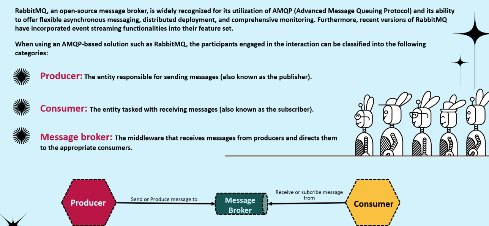
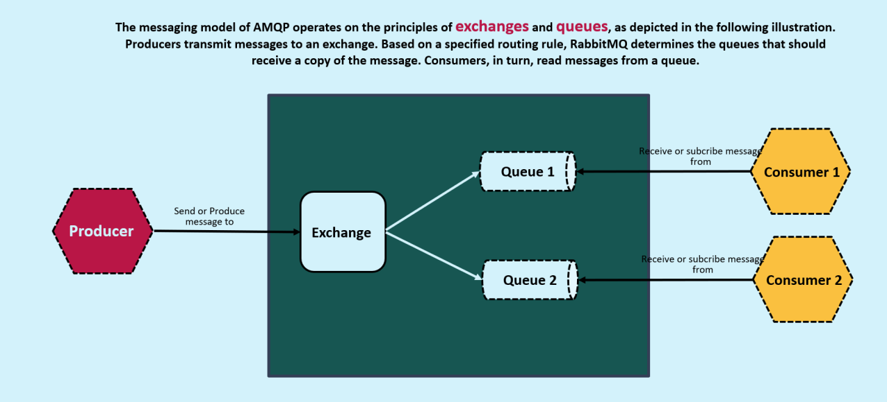

## RabbitMq:
* It is a message broker platform that uses AMQP (Advanced Message Queueing Protocol) .
* 
* 

## Flow:
* Inside the rabbitmq there are going to be multiple queues , usually created by the developers only.
* A publisher never pushes the message directly to the queue .
* A publisher has no idea about who are the consumers .
* A publisher always creates a event which is pushed into the rabbitmq .
* Inside rabbitmq the event is directly not sent to the queues or consumers .
* It is first received by the exchange where depending on the type of exchange that we are using the messages will be delivered to different queues .
* And from the queues the message will be received by different services.

## Flow Diagrams:
* 

## Flow Diagram 2:
* 

## Exchanges of RabbitMq:
* 