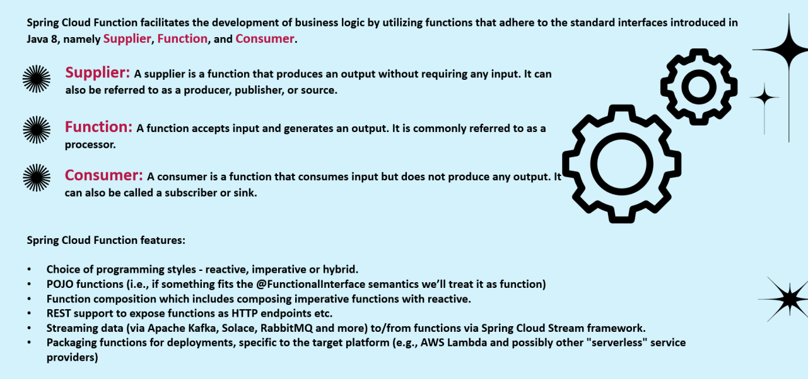
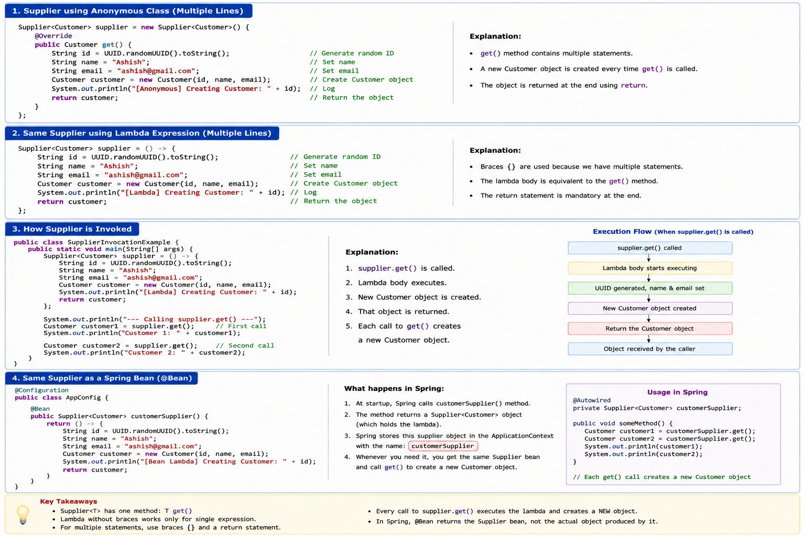
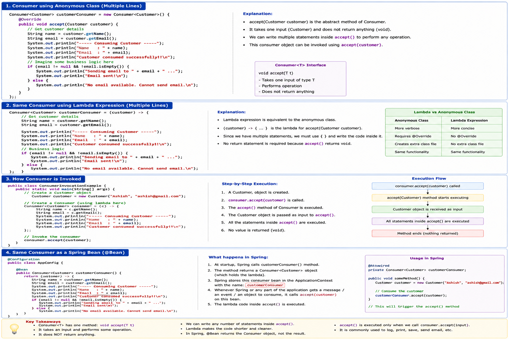
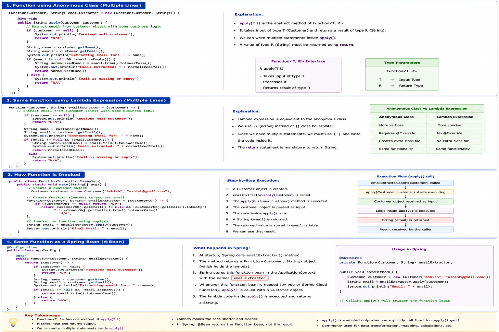

# Spring CLoud Functions:
* It is a library introduced by spring framework by which we dont have to write so much of boiler plate code and we can just simply write business logic inside functions rather than writting so many classes like controller , service , repository etc.
* 
* 
# Why is it important for RabbitMq:
* It gives the dev the flexibility to write simple logic inside functions and return them as beans , rather than writing so many classes like controller , repo and service classes.
* Every Bean that we create inside a event driven project , returns a lambda function and the type of the lambda function can be Supplier , Consumer or Function .
* We will see that .

## RealWorld Cases of Spring Cloud Functions:
* 

``Inorder to understand the working of the spring cloud functions you need to understand the why they came in first place , simply ask this to chat GPT ``

### Supplier:
* 

### Consumer:
* 

### Function:
* 

### Read:
* https://spring.io/projects/spring-cloud-function