# Logic of the Message Microservice:
* In this lecture we will see how we are going to give the implementation logic of the function interfaces .
* We will be creating beans of Function<T,R> , Supplier<> , Consumer<T> .

## Logic:
* 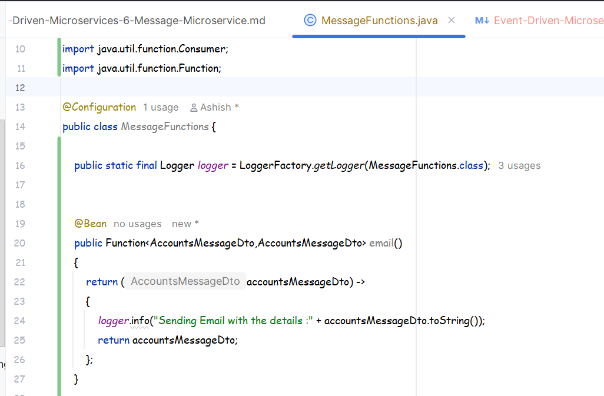
* 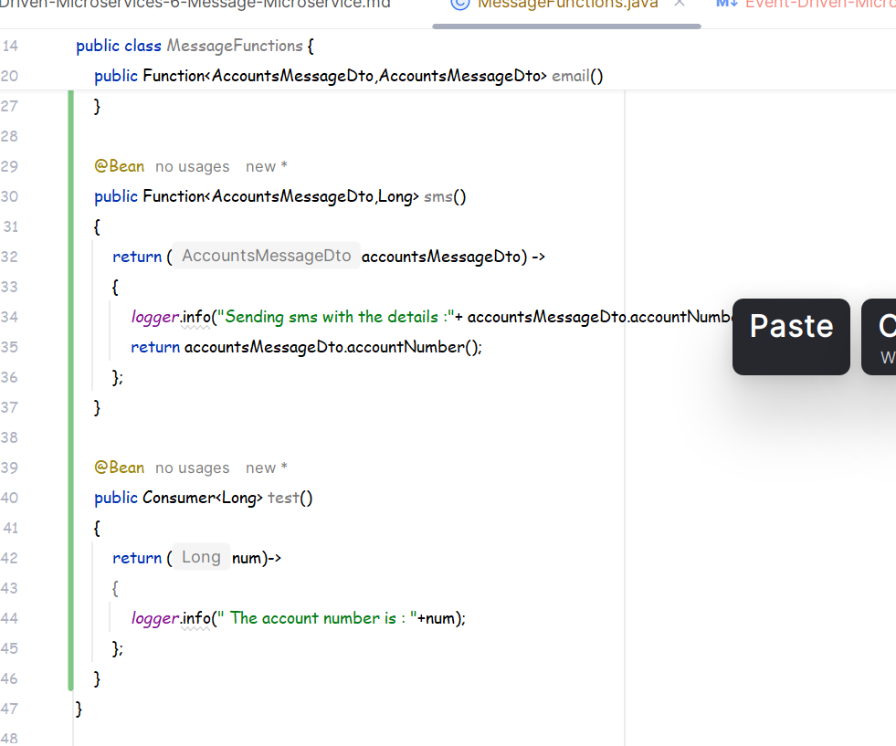
* As can be seen above the logic that we are returning inside the beans are basically the implementation logic of their respective functional interfaces.

### Exposing the Functional Interfaces as REST API's:
* ``This is completely optional no need of this for understanding messaging queue but still lets do it``
* For this we need a new dependency to be added.
* 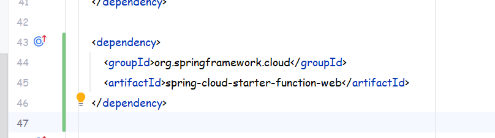
* This dependency will expose the Functional Interfaces as REST API's .
* Lets test them .
* 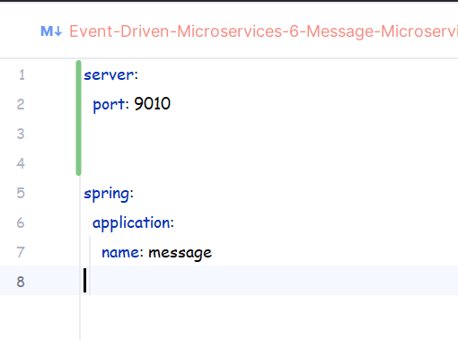
* This is our app config .
* 

### Testing the Functional Interfaces as Rest API's:
* First start the message service then head over to postman .
* Now in postman create a post request with the below specs:
* 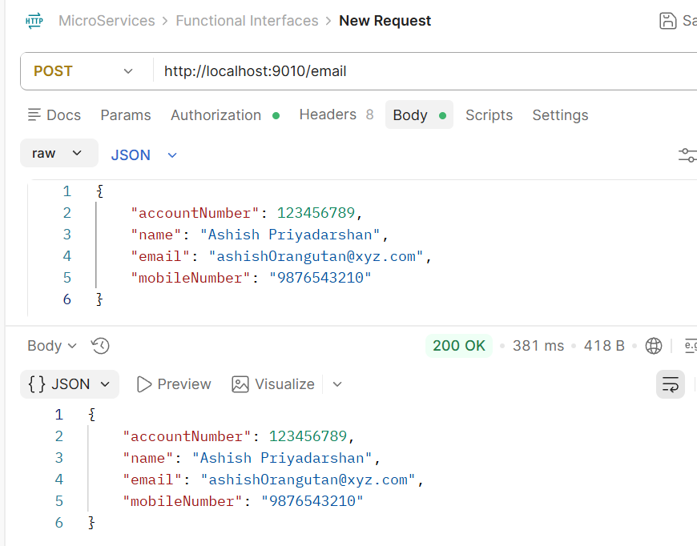
* As can be seen as soon as we send the request the response is also the same as email function was returning the same DTO .
* 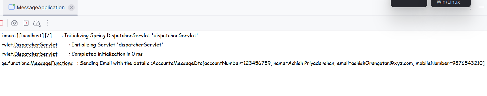
* This is the console .
* Now lets do one thing , now lets test it for he sms function :
* 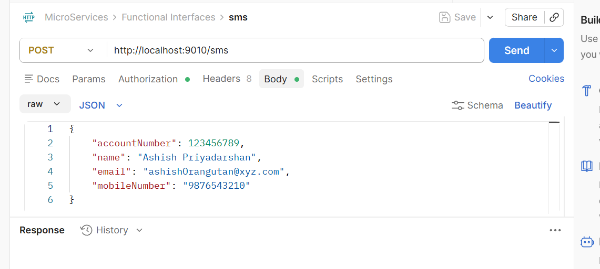
* As soon as i click send i get the below response:
* 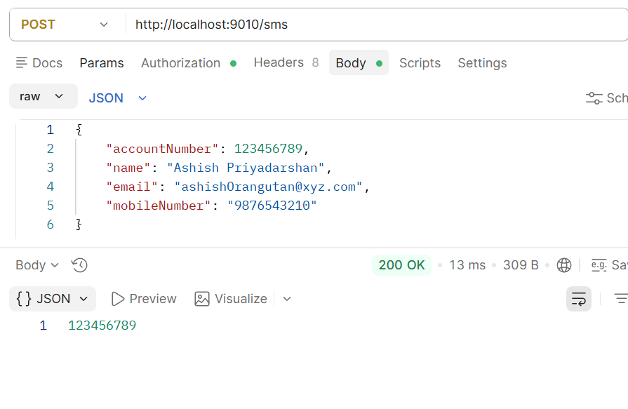
* as we had configured the input type as AccountsMessageDto and output as Long so we got long.

### Invoking both the functions at once :
* This is possible like if we make a single call to the message service then both the functions will get invoked .
* For this we will have to make some config changes .
* 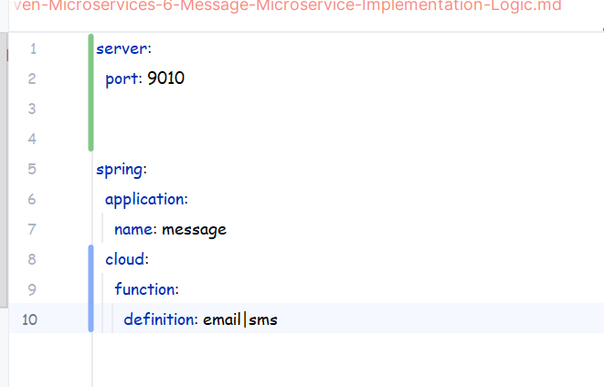
* make sure there are no spaces between the email|sms
* Now both the email and sms functions are clubbed together .
* You can still call them individually with /sms or /email .
* But to invoke them together we will have to use ``/emailsms`` 
* 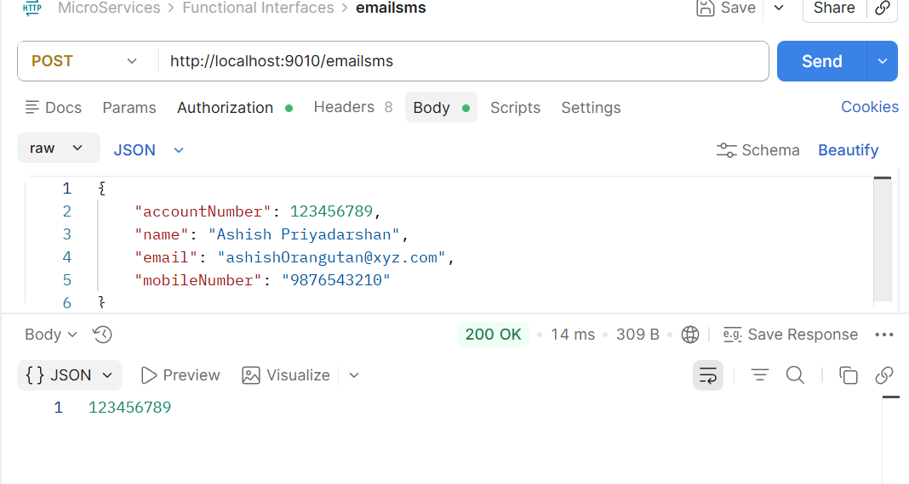
* 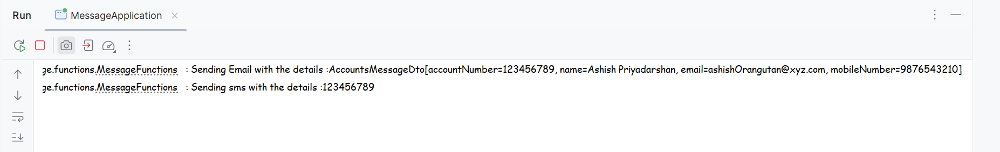
* See as soon as we invoke look at the postman response as well as you can look the console response .

### Conclusion:
* This is how it can be invoked as a REST API .

### Revert back the changes:
* Our main focus is to make these Functional Interfaces listen to some Rabbitmq Queue , so for the time being we will have to remove the REST API dependency that we had added and make sure other changes stay the same.
* 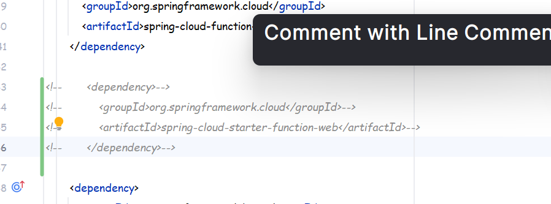 .
