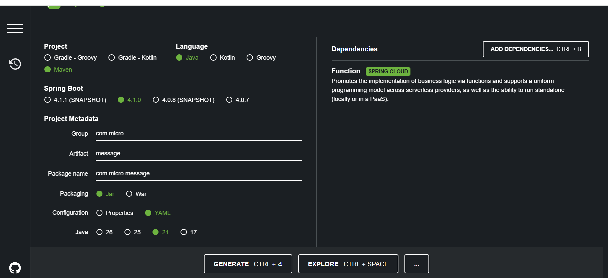
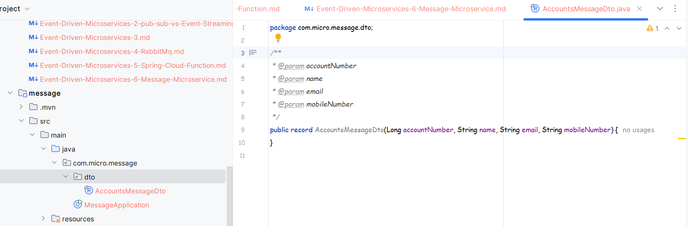
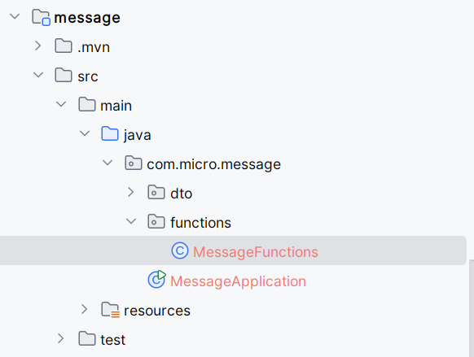
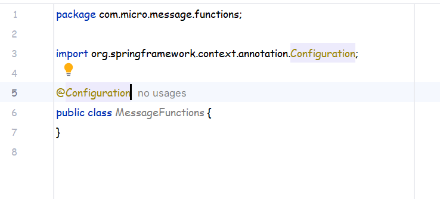

# Creating a Message Microservice:
* In this lecture we will learn about how we can create a Message Microservice , where we will use the Spring Cloud Functions .
* We are developing this Service to demonstrate the working of RabbitMq.

## Creating a spring project with the dependencies:
* 
* For now we just need this dependency .

## Creating the DTO that will receive the JSON from the queue:
* Lets create a record instead of a class .
* 
* We have used record class here as we don't need to explicitiy create any getter or setter or any kind of constructors for this class.
* And each variable of this Record can be accessed using the name only like objectName.VariableName() that's it.
* Record Classes are used to store information only , these information can be used anywhere but once the object is initialized with some value then it cannot be changed.

## Creating the Config class that will contain the beans:
* 
* 

