# Understanding how to use a REAL DB like a mysql DB in a microservice:
### We copied the contents of the V3 folder which is inside the section 6 here. There will be two versions of this section 7 one version would be where we will carry everything from the last section .
### One version is without dependency like the spring cloud monitor and spring rabbitmq dependency , because unecessarily it will take up the space.
### Another version will have all the things from the section 6.

___

### Now first of all even before migrating from H2 to the mysql DB we will create some DB's locally i mean using docker .
### In real projects the developer is given the information of different DB enviroments like the dev , qa and prod.
### In real projects the DB's are already pre created by some team and you dont need to create DB fields manually or by code.
### In real projects there is no schema.sql file inside your resources folder like we have while using the H2 DB.
### Lets create 3 DB's for our 3 microservices , each microservice will be having its own DB.

### Command that we used to create a DB for accounts microservice:
* 
* In the above image -p 3306:3306 means a container will run at port 3306 of our local and 3306 inside the container .
* --name accountsdb means the name of the container .
* -e means environment variable MYSQL_ROOT_PASSWORD root , means the password for the user root is root.
* -e MYSQL_DATABASE means the name of our Database as by default initially the DB will be created but it will be empty .
* -d mysql means start the container in detached mode and at last we have given the name of the image which it has to pull that is the mysql.
* 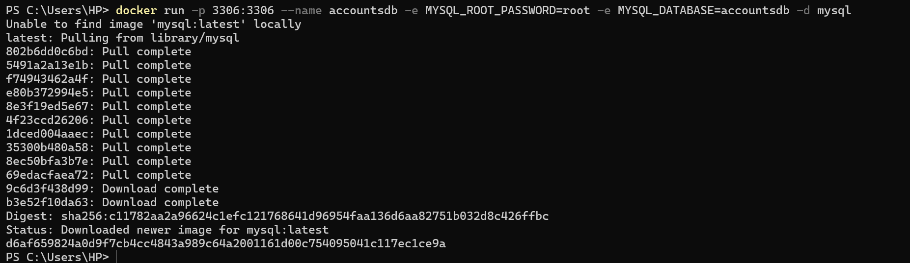
* So finally we have the mysql image and the container is also running now inorder for us to properly use the DB we need a client or an interface .
* For that download sqlelectron .
* Once you have downloaded the sqlelectron .
* 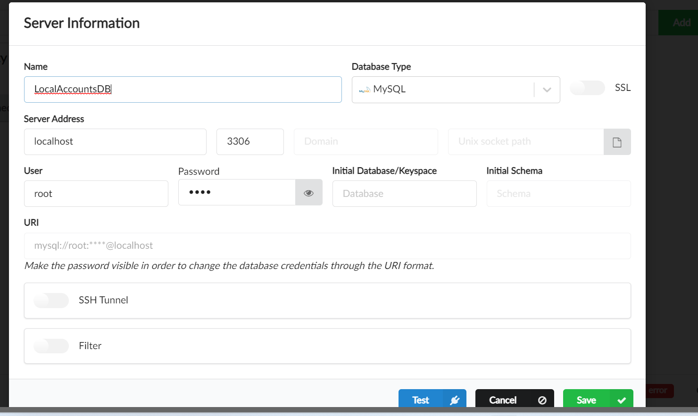 Fill all the details and then click on the test button to check if the client can connect to the DB or not.
* If it is working then simply save and then connect to it and try to see whats there inside the DB.
* 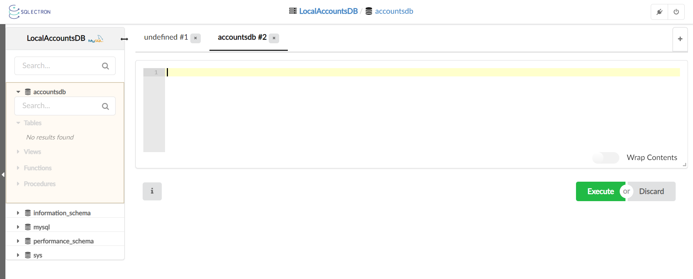 
* See here it looks like this , in the similiar manner lets setup the DB for other microservices as well.
* LoansDb: 
  * 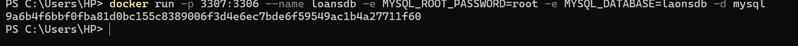 
  * Here let me explain each word -p 3307:3306 means in our local system we will run a container at the port 3307 but inside the container we will run our image or whatever app at port 3306.
  * Thats it hostport: containerport , As we have exposed our hostport 3306 earlier to the accountsdb container so we need another hostport.
  * 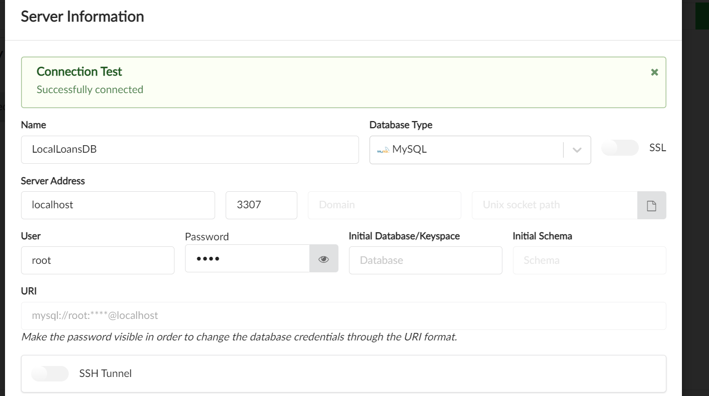
  * Added the LoansDB to the client.
* CardsDb:
  * 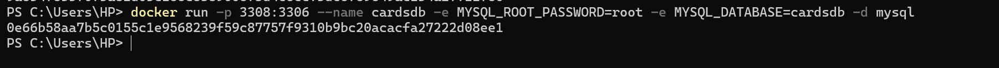
  * 3308 is the hostport of our local system and 3306 is the port inside the container.
  * 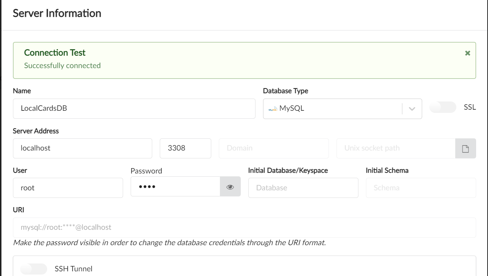
* 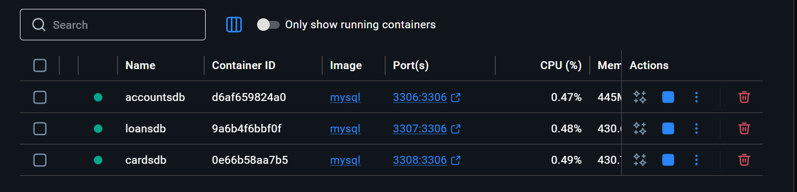
* 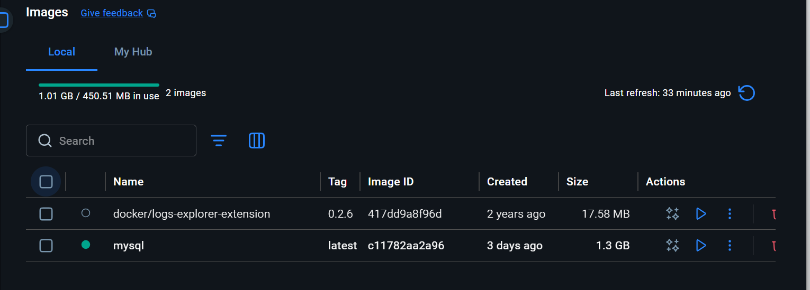 
* Same image getting used again and again in different containers with different configs.
* Like if you open and see any of the containers DB then you will see that they have no tables inside them yes they do have a name given by us but no table why because we are using the same image to create multiple containers we are just changing the name and some configs.

## Important : In real projects we dont install or use mysql in our system or maybe docker . It is the project infra team that deploys the DB in different servers or env and they just give us the URL and the credentials thats it and thats how we connect to a DB hosted in some cloud env.

___

## Now as we have completed creation of our DB's so now it is time to make the code changes in our microservices so that they connect to our DB:
### Accounts Microservice:
* First thing that we need to do is delete the H2 related dependencies from the pom.xml , because if we dont remove it then during run time even if we mention our mysql db still our microservice will get connected to the H2 DB.
* 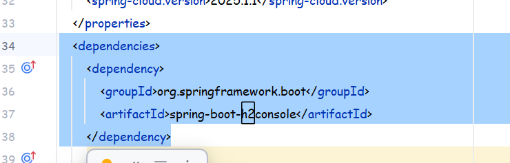
* 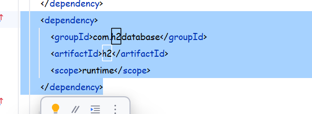
* Remove the above two dependencies .
* Now add the mysql dependency to our pom.xml.
* 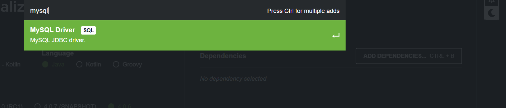 We need this dependency.
* 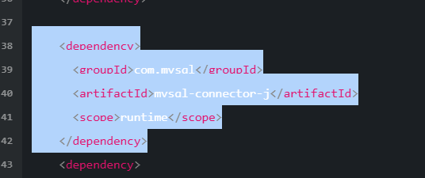 Copy and paste it in the pom.xml file.
* This dependency will help the app in connecting to a mysql DB as well as act as an interpreter between the app and the DB.
* Now as we have pasted the dependency successfully so the next task is to make changes to the configs like the application.yml.
  * Before : 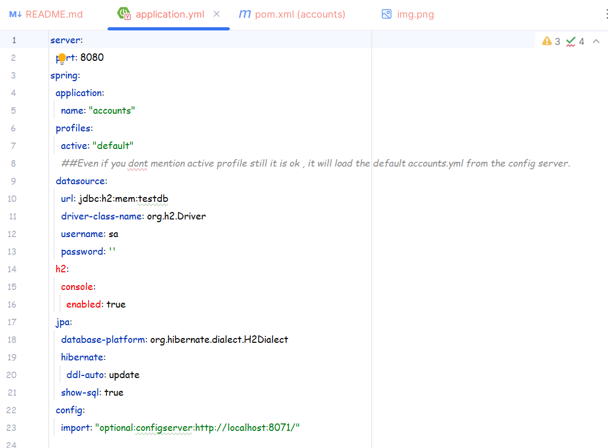 JVM , CLI , ENV Variables configmaps or secrets to use the DB creds as they are not directly mapped.
  * After: 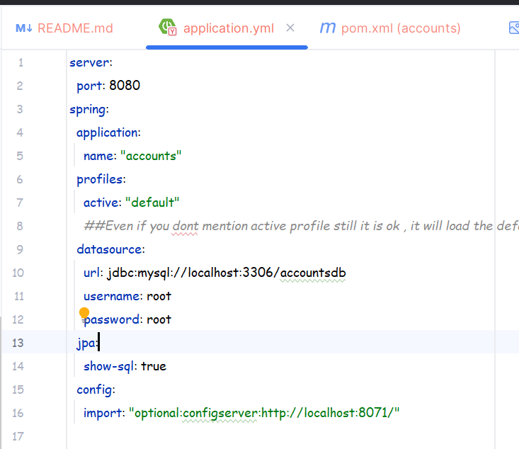
  * Let me explain what i have changed and what i have removed and why.
  * I have changed the URL which was earlier ``jdbc:h2:mem:testdb`` to ``jdbc:mysql://localhost:3306/accountsdb`` which says that my DB is in localhost IP running at port 3306 and the name of the DB is accountsDB.
  * Changed the username and password.
  * remove that h2 console part as it is no more needed , we dont need to hit the h2 console url.
  * removed the JPA database platform and the hibernate part but we need the show-sql true as it will help us in looking at the logs.
  * Thats it thats all we have done .
  * Again we dont use the hardcoded values for the creds in any env rather we use : JVM , CLI , ENV Variables configmaps or secrets to use the DB creds as they are not directly mapped.
  * Another very important change that we need to do is , dealing with the schema.sql because for us we dont have the tables inside our DB.
  * In real projects the tables are already created we just need to connect to the DB but since here we need to create tables in the DB.
  * There is a way by which we can execute the schema.sql to populate our DB.
  * 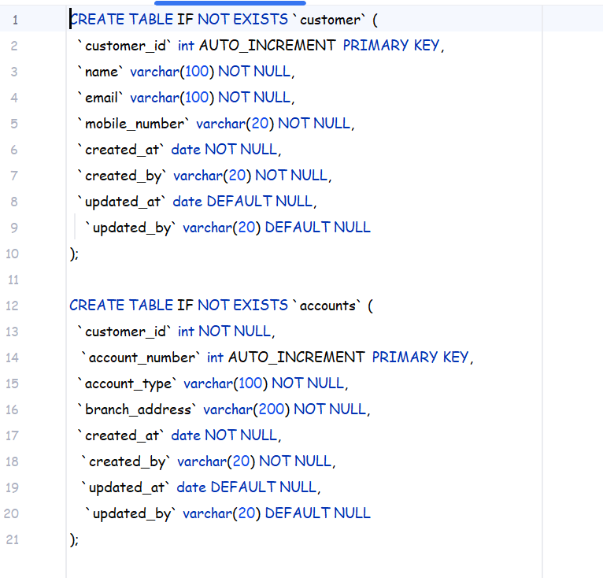
  * 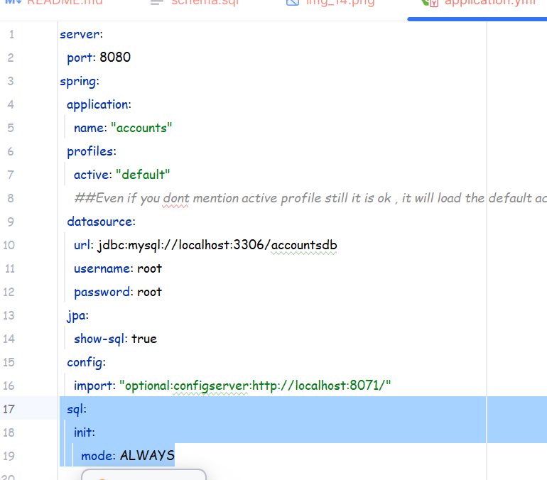 Added this SPRING_SQL_INIT_MODE : ALWAYS 
  * What it does is it will always run the schema.sql present inside our resource folder so that the DB is populated with the tables.
  * Another thing our DB tables will not be created again and again because we have used IF EXISTS that means if they exist in the DB then dont create any new table.
  * So now we are done with setting up all the properties we could have done this thing in the docker compose file too but we will see that ahead.
  * Now we need to replicate all of the changes to the cards and loans microservice as well.
  * Cards:
    * Before: 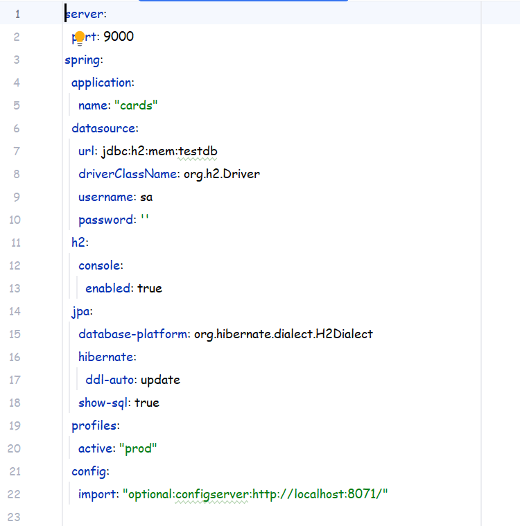
    * After: 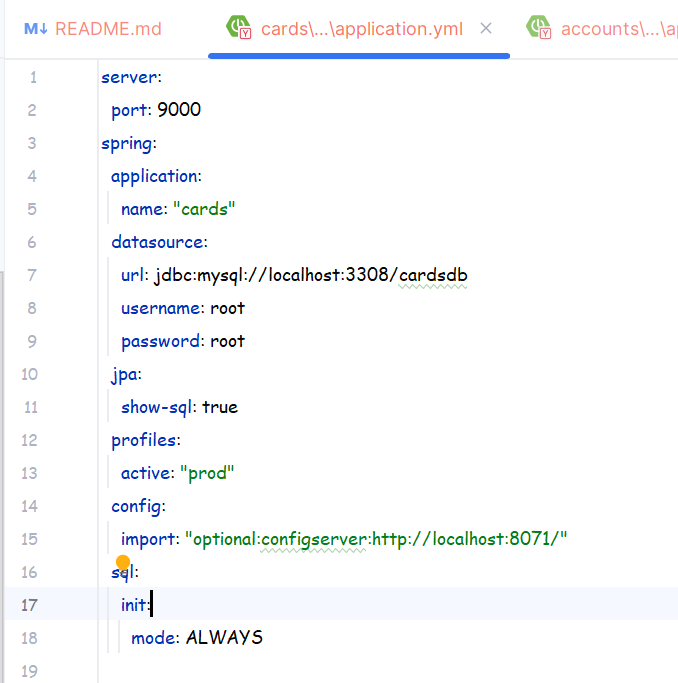
    * Also we need to remove the dependency of the H2 DB and add the mysql connector dependency.
    * We have the cardsdb container running at the port 3308.
  * Loans:
  * Before: 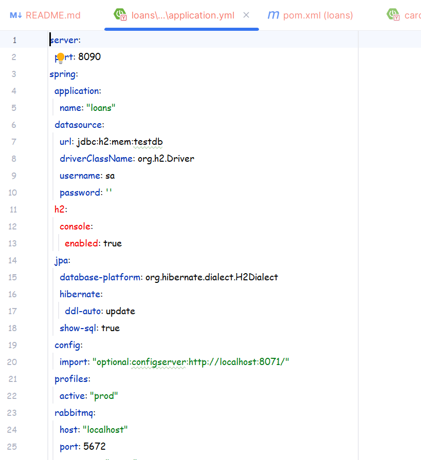
  * After: 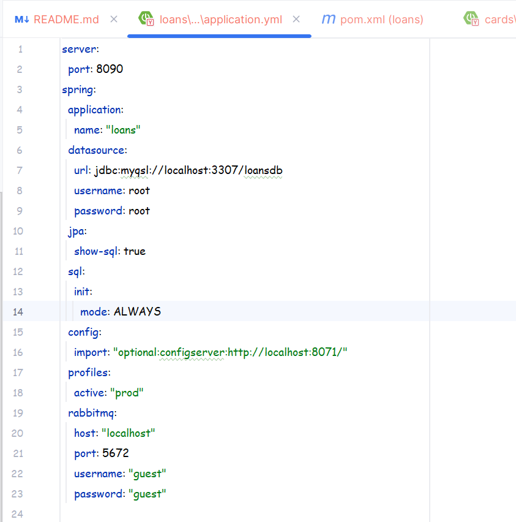
  * Also remove the dependency of the H2 DB and add the mysql connector dependency.
  * We have the loansdb container running at the port 3307.
* Finally we have done the setup for all of our microservices.
* Now we will test our microservices and their connectivity like are they working properly or not.

___
## Testing the connectivity and working:
### First make sure you have started all of your databases and then start your apps one by one.
* 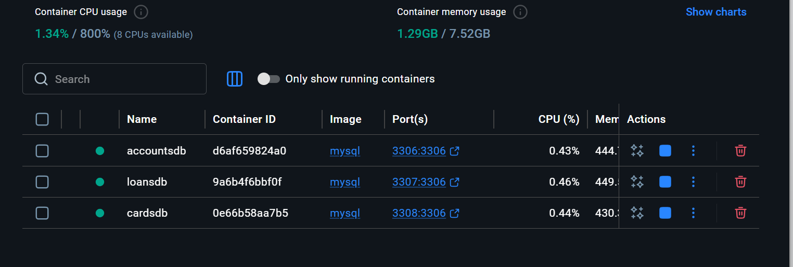
* Well all are in running status.
* 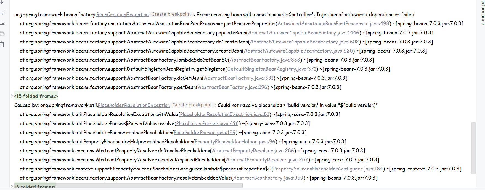
* As soon as we started our accounts app it failed with this error . It says it cant find build.version .
* It is because that config is present in our config files and to load the config files we need the configserver to be running.
* So first start the config server.
* Well now there is another issue that is we need the rabbitmq server to run first other wise our configsever will keep giving wrong configs.
* But still we can start our microservices as we are starting them manually not via docker compose so it wont cause any issue to dependency.
* In their logs you will see that they are trying to connect to the rabbitmq again and again thats it no issue.
* 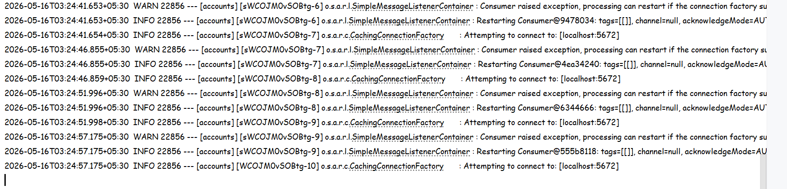 Talking about this thing in the logs.
* Thats why at the beginning of the course i said we need to have two version one without that rabbitmq and another with rabbitmq.
* Anyways so our accounts has started :
  * In the sql client: 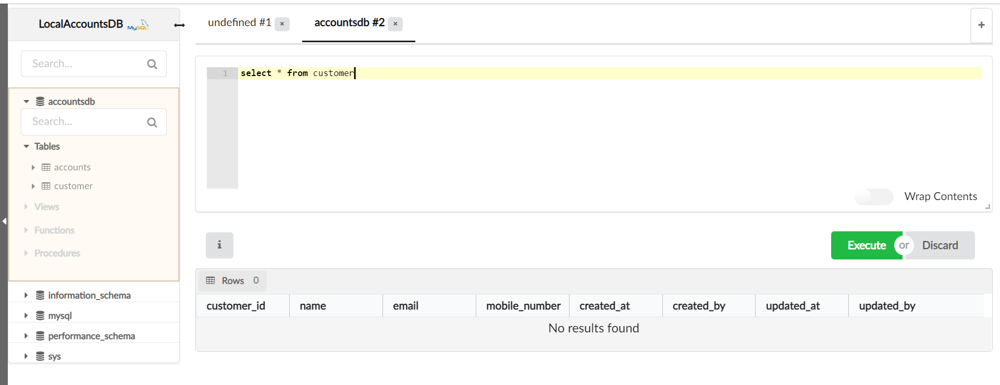 
  * See this time it is showing us all the tables and fields.
  * lets check whether it is taking any input or not by using postman.
  * 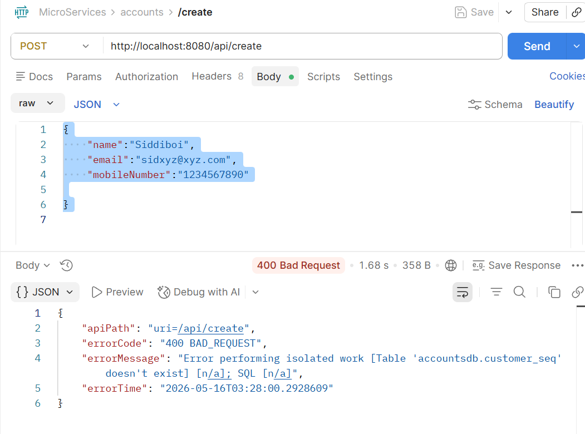 
  * We are getting a error upon hitting the api .
  * Upon looking deeper into the issue we found that it is not able to find a table with the name customer_seq under the accountsdb.
  * But why do we even need a table like that when we just have two tables one is customer and another is accounts.
  * The answer is because there are some codes which we have done while creating the entity that is causing this issue.
  * 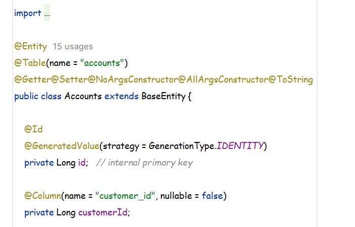
  * 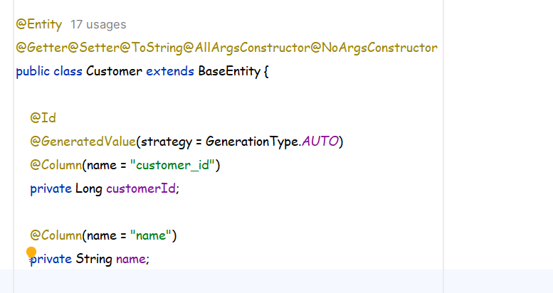
  * Well the issue lies with the customer entity where for creating a new entry we have told it to generate a ID in auto which means Hibernate will select a method of creating ID because of which it is trying to insert records into the accounts.customer_seq table which will have the id and those id's will be used in the customer table too and since there is no such table like customer_seq that is why it is failing so just change the Generation Type to Identity.
  * 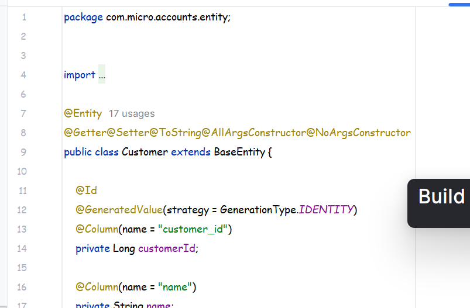
  * So we have changed it here now lets run the accounts again.
  * 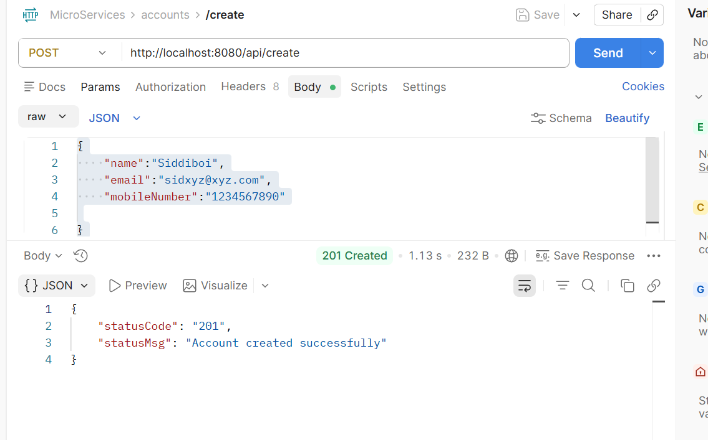 See this time it worked.
  * Lets check the DB client: 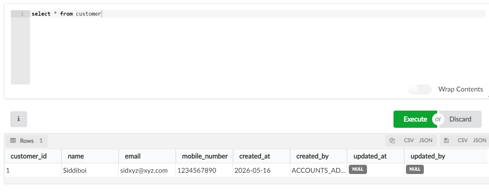
  * 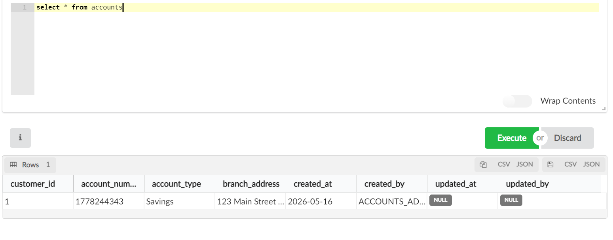
  * Finally it is working .
  * Now we need to check with other microservices as well but before that lets just make sure the ID Generation Strategy is set to Identity.
  * Cards is ok but in loans we have to change : 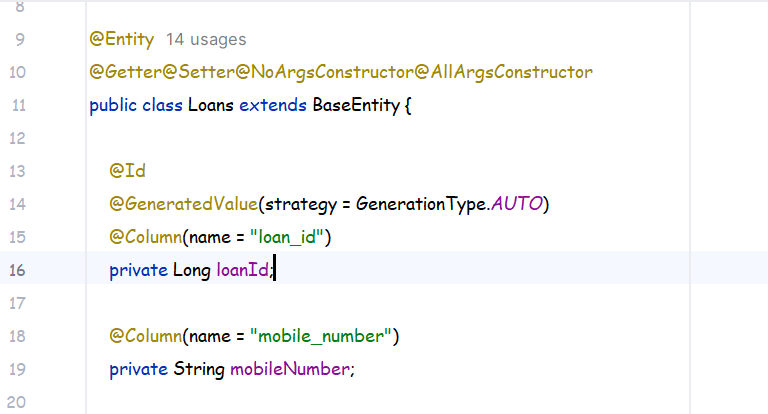
  * Change it to identity.
  * Cards:
    * Postman: 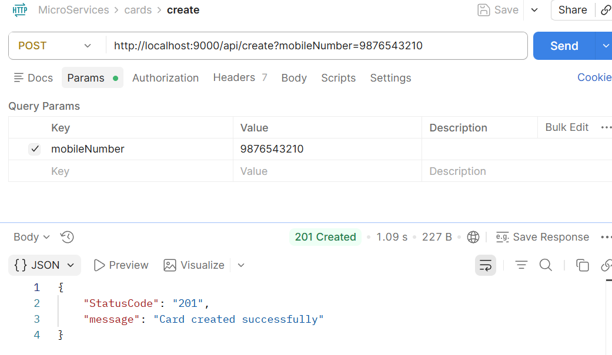
    * DB Client: 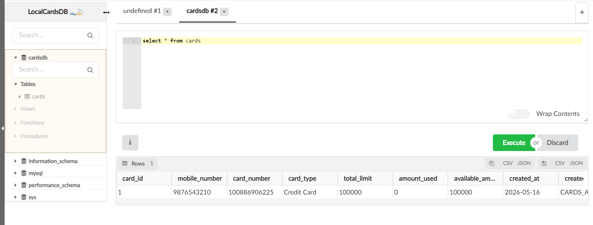
  * Loans: 
    * Postman: 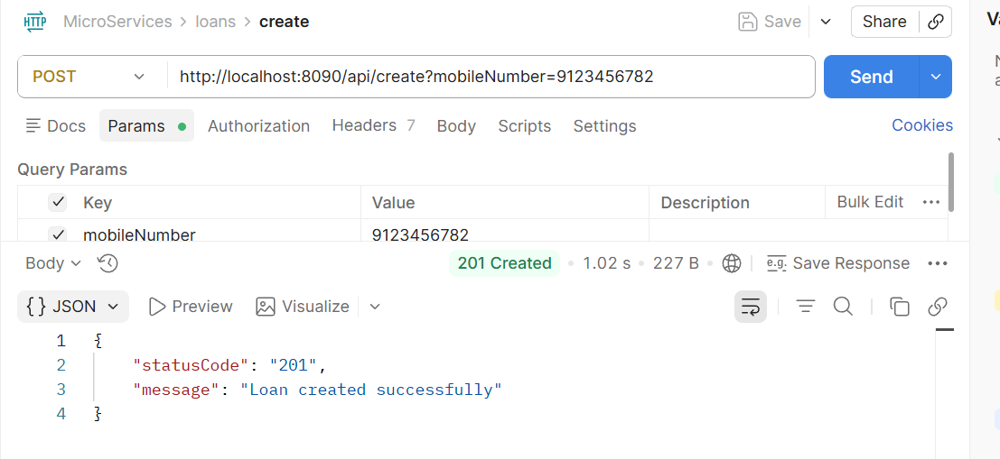
    * DB Client:  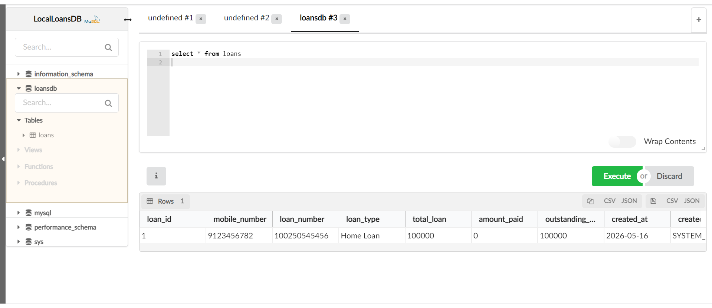
* See everything is working fine. For now stop all your applications just dont delete the running mysql containers or image otherwise you will loose all the data .

### 1st commit: Next we will learn what changes we need to make inside docker compose file.
### Commit Message: "Demonstrated the mysql in docker | Multiple mysql containers for microservices | Made config changes in all the microservices as per their DB configs"
___
