# Service Discovery and Service Registry:

* In real world production grade applications there is the FE , BE , DB and many other things.
* Suppose there are multiple clients c1 , c2 , c3 etc . These clients never directly hit the BE API's or the location where the BE App is hosted .
* Their request always goes through a common entry point that is the API GATEWAY .
* API GATEWAY is a common app or gate whose responsibility is to redirect the traffic , enter the logs , perfom security checks , performs auditing etc .
* So we never directly hit the BE Apps.
* Now suppose we have 3 microservices do you know how are they going to talk to each other internally .
* Suppose let all our microservices are hosted in the same network or maybe not in the same network and they are inter dependent on each other like suppose , accounts microservice has a api which sends some info to the cards as well as loans microservice .
* So how do you think they are going to communicate .
* Any one would say they will communicate by hardcoding each others IP and port and send the request directly there .
* That is fine but what if for some reason their IP's and ports change , then in that case we have to make changes at so many levels.
* or suppose we need to scale our app suppose we scale loans to 5 instances so we have to now provided all the 5 instances details to accounts microservice and set some load balancing algo so that the traffic is eqaully distributed , but do you observe the amount of manual work we have to do here.
* So in this section we will learn how can we avoid this manual task and help microservices talk to each other without hardcoding each other's details.

___

## How microservices discover other microservices and how they register themselves too so that they are also recognized by others:
* 1:
  * So each microservice will be having their own host and port info and they will be exposing some remote API .
  * How will other microservices know about this dynamic endpoint URLs to invoke them.
  * Since our microservices might be scaling , downgrading or maybe destryoing their containers , restarting them etc.
* 2:
  * Suppose if a microservice instance fails , new instances will be brought online to ensure constant availability .
  * This means that the IP addresses of the instances can be constantly changing.
  * So how does this new instances start serving to their respective cleints .
  * Suppose accounts needs to talk to the loans microservice but 1 instance of loans was shut down and 5 new instances are now live so how will these instances start serving to accounts since accounts only knew details of 1 instance and that IP is now not in use by any.
* 3:
  * How do we make sure that there is proper load balancing between multiple instances of the microservice .
  * Suppose accounts microservice invokes loans microservice and loans has like 5 instances and accounts keeps sending all the load or request to only 1 instance then that is not proper load balancing right.
  * I mean 1 is heavily occuiped while rest 4 are enjoying free time and thats not a very ideal condition.

### To address the above challenges we have some solutions :
* Service Discovery.
* Service Registration.
* Load Balancing.

## How service communication happens in Traditional apps:
* In a web network when a service wants to communicate with another service/app, it must be given the necessary information to locate the app such as it's IP address or a DNS Name .
* Lets think of scenario where Accounts microservice wants to communicate with the Loans microservice and there is just one instance of Loans.
  * 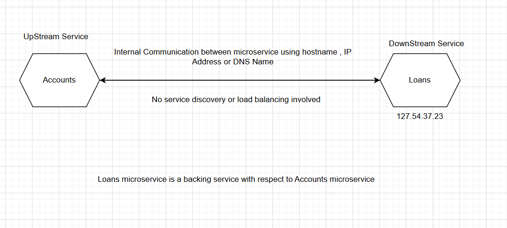
  * Here Accounts needs the information of Loans like IP/DNS etc and that too it will hardcode those details .
  * Here Accounts is a upstream service meaning a service which is dependent on another service for processing some of it's api.
  * Loans is a downstream service with respect to accounts as it is not dependent on accounts.
  * Loans is a backing service wrt to accounts as without loans accounts cannot process some of it's own request.
* When there is only one instance of the loans microservice so managing the DNS name and its corresponding IP address mapping is straight forward very easy just hardcode it.
* But in cloud env we deploy multiple instances of a service and each instance has it's own unique IP.
* To address this challenge there is one approach that is to update the DNS Records with multiple IP Addresses and rely on some round robin name resolution .
* This method directs the request to one of the IP addresses assigned to the service replicas in a rotating manner . 
* However, this approach may not be suitable for microservices as containers or services frequently change.
* The rapid change makes it difficult to maintain the accurate DNS records manually and ensure efficient communication between microservices.
* This is not some monolithic application where they will get hosted on some physical machine's and have a long life span . They are deployed in some random cloud infrastructure .
* These instances are designed to be disposable and can be terminated or replaced for various reasons .
* Furthermore, auto-scaling capabilites can be enabled to automatically adjust the number of application instances based on the workload.

### How traditional Load Balancers work:
* Suppose i have 3 apps and there are 3 cleints trying to send request to my 3 apps like accounts , loans and cards .
* So inorder to hit my api they will use DNS name of the server where my load balancer is hosted along with that they will be sending the api path too.
* ex : services.microdemo.com/accounts :
* Here the DNS is services.microdemo.com it will send the request directly to my server where my load balancer is present.
* Now in that server we will be having a primary load balancer which will pick up the request and then from there it will pickup accounts and try to look for the IP Address of accounts in it's routing table which is manually managed and then it will send the request to the correct IP.
* Also there will be a secondary load balancer that keeps checking the health of the primary load balancer.
* If for some reason the primary one fails then it will act as the primary one.
* But this type of traditional load balancers have got so many limitations as well.

### Limitations of traditional Load Balancers:
* With traditional approach each instance of a service used to be deployed in one or more machines.
* The number of these application servers was often static and even in case of restoration it would be restored to the same state with the same IP and other configurations.
* While this tye of model works well with monolithic and SOA based applications with a relatively small number of services running on a group of static servers , it doesnt work well for cloud based microservice applications for the below reasons:
  * Limited horizontal scaling . Upon heavy traffic our apps will not get scaled up automatically , it will be manual and a long task.
  * Single point of failure . If the load balancer fails for some reason and suppose the secondary load balancer also fails then it will create a lot of issues.
  * Manully managing to update any IP's or configurations.
  * Complex in nature and they are not container friendly as they cannot automatically take our images and deploy them into random servers.

### The biggest challenge with traditional load balancers is that someone has to manually maintain the routing tables which is an imposible task inside the microservices eco-system because containers/services are ephemeral in nature , thats means they are short lived.

___

## How to solve the problem for cloud native applications:
### Service Discovery and Service Registry:
* Service Discovery is a pattern which involve the tracking and storing information about all the running service instances in a registry.
* Whenever a new instance of any microservice is created it should be registered in the registry , and when the service or instance of the service is terminated then it should automatically get de-registered too.
* The register acknowledges that mulitple instances of the same application can be active simulataneously. 
* When an application needs to communicate with a backing service it performs the lookup in the registry to determine the IP address to connect to.
* If multiple instances are available a load balancing strategy is employed to evenly distribute the work load among them.

* Well there are two ways in which the service discovery problem is addressed:
  * Cleint side service discovery .
  * Server side service discovery.

* In modern microservice architecture , knowing the right network location of an application is a much more complex problem for the cleints as the service instances might have dynamically assigned IP Addresses .
* Moreover, the number of instances may vary due to auto-scaling and failures.
* Microservices service discovery & registration is a way for applications and microservices to locate each other on a network . 
* How it works:
  * A central server (or servers) that maintains a global view of address's . Means there is going to be a central server that acts as a registry and holds the address of many microservices and their instances.
  * Microservices/clients that connect to the central server to register their addresses when they start & ready. 
  * Basically the microservices are coded in a way that upon their startup they register themselves in the registry .
  * Like they register their IP and name in the central server.
  * Microservices/cleints needs to send their hearbeats at regular intervals to the central server about their health.
  * Microservices/cleints that got themselves registered to the central server de-register themselves when they are about to shut down.
  * If 5 instances of loans microservice is registered and running then if one of the instances gets terminated then it also de-registers that particular IP from the registry.
  * Service discovery and registry deals with the problems about how microservices talk to each other : Make api calls.

## Client side service discovery and Load Balancing:
* In Client side service discovery the services or instances of the services are responsible to register themselves to the central repository which is the service registry.
* Now suppose there is a service that needs to communicate with one of the service so it will first go to the central server the service repository.
* There it will look for the service with which it wants to communicate now from there the service registry will give it a list of IP's at which the instances of the service that it is looking for are hosted.
* Then finally the client application will select one of the IP addresses based on some type of load balancing algo .

* Suppose we have accounts service running at some IP and accounts has registered itself to the service registry.
* Now there are 3 instances of loans service running at 3 different IP's but all the instances have registered themselves to the service registry.
* Now suppose accounts needs to communicate with loans then first it will go to the service registry and ask for loans address and service registry will return it 3 different IP Addresses.
* Now accounts has all the needed IP's now based on some load balancing algorithm it will send its request to any one of the IP's .
* Since here the client is doing the searching/discovering of the service and also balancing the load on its end thats why it is known as client side discovery.

### Client side service discovery:
* It is a architectural pattern where client application are responsible for locating and connecting to the services they depend on.
* In this approach the client application communicates directly with a service registry to discover available service instances and obtain the necessary information to establish connections.

### Key Aspects of client-side service discovery:

* Service Registration : 
  * Client applications register themselves with the service registry upon startup.
  * They provide their essential information about their location , such as IP address , port and metadata which helps identify and categorize the service.
* Service Discovery:
  * When a client application needs to communicate with a specific service , it queries the service registry for all the available instances of that service.
  * The registry responds with the necessary information such as IP addresses and connection details.
* Load Balancing:
  * Client side service discovery often involves load balancing to distribute the workload across multiple service instances.
  * The client application can implement a load balancing strategy to select a specific instance based on factors like round-robin , weighted distribution or latency.

* The major advantage of client side service discovery is load balancing .
* Like we can implement various types of load balancing algorithms.
* Round-robin , weighted round-robin , least connections , or even custom algorithms.
* The only drawback is that client service discovery assigns more responsibilty to developers .
* Also we have to create a central server (Service Registry).
* But Server side discovery solve's these issues which we will learn about in some other sections.

### There can be multiple instances of the service registry too.
* Suppose you have created a service registry app , now while running it or starting it give it the info of the port at which it will run .
* And also provide the information of other ports or URL where the instances of the same service registry could be running or may run.
* Like this they are connected to each other and yes each service registry will share the info it has with other service registry instances too.
* S1 , S2 and S3 . Suppose instances of accounts are only getting registered at S1 doesnt mean only S1 will know it's details .
* S1 will share all the details to S2 and S3 as well . This is known as gossip mechanism.
* Suppose accounts wants the IP of loan microservice.
* It will ask the service registry and the service registry will return it a list of IP's .
* The accounts app instance will keep all those IP's in its cache or load balancing so that it doesnt have to ask for addresses again and again from the service registry.
* Another thing is their cache gets refreshed at some regular intervals so that they dont miss on the new list of IP's , if there are any additions or deletions.

___

## Implementing Client Side Discovery:
* We have some spring cloud projects that will help us in achieving this.
  * Spring Cloud Netflix Eureka : which will act as the service discovery agent (Service Registry)
  * Spring Cloud Load Balancer: Library for client-side load balancing.
  * Netflix Feign Client: Installed on teh client side which helps in looking up for the IP's of any microservice.
  * There are other service registries in the market like etcd , consul and apache zookeeper which are also good.

* Advantages of service discovery approach:
  * No limitation on availability.
  * Peer to peer communication b/w services discovery agents.
  * Dynamically managed IP's , configurations and Load Balanced.
  * Fault tolerant & Resilient in nature.

* Current Netflix Backend Tech:
  * https://netflixtechblog.com/netflix-oss-and-spring-boot-coming-full-circle-4855947713a0

* We can have multiple service registry running and all of them will know about each other , because in their application.yml they will be coded in that way.
* This coding is hardcoding stuffs but at infrastructure level not business requirements level.

### Lets Build a Service Registry:
* First we will copy all the folders from the section 6 not section 7 it is because we will be using the H2 DB not the section 7 MYSQL DB.
* As it will take a lot of space in our system.
* 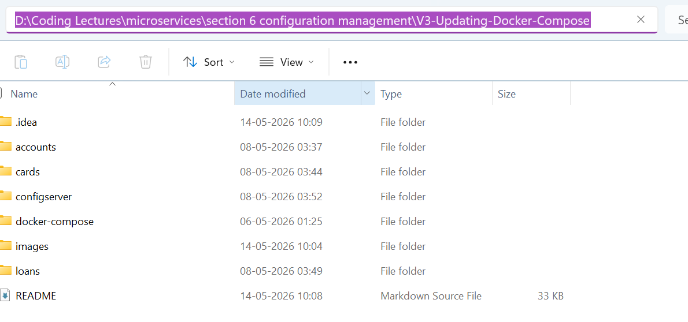
* Copying all of the above.
* Now first go to the start.spring.io
* Create a simple project there with the below settings:
* 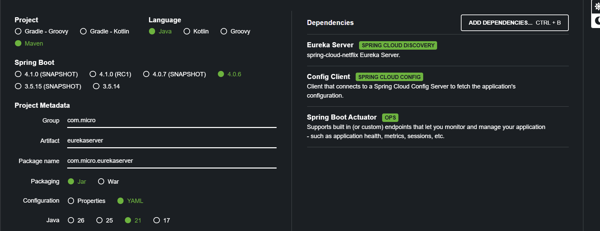
* Now generate it and copy it into your section 8.
* We need the config client as it will extract all the details about itself from the configserver.
* Eureka server is the base dependency that it needs.
* We need actuator dependency too inorder to monitor its health.
* 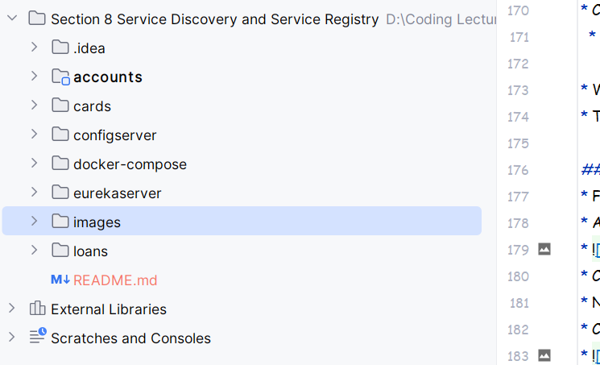
  * Now open the main class of the eurekaserver app:
  * Add the annotation of EnableEurekaServer.
  * It will make the app work like a service registry and also it will expose a API Which might look like a dashboard
    * Before: 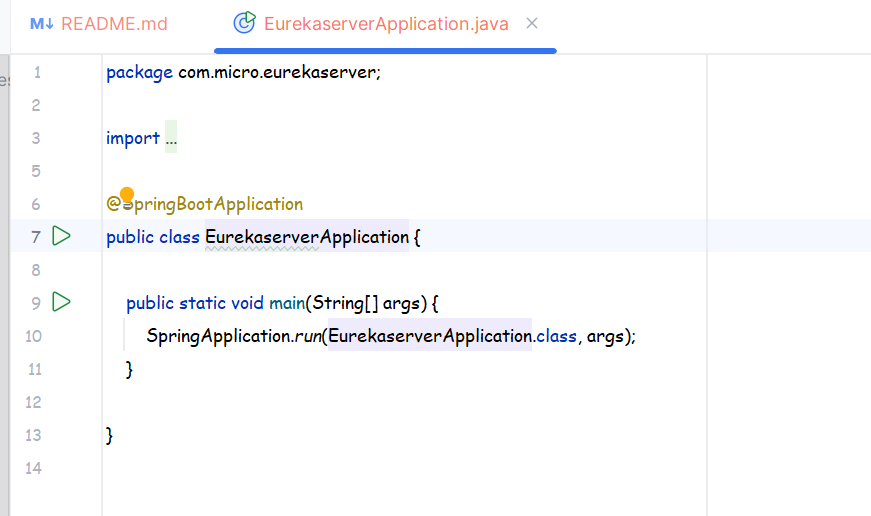
    * After: 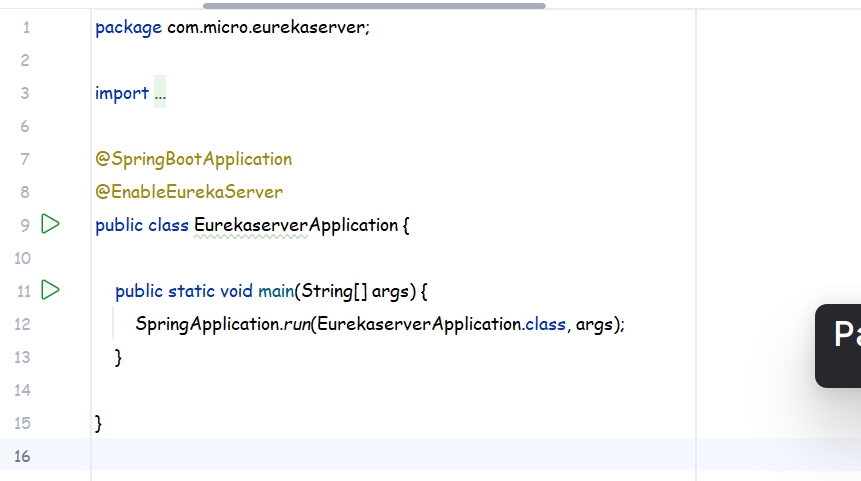
  * Now lets make changes in the application.yml:
    * 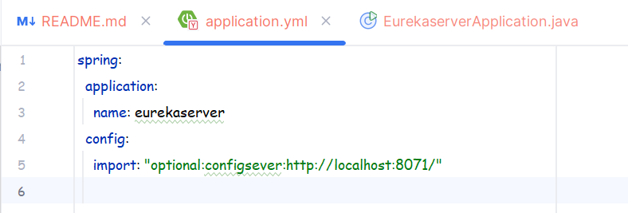
    * We added the configserver details to it so that it can fetch information about itself from the configserver.
    * Let us also create a eurekaserver.yml file and add some instructions and then push it to the github repo of the microservices config.
      * eurekaserver.yml: 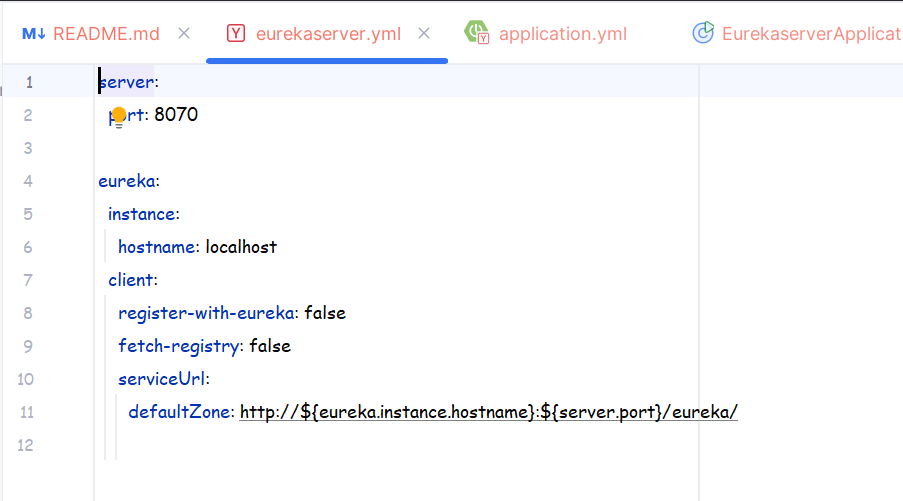
      * application.yml: 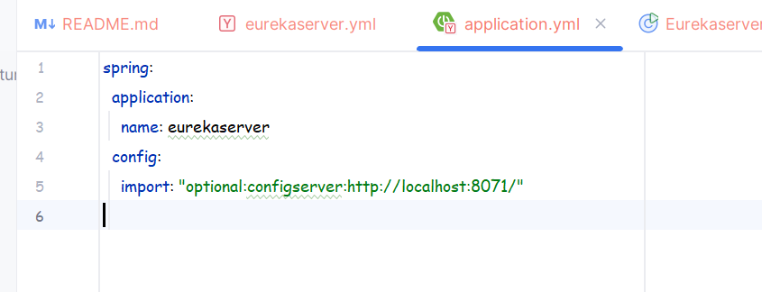
      * Let me just add teh eurekasever.yml to the configserver repo:
        * 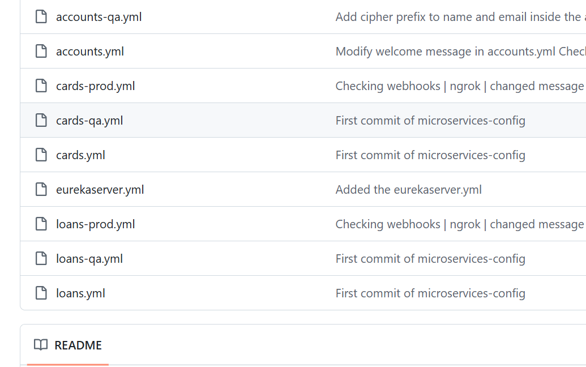
  * Also we need to add some more properties to the application.yml or maybe eurekaserver.yml about the health check details.
  * Because certain probes are needed to us for using them proplery inside the docker.
  * Just simply go to chatgpt and ask what are the healthprobes that i need to be enabled in my springboot app so that i can use them in docker and also tell me what and how to do.
  * And this will give you the answer.
    * Add the actuator dependency then:
    * 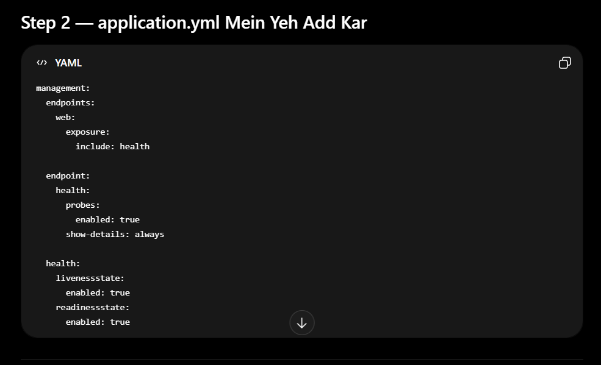
    * copy and past the above instructions in the application.yml.
    * 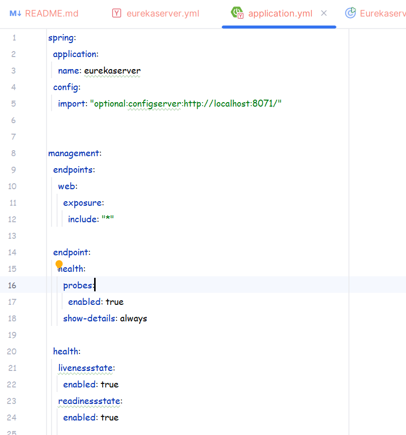
  * SO now we are done with all the basic setup , but before starting both the configserver app and the eurekaserver app , let me explain what i have written inside the application configs:
    * 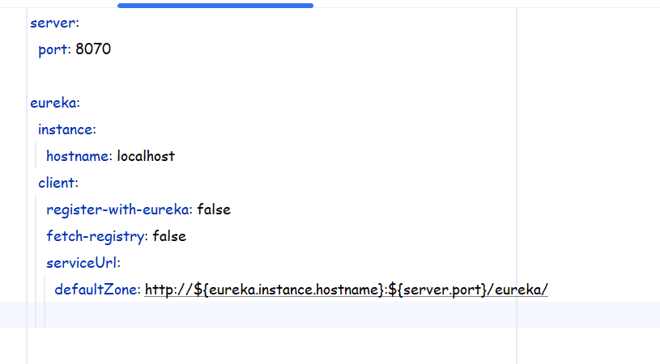 
    * This is the eurekaserver.yml .
    * Whenever it will start it will start at 8070 port be it in local or inside some container.
    * eureka.instance.hostname means what we want the hostname to be we can set it as localhos or eureka whatever you want.
    * client.register-with-eureka: false , it means dont register yourself at any of the other instances of yourself which are running and who's info you have.
    * Because default behaviour of any eureka server app is also like a cleint they can register themselves on any of their other running instances.
    * fetch-registry: false .
    * It means dont fetch the data from any other instances or any other registry who's information you have like their URL.
    * serviceUrl.defaultZone here we provide the links of all the probable instances of the eurekaserver.
    * You might be asking how will 1 instance know about other instance . Well it is not automatic .
    * Before starting any instance we can either configure the application.properties and tell it that either presently or maybe in the future at this link you can get a instance of yourself running so that's how they know.
    * This is not told to them during runtime , it is all predefined .
    * And multiple instances of the eurekaserver comes in when we want a cluster of service registry .
    * We will learn more about that later .
    * If you are planning for cluster then the two properties which we have set as false make them true , so that they can fetch each others details and data and can also register themselves .
    * Thats how they stay in sync.
* Enough talking lets run the app:
  * First start the configserver:
    * Now lets check if our configserver is fetching the details of eureakserver.yml or not:
    * 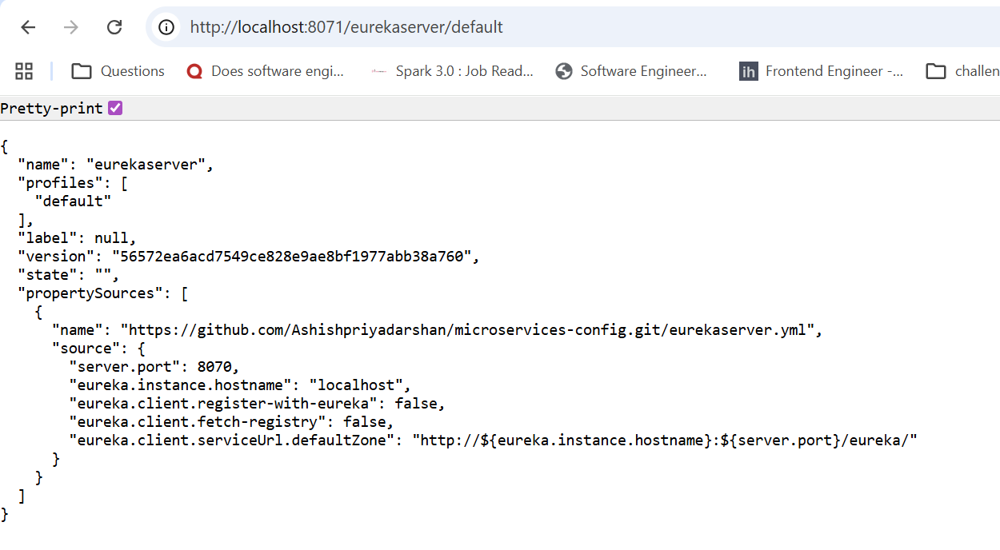
    * See we can fetch the details by going at 8071/eurekaserver/default.
  * Now start the eurekaserver:
    * 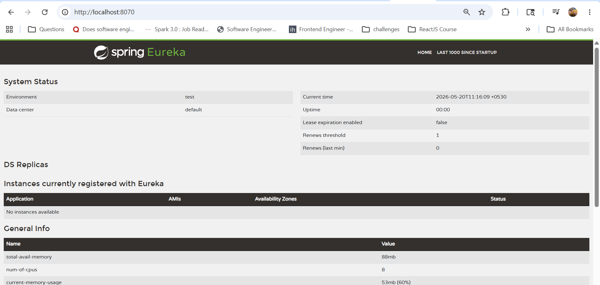
    * Well we got this dashboard by default.
    * There's nothing here because we need to start other microservice's and register them as clients here.

### 1st Commit: In the Next lectures we will configure our microservice's and register them as client to this eurekaserver.
### Commit Message: "Created EurekaServer | Explained some of it's properties | made a config file for the eurekaserver"

## Registering the microservices at the eurekaserver:
* Lets start with our Accounts-microservice:
  * First copy the mvn dependency for the eureka client and paste it in the pom.xml of accounts
    * 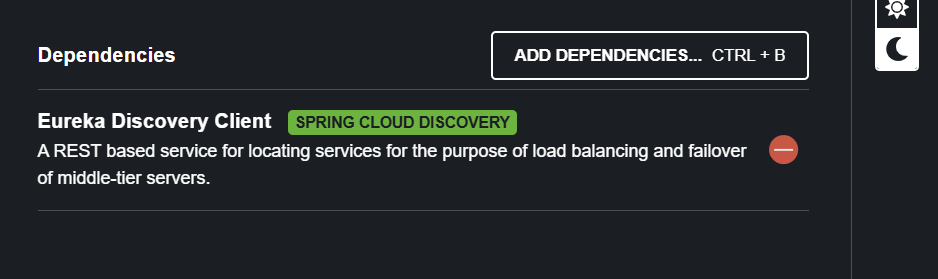
    * 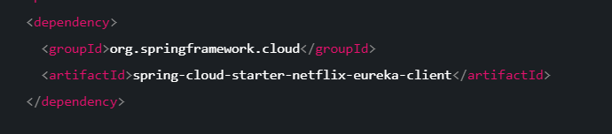
    * 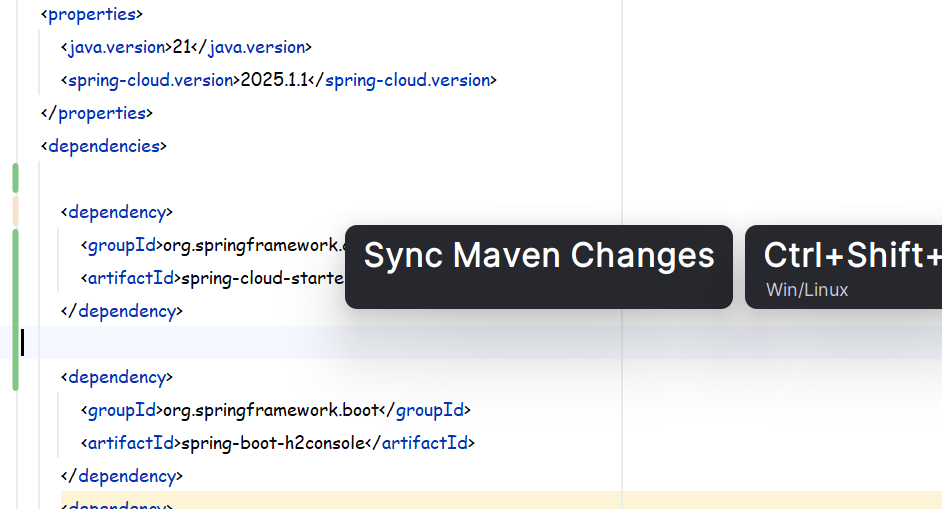
  * Now lets make changes in the code of accounts microservice:
  * 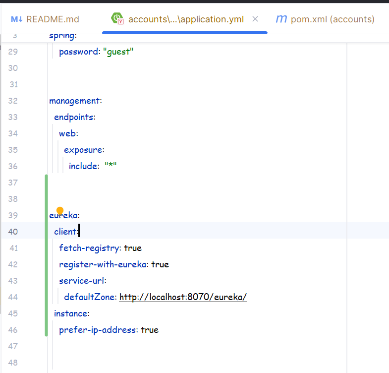
  * In the application.yml we did this.
  * Well eureka.cleint.fetch-registry: true means fetch the data from the eureka server.
  * register-with-eureka means register yourself with eureka server.
  * We have also given it the serverURL so that it has idea with the eureka server or servers are running.
  * Now what about the last property:
    * 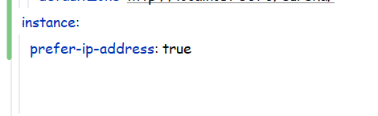
    * prefer-ip-address true means prefer to register the microservice with it's ip address .
    * Because by default it will register the app with the app name which it will get from spring.app.name .
    * Think tomorrow if there is a app which needs to talk to accounts then it will try to fetch it's details from the service registry but it will not get the IP , it will only get the app name.
    * And it is of no use .
    * We can use the app-name instead of IP too only if the DNS mapping is done then only .
    * Think of google.com do u write it's IP no right you simply try the DNS name and somehow internally it hits the google IP thats it.
    * I will explain more about this IP Address and DNS mapping thing with context to eureka server ahead.
    * Now lets add some more details like info about our microservice which will be shown in the eureka dashaboard:
    * 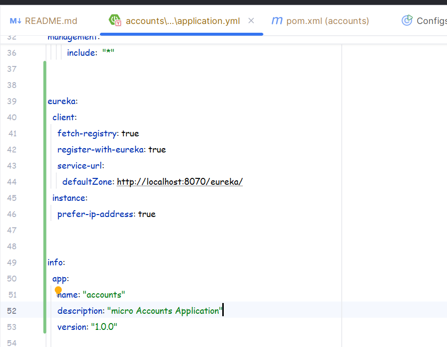 
    * Well this info related property is actually a part of the actuator dependency , which needs to be exposed as it is not exposed by default.
    * 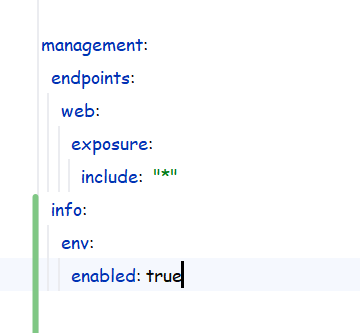 
    * See here we added the property  , this will expose the info api which will be consumed by the eureka server.
    * Another thing lets just add some properties which will help using during de-registration of the app from the eureka server.
      * 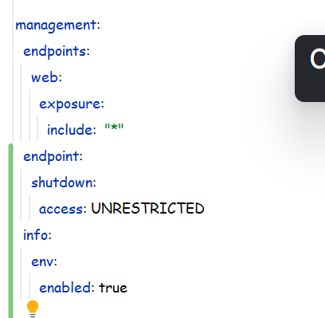 
      * This endpoint.shutdown.access unrestricted means if there is any shutdown by the app then the eureka will de register the microservice instance from the eureka server.
      * Well we will add the graceful shutdown at later stages where we will learn more about it so for now lets just leave it here.
    * Let's start the configserver and eureka and then accounts micro:
      * As soon as you start the accounts' app:
        * 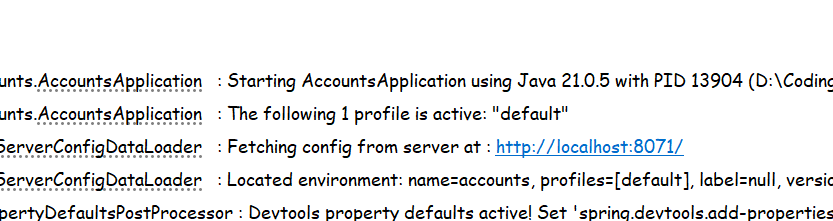
        * You will see it pulling the configs from configserver.
        * 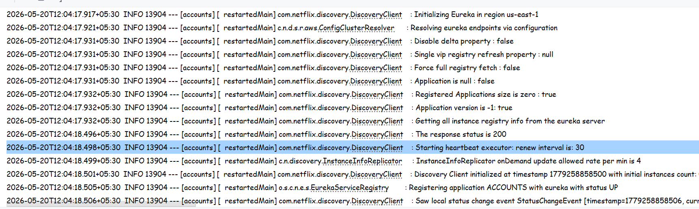
        * See here it is sending heartbeats to the eureka server and also registering itself and also trying to fetch info about all the apps instances from the eureka server.
        * The microservice by default will keep sending heartbeat signals to the eureka server every 30 seconds.
        * 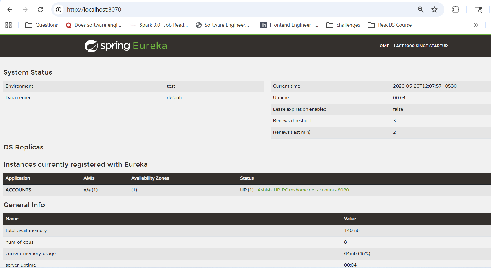
        * See here this time in the dashboard of eureka we can see Accounts app instance And if you click on the link below the status part:
        * 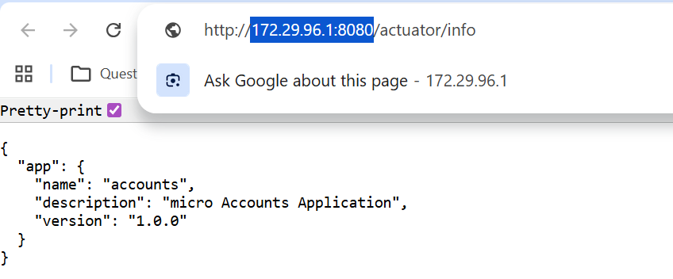
        * Observer above that it is using my local IP Address along with the port and then the /actuator/info .
        * 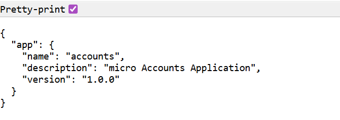 We are getting the info that we had given in the applications.yml .
        * BTW the application name is taken from spring.application.name .
        * And the link under that status is randomly created by eureka server using my PC name etc. i mean the host name is taken from my PC name only.

### 2nd Commit: In the Next lectures we will configure our loans and cards microservice and register them as client to this eurekaserver.
### Commit Message: "Installed Eureka Client dependency to our Accounts microservice | Configured the accounts microservice app | Provided the eureka cleint info and eureka server info | Exposed management end points like info and shutdown"

### Lets make changes in the Loans and Cards microservice:
* Loans:
  * Add the mvn eureka client dependency.
  * Make changes in the application.yml:
    * 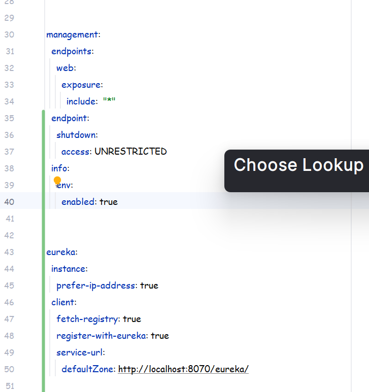
    * 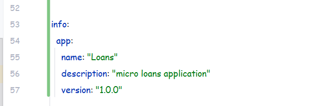
* Cards:
  * Add the mvn client dependency.
  * Make changes in the application.yml:
    * 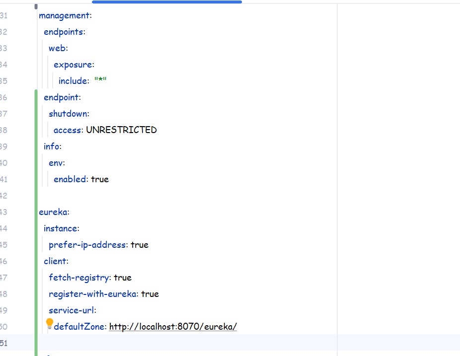
    * 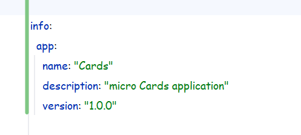

* Now just simply start the applications:
  * configserver:->eurekaserver:->All 3 microservices:
  * 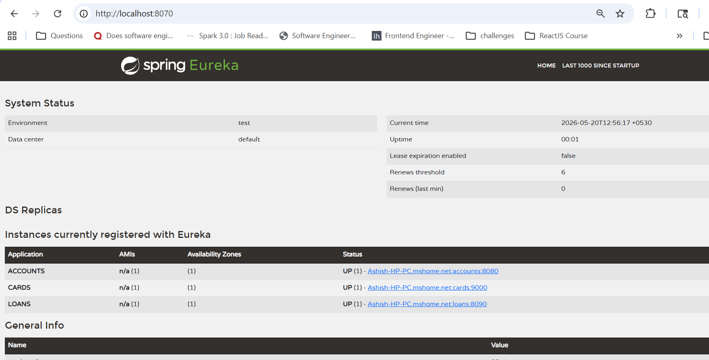
  * See here this time we are getting all the app instances in the eureka server.
* There is a endpoint exposed by the eureka where you will get all the info about the registered apps:
  * localhost:8070/eureka/apps
    * 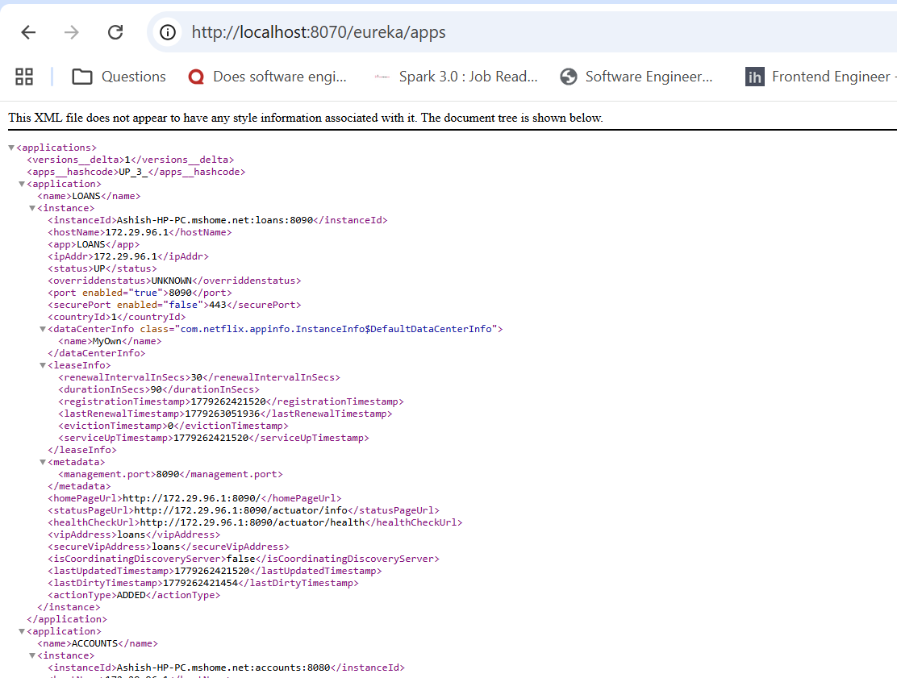
    * You will get so much information from here like no of instances their IP their name , their health , port etc , everything.
    * If you want this in the json format then :
      * Open postman: 
        * 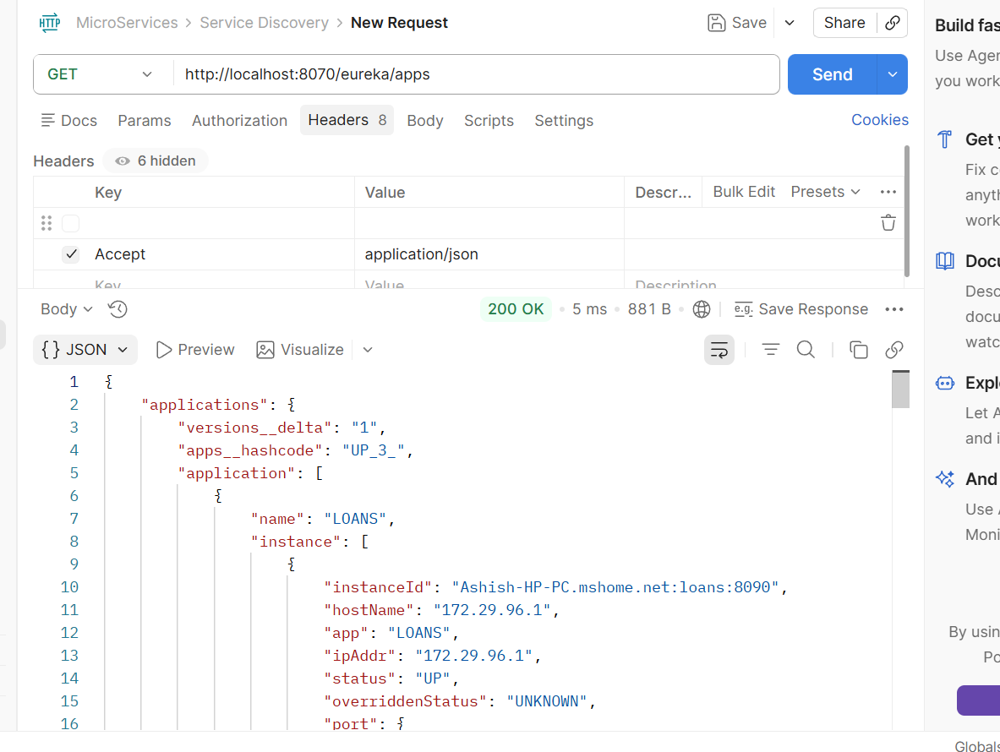
        * Send info with the Accept header.
        * If you want info related to a specific app like accounts then use:
          * ``localhost:8070/eureka/apps/accounts``

### 3rd Commit: In the Next lectures we will see how to de-registration works and also how the heartbeats mechanism works.
### Commit Message: "Installed the eureka client dependency in cards and loans microservice | learned more about the api's exposed by eureka | eureka/apps"

### Service De-Registration and HeartBeats Mechanism:
* In real prod applications we wont be running the apps in intellij right .
* I want to say do you think in prod apps you will simply go and press the stop all button .
* 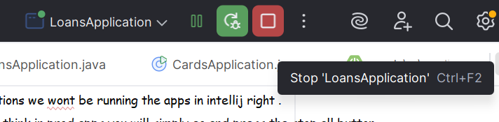 
* The above , no right.
* So for that reason we have exposed the actuator end-point that is the actuator/shutdown , when you hit this api it will gracefully shutdown your app and then our app will de-register from the eureka.
* 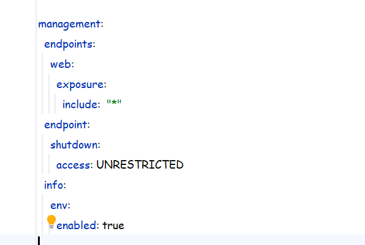
* Lets do see how the apps De-register from the eureka server:
  * Lets start all the related apps in seq:
    * configserver->eureka->All apps:
    * So as usual when our apps start they fetch configs from config server and then they register themselves on the eureka server as per the logs .
    * Now lets hit the shutdown api for any one of the service instance.
    * 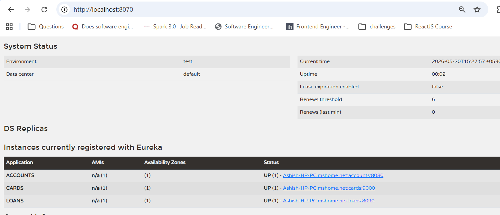
    * Lets hit the actuator/shutdown api for the accounts app.
    * 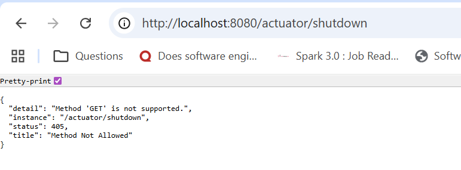
    * GET is not supported so lets open postman and perform a POST Request at ``localhost:8080/actuator/shutdown``.
    * 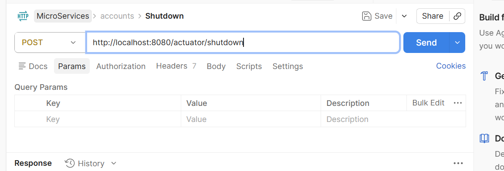
    * As soon as we execute this we will see the response and also read the logs and also the dashboard.
      * Logs:
        * Accounts: 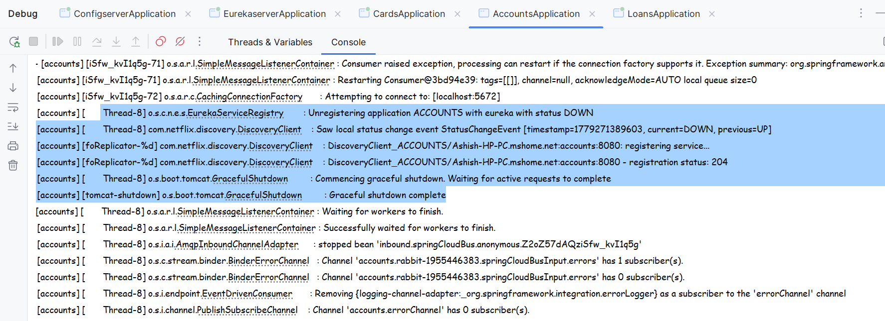
        * Accounts: 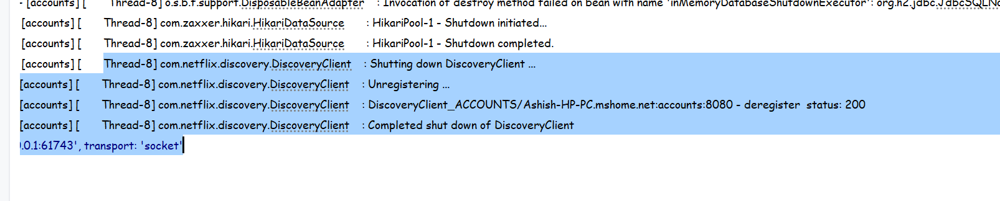
        * See above it is unregistering itself and then gets completely shutdown
        * EurekaServer: 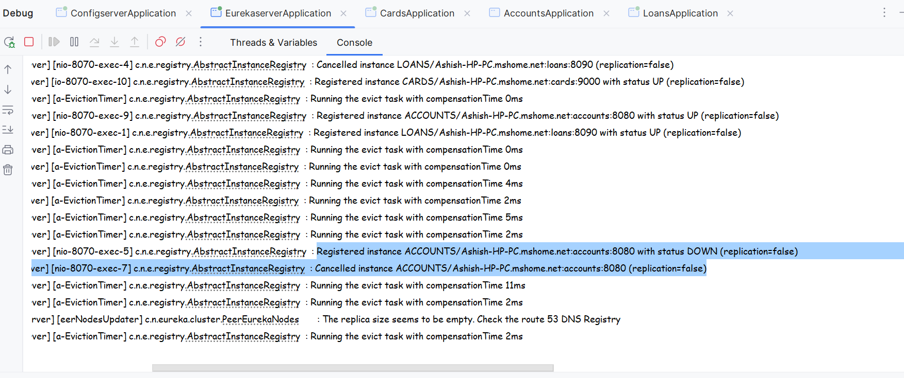
        * See here the status is DOwn so it is also removing the service instance from it's registry.
      * Postman: 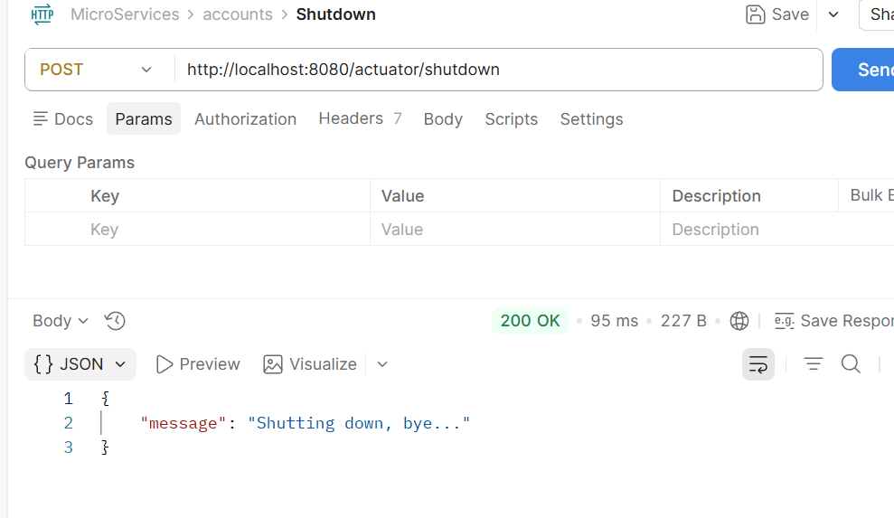
      * Dashboard: 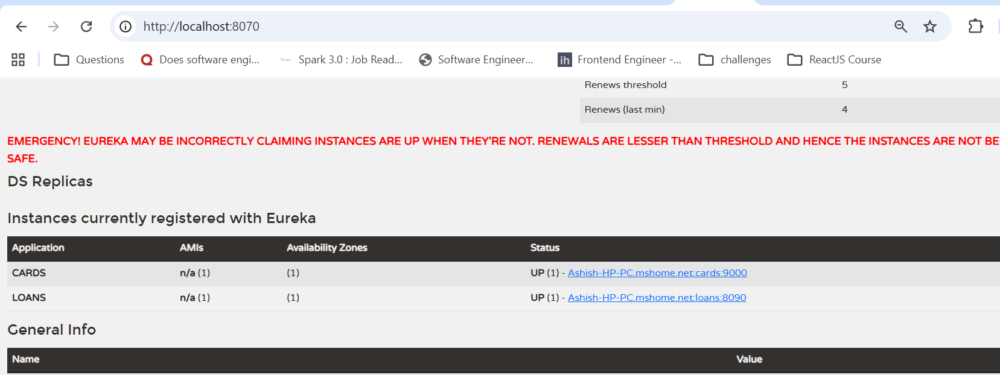
* So this is how the de-registration works .

#### Hearbeats Mechanism:
* By-default every eureka cleint keeps sending heartbeats to the eurekaserver at regular intervals of 30s.
* So in-order to see that lets just stop the eurekaserver and then you can see in the logs of the client app how it keeps sending heartbeats.
  * First stop the eureka server then look at the logs of any service that was registered at that eureka server.
  * Cards:
    * 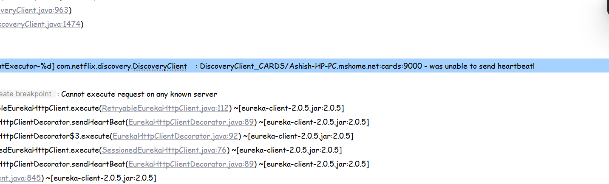
  * This is the heartbeats mechanism , they need to send to the eurekaserver.

### Graceful Shutdown:
* We forgot to mention about graceful shutdown.
* Well it is not an api-endpoint but a config for the app , that makes the app shutdown gracefully.
* Which means suppose some processing is going on for some request but all of a sudden the ops team decides to close the app so they will hit some api to close the app.
* What it does is it will completely stop the app which can cause data inconsistency.
* So inorder to avoid that if we mention server.shutdown:graceful , it will shutdown only after all the current ongoing requests are processed and meanwhile if a new request comes in then it will not take the request .
* It's like we have closed taking orders and right now who ever is inside the restaurant and who's order is being prepared once they are served the food the restaurant will close.
  * This is very important in situations where :
    * The app is performing some money transfer.
    * Payment.
    * Order Booking
    * File Upload.
    * DB transaction.
* Donot get confused between actuator endpoint shutdown and graceful shutdown.
* graceful shutdown is a way to handle requests while shutting down , where as actuator endpoint is a api to initiate shutdown process.

### 4th Commit: In the Next lectures we will understand inter-services communication | FeignClient
### Commit Message: "Demonstrated De-Registration | Hearbeat Mechanism | Graceful Shutdown "  

### Interservices communication:
* How multiple services communicate with each other.
* In traditional app's REST Template or some web client was used where the dev had to give all the information like IP of the service to which we were trying to connect and had to write down lot and lot of boilerplate code.
* Every code of how we can connect to a external service it was being coded by the dev .
* But in spring microservices env we have OpenFeignClient.
* It is bascially a dependency which has an interface which we can use to directly communicate with other services without having to write lots and lots of code like URL , connection type etc .
* So inorder to understand communication between two microservices let's create a new REST API and in the way we will understand more and more about the working of feignclient.

### New REST Api:
* Till now we have created individual microservices who have their own DB right and these microservices had their own set of data.
* Now lets create a API where upon passing the mobile Number we can get the consolidated information of the USER on the basis of their mobile number.
* Information of accounts , customer , cards and loans.
* Like till now we had accounts , loans and cards ms.
* But we never had a ms which could return the data of all the ms combined right .
  * The basic flow is first create the details in all the DB as per the given mobile Number.
  * Now create a REST Api such that it takes the mobile Number info from the user and then tries to find the data in the accounts and customer DB and then Loans DB data using the loans ms and then Cards DB data using the cards ms.

### Setting Up OpenFeignClient:
* 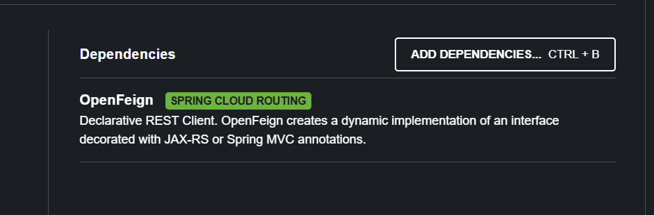
* Copy the mvn dependency and paste it in the app's where you want to establish communication.
* Lets copy the dependency into the accounts pom.xml because accounts is the one who needs to discover service's in order to communicate.
* Now in the main class of accounts add a annotation that is ``@EnableFeignClients`` .
* 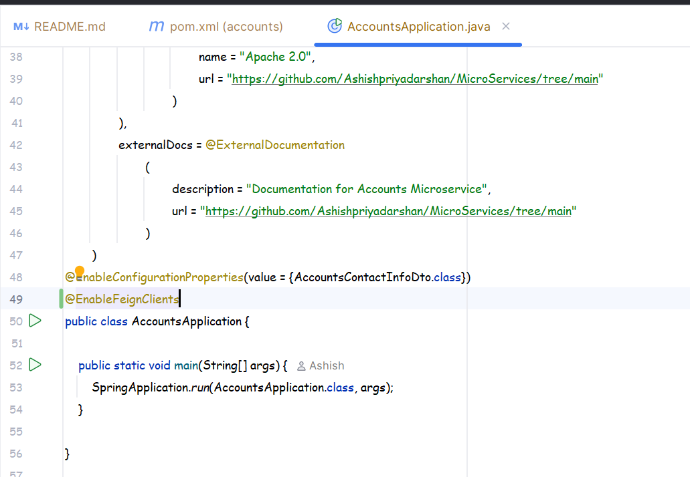
* Now once it is done now we will be using it as an interface , it's internal mechanism is same like JPA becuase we use the interface only and mention some details only and rest of the things like implementation and execution is taken care internally.
* Just go and check the Repository layer do we write any kind of implementation logic or anything no right we just mention some details and thats it the interface takes care internally.
* We only mention some declarations.
* OpenFeignClient generates the codes during runtime.
* Now lets create a feignclient interface:
  * 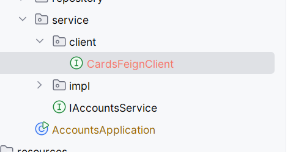
  * In the service folder create a folder with name client then create a interface inside it with the name CardsFeignClient.
  * 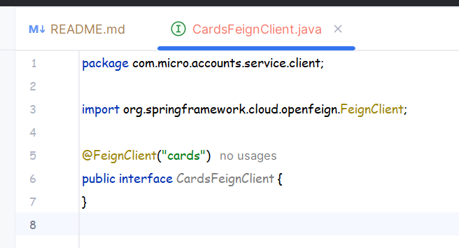
  * Now use the annotation ``@FeignClient("name_of_microservice_instance_which_shows_in_eureka_server_Dashboard"``
  * ``@FeignClient("Cards")``
  * Now what function or abstract methods are we supposed to define if we want to communicate with any api exposed by the cards microservice.
  * Suppose if we want to fetch the details from the cards DB via Cards ms using the fetch method of the cards ms then we will have to use its declartion here as it is.
  * 
  * In cards ms we have this REST API which quries the cards DB on the basis of a mobile number and then returns the details to the client.
  * So will have to invoke this .
  * So we will simply copy the code from the cards controller and paste it in the feignclient interface .
  * 
  * You can keep the name of your feignclient interface whatever you want but make sure the name of the function that you want to connect to should have the same name and signature in you feignclient interface as what is there in its own microservice controller otherwise it will fail .
  * Like this just paste it but we need to make some corrections here so lets do it.
    * 1st : the URL of this api is not /fetch , Because if you go and check in the cards controller then you will see that the URL of this api is /api/fetch.
    * 
    * So we will have to change the URL in the feignclient too.
    * From the parameter's we have to remove the @Pattern part because we are just invoking a api of the cards ms.
    * And the validations will be done in the cards api not by our client accounts app .
    * Another important thing is the CardsDto which we need to have in the accounts app too because it will be reponsible to handle the incoming data.
    * So lets create CardsDto same to same in the accounts ms too , take reference from CardsDto of cards ms.
    * Keep the stucture as same as what is there in the CardsDto of the Cards app.
    * You can ignore the validation parameters in case of CardsDto for the accounts app , because this time we are not expecting any incoming requests we are just using it to to receive data in CardsDto format from the Cards App.
    * Before: 
    * After: 
    * You can ask why do we need RequestParam why cant we just send the mobile Number as a normal method parameter.
    * 
    * It is because when we are sending a request to the /fetch api of the cards app so it will be send as a http web request.
    * 
    * See above this is the reason and if you dont mention @RequestParam then the proper http web request might not get formed and even sent.
    * 
    * So Now we are done with setting up the FeignClient interface for the Cards , Make sure we have the getter , setter, noArgs and AllArgs for the DTO.
    * Lets Now create a FeignClient for the Loans as well to fetch the Loans details.
    * Loans:
      * 
      * Inside the service->client folder create a interface LoansFeignClient.
      * Now lets see which is the API responsible for fetching the Loans details in Loans microservice from the LoansDB .
      * 
      * This is the Api responsible for fetching the loans details so let's just copy it and paste it as it is in the LoansFeignClient.
      * 
      * Well we only need the declaration so .
      * 
      * Now we need to write down some more details like it's api path and then also create the LoansDto.
      * 
      * Now lets create the LoansDto.
      * Simply just copy the dto from the Loans app and paste it in the DTO of the accounts and then just remove the validation parameters.
      * 
      * See here we are done with the basic setup.
      * Now in the Next part we will work on creating the New API which will consolidate all the info.

### 5th Commit: In the next lecture we will create the New Rest Api and see the working of feignclient
### Commit Message: " Created the FeignClient interfaces for the loans and cards microservice"  

___

## Creating the New REST API:
* This new REST API which will be inside the accounts app , its task is to take mobileNumber from a user and then query it's own DB and get the records and then .
* Use the same mobile Number to send requests to the other services like loans and cards and get the data from them also and then consolidate all the data together and send it back to the user.
* First we will build a DTO that is capable to hold the consolidated information of all the other DTO's.
* 
* A DTO that can hold the info of all the 3 DTO's .
* Lets create the CustomerDetailsDto.
* 
* So we have created it.
* Now lets create the API.
  * 
  * 
  * 
  * Now lets work on the service layer like we need to create a service that will run the business logic for us.
  * First lets create a interface of a service.
  * 
  * Now lets give some method declarations here.
  * 
  * Now lets create a java class in the service->Impl which will implement this interface.
  * 
  * 
    * Now lets start the coding.
    * First i need to connect with the accounts repository and fetch the details of accounts from the DB.
    * Then i need to connect with the customer repository and fetch the details of the customer from the same DB.
    * Then i need to make a call to the fetchLoansDetails function of the LoansFeignClient.
    * Then i need to make a call to the fetchCardsDetails function of the CardsFeignClient.
    * So accordingly i will have to set the dependencies.
    * 
    * See we have injected the dependencies.
    * 
    * We are using here @service annotation and we have also given it a name , because if in future we are creating more and more servie's implementation of the same interface then atleast while injecting we can inject as per the name of the bean.
    * Well we have injected the dependencies but now we also need to create some mapper logic which will map all the incoming data from different different sources to our CustomeDto.
    * Let me first write down the business logic and then we will think about the mappers.
      * First lets fetch the customer details from the DB as per the mobileNumber.
        * For this either i can use the same logic as what was there in the fetchcustomerdetails of the AccountsServieImpl or i need to inject a new dependency that is the dependency of the AccountsServiceImpl .
        * But we will simply copy the logic.
        * 
        * What we did above is first we fetched the data from the DB using the Customer Entity.
        * Then we are mapping the Customer object to the CustomerDto object.
      * Now let me write the same code for the fetching the accounts details as well but this time we will use the CustomerId to fetch the accounts Details.
        * 
        * See here first we fetched the customer details using mobile number now we fetched the accounts details using the customerID .
        * We also mapped the Accounts object data to the AccountsDto object.
      * Now lets create the logic for fetching the loans and cards details using their FeignClient interface's.
        * 
        * Even if we dont use that ResponseEntity still there wont be any issue but we used it so that based on the status of the response we can do some more conditioning.
        * Now lets map this into the CustomerDetailsDto by simply using getter and setter's.
        * 
        * See we created the CustomerDetailsDto object and then we are mapping the values , now we need to map the values of customer and AccountsDto.
        * But before that we observed a problem that is if you go into CustomerDto then you will see that it is using AccountsDto as one of it's variable.
        * And now we are using AccountsDto variable along with CustomerDto in the CustomerDetailsDto so it is better if we remove the AccountsDto from the CustomerDetailsVariable and use the CustomerDto variable to set the AccountDto too.
        * CustomerDetailsDto:
          * Before: 
          * After: 
        * Now we need to make some changes inside our CustomerServiceImpl:
          * 
          * We simply used the setter function setCustomerDto this will set both the values of CustomerDto as well as the AccountsDto which is used as a variable inside it.
    * Now since we are done with setting all the values:
      * Lets write the return statement and also write the logic in the controller layer.
      * 
      * Controller layer:
        * Before: 
        *  
        * Added the dependency of the service not as service but i added the instance of the interface and wrote the qualifier annotation inside which i gave the name of the service implementation.
        * 
        * Took the qualifier name from the CustomerServiceImpl.
        * Now lets write the logic.
          * 
        * So finally we have done the logic writing now our coding part is complete .
        * Now we will build all our apps and then run them and then check whether all the api's are working fine or not.

### Validating the Rest API's:
* First build all the apps.
* Now start all one after another.
  * configserver.
  * eurekaserver.
  * Loans
  * Cards
  * Accounts
  * Now after starting all the apps now in sequence we will be hitting different api's.
  * API's:
    * First Api: Accounts 8080/api/create
      * we wil provide the mobile Number here.
      * 
    * Now we will use the same mobile Number to create a record in the loans DB: 8090/api/create?mobileNumber= 9876543210
      * 
    * Now using the same mobileNumber we will create a record in the cardsDB : 9000/api/create?mobileNumber = 9876543210
      * 
    * So we have created all the data that was needed .
    * Now we will hit the fetch api's of all our microservices and see whether the value is coming in the desired manner or not.

### Validation Table:
| Service  | API                                                              | Postman                                                               | DB                                                                      |
|----------|------------------------------------------------------------------|-----------------------------------------------------------------------|-------------------------------------------------------------------------|
| Accounts | 8080/api/fetch?mobileNumber=987654321                            |                                       |     |
| Cards    | 9000/api/fetch?mobileNumber=987654321                            |                                       |                                         |
| Loans    | 8090/api/fetch?mobileNumber=987654321                            |                                       |                                         |
| Accounts | Consolidate customer information (8080/api/fetchCustomerDetails) |   | Not Needed                                                              |

* So finally everything is working fine as expected we are getting all the consolidated information .
* There is one small issue that is instead of getting AccountsDto in the json we are getting it but inside customerDto which is expected because of the way we are using it inside the CustomerDetailsDto.
* We will work on this later and try to make changes to the CustomerDetailsDto .
* 
* But overally everything is working fine.
* 
* Our eurekaserver is also good.

### 6th Commit: 
### Commit Message: " Demonstrated how services communicate with each other with the help of FeignClient | Created new REST API to return the consolidated data | Created new DTO's | Created a new Service layer interface and also it's implementation "  
