# API GATEWAY , ROUTING AND CROSS CUTTING CONCERNS 
#### Why do we need a single entry point , why cant we just provide the URL of our services directly to the clients like the FE.
* It is possible but this will be a tightly coupled situation .
* FE will be having the URL of the microservices it wants to talk to , but what if tomorrow the service changes its port or IP .
* In that case we will have to push new codes to the FE as well .
* What if tomorrow we have more instances of the same microservice then what will we do in that case.
  * We will have to give the details of all the instances of the microservice's to the client and also it will be the task of the client to balance the load or evenly distribute the load which is not a good thing.

#### How will we handle cross-cutting concerns like logging , auditing , tracing and most importantly security.
* Well you may say we will introduce all of this for all the apps like we will code all of this for different apps.
* Ok like logging is ok at app level , auditing is also ok but what about tracing it will very diffcult to track which user or which client is sending requests where and where etc.
* Most importantly are you going to introduce different security features for different microservices .
* Suppose the user hits the api for the accounts he/she needs to provide his/her creds to login and do their work.
* Now they hit some other api which responds to loans now again since we have app level security so it will again ask for creds.
* Asking for creds again and again is a very very bad practice , so what are we supposed to do then.
* Imagine you have 1000's of microservices are you going to make cross cutting concerns for all of these 1000's of ms 1000 times .
* We have to enforce all of this things to all of our apps but only at a single place.
* We need a gate keeper who will redirect every thing to the right place.
* Think of a apartment security guard , who has eyes on every incoming and outgoing guest .
* He knows who came in when and went out when .
* He knows whom to allow inside the society whom to not.
* He knows who has access till the parking and who has access inside the apartments .
* He knows who lives where just need to tell him the name and he will send you to the right house no , which can be thought of as IP Address for block No and house no for port.

#### How do we route based on custom requirements ?
* How to provide dynamic routing capabilities which allows to define routing rules based on various criteria's such as HTTP headers, request , parameters etc , inside microservices network .

#### Well all of the above challenges can be solved using EDGE Server or API GATEWAY a common entry point.

___

#### In the Early traditional applications clients used to hit the microservices api directly which is not a good thing in todays era.
* Because if we keep hitting the api's of different services directly again and again then all of our microservices will have to implement so many things like some repeated set of codes.
* They will have to individually perform security checks again and again.
* Suppose you have a website where there are many clickable icons ,
  * Suppose you clicked icon A which will directly redirect you to the microservice A Api but now it will ask you for authentication and authorization.
  * Suppose you gave the creds and now you have entered into the api and u r happily doing your task.
  * Now once your task is done , you came back to the main page and now you clicked on icon B which takes you to microservice B.
  * Now B will ask you for authentication and authorization since B will have it's own set of security context .
  * You will again provide login creds here .
  * So this is the issue you didnt had any common point where you could just give details once and then the same details will be used across all the services.

#### Traditional:
* 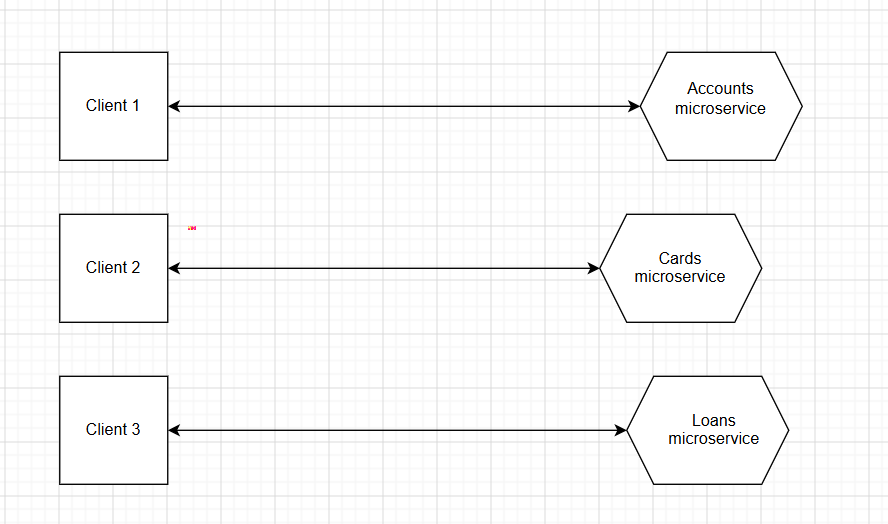
* Directly hitting the microservice api's.

#### Modern Architect:
* 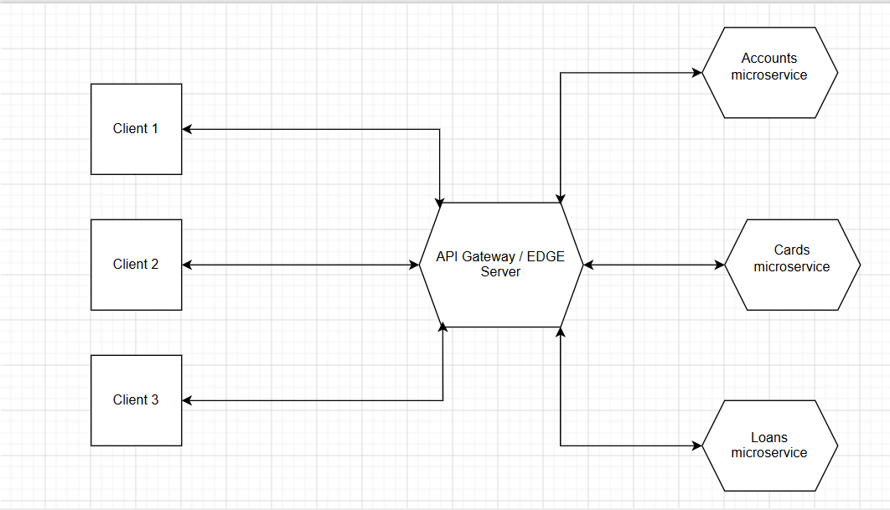
* In this approach all the clients they have to go through one single point or you can say a gate rather than direclty hitting the microservices.
* Advantage of this approach:
  * We can handle so many cross cutting concerns at this stage.
  * We can make our downstream services resilient and fault-tolerant.
  * At this stage we can manage the no of retries , timeout etc of calling an api.
  * Authorization and Authentication can be handled here at this single point.
  * We can enforce some quota policies here like the no of times a particular client can make request within some time frame  or the api's which or contents which they have access to and which have no access to.
  * We can have custom exception handling at this layer.
  * We can perform logging and monitoring and send the info to other services using this layer.
  * We can use REDIS Cache here.
* You may ask why cant we use our eureka server here.
* It is because the purpose of eureka server is to discover services and help services to find each other .
* It cannot perform cross-cutting functionalities like logging , auditing , tracing , security checks etc.
* From 6 mins lect 122

#### Spring Cloud Gateway:
* All the functionalities that i have explained above can be acheived by using the Spring Cloud Gateway .
* It is very easy to set up and it can handle the workload seamlessly while maintaining optimal scalability .
* We can use it to create production grade gateway server.
* Since the gateway sits at the edge of the servers so very heavy traffic is expected here .
* And the spring team has developed this in such a way that it uses very less memory and works very efficiently even in heavy traffic conditions.

### Key Aspects of Spring CLoud Gateway:
* The service gateway sits like the gatekeeper for all the incoming traffic to microservices calls.
* With a service gateway in place our service clients would never directly call the URL of the individual microservices but instead make a call to the service gateway.
* Spring cloud gateway is a library for building an API Gateway so it looks like any other spring boot application .
* Any person familiar with spring boot coding can easily start a gateway server with just few lines of codes and some configs.
* Spring cloud gateway supports dynamic routing .
* Routing based on context.
* Suppose in the header of a request if there is some value indicating to a particular version of an api then we can redirect the request there.
* The gateway can keep a track of the session of each and every user (Tracing).
* It can also help in creating sticky sessions which means a particular users request will always be forwarded to a particular instance of a microservice.
* Well there are other API Gateway available in the market like ZUUL and others too .
* But Spring Cloud Gateway is mostly preffered because spring cloud gateway build on spring reactor and spring webflux provides circuit breaker integration , service discovery with eureka , non-blocking in nature has superior performance compared to that of ZUUL

#### The service gateway sits between all calls from the client to the individual services and acts as a central Policy Enforcement Point (PEP) .
* Routing (Both static and Dynamic)
* Security ( Authentication and Authorization )
* Logging , Auditing and Metrics collection .
* 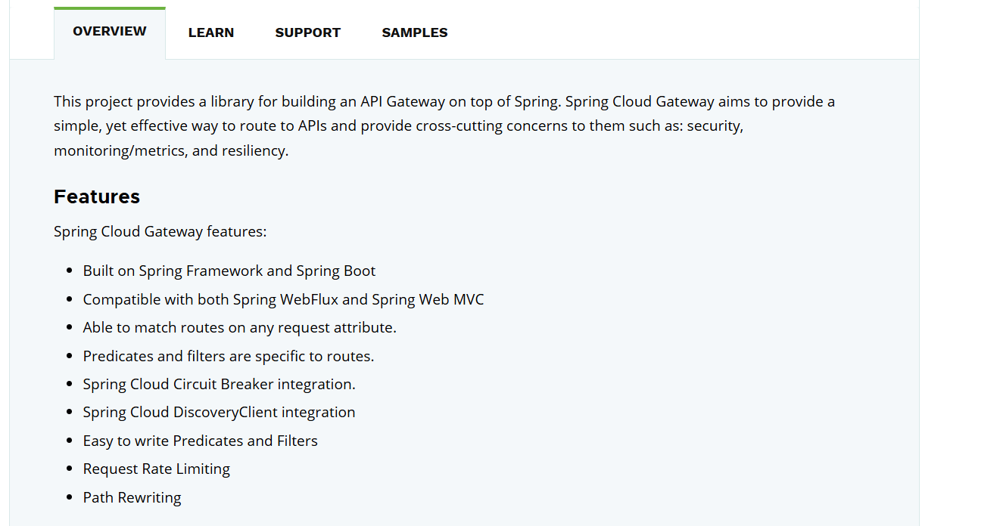
* TO learn more : https://spring.io/projects/spring-cloud-gateway

### Internal Architecture of API Gateway:
* 
* Well the above images shows us how the HTTP Requests flow inside a gateway server.
* 
* Now the above image tells us about the internal architect of a Spring CLoud Gateway server.
* Let me explain each part:
  * While creating a gateway it is the developer who has to mention certain things in the configs like ,
  * The dev has the mention some predicates and filters .
  * What are these predicates and filters ?
  * Well the task of a gateway is to route the incoming http request to the proper instance of a microservice right.
  * So we have to mention routes inside the gateway server .
  * like for example suppose we have 5-10 microservices hosted at different servers lets just focus on microservices and not instances.
  * So we have to mention the details of all of these microservices right , inside gateway we never mention any hardcoded IP Address.
  * It is the task of the gateway to retrive the IP Address from the Service Registry for any of the particular service on the basis of the URL received.
  * Whenever any client sends a reqeust to the gateway server they will definitely mention the path .
  * like in their URL they definitely going to have the path of the API.
  * Suppose our gateway is hosted at localhost:8076 , Now suppose a client wants to hit the /api/fetch of the accounts microservice so for them they will use the below URL.
  * URL : localhost:8076/accounts/api/fetch.
  * Now what it does is the request will go to the gateway at localhost:8076 now from there, there are gateway handlers who are going to process this incoming http requests.
  * Now they will try to match the request which is /accounts/api/fetch with the pre-written lists of URL's which are coded by the developer inside the gateway.
  * Now this matching where the url of the http request is being handled by the gateway handlers and these gateway handlers are comparing the url with the list that they have this is know as conditional checking in gateway language.
  * This conditional checking that is being done is knows as ``predicates matching``.
  * And Predicates are basically the conditions which are written by the developer inside the gateway.
  * It is a set of conditions for a incoming HTTP request , on the basis of which a incoming http request is identifed and furthur processing is done and finally the request is sent to the right microservice address.
  * ### Predicates:
    * A list of conditions written by the developer for every specific route that they know.
    * A HTTP request will only be processed furthur by for a specific route only if it satisfies all the conditions for that route , if it doesnt satisfy then the http request will get compared to other routes mentioned.
    * Suppose we have 3 microservices accounts , loans and cards.
    * so inside the gateway configurations you will see that the developer has written 3 different predicates for 3 microservices.
    * Have a look at the picture:
    * 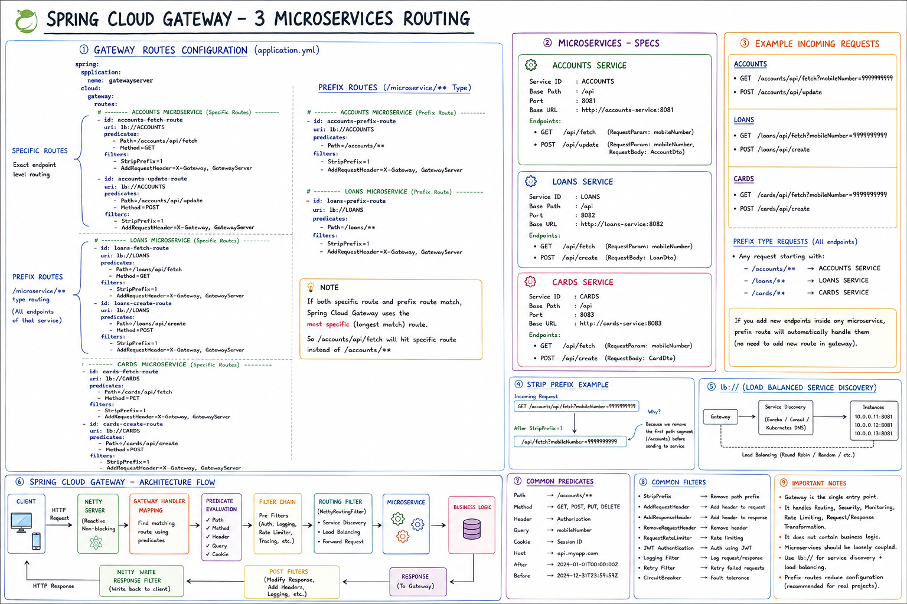
    * Here if you see to the left top then this is how a developer writes the routing information.
    * id: which basically means the internal name given to a route.
    * uri: It's task is to get the actual IP address for a microservice.
    * predicates: Conditions.
    * filters: Acutually filters are of two types 
      * pre and post filters.
      * well here the filters that you are seeing in the image their task is to modify the http request before sending it to the actual IP.
    * See at point 6 how the http request flows
    * Inside predicates first the path is matched then remaning predicates are matched.
    * There can be many predicates for a particular request in our image you might be seeing only 2 for every route id.
    * See at point 7 there are a list of common predicates which are used.
    * Now you have little bite idea about predicates , lets move ahead and understand more about filters.
  *  ### Filters:
    * Filters are of two types one is pre-filter and other one is post-filter.
    * Pre-filter modifies the http request before sending the request to the correct microservice instance.
    * Post-filter modifies the response that it has got from the microservice , before sending the response to the client.
    * But we write all the filters inside the filter tag only it is by the name of the filter that they get differentiated like which one is post and which one os pre.
    * 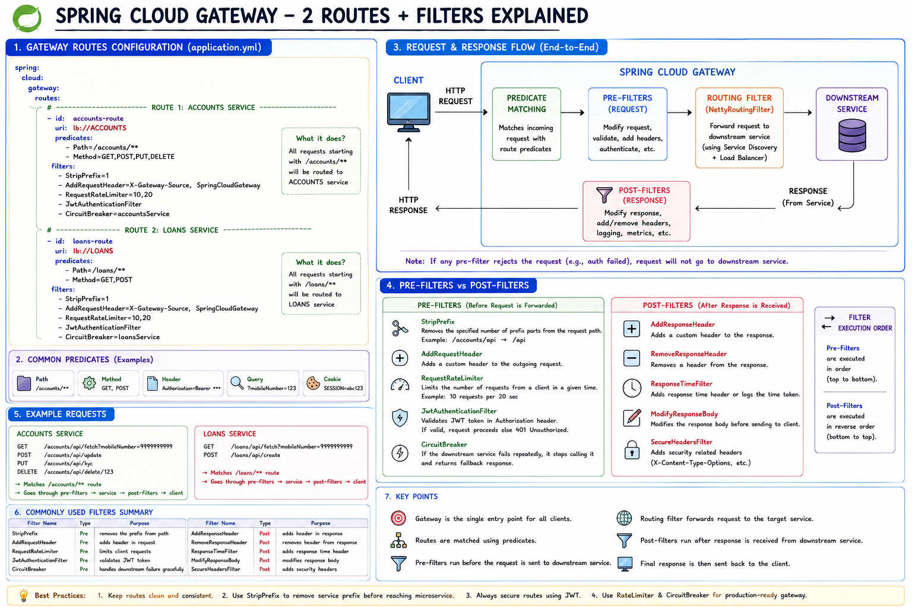
    * This is how the filters look .
    * 
    * In the above image we have mentioned both pre and post filter , they are not written explicitly.
  * ### URI:
    * Once the request passes successfully through all the pre-filters now the gatway handlers will go to the URI Part and get the information about all the instances of the microservice.
    * Like suppose URI says lb://ACCOUNTS , it means now the Gateway server will contact the service discovery and seek information about all the instances of ACCOUNTS and when the service discovery returns all the instances of the ACCOUNTS.
    * It will now implement the loadBalancing using some algorithm from its end and finally send the request to some instance of that microservice .
    * This is how load balancing is also done by the gateway server.
  * ### POST Filters:
    * As you have seen above under the filters section we have mentioned how the post filters look.
    * Now once we get the response back from the microservice it will be modified on the basis of the post filters that we are using .
    * Then finally after modification the response will be send by the gateway server to the client.
  * ``This is the overall flow of the requests inside the gateway server.``
___

### Overall Architect :
* 
* Here you can see we have a NETTY Server running inside the GATEWAY .
* In normal springboot apps we have tomcat server running , most of the springboot apps have spring mvc which has the embedded tomcat.
* But there is a issue with tomcat server that is it's threads are blocking in nature they will not do anything else unless they get a reponse or you can say they keep waiting till they get a reponse whenever they execute some requests.
* And this is blocking in nature and it makes them slow.
* In API GATEWAY we need fast processing because it is the single entry point for millions of requests per second maybe and here if the threads are getting blocked then our requests will be resolved very very slowly .
* It will take a lot of time .
* So for this reason we use the NETTY server inside the spring gateway which has very threads and these threads are know as eventloop threads , but they are very fast compared to traditional threads.
* These threads are non blocking in nature , like they handle all the requests inside the gateway and once they send the request to the microservice they dont wait of the response in return they tell the request that once it is processed and the respone is sent by the microservice they will again start working on it but in the mean while they focus on other incoming requests .
* They work like a waiter of a restaurant like they take the order/request and process it and then they give it to the kitchen/microservice and then they say hey once the order is ready just call me (callback) and in the meanwhile they go and take other orders/requests.
* NETTY server is build inside the Spring WebFlux , it is reactive async and non blocking in nature.
  * ### NETTY Server VS Tomcat Server
    * 
* TO understand more about predicates , filters etc go to the official documentation of spring cloud gateway.

### Lets start creating the Gateway Server:
* First lets copy all the projects and contents of the section 8 folder to this section 9 folder.
* Now lets create a project of the gateway server at start.spring.io .
* 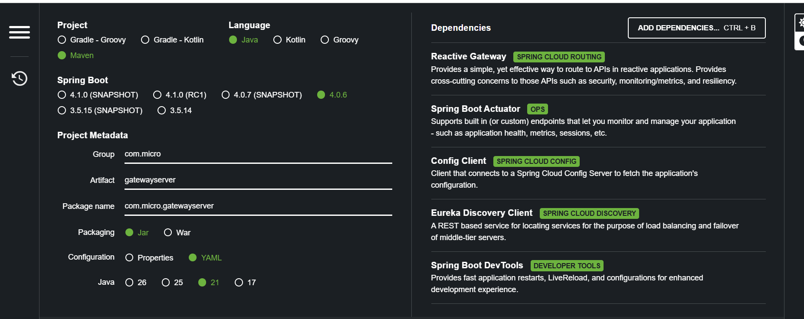
* The above are the dependencies that we need to add.
* We added eureka discovery client so that our gateway sever has idea of where the service discovery is registered .
* Config client is added as we need to fetch the configs for the gateway using the configserver.
* Lets also add the google jib plugin into the pom.xml of gateway server so that it would be easy for us to generate the image.
* Lets start editing the application.yml of the gateway server.
* 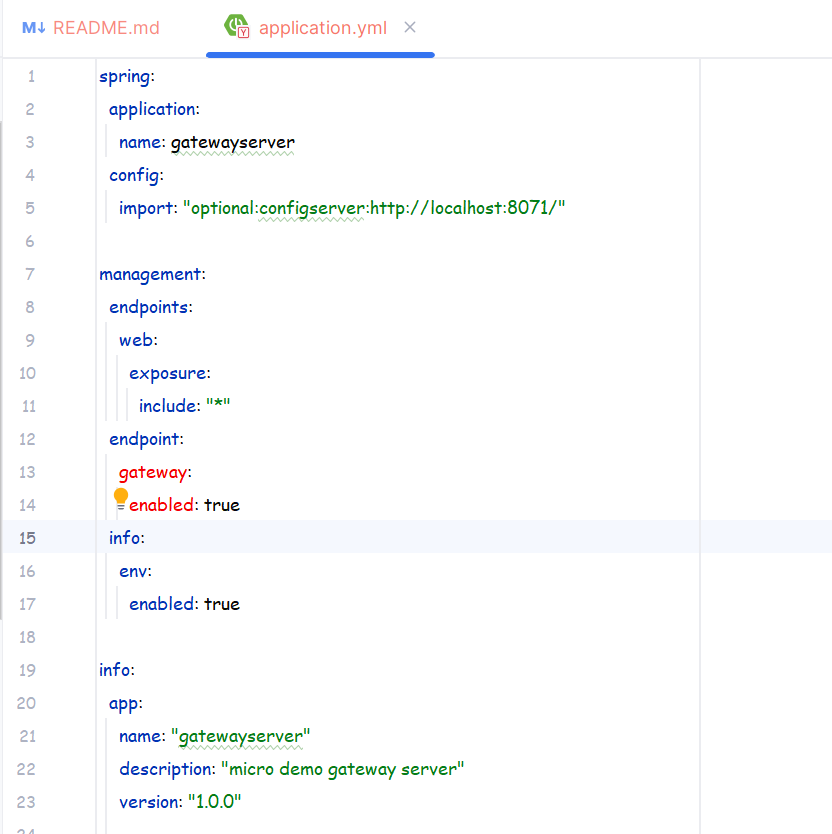
* These are some of the basic properties for our api gateway , the main one here is the config.import as we will be importing rest of the properties from the github.
* We have enabled all the management related endpoints as well as some gateway related endpoints.
* We have not written here profiles:active default/qa/prod as for our project we will be having only one yml file for the configserver in the github.
* But in real projects teams are going to have different different profiles.
* 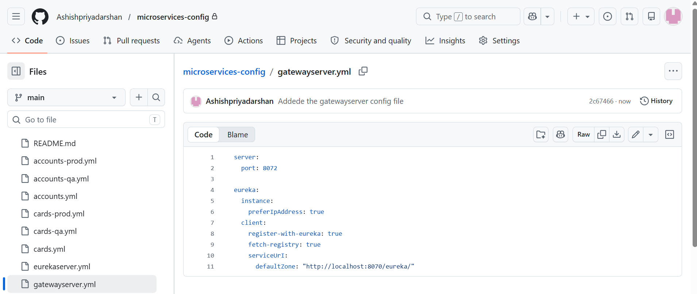
* As can be seen we have given it the port 8072 and then we have also given it instructions to register itself with the service discovery .
* So that it can fetch all the information from the service discovery.
* Now it will act just like any other microservice like it will get registered in the service discovery but will it forward the incoming external clients requests to the desired microservices ?
* No it will not.
* We still need to provide some more information and for that we need to provide some information in the gatewayserver's applcation.yml.
* With the above statements we are telling to the gateway to connect with the discovery server/service and locate all the details about the individual microservices , Once it locates all the details now it will forward all the external requests from the client to the individual microservices.
* 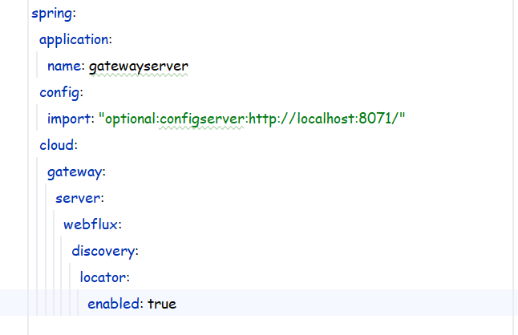
* This property actually takes up all the services registered with eureka and automatically creates routes to them without us manually routing.
  * Suppose we have accounts ms instances in eureka server so it will take all the instances and create routes on its own.
  * Now if a user hits : http://localhost:8072/ACCOUNTS/**
  * It will directly forward the request to the IP of the accounts service , so we dont have to manually do the routing .
  * We will see all the routes , when we start the gateway server and the service discovery and register some services with the eureka server.
  * Then upon hitting actuator/gateway/routes we will see all the routes that it has automatically routed.
  * As we have exposed the management:endpoint:gateway:enabled true .
  * 

## Validating the Gateway:
* Now as we have created our gateway now it is time for us to check whether the gateway is working or not.
* So for this lets starts our app in the given sequence: ``configserver->EurekaServer->All 3 microservices -> Gateway Server``
* 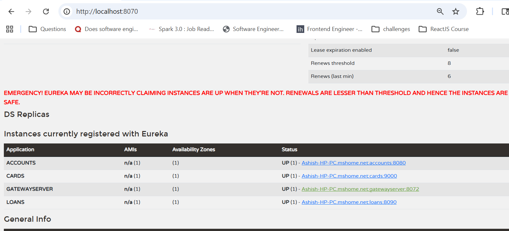
* See as soon as we started the apps in the proper sequence this is what is being shown inside the Eureka server .
* Now lets check the ``/actuator`` url of the gateway server. And observer what are the management endpoints it is exposing .
* But before that let me show you one very important thing:
  * Whenever you start any springboot application it says Tomcat started on port and then port info.
  * for example: 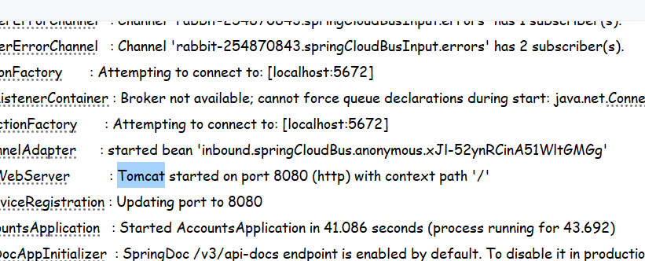
  * But Now when we have started the gateway server which has the reactive gateway dependency .
  * 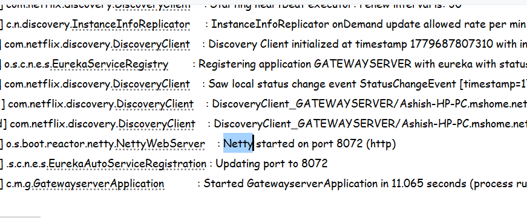
  * See here we have the Netty server that is working here instead apache tomcat server.
* So as soon as we hit the gatewayIP/actuator so we are getting a list of URL endpoints exposed by the actuator.
* 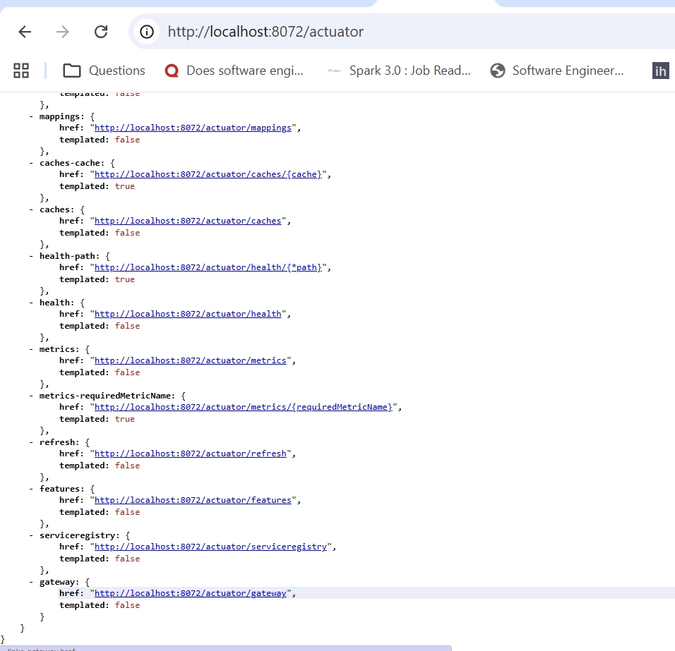
* Now if you go to actuator/gateway then again we see lots of urls.
* 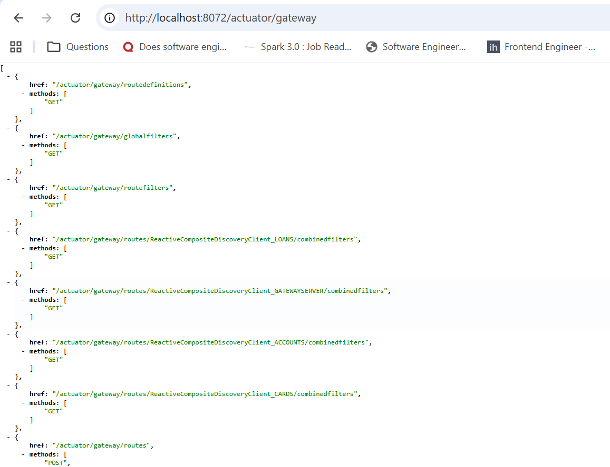
* Now lets go to ``actuator/gateway/routes``
* 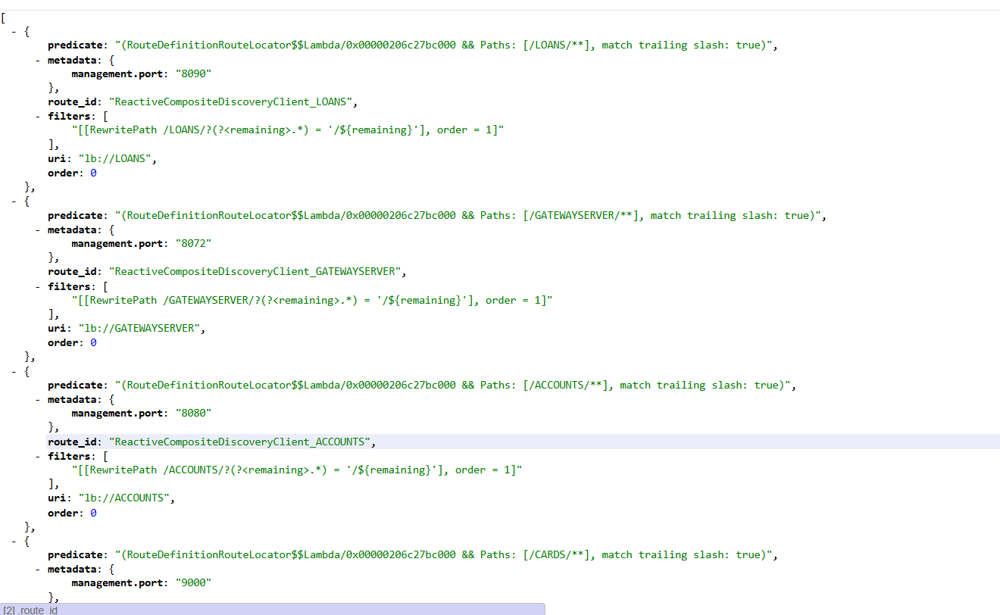
* 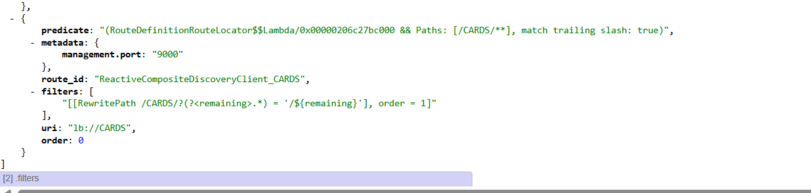
* See how it is generating routes for all the services that it found inside the eureka service registry.
* We are not even manually routing anything still it making routes for all of them.
* It is performing some default predicates and filtering too for each of the routes.
* In predicates it is trying to match the incoming http request .
* filters: it is removing the first word of every http which is after localhost:8072.
* for example for us to send requests via gateway server we have to use.
* ``http://localhost:8072/ACCOUNTS/api/fetch?mobileNumber=9876543210``
* When this http request is recieved by the gateway it matches the predicates , like the actual matching starts from,
* /ACCOUNTS/api/fetch?mobileNumber=9876543210 .
* So the filter before sending the request to the ACCOUNTS will remove this ACCOUNTS from the URL and then send the api/fetch?mobileNumber=9876543210 to the IP of Actual ACCOUNTS microservice.
* uri: "lb://ACCOUNTS" this is what the gateway uses to get the info of all the instances of ACCOUNTS from the service registry.
* ### Now lets validate if the microservices can be accessed using gateway or not:
  * Lets try with the ACCOUNTS microservice.
  * Open postman and hit the URL ``http://localhost:8072/ACCOUNTS/api/create``
    * with a json body : 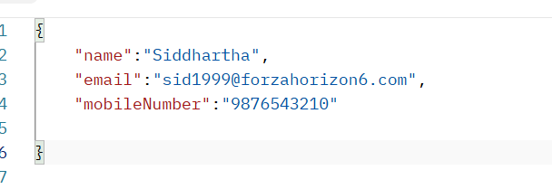
    * Method should be POST:
    * 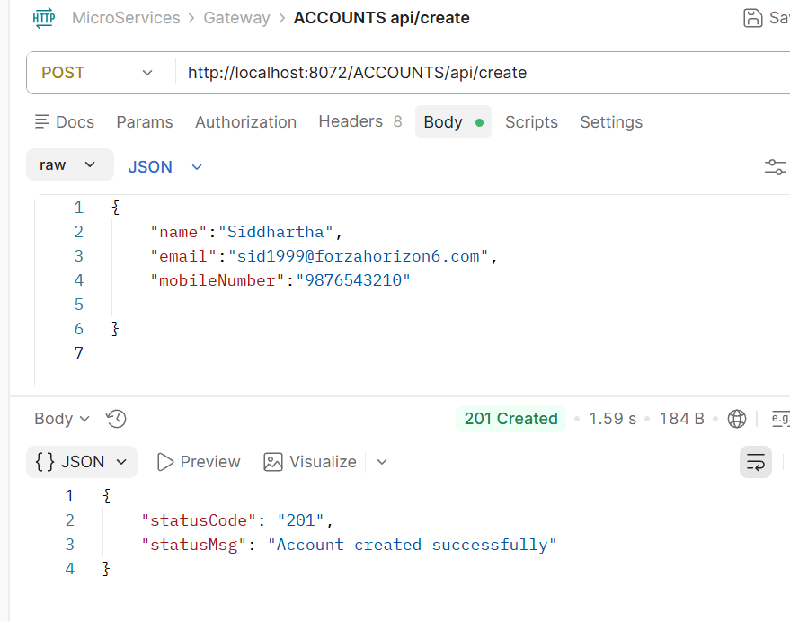
    * See we got a success response .
    * Lets validate this using the fetch api of the ACCOUNTS using gateway and then we will use the fetch via accounts URL only and also check in the H2.
      * ``localhost:8072/ACCOUNTS/api/fetch?mobileNumber=9876543210``: 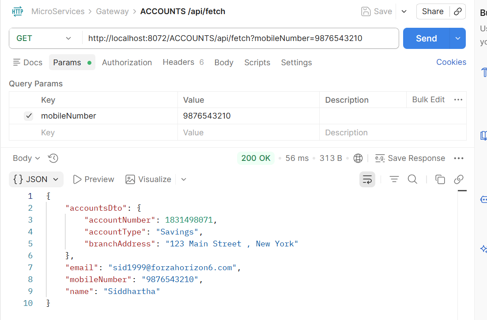
      * ``localhost:8080/api/fetch?mobileNumber=9876543210``: 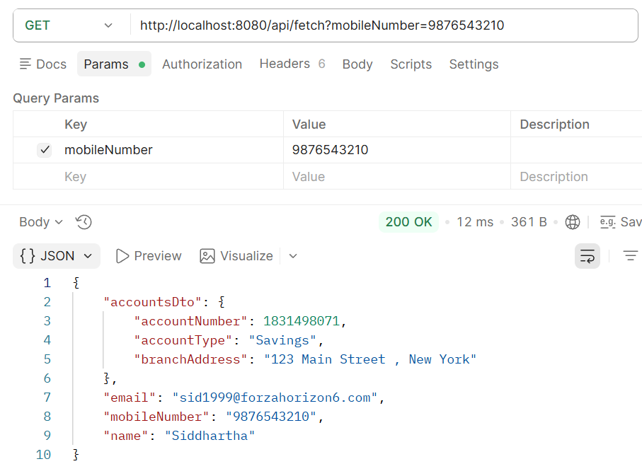
      * H2 of Accounts: 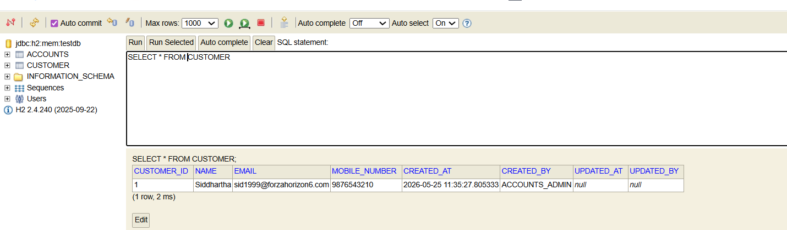
    * SO it is now validated that everything is working as expected .

### 1st Commit: In the upcoming lectures we will learn more about manual routing .
### Commit Message: "Gateway Server | Explained the Internal Architect of Spring CLoud Gateway | Netty Server| Demonstrated creation and working of Gateway Server"

### Accepting Service names with lowercase letters:
* Till now whatever URL we are trying to access we are using block letters for the service name like:
* ``localhost:8072/ACCOUNTS/api/fetch?mobileNumber=9876543210``
*  ``localhost:8072/LOANS/api/fetch?mobileNumber=9876543210``
*  ``localhost:8072/CARDS/api/fetch?mobileNumber=9876543210``
* This looks really bad and do you want your client applications to send the request to a URL like this .
* I mean this is the ideal behaviour of the gateway server but we can overcome this .
* By using a property inside the application.yml that is : lower-case-service-id
* 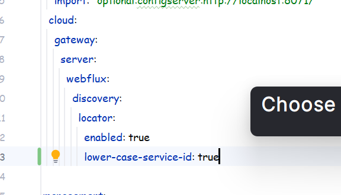
* Now try to hit the URL with both Uppercase as well as lower case .
  * UpperCase: 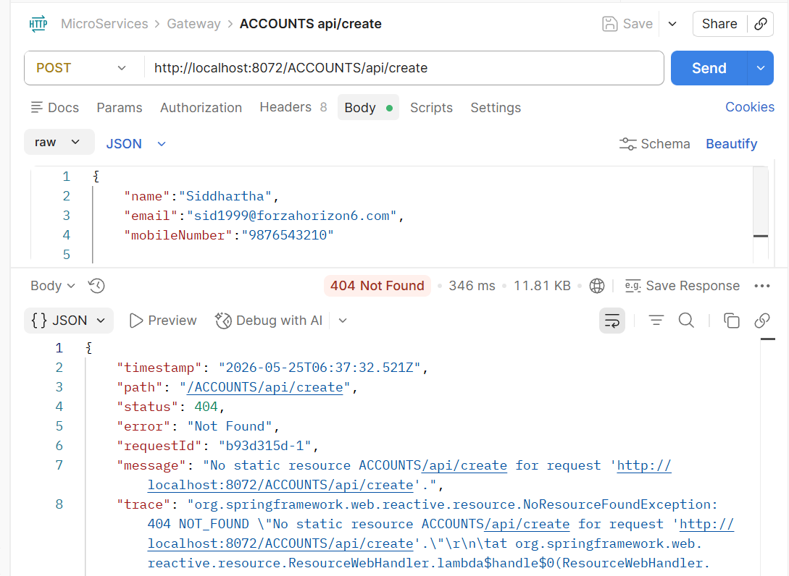
  * lowerCase: 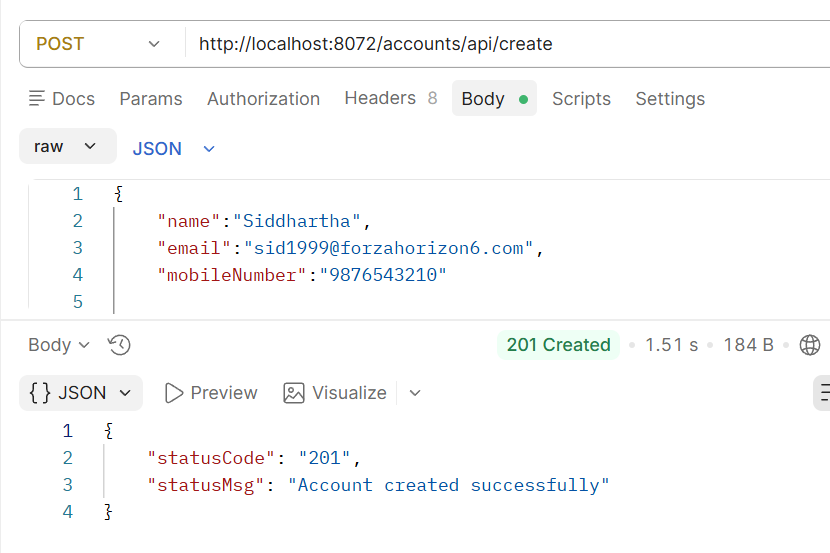
  * See how the lowercase is working fine.
* Lets check the /actuator/gateway/routes to see how it forms the URL for incoming lowercase http requests:
* 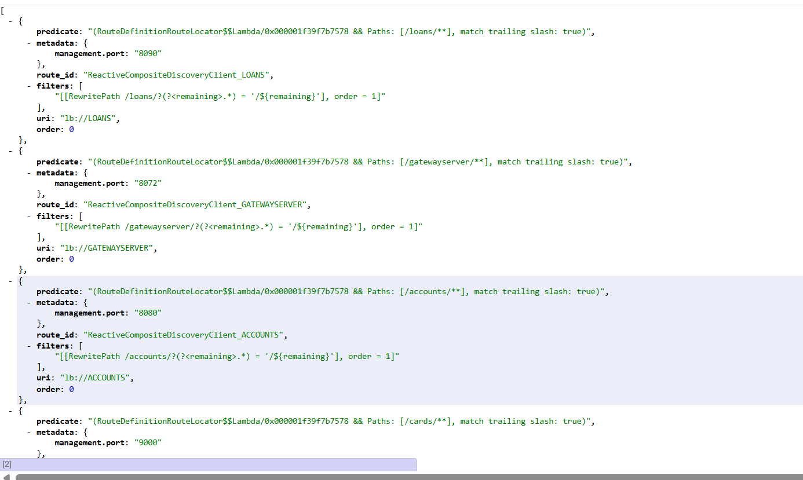 
* See how the lowercase letter service name are showing up here.

### 2nd Commit: In the Upcoming lectures we will learn more about manual routing.
### Commit Message: "Made changes in the application.yml to accept lowercase letters in the URL"

## Manually Routing the requests:
* There are two ways in which we can manually route the incoming http requests.
* One of them is writing the configs inside the application.yml which you might have seen in most of the images attached above in this lecture.
* The 2nd one is creating bean of RouteLocator and giving all the required information inside it.
* The 2nd one is used widely by developers as it gives more flexibility to introduce more custom predicates and filters.
  * ### Steps to create Routing inside the bean of RouteLocator:
    * First create a folder config.
    * Inside the config folder create a class GatewayConfig: or whatever name you want.
    * Now give it the annotation of @Configuration and then create a function whose return type is going to be RouterLocator.
    * 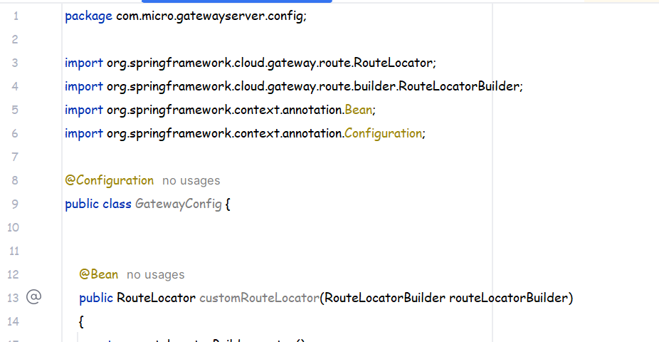
    * Now lets create some routes inside the function:
    * 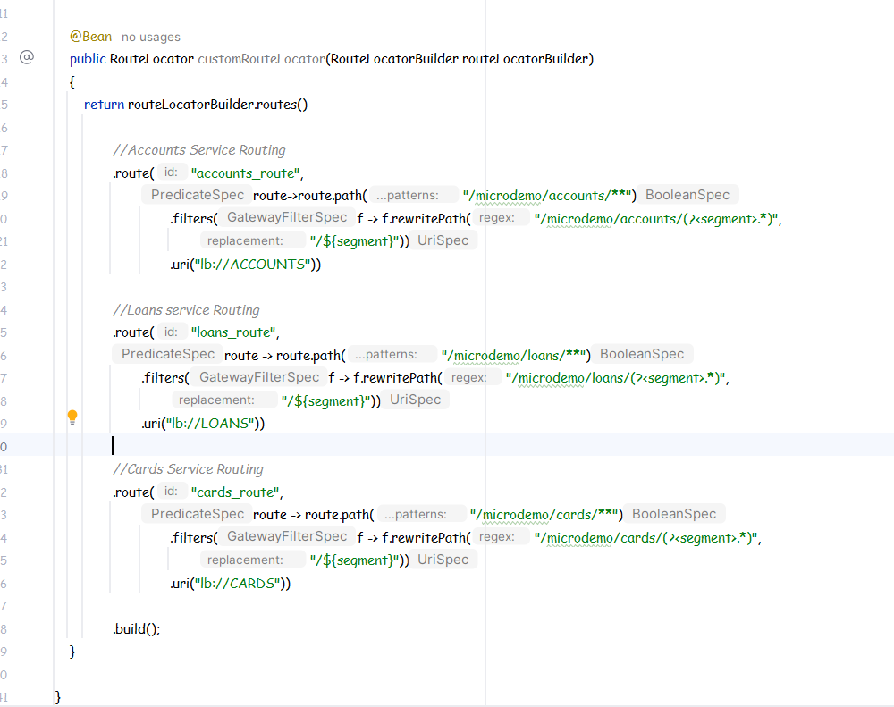
    * See the above image this is how we create different routes , the fashion in which we are writing the code here looks pretty similiar to create custom security configs.
    * Now let me explain each and every line :
      * 
      * The details about each and every line has been explained clearly.
      * 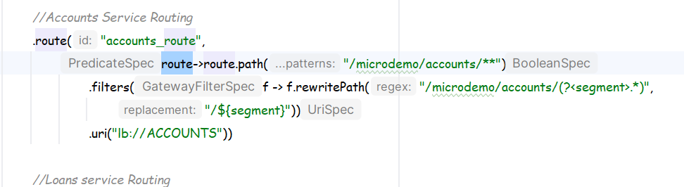
      * Here the route->route.path is not same as the .route() above because inside we are using a lambda function and we can use r or anything else instead of that route->route.path.
      * Lets see how are our URL's getting exposed in the actuator/gateway/routes .
      * 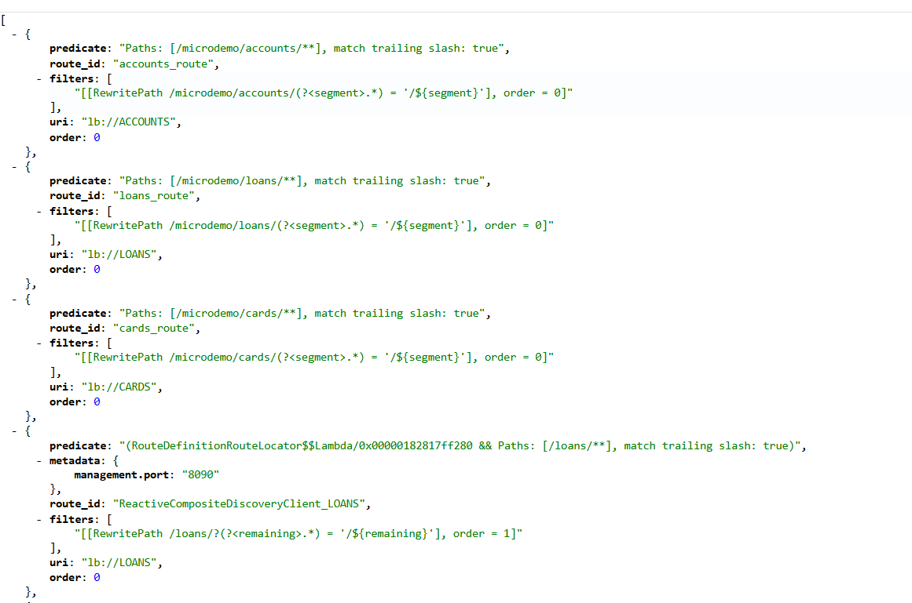
      * 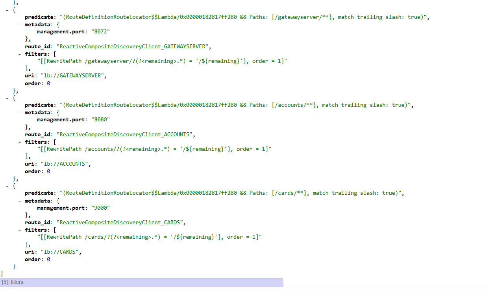
      * This is how the /gateway/routes looks now but if you observer one thing then even after mentioning our custom route still we are getting the auto configured routes by gateway server.
      * for example:
        * 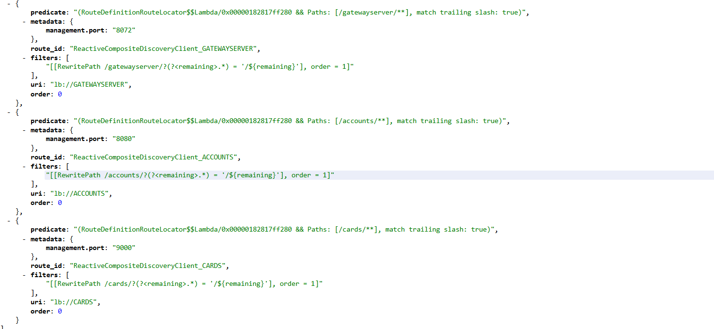
        * Even if a client wants then they can still hit the localhost:8072/accounts/** and still they would get redirected to the actual instance of ACCOUNTS.
      * It is happening because we have set a property true that is :
        * 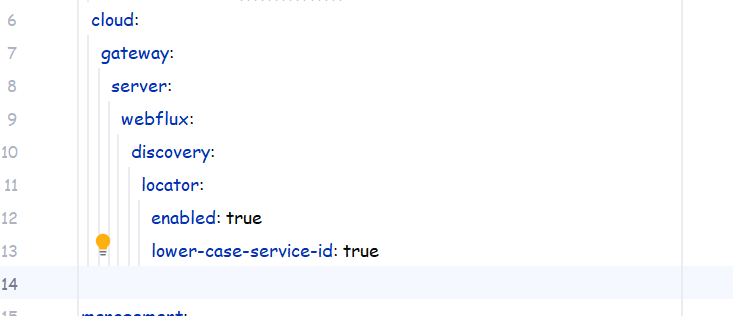
        * Change the value here from true to false then again run the edge server.
        * 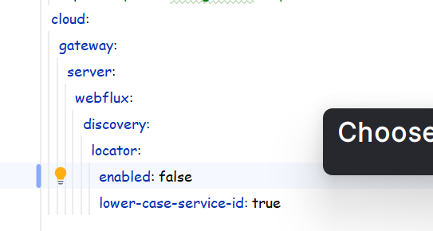
      * Now lets hit localhost:8072/gateway/routes :
        * 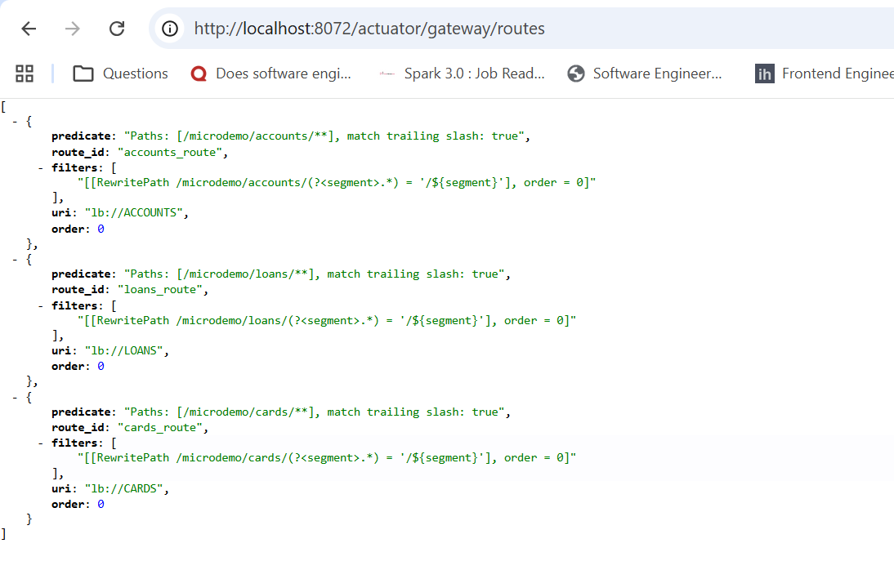
        * See no more autoconfigured routes.

### 3rd Commit: In the Upcoming lectures we will see how we can have some custom filters added.
### Commit Message: "Created Custom Routes using RouteLocator"

### Adding Response Header filter to the route:
* For this just go through the official documentation and look for adding response header filter.
* 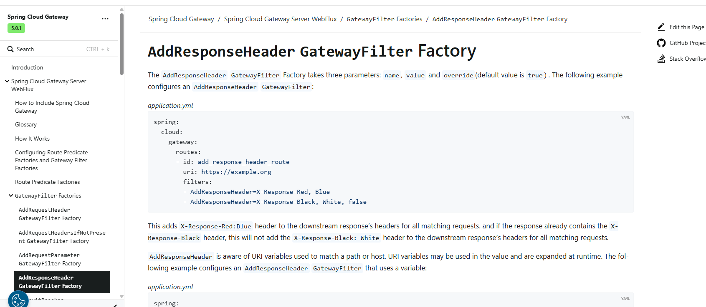
* Well this is the yml config one .
* But we need the java dsl one right .
* So for that lets work on our current code.
* 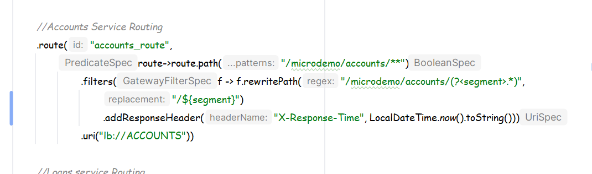
* Well this is how you add multiple filters like 
* ``.filters(f->f.firstfilter().secondfilter().thirdfilter().andso on)``
* We have used the AddResponseHeader filter here to send a header value in the http response like we are going to send the Current LocalTime.
* Replicate the same to other routes too.
* Now start the edge server and use postman to send some request and then observe the incoming request .
  * 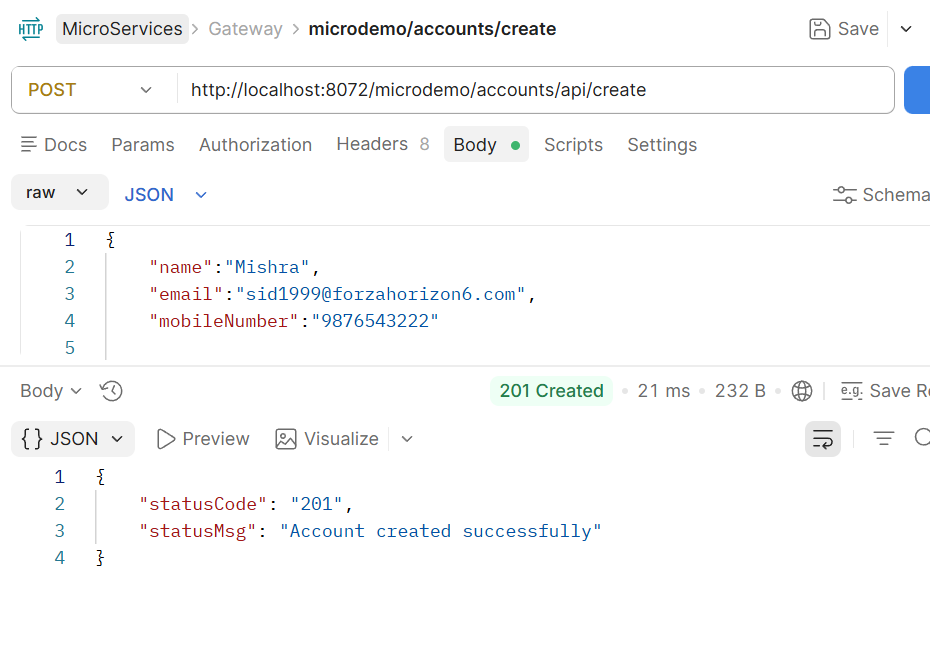
  * 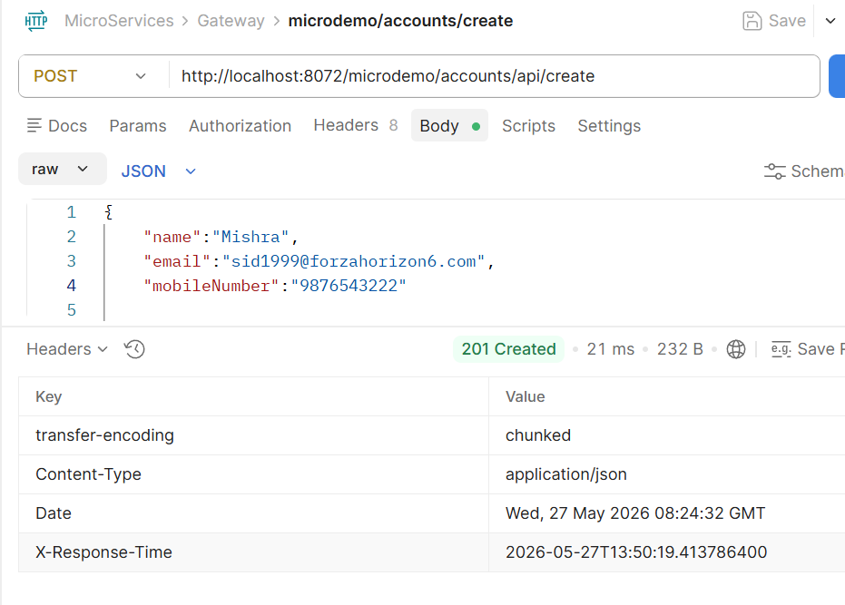
  * In response select headers and see the added filter that we are getting as a response.

### 4th Commit: In the Upcoming lectures we will see how we can have some custom filters added.
### Commit Message: "Demonstrated how to add a response header filter"
