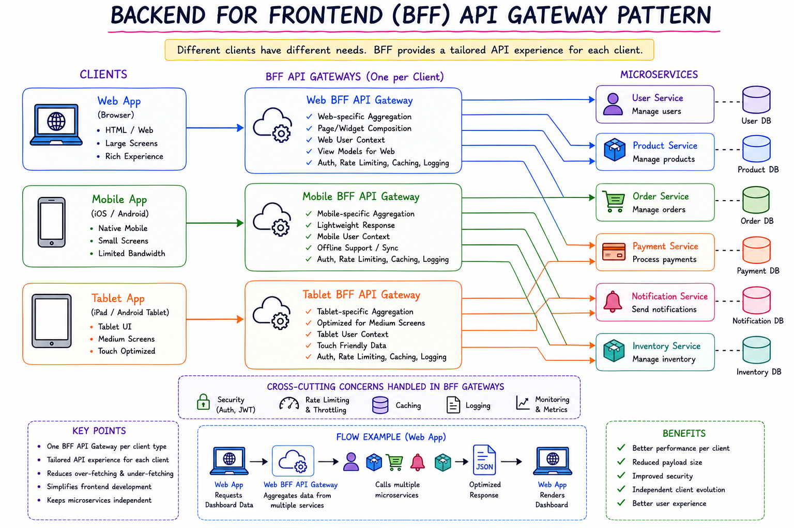

# API GATEWAY Design Patterns:
* API Gateway is a critical architectural component in microservices design , offering a unified entry point for the multiple microservices.
* It Acts as a gateway between the external clients (eg: web apps, mobile apps) and the internal microservices , helping streamline communication , security and routing.
* This pattern is essential when managing the complexities of microservice-based applications.

### Gateway Routing Pattern:
* It is a design pattern used in the microservices architectures where an API GATEWAY routes incoming client requests to the appropriate backend microservices based on various factors like the URL , headers or request parameters.
* 
* This is the pattern that we have been following.

### Gateway Offloading pattern:
* The gateway offloading pattern is an architectural pattern used in microservices to offload certain cross-cutting concerns - such as security , caching , rate limiting , and monitoring  - from individual microservices to the api gateway.
* This pattern helps centralize and simplify the implementation of these concerns, allowing the microservices to focus solely on business logic.
* 
* 

### Backend for Frontend Pattern (BFF)
* The BFF design pattern used in the microservices architectures where a seperate backend service is created for each client type ex: mobile app , web app , tablet app etc .
* Each frontend client has its own specialized backend to optimize communication between frontend and the microservices, providing a tailored experience for different clients.
* In this pattern the microservices will remain same but there will be multiple api's for multiple types of clients.
* As per the client type the request will be forwarded to the specific gateway and filterations will be done there then the request is forwarded.
* Ex: Web app gateway can send high quality images , where as for mobile apps which dont hv big screens so the image quality and size may be chopped .
* See how we are filtering.
* 

### GATEWAY Aggregator/Composition pattern:
* In this microservices architecture , a gateway aggregator or gateway composition pattern is used when a request from a client needs to retrieve or process data from multiple backend microservices. Instead of having the client make multiple calls to various microservices, the gateway consolidates the requests into a single response.
* Suppose your clients need the information of Accounts , Loans and Cards which are handled by different microservices.
* So one approach is the client will send the request to the gateway but 3 times with 3 different URL's for 3 microservices .
* Which is ok but very slow.
* Another approach is instead of client sending 3 requests , the client just needs to invoke one api which will hit the api gateway and now it is the task of the api gateway to call the 3 microservices get the response from all the microservices.
* Then consolidate all 3 of them to form a response and send it back to the client.
* 
* 