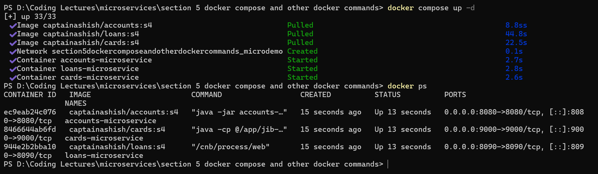
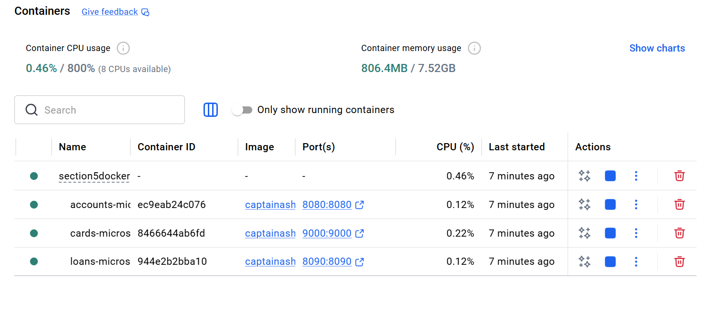
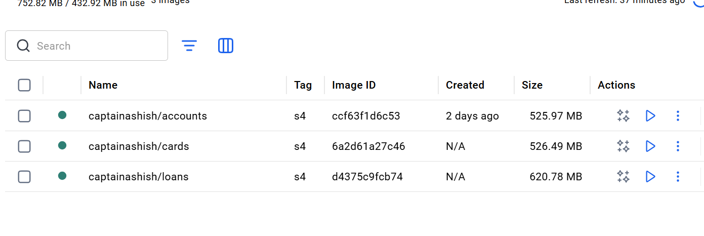
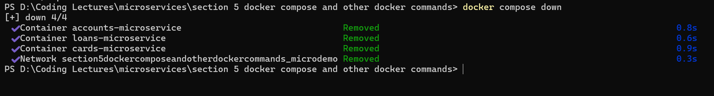
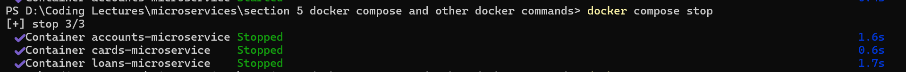
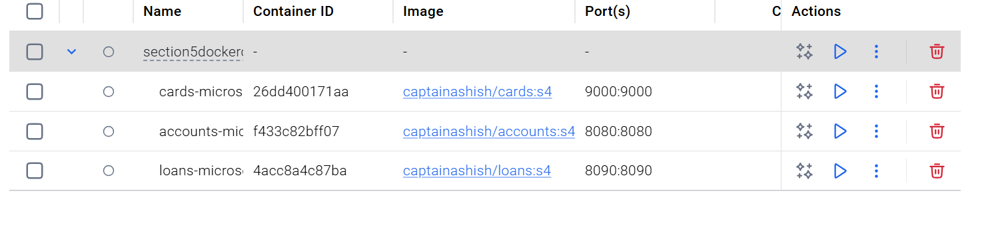
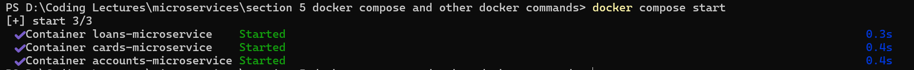

# 🐳 Docker Compose - Complete Guide (Beginner to Practical)

## 🚀 What is Docker Compose?

Docker Compose is a tool that allows you to **run and manage multiple Docker containers together** using a single configuration file.

👉 In simple terms:
If you have multiple services (like microservices), instead of running each container manually, you define everything in one file (`docker-compose.yml`) and start all services with a single command.

---

## 📁 What is docker-compose.yml?

It is a YAML configuration file where you define:

* What services to run
* Which Docker images to use
* Port mappings
* Networks
* Resource limits

👉 It helps you **orchestrate an entire system easily**

---

## 🧱 Basic Structure

```yaml
services:
  service_name:
    image: image_name
    container_name: container_name
    ports:
      - "host_port:container_port"
    networks:
      - network_name

networks:
  network_name:
    driver: bridge
```

---

## 🔍 Key Configurations Explained

### 🔸 services

Defines all the containers (applications) you want to run.

---

### 🔸 image

Specifies which Docker image to use.

```yaml
image: captainashish/accounts:s4
```

* `captainashish/accounts` → image name
* `s4` → version/tag

---

### 🔸 container_name

Gives a fixed name to the container.

```yaml
container_name: accounts-microservice
```

👉 Helps in debugging and easier identification

---

### 🔸 ports

Maps ports between host and container.

```yaml
ports:
  - "8080:8080"
```

Format:

```
HOST_PORT : CONTAINER_PORT
```

---

### 🔸 networks

Connects containers so they can communicate.

```yaml
networks:
  - microdemo
```

---

### 🔸 deploy (optional)

Sets resource limits like memory.

```yaml
deploy:
  resources:
    limits:
      memory: 700m
```

---

### 🔸 networks (bottom section)

```yaml
networks:
  microdemo:
    driver: bridge
```

👉 `bridge` is the default Docker network (like a private LAN)

---

## 🧪 Example (Microservices Setup)

```yaml
services:
  accounts:
    image: captainashish/accounts:s4
    container_name: accounts-microservice
    ports:
      - "8080:8080"
    networks:
      - microdemo

  loans:
    image: captainashish/loans:s4
    container_name: loans-microservice
    ports:
      - "8090:8090"
    networks:
      - microdemo

  cards:
    image: captainashish/cards:s4
    container_name: cards-microservice
    ports:
      - "9000:9000"
    networks:
      - microdemo

networks:
  microdemo:
    driver: bridge
```

---

## ⚡ Important Commands

### ▶️ Start all services

```bash
docker-compose up
```

👉 What it does:

* Checks if images exist locally
* If not → pulls them automatically
* Creates containers
* Starts all services

---

### ▶️ Run in background

```bash
docker-compose up -d
```

---

### ⛔ Stop and remove everything

```bash
docker-compose down
```

---

### 🔄 Restart all services

```bash
docker-compose restart
```

---

### 📦 View logs

```bash
docker-compose logs
```

---

### 📊 List running containers

```bash
docker-compose ps
```

---

## 🎯 Managing Individual Services (Very Important 🔥)

### ▶️ Start a specific service

```bash
docker-compose up accounts
```

👉 Only starts `accounts` service

---

### ▶️ Run a specific service in background

```bash
docker-compose up -d loans
```

---

### ⛔ Stop a specific service

```bash
docker-compose stop cards
```

---

### ▶️ Start a stopped service

```bash
docker-compose start cards
```

---

### 🔄 Restart a specific service

```bash
docker-compose restart accounts
```

---

### ❌ Remove a specific service container

```bash
docker-compose rm cards
```

👉 Removes container (won’t delete image)

---

### 🧹 Force remove (without prompt)

```bash
docker-compose rm -f cards
```

---

### 🛑 Stop + remove single service (safe way)

```bash
docker-compose stop loans
docker-compose rm loans
```

---

## 🔥 Important Note

👉 Even if images are NOT present in your system:

```bash
docker-compose up
```

✔️ Docker will:

* Automatically pull all required images from Docker Hub
* Create containers
* Run them based on your configuration

---

## 💡 Why Use Docker Compose?

✅ Run multiple services with one command
✅ Simplifies microservices setup
✅ Automatic networking
✅ Faster development & testing
✅ Clean and maintainable configuration

---

## 🧠 Final Understanding

👉 Docker Compose = **multi-container orchestration tool**

> One file + one command = full system running 🚀

---

If you want to level up next:

* Add API Gateway
* Add database (MySQL/Postgres)
* Use environment variables
* Move towards production-ready setup

### some screenshots :

running containers below:

images:


stopping all the docker containers and it also removes them:


just to stop the running containers you can use below:

The containers are still present they are just stopped :


if you want to start:



### Final Note:
Try to look for extensions always install the logs explorer that will help you to a great extent.