# 📘 Configuration Management in Spring Boot and Different ways of taking up values

## 🚀 What is Configuration Management?

Configuration management in Spring Boot refers to the way an application handles external settings such as:

* Database credentials (URL, username, password)
* API keys
* Server ports
* Feature flags
* Environment-specific values

Instead of hardcoding these values into the code, Spring Boot allows you to **externalize configurations**, making your application more flexible and production-ready.

---

## ❓ Why is Configuration Management Needed?

Without proper configuration management:

* ❌ You would need to change code for every environment
* ❌ Risk of exposing sensitive data (like passwords)
* ❌ Difficult to maintain and scale

With configuration management:

* ✅ Clean separation of code and configuration
* ✅ Easy environment switching
* ✅ Secure handling of secrets
* ✅ Supports **“Build Once, Deploy Anywhere”**

---

## 🌍 Different Environments

In real-world applications, we usually have multiple environments:

| Environment           | Purpose                       |
| --------------------- | ----------------------------- |
| **Development (dev)** | Local development and testing |
| **Testing (test)**    | QA testing                    |
| **Staging (stage)**   | Pre-production environment    |
| **Production (prod)** | Live system used by users     |

Each environment has **different configurations**:

* Different databases
* Different API endpoints
* Different logging levels

---

## 🛠️ Ways to Access Configuration in Spring Boot

### 1. 🔹 Using `@Value`

```java
I have demonstrated below how to use the value annotation.
```

In your application.proprties create some random variables:
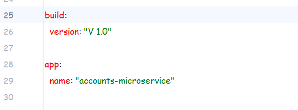
Now in your controller layer:
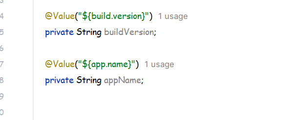
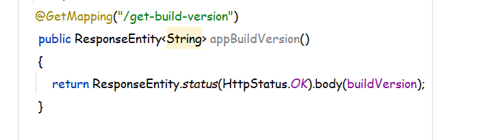
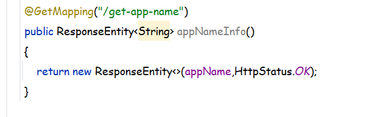

### ✅ Pros:

* Simple and quick
* Good for small use cases

### ❌ Cons:

* Not type-safe
* Hard to manage large configs
* Scattered across code

---

### 2. 🔹 Using `Environment` Interface

```java
@Autowired
private Environment env;

String port = env.getProperty("JAVA_HOME");

For this check your system environment variables or create a new variable .
Suppose you have java installed in your local then .
system variable with name JAVA_HOME will correspond to the path where the java app is present.
        
```
example:

do the above code in your controller layer or wherever you want to use it.
Then do the below code.
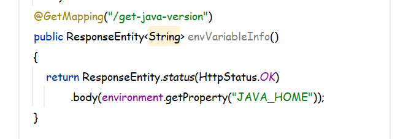

### ✅ Pros:

* Dynamic access
* Useful in conditional logic

### ❌ Cons:

* Still not type-safe
* Not clean for large configs

---

### 3. 🔹 Using `@ConfigurationProperties` (🔥 Recommended)

```java
@ConfigurationProperties(prefix = "app")
@Component
public class AppConfig {
    private String name;
    private String version;
}
```
The below is not a class it is a Record used just to store values during its obj creation.
It comes with inbuild getters only no setters.
The annotaion that we are using is to create a bean of this type and register the values in it 
from the application.properties where the property starts with accounts.
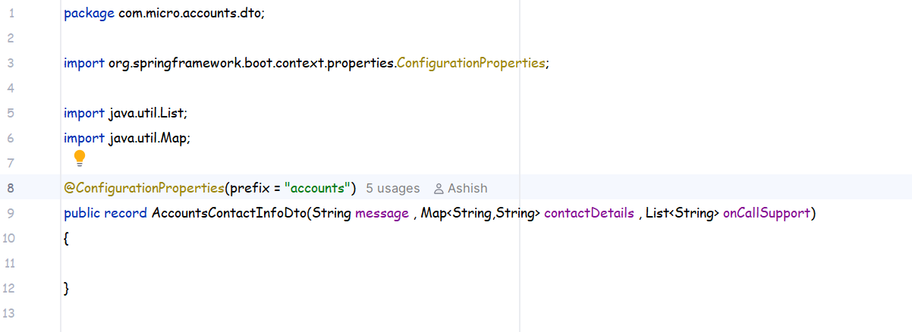
Write the below into your YML now the Record class will try to Map all the props into the AccountsContactInfoDto
make sure the record argument list is in sequence with whatever you have mentioned in the application.yml

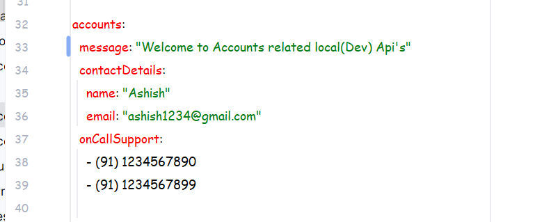
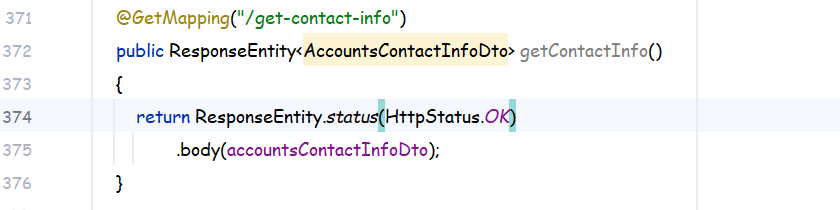
At last on top of your main class write the below code:
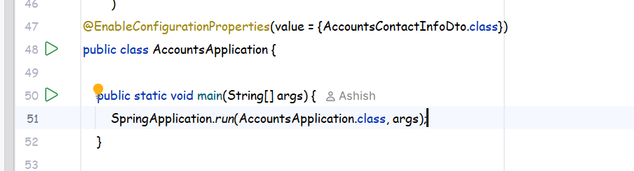
The above will be responsible to create your bean of AccountsContactInfoDto

### Required Setup:

* Add dependency (if needed):

```xml
<dependency>
    <groupId>org.springframework.boot</groupId>
    <artifactId>spring-boot-configuration-processor</artifactId>
</dependency>
```

* Enable it:

```java
@EnableConfigurationProperties
```

### ✅ Pros:

* Type-safe
* Clean and structured
* Best for large configs
* Easy to maintain

### ❌ Cons:

* Slightly more setup

---

## 🏆 Which Approach is Used in Real World?

👉 **`@ConfigurationProperties` is the industry standard**

Because:

* Clean code structure
* Scalable
* Easy to manage complex configurations

👉 `@Value` is used only for **small or quick values**

---

## 🔄 Configuration Priority Order

When Spring Boot loads configurations, it follows this priority (highest → lowest):

1. 🥇 Command Line Arguments (CLI)
2. 🥈 JVM System Properties
3. 🥉 Environment Variables
4. 📄 `application.properties` / `application.yml`
5. 📦 Default values in code

👉 Example:

```bash
java -jar app.jar --server.port=9090
```

This will override everything else.

---

## 🧠 Why “Build Once, Configure per Environment”?

Instead of rebuilding your app for every environment:

* Build **once**
* Deploy same JAR everywhere
* Change only configurations

### Benefits:

* ✅ Faster deployments
* ✅ Consistency
* ✅ Less risk of bugs

---

## ⚙️ Spring Profiles

Spring Boot allows you to define environment-specific configs using **profiles**.

### Example:

```
application-dev.properties
application-prod.properties
```

---

## 🛑 Setting Profile in `application.properties` (Not Recommended)

```properties
spring.profiles.active=dev
```

### ❌ Drawbacks:

* Hardcoded environment
* Not flexible
* Requires rebuild to change

---

## ✅ Setting Profile at Runtime (Best Practice)

### 🔹 Using CLI

```bash
java -jar app.jar --spring.profiles.active=prod
```

### 🔹 Using JVM Argument

```bash
java -Dspring.profiles.active=prod -jar app.jar
```

### 🔹 Using Environment Variable

```bash
export SPRING_PROFILES_ACTIVE=prod
```

---

## 💡 Best Practices

* ✅ Never hardcode credentials
* ✅ Use `@ConfigurationProperties` for structured configs
* ✅ Use environment variables for secrets
* ✅ Always use runtime profile switching
* ✅ Follow “Build Once, Deploy Anywhere”

---

### Lets see how we can create different profiles in the app and use them.

First we will learn how to use them manually then we will see what are the demerits of manually setting the profile.

* 1st Step: 
  create 2 files with the name application_prod.yml and application_qa.yml
as per our requirment we are having 3 env one is dev then qa then prod.
The dev env configs are inside the application.yml so we are not creating any extra config file.
But ideally each env has seperate files.
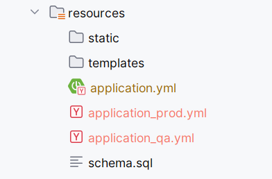
* Now let us first set our default dev env configs:
* application.yml file
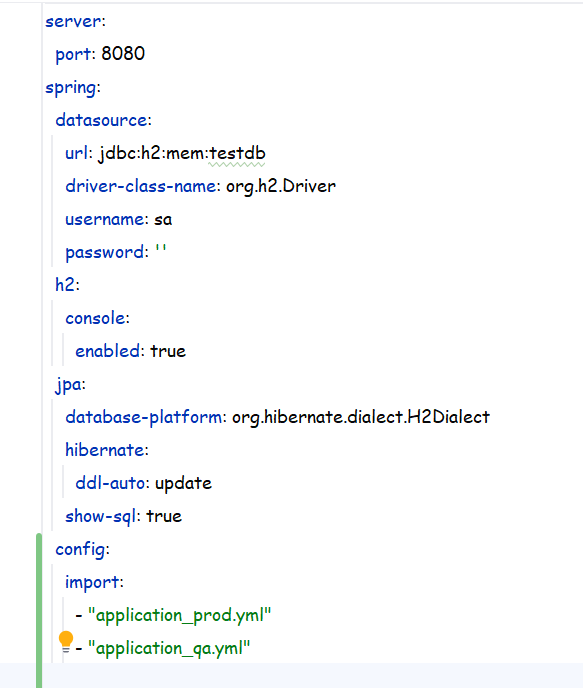
!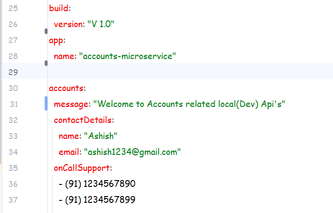
* There are some props which will be same accross all the env in our case those are in blue color in the above config .
* application_qa.properties:
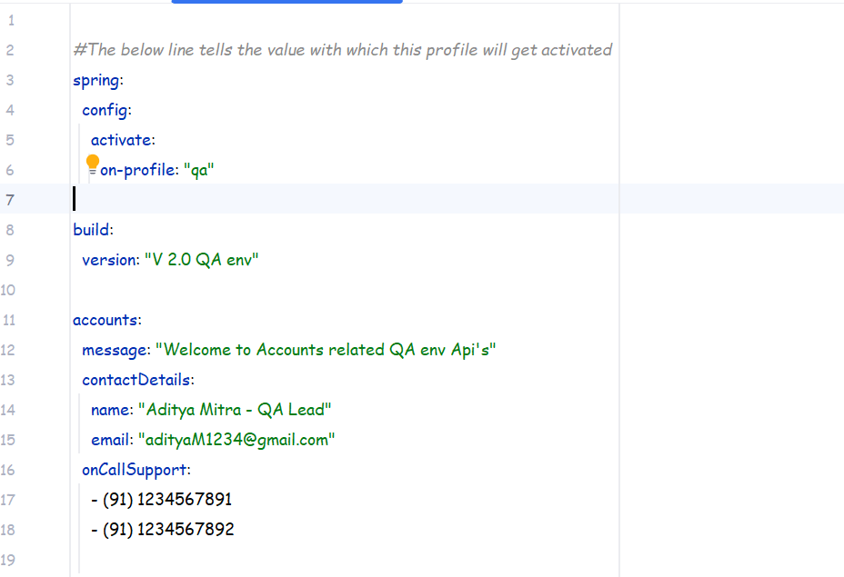
* application_prod.yml
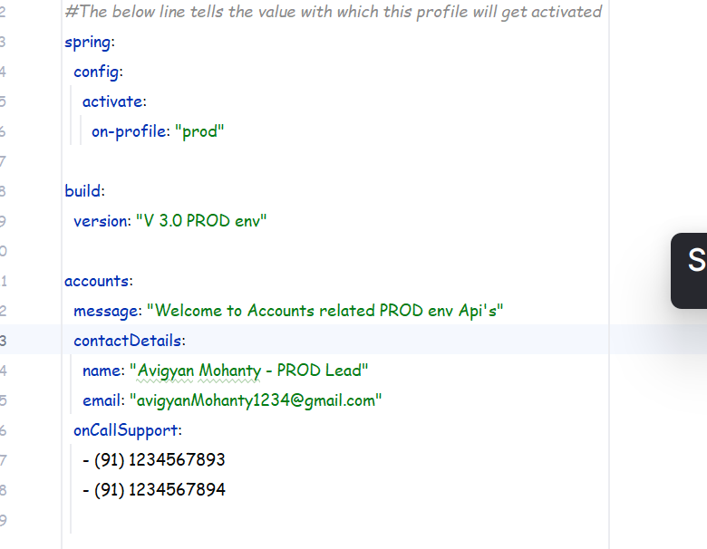
* Now we have set all the configs of different env for demonstration.

### By default springboot will always load the default application.yml/properties file unless we mention the environment to be loaded.

### Let me show yu how it is done manually:

The biggest disadvantage of manually setting the profiles inside the application.yml is that 
it gets hardcoded and when you will create the docker image or jar file of it then at that time it will only work in one 
specific env who's profile is active means suppose your active profile is dev then when you create a image or jar
and deploy it to some other env suppose qa there it might cause problem.

* lets see below
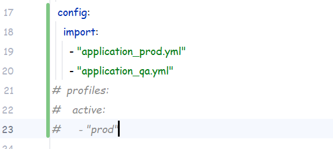
here i have not mentioned any active profile so lets run 
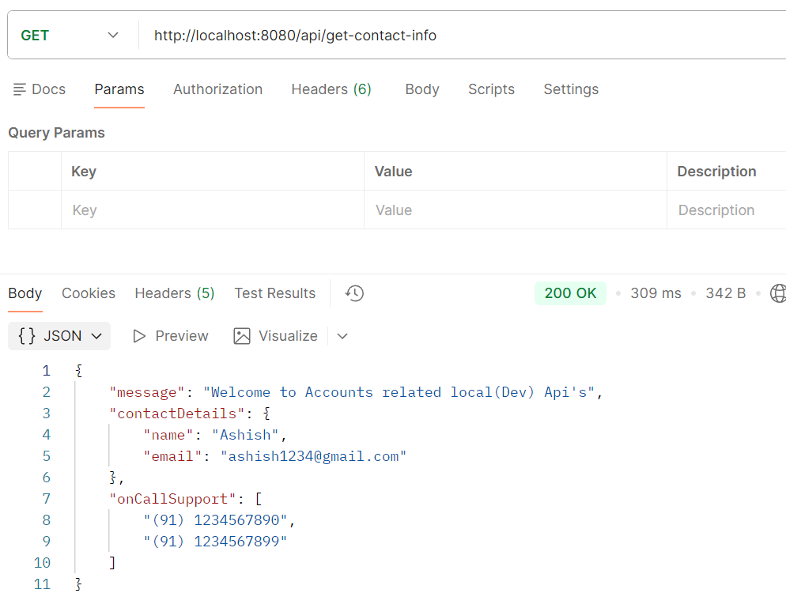
see the above op that i am getting.
* suppose let me activate a profile:
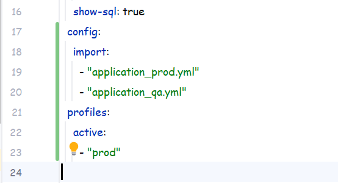
* See the below OP this time i got this
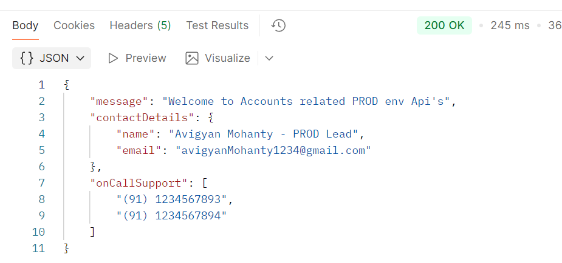


### Lets look at the priority of ways in which we can set arguments:
* For this first let me make some more yml files for prod , dev , stage and qa env .
* 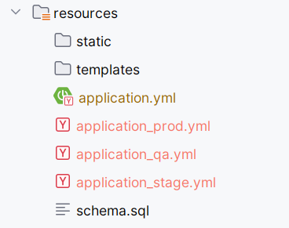
* Now let me show you the details that are present inside each yml file.
* ## 📸 Environment Screenshots

| Dev                                                                | Stage                                  | QA                        | Prod                                 |
|--------------------------------------------------------------------|----------------------------------------|---------------------------|--------------------------------------|
| 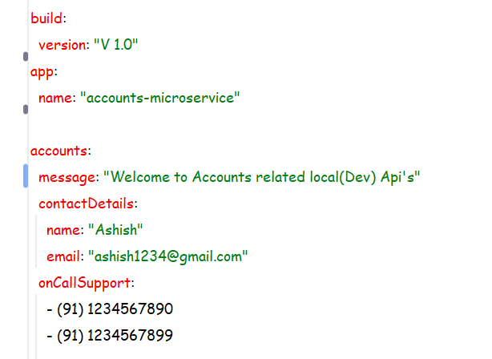 | 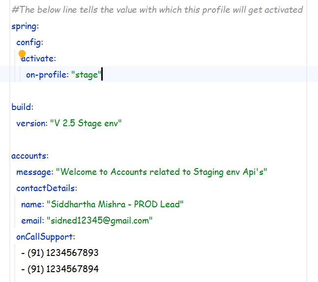 | 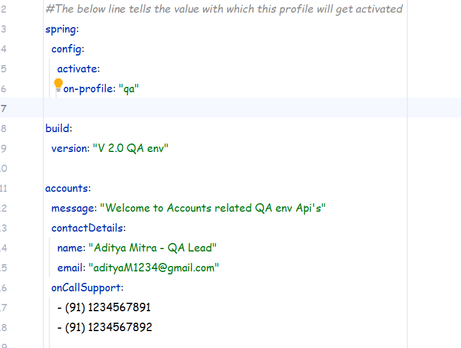 | 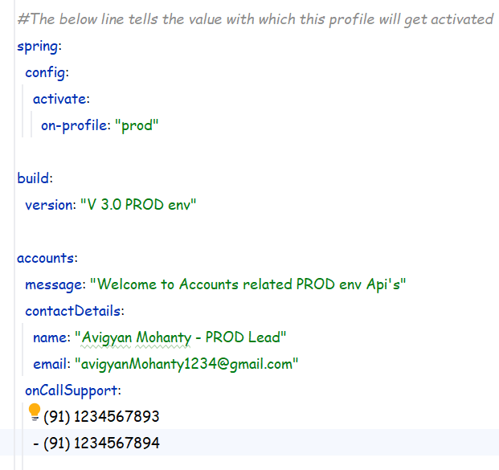 |
* Now lets see some test cases according to different situations how will our app perform.
* ## 🧪 Test Cases( Running directly from IDE(IntelliJ) Not on Jar files)

| Case No | Case Definition                                                                                                                                                                                                                                                                 | Case Input / Image                                                                                                                                                                                                               | Expected Output                                                                                                                                                                                                                                                                                                                                                                                                   |
|---------|---------------------------------------------------------------------------------------------------------------------------------------------------------------------------------------------------------------------------------------------------------------------------------|----------------------------------------------------------------------------------------------------------------------------------------------------------------------------------------------------------------------------------|-------------------------------------------------------------------------------------------------------------------------------------------------------------------------------------------------------------------------------------------------------------------------------------------------------------------------------------------------------------------------------------------------------------------|
| TC-01   | when we have all the config files but we have not shared any details to the application.yml<br/>As you can see that it will load the default configs if we dont mention the active profile                                                                                      | 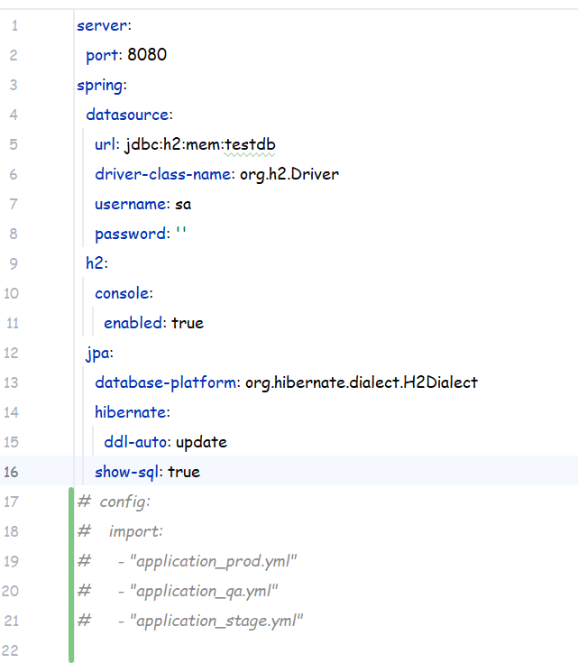                                                                                                                                                                                                        | 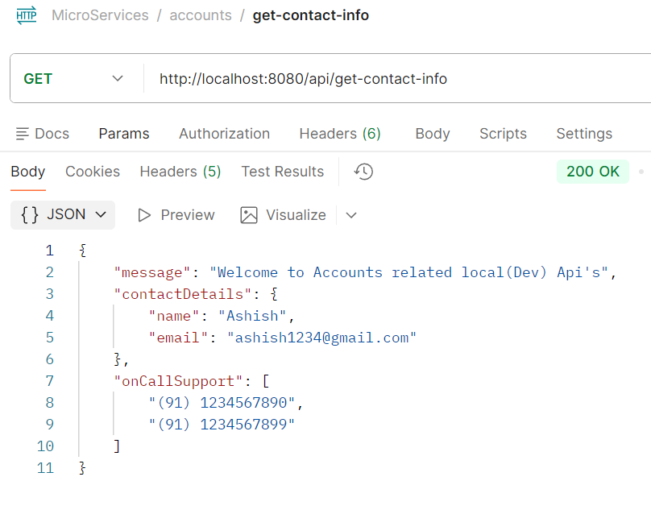                                                                                                                                                                                                                                                                                                                                                                                         |
| TC-02   | When we have provided the config files details to the application.yml but we have not activated any profile.<br/> You will observe here that still we are getting the default configs only.                                                                                     | 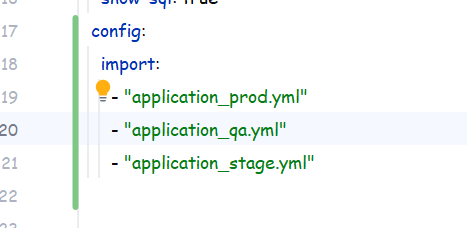                                                                                                                                                                                                        | * 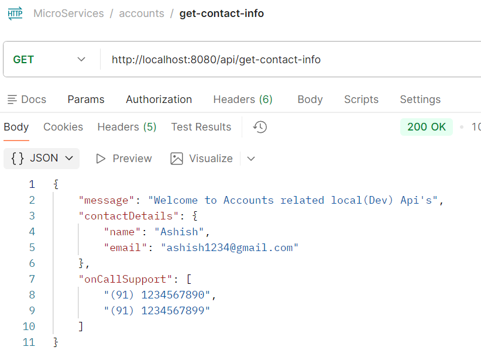<br/>* 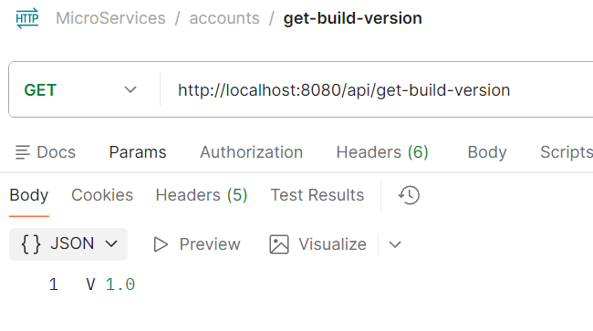                                                                                                                                                                                                                                                                                                                                                       |
| TC-03   | Lets activate a profile inside the application.yml file . We are hardcoding it which is not usually recommended . <br/> If you activate some other config then it will show the values of that config suppose you activate qa then it will show configs of application_qa.yml . | *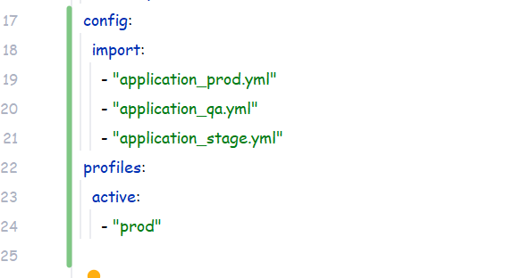<br/> * This will be shown in the terminal when you run ur app 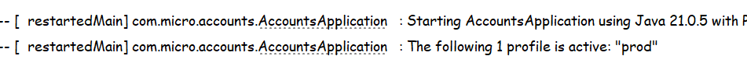                                                                                                               | 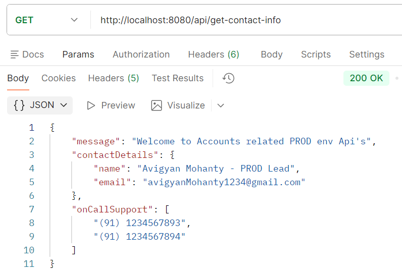 See finally we got the configs of the application_prod.yml<br/>* 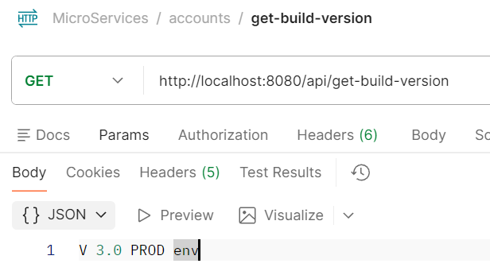                                                                                                                                                                                                                                                                                              |
| TC-04   | Lets see how to use the CLI and provide config details .<br/>We will use the embeded CLI of the IntelliJ .<br/> For this right click on your main app file and then select modify Run configuration then Run the app.                                                           | * First comment these lines in the application.yml <br/>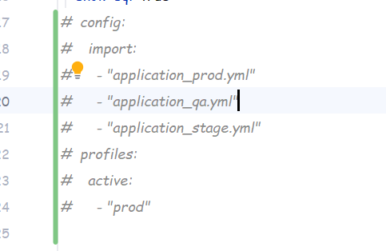     <br/> * Now fill the details here in the edit config before run menu<br/>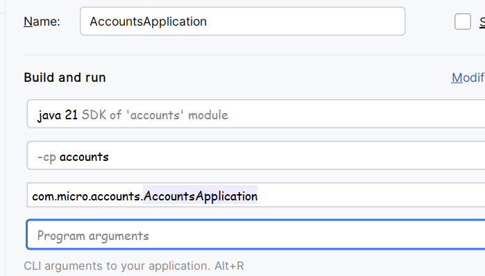 <br/> 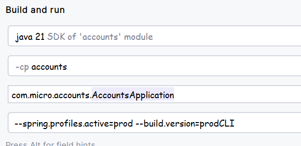         | * As soon as we give the configs in the CLI we can see this in the logs of the app :<br/> 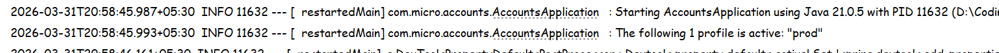 <br/>but when we are calling the API we are getting the configs of the default application.yml as can be seen. <br/> 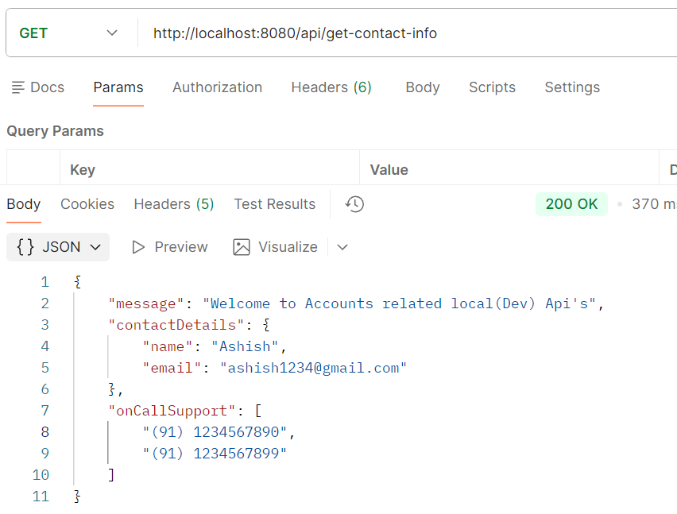<br/> we could only change the build.version because it is common property accross all the .yml files thats why <br/> 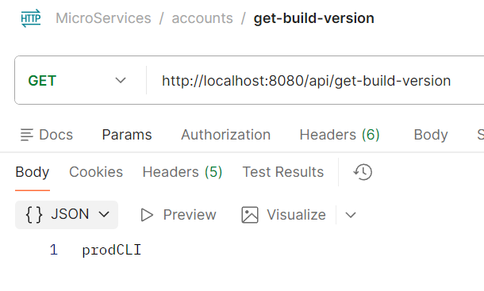 |
| TC-05   | Continuation of case 04 . We faced issues in case 04 because our application.yml has no idea about the other yml config files so lets uncomment the lines.                                                                                                                      | * First uncomment few lines from application.yml <br/>   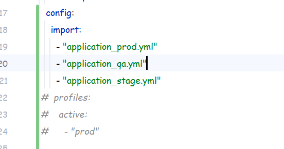 <br/> Now set the config <br/>  <br/> Now simply Run the main app file                                               | Finally we got the desired OP , the profile was finally used <br/> 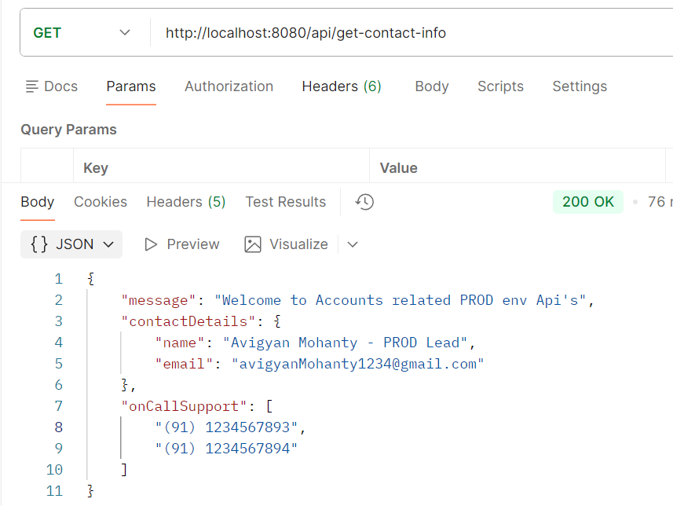 <br/> * The build version is    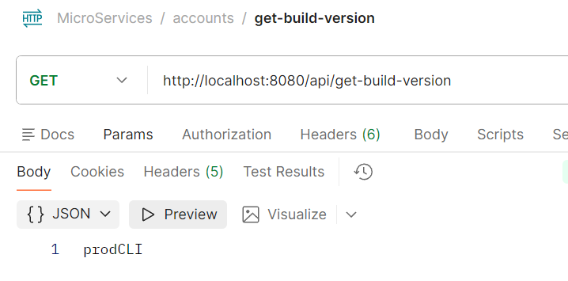                                                                                                                                                                                                                                                            |
| TC-06   | Continue case 05 , Now instead of using CLI we will use the JVM Options which is again iside the edit configuration before RUN menu.                                                                                                                                            | First enable the Vm options inside the edit configurations then we have to fill the commands here 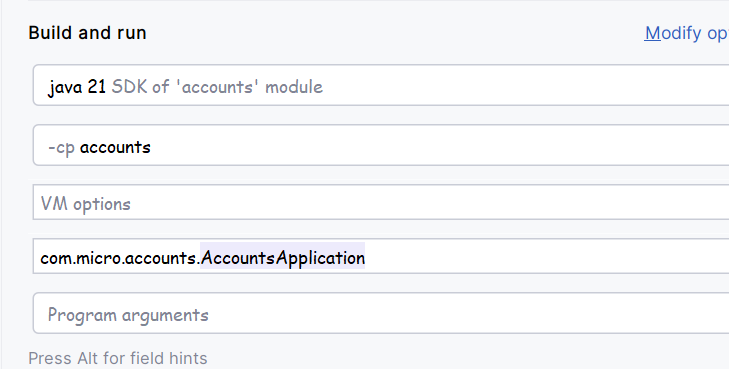 <br/> * 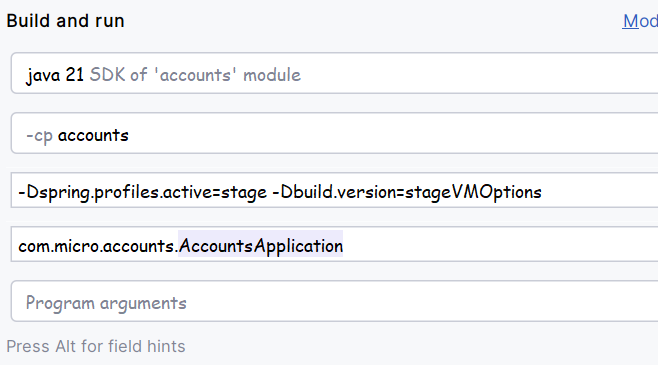                                                                    | As soon as you Run you will see this in your logs You will the stage getting activted <br/>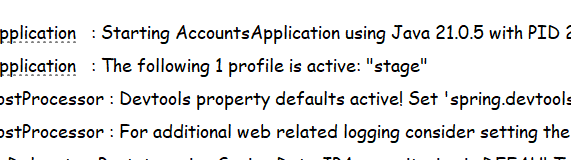 <br/> Now when we hit the API we can see that our application_stage.yml configs were loaded 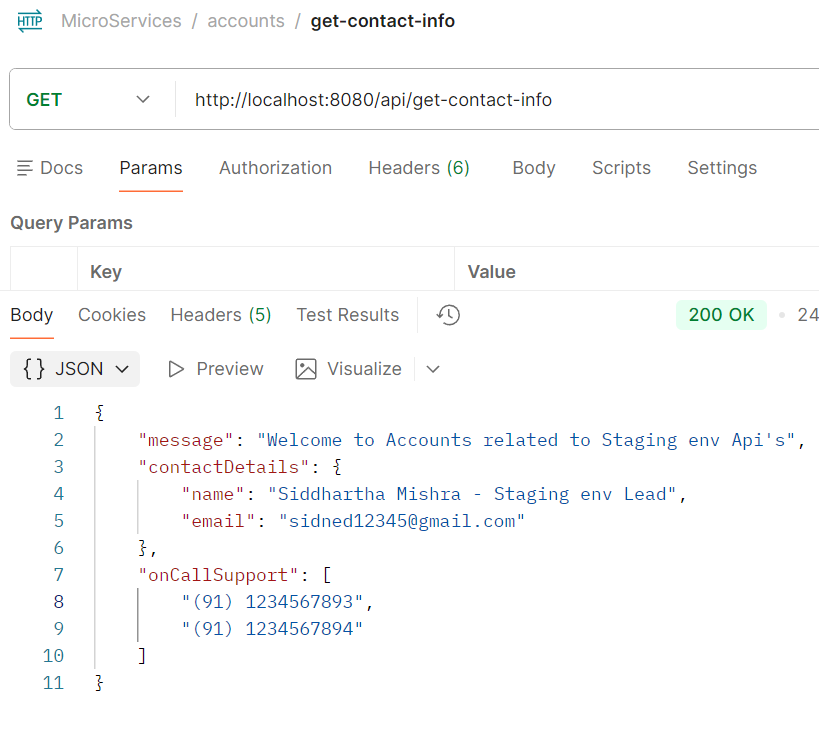 <br/> * build.version is     <br/> 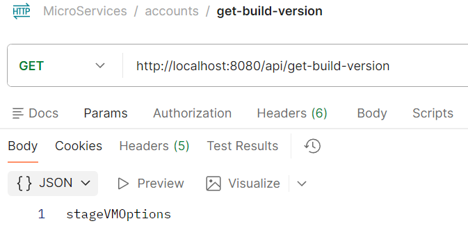                                                                                                           |
| TC-07   | Continue case 06 , Now we will use the inbuild ENV Variables option , we are not overRiding the sytem env variables we will simply inject some Variables during RUN Time again using the edit configuration                                                                     | We will have to fill the details here first <br/> 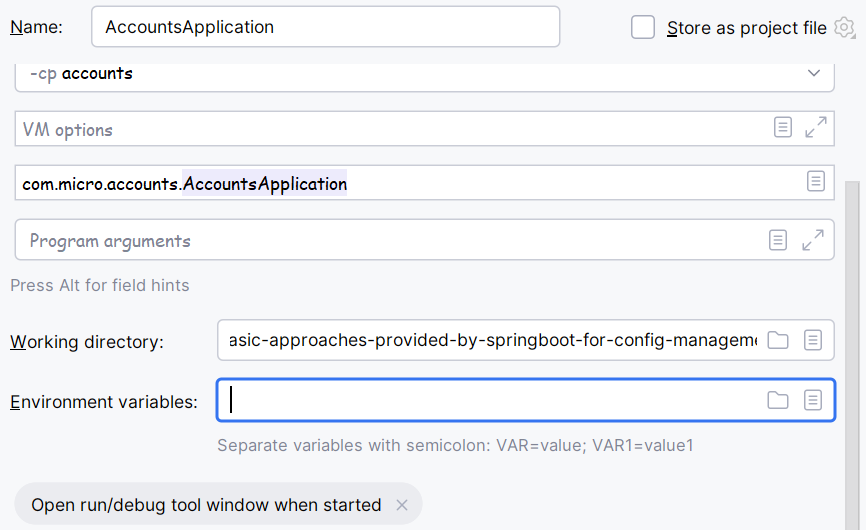 <br/> * Lets fill the details <br/> * You can either do this 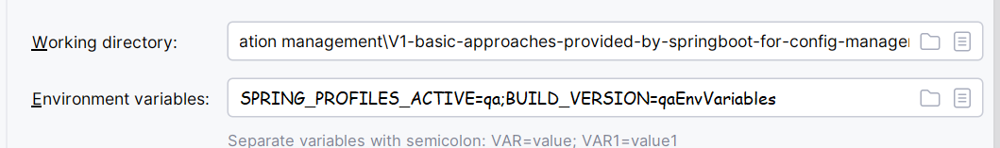  <br/> * Or you can expand the list and fill here one by one 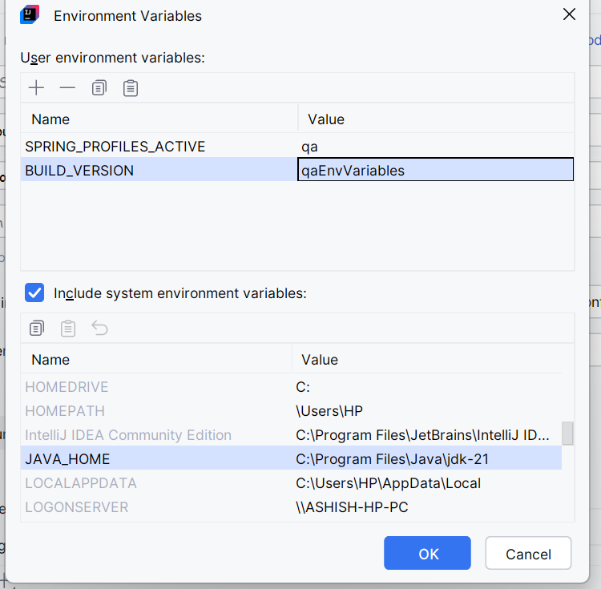 | As soon as you start your app you will see this in the logs <br/> * 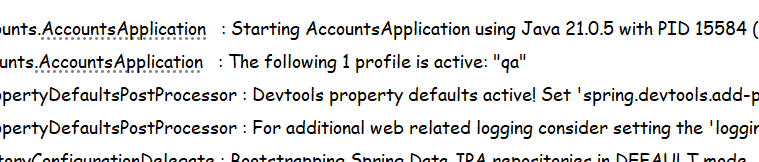 <br/> * Now when you hit the API's you will see <br/> *    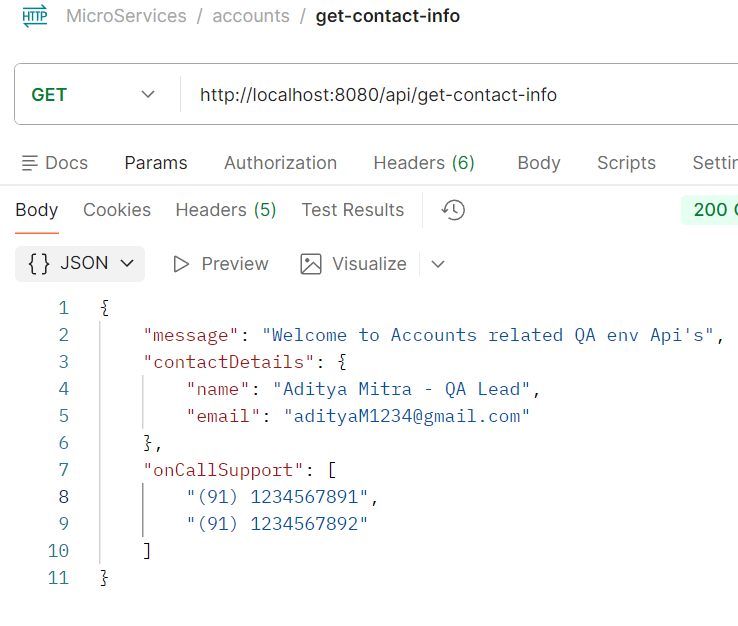 <br/>*  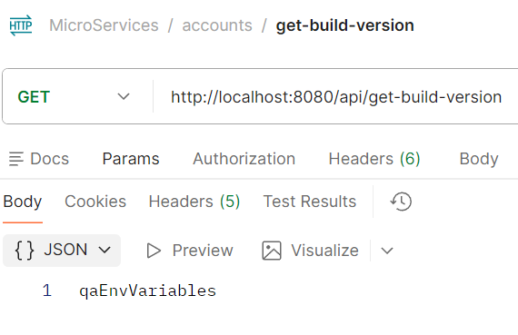                                                                                                                                                                                                                       |

[//]: # (| TC-08   | Description here                                                                                                                                                                                                                                                                | ![Input]&#40;images/tc8.png&#41;                                                                                                                                                                                                         | Output here                                                                                                                                                                                                                                                                                                                                                                                                       |)

[//]: # (| TC-09   | Description here                                                                                                                                                                                                                                                                | ![Input]&#40;images/tc9.png&#41;                                                                                                                                                                                                         | Output here                                                                                                                                                                                                                                                                                                                                                                                                       |)

[//]: # (| TC-10   | Description here                                                                                                                                                                                                                                                                | ![Input]&#40;images/tc10.png&#41;                                                                                                                                                                                                        | Output here                                                                                                                                                                                                                                                                                                                                                                                                       |)


* see we are getting the qa related configs as CLI has the highest priority
## 📊 Priority of all the possible ways to set values

| Case No | Description                                                                                                                                                                | Case Inputs                                                                                                                                                                                                                                             | Case Outputs                                                                                                                     | Conclusion                                                                                                                                                                                                                                                                                                                                                             |
|---------|----------------------------------------------------------------------------------------------------------------------------------------------------------------------------|---------------------------------------------------------------------------------------------------------------------------------------------------------------------------------------------------------------------------------------------------------|----------------------------------------------------------------------------------------------------------------------------------|------------------------------------------------------------------------------------------------------------------------------------------------------------------------------------------------------------------------------------------------------------------------------------------------------------------------------------------------------------------------|
| TC-01   | Suppose we have set some values in all the ways possible . Like we have set the values in CLI , JVM Options , ENV Variables , Hardcoded in the application.yml .           | * inside application.properties<br/>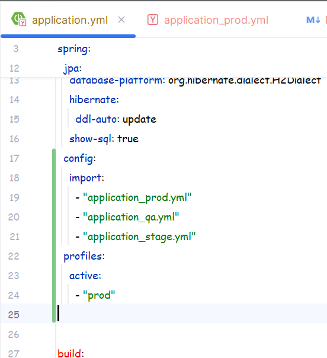<br/>* inside the application configuration<br/>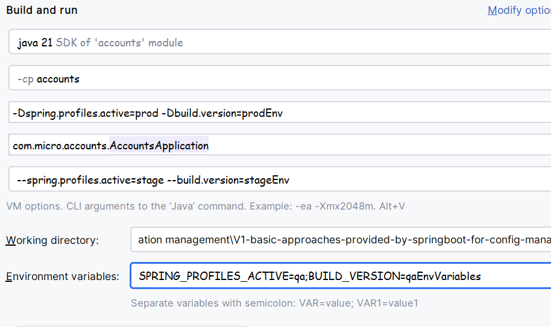 <br/>* Observe the values that i have given under different tabs now lets see which one gets highest preference. | * we get this in the logs <br/>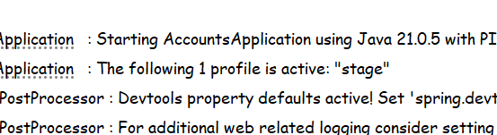 <br/>  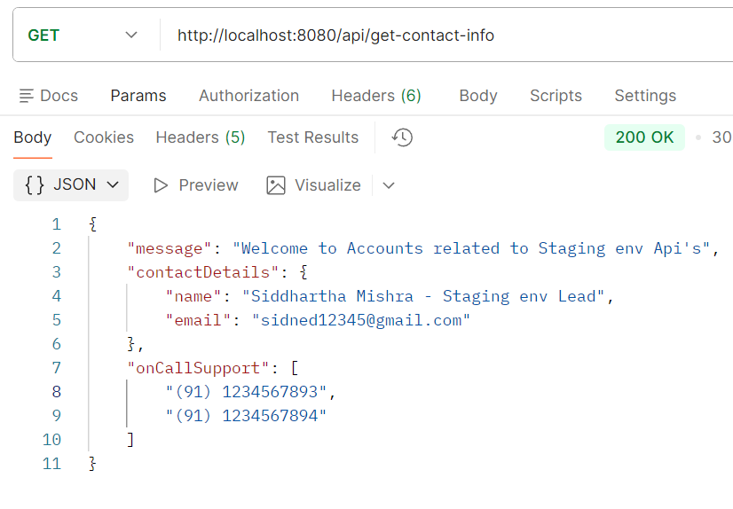 <br/> * 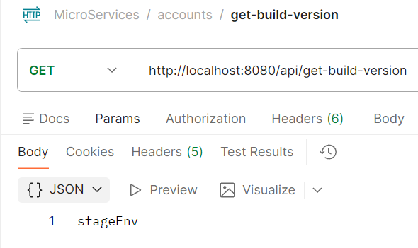      | We can see that the CLI has the highest preference as compared to any other method.                                                                                                                                                                                                                                                                                    |
| TC-02   | Now lets remove the CLI and check the preference for the remaning 3 ways . application.yml then JVM Options and ENV Variables way.                                         | * inside application.properties<br/><br/>* inside the application configuration<br/>  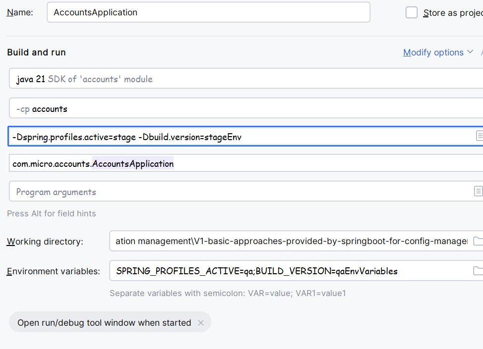 Observer as we have removed the CLI argements now see who gets the highest priority.                           | * we get this in the logs <br/>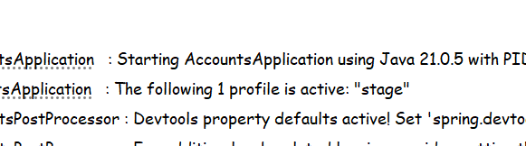 <br/>   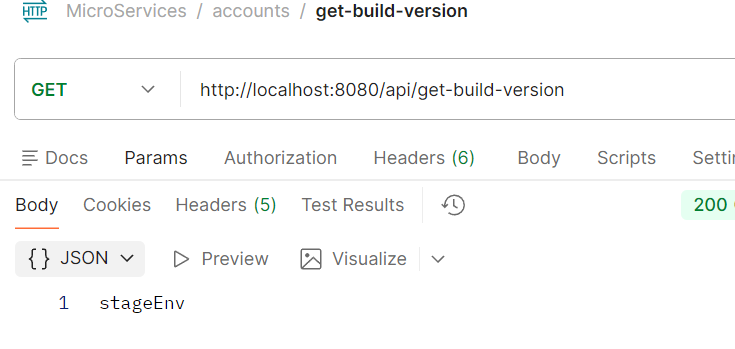 <br/>     * 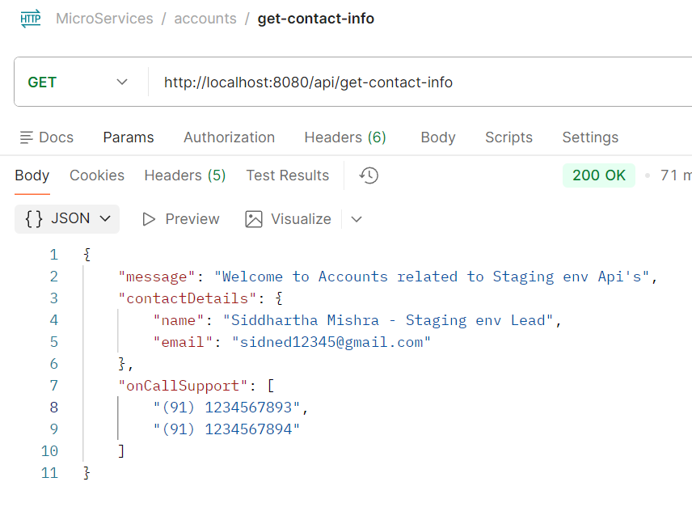 | From the screenshots on the left side we can conclude that out of JVM Options , hardcoded active profile in application.yml and ENV Variables inside the run configs  JVM Options has the highest priority after CLI arguments                                                                                                                                         |
| TC-03   | Now lets remove the JVM Options and check the priority of the remaining two ways. application.yml active profile hardcoded vs ENV Variables inside the run configurations. | * inside application.properties<br/><br/> * inside the application configuration <br/> 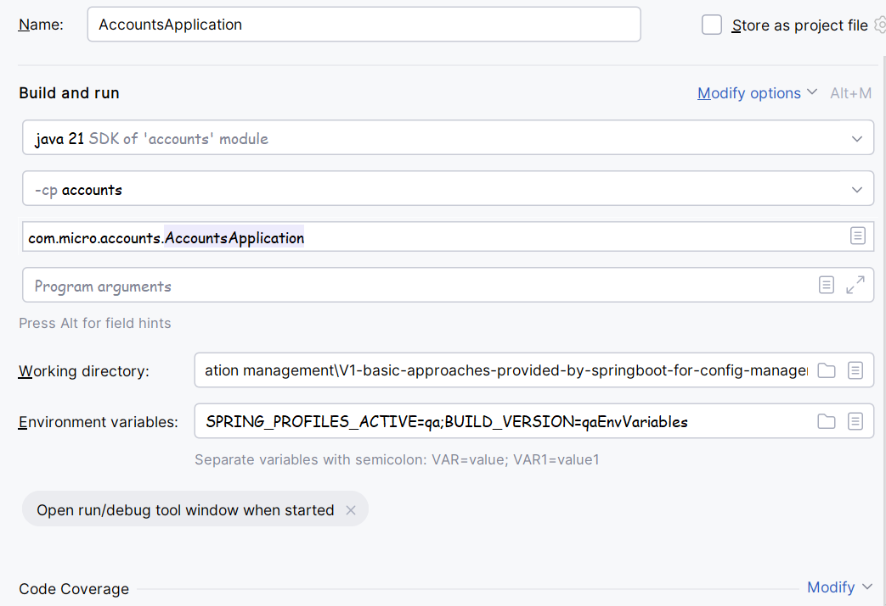 Observe we have removed the JVM Options lets see who has the highest priority now                             | * We get this in the logs <br/> 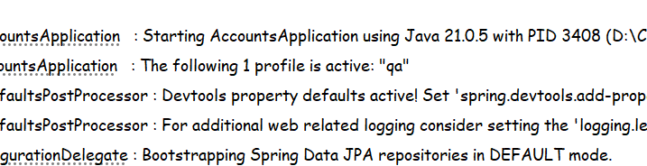 <br/> *  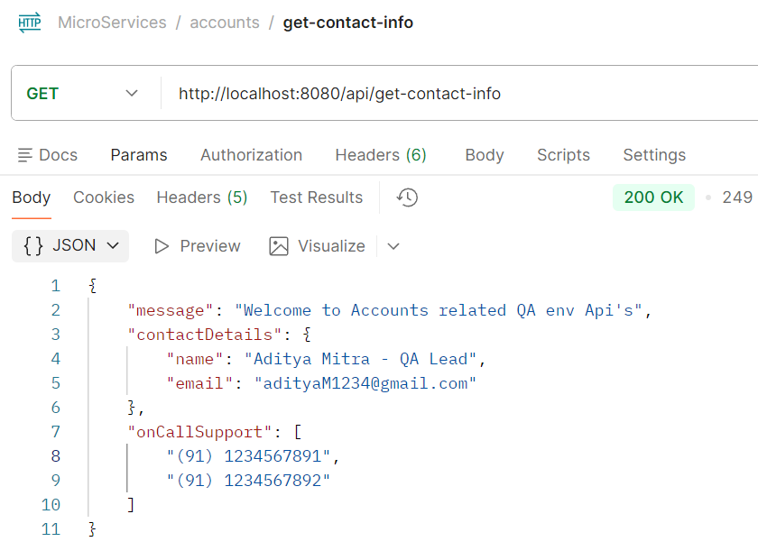 <br/>  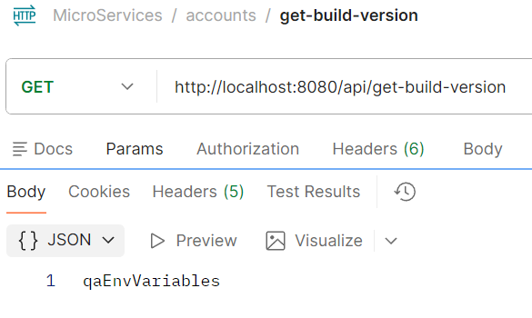    | From the screenshots on the left side we can finally conclude that out of ENV variables and hardcoded active profile inside the application.yml we have ENV variables as the highest priority and hardcoded one has the least priority . So even if you hardcode any active profile then still you change the profile of the JAR file before running it in the servers |

### CLI > JVM OPTIONS > ENV VARIABLES > HARDCODED ACTIVE PROFILE


---

### We will see how the configs management work in case of JAR Files which is actually used a lot:


## 🔥 Final Takeaway

Configuration management is not just a concept — it’s **critical for real-world scalable systems**.

If you do it right:

* Your app becomes flexible
* Deployment becomes smooth
* Maintenance becomes easy

If you do it wrong:

* You’ll struggle with bugs, environment issues, and security risks

---

