### First copy the docker-compose.yml from the section 5 repo:
* Start making changes there for our new images.
* First we will have to change the name of our existing images like we are using the s4 tagged images , but now since we have done so many changes to our app's so lets make them as s6.
* Before:
*  
* Now we will be creating new docker images with tag as s6 but before that lets just simply change the name.
* After: 
* 

* Now lets add the configserver app too as we want all of them to be pulled and start running together.
* 
* This is the specs that we have given it .
* Now it might look ok but another thing is there is some issue with our code's.
*  
* If you go and have a look at the default application.yml of any of our microservices then there we have hardcoded the configserver url as can be seen above .
* But the issue is do you think once our apps are going to run in their individual container they will recognize this localhost thing.
* Because configserver will be running in it's own isolated container and accounts-microservice will run in it's own one . so the thing is accounts container will never get the localhost:8071 as configserver so it will fail.
* So for this what we can do it we can set the config's manually for the services.
* Before in docker-compose under the accounts:
* 
* After:
* 
* if you observe in application.yml then you will see the configserver is set as :
* 
* So whenever we are setting the env values inside a docker compose file so we have to use the block lettes along with underscore thats why i have written here 
* environment: SPRING_CONFIG_IMPORT so what it does is it sets the internal property of our microservice when the container runs.
* Another thing : 
* What i have highlighted here is configserver which means we are telling our microservice that the link to the configserver is .
* But :  This highlighted one is the name of our docker service or image name that will be running whenever the compose file is executed.
*  same as the above.
* And yes the networks name that we have given for all our containers should be same otherwise they cannot communicate with each other properly.
* Now lets also set the profile which our microservice needs to use when the image becomes container so for that lets set the profile as dev: lets just use default.
* default will run the default properties like the yml file present inside the microservice directory as well as the other properties like the accounts.yml from github microservice-config will also get loaded.
*  So we have set the environement values as shown here another thing is mention the application_name again because we also have a profile with the name accounts.yml in the configserver too , so it will be considered as default otherwise it may cause issue's.
* Now mention the same properties for other services too.
* 

* docker compose files will be different for all the env's so lets create a directory : 
* docker-compose and then create 3 more directories default/dev , qa , prod.
* Copy the docker-compose.yml into the default directory.
*  see here.
* Now we are ready with our docker compose file , when we will start the docker-compose file it will create containers in the order in which we have mentioned the images details but all of them will start asyncronously which means ,
* We dont know if configserver would have started by the time other service have started so , lets make more changes to our docker compose file inorder so that it starts properly without any error's and our ms succesfully fetches all the required config info's.

### WE did our first commit till the above point with the name:
### "Directories created | Docker-compose file created | Configserver mapped properly | Environment variables also set for individual microservices"


________

# LiveNess and Readiness :
* In cloud environements we just deploy our app into some container orchestartion platforms like kubernetes and it is not our task to keep checking whether our app is up or not , whether it needs scaling up or scaling down , or is our app dead then it needs a new instance to be started , or maybe restarted.
* All this things are done by container orchestration platfroms now the thing is we dont do it manully so the conainter orchestrations platfroms do it but these platforms also need some info from the containers or running instance's so that they have the idea whether the app is running or not properly.
* And there comes the health probes or health checking parameters like liveness and readiness and there are other parameters too which helps the platform to understand the current situation of the running instance.

### First lets understand LiveNess:
A liveness probe sends signal that the container or application is either alive(passing) or dead(failing).
if the container is alive then no action is needed because the current state is good . if the continer is dead then an attempt should be made to heal the application by restarting it .

* In simple words liveness answers a true or false questions: "is the container alive or not"
* Platforms like kubernets invokes this probe to check the status at regular intervals inorder to perform any task be it scaleup or scaledown or restart etc.

### Readiness:
It bascially means whether your app is ready to recieve incoming requests or not.
Liveness means whether the app is up or not , but readiness means whether your app is free from all the background processings and is ready to receive signals or not.
Suppose you just started your app and the termainal is also showing the 1st line like started ut in it's background it has some dependencies like maybe postProcessing or DB processign or may be waiting for some other service , this things tells us whether the app is finally ready or not.
It's like a car is ready to be driven but do u have the DL , Registration , Fuel , Roadpermit etc then only your car will run on road right.

* There is a common scenario where your container is alive but cannot handle the incoming requests ( a common scenario during startup)
* you want the readiness probe to fail . So that traffic will not be sent to a container which isn't ready for it.
* if someone prematurely sends network traffic to the container it can cause the load balancer or router to return a 502 error to the client and terminate the request . The client would get a connection refused error message .
* In simple words readiness answers a true or false question is the container ready to receive network traffic or not.

In springboot apps actuator gathers the info for "Liveness" and "Readiness" information from the applicationavailaibilty interface and uses that information in deicated health indicators : LivensssStateHealthIndicator and ReadinessStateHealthIndicator. This indicators showup on the global health endpoint ("/actuator/health").
They are also exposed as seperate HTTP probes by using health groups: ```/actuator/health/liveness``` and ```/actuator/health/readiness```


#### Since we are concerned that first our configserver must start so for that case we will add the actuator dependency to it's pom.xml:
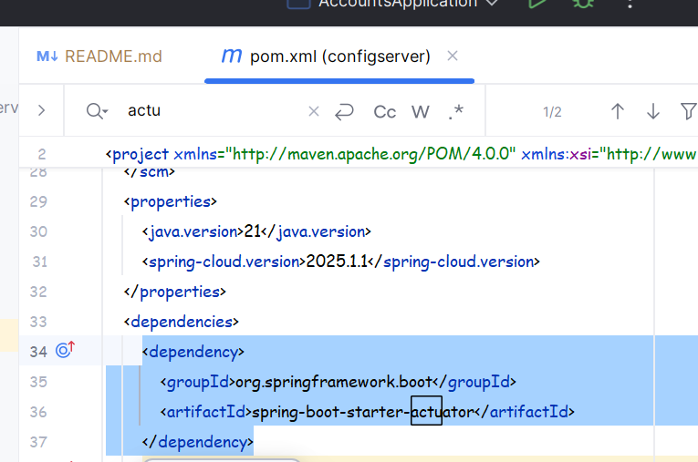 As can be seen here we have added it.
Now we need to make some code changes too , i mean changes in the application.yml:
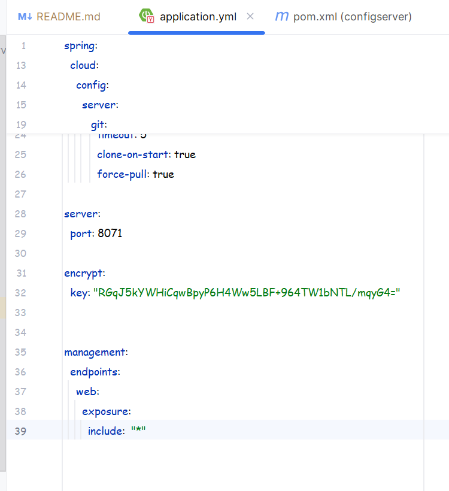 Here under the management we will have to add the some end points:
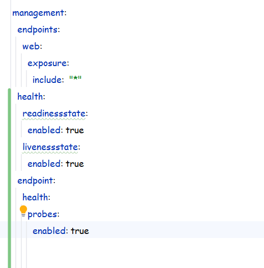 So what we have done is we have mentioned the readinessstate: enabled : true which means we have told the actuator to enable the readinessstate info of our app.
similarly livenessstate: enabled: true means we have told the actuator to show us the info of the livenessstate of our app.
then in the endpoints we have exposed the health probes which will allow us to hit the api's to check the info the liveness and readiness.

### Lets see how it works so lets just start our configserver app:
 upon hitting this api we get the below info on the screen:
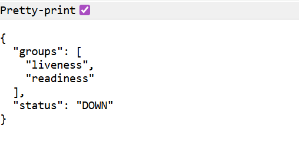 Status is down?
lets check the individual api's:

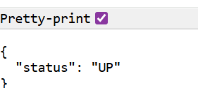
* Livenss is working fine. lets check for readiness:
* 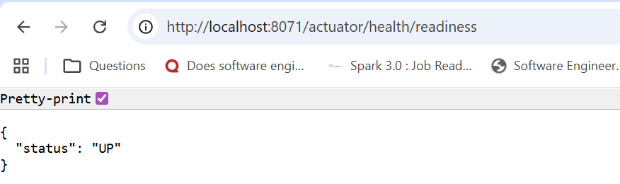
* It also says up but the status is down in actuator/health.
* It is because if you look at the terminal response of the configserver then you will see that it is dependent on the rabbitmq which we haven't yet started that's why it says down.
* 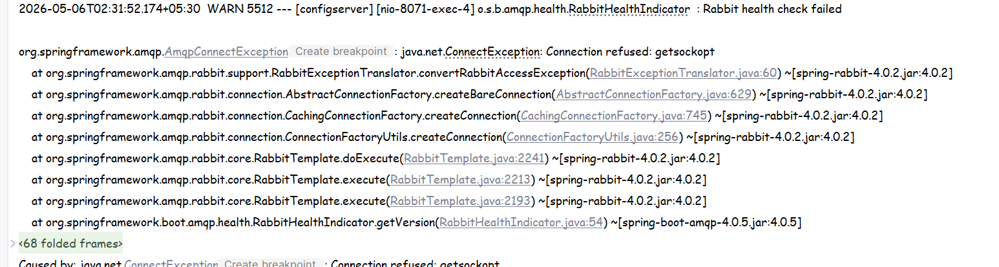 See here.
* Now lets just start the rabbitmq server and then lets do a check.
* 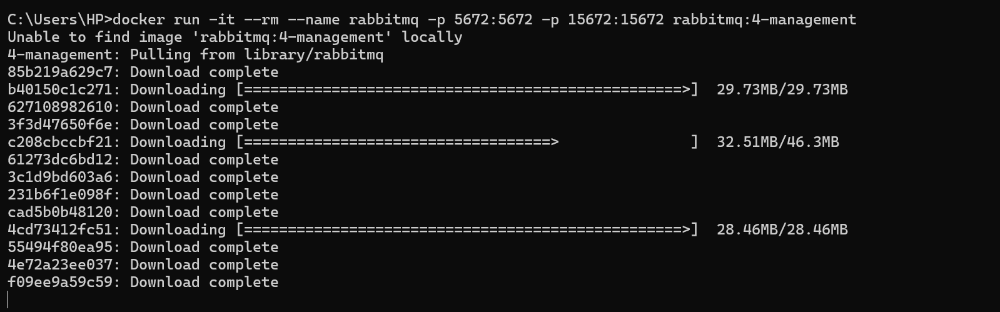 we have started the extraction process.
* 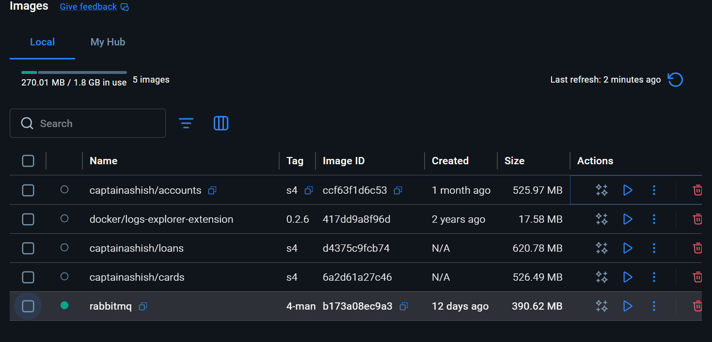
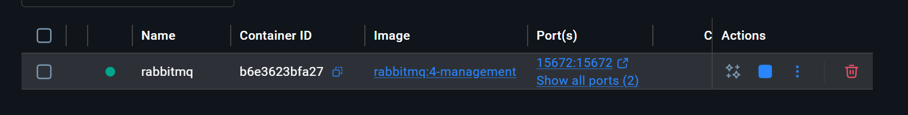
* Now again start the configserver and check the status this time:
* 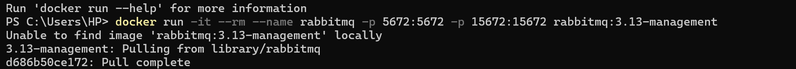 We used this version as the previous one had some issues.
* 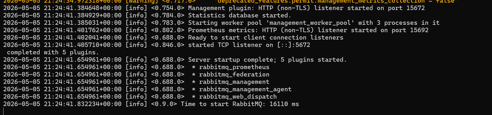 Once the rabbitmq runs this showsup on the terminal now lets start the configserver:
* 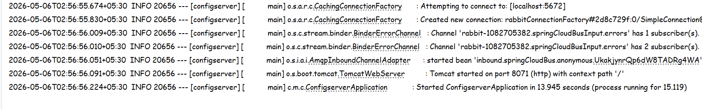 This shows up on the terminal.
* 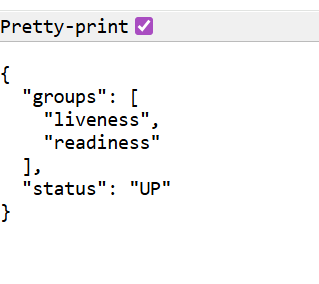 Now see the status it is UP .
* You can also check readiness and liveness they will show UP.
* which was earlier down so now we know how the health probes work.

### Now we will make our 2nd commit: In the next lecture we will make changes in the docker compose file as per our needs:
### commit message: "Made changes to the application.yml of configserver | Exposed some health probes like liveness and readiness | Added actuator dependency | Monitored the status and ran rabbitmq server locally on docker v 3.13"

___

# Updating the docker compose file as per liveness and readiness of the configserver:
* configserver:
* 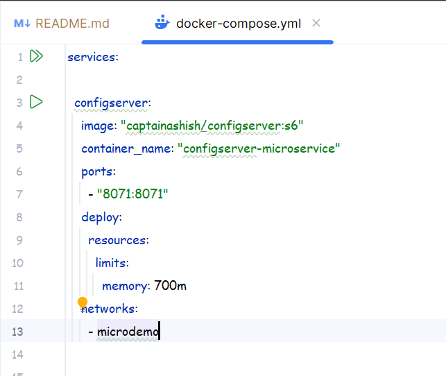
* It looks like this but lets make the necessary changes:
* 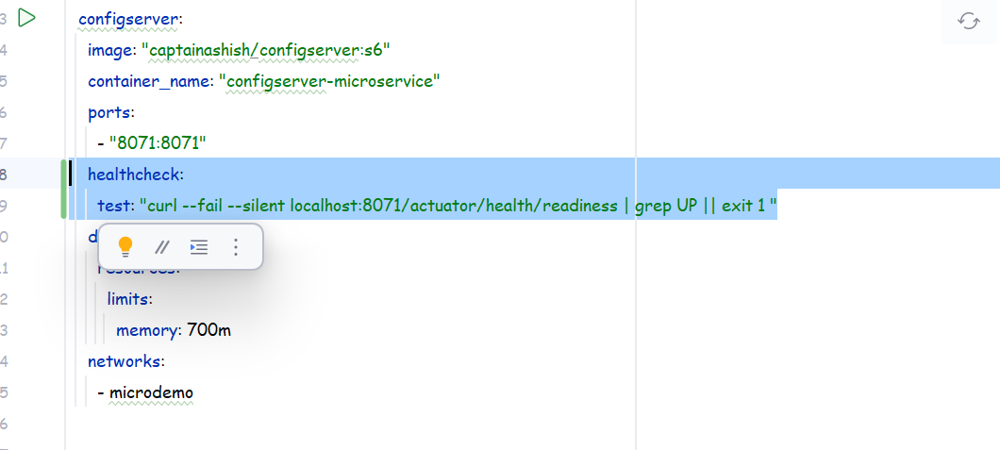 We have added this line of code.
* This will check whether the app is ready or not inside the container but the thing is as soon as container is created it will be executed and it will always return 1 exit as it takes time for the app to finally start and get ready inside the container.
* So for that lets add more things to it.
* 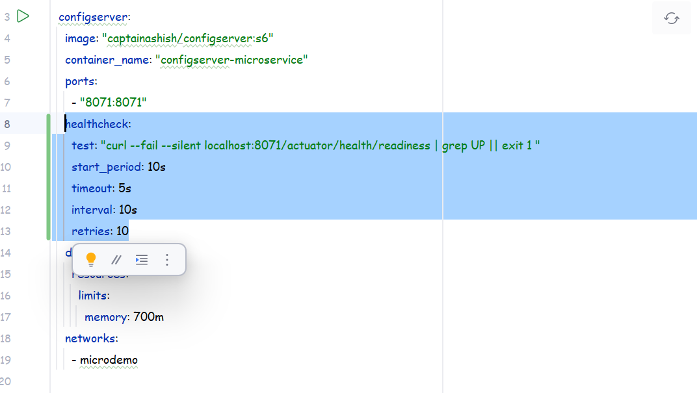 Now here start_period means execute the code after 10s of starting the container and wait for 5s at max to get a response .
* and if the response is false then try the same command again with a interval of 10s and at max try 10 retries , if it still fails then exit.
* Now we have set the healthcheck of the configserver but this only means we are requesting a check on the health of the configserver.
* Still till now we have not made it a dependency on other services so lets do that.
* Accounts: before : 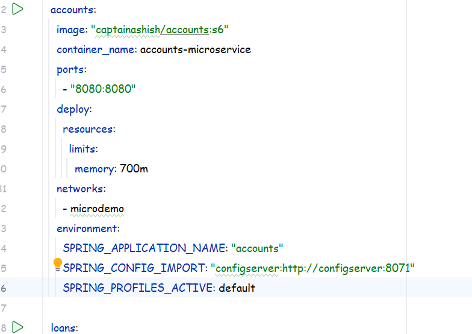
* Now: 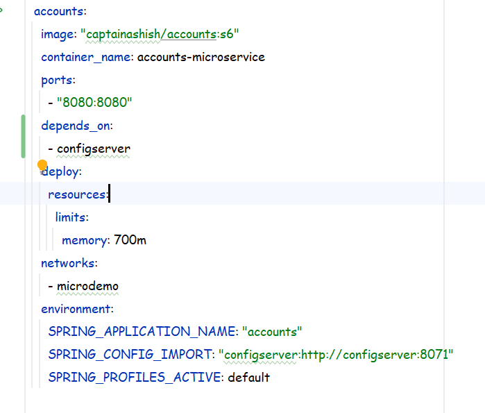 
* Now the accounts container depends on the configserver but still it will not wait for it to be ready and accounts container will run as soon as the configserver container starts and doesnt care if it is ready or not.
* so lets make the needed changes:
* 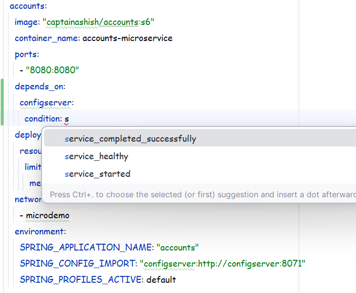 See there are many options but select service_healthy which means service is UP.
* Now copy the depends_on part to all the microservices:
* So once we have copied it to all of our microservices now only when the configserver has successfully started with a healthy status then only the other containers will be created and will run.
* Now we need to add one more service to our docker compose file that is the rabbitmq as all our services will be using the same rabbitmq server.
* 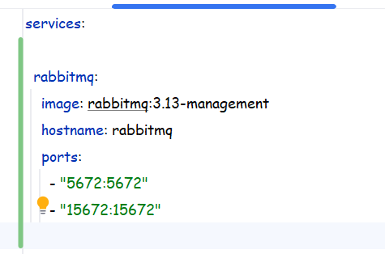 we have also added the rabbitmq but here also we need to add condtion that is rabbitmq should start first then only configserver will start as configserver is dependent on it.
* so for that lets make the changes: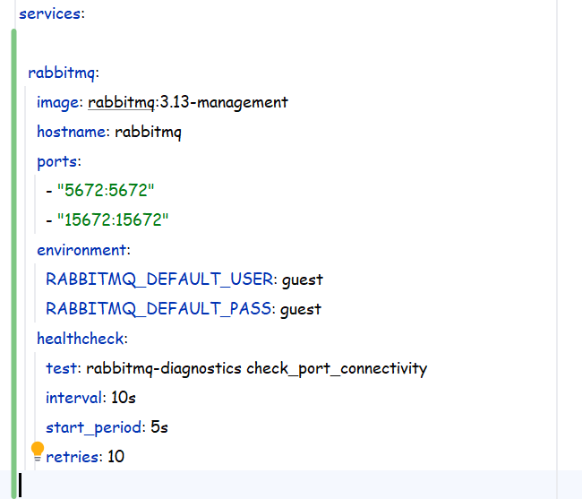 
* Now make changes under configserver service : make it dependent on it. 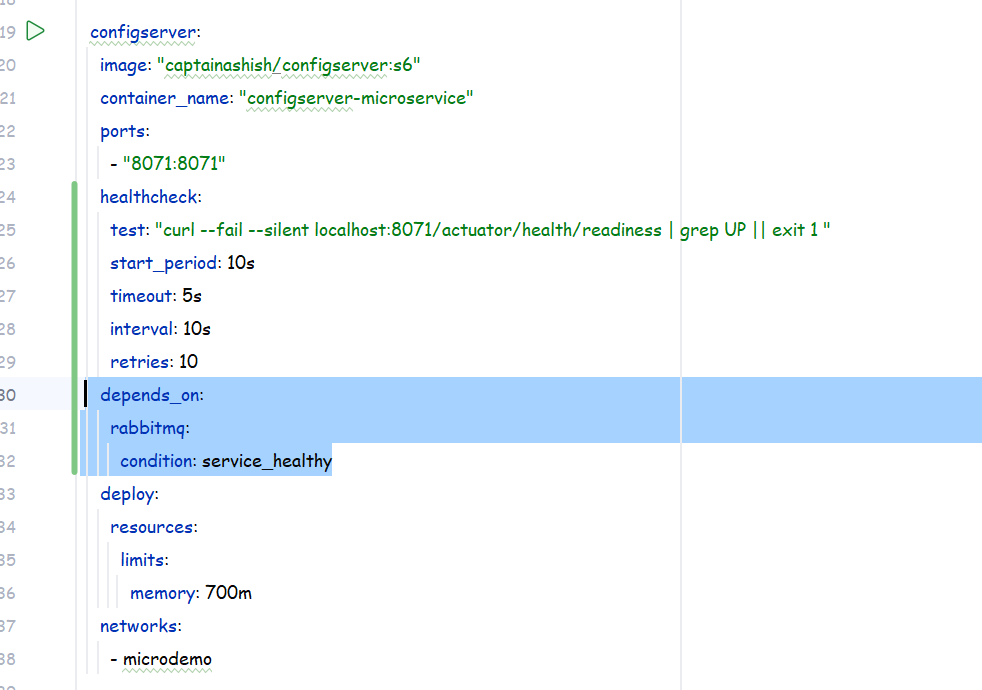
* See we made it dependent on rabbitmq , like now usless rabbitmq starts it will also not start.
* 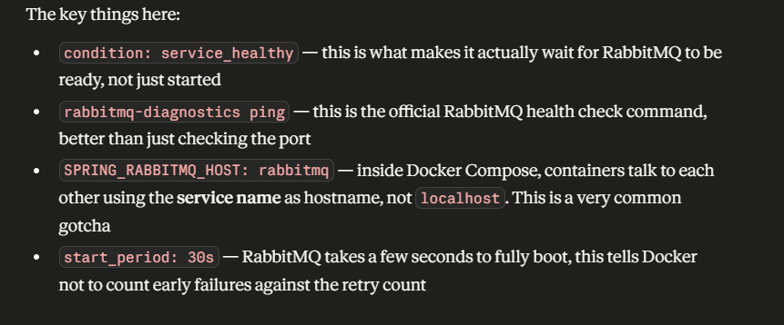
* You can also ask claude like how to make configserver dependent on rabbitmq , like unless rabbitmq starts successfully the configserve contianer wont be created.
* Our accounts , loans , cards also depend on the rabbitmq but we are not mentioning it in their dependson as they all are dependent on configserver and configserver is dependent on the rabbitmq thats why 
* rabbitmq->configserver then configserver-> rest of the containers.
* Also, we forgot to mention the network name in the rabbitmq it is important as we want to isolate all of our containers even inside the docker machine otherwise if tomorrow you start any other project then all of the projects will by default be running inside the default network of docker.


### 3rd Commit . Next lecture we will learn how we can optimize our docker compose files like we have so many things getting repeated again and again.
### commit message: "Updated the docker compose file as per the dependency of configserver on other containers | Added rabbitmq service and made it a dependency for the configserver | added some health check commands"

___

## Optimize the docker compose file:
* As we have noticed there are so many repeated lines in our docker compose files , like multiple lines are getting repeated again and again .
* In order to sort that out we can create a external file with the name common-config.yml which will have common commands inside them and we just need to use them directly inside our main docker compose file.
* Lets see what are the common lines:
* 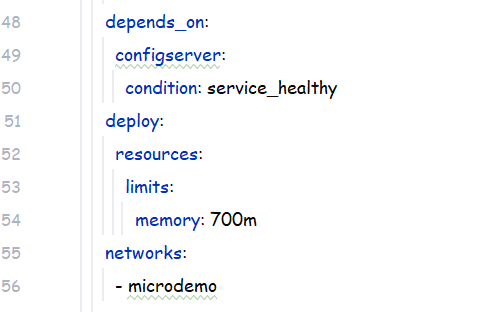 If you observer then these are some of the lines which are getting repeated again and again under almost all of the services like accounts , configserver , loans , cards .
* Lets first create a file with the name common-config.yml create it under the same default folder.
* 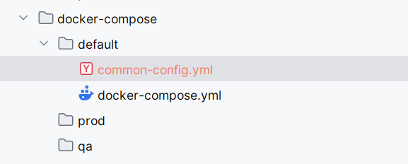 .
* Here inside the common-config.yml .
* 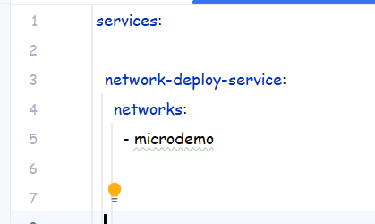 here just like normal docker-compose file we write service under which we can create as many as service as we want and give them any name.
* Like i have given here network-deploy-service under that i have my networks with the values as microdemo.
* If you remember how we used to set some random properties and values inside the application.yml like that we are also doing here.
* Now lets furthur improve:
* Now let me bring all the common configs of all the services like 
* Lets do it.
* 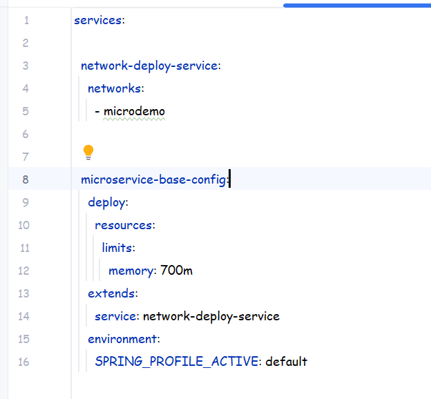 See here whenever we write extends and then we are giving below a service it means it will copy whatever is inside the service like now inside the microservice-base-config we are going to have networks: -microdemo too.
* You may ask why we need to create a service like network-deploy-service for networks and why cant we just include network inside the microservice-base-config?
* It is because we need only networks for the rabbitmq where as rest all are needed by other services.
* Lets try to spot more repetative stuffs:
* 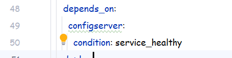 This one is getting repeated in almost all the service but we should not use this as in latest versions of docker we cannot use extends and depends_on togther so let it be hardcoded in the same docker compose file.
* Other than this we have : 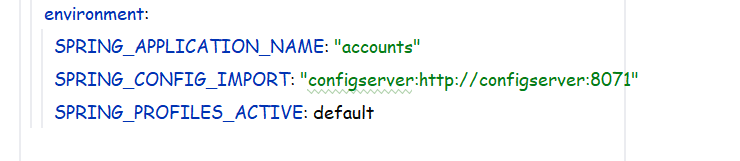
* Here we have the SPRING_CONFIG_IMPORT common in 3 of our services so.
*  This is the common config file now.
* Now we have to make changes in the docker compose file too:
* Before: 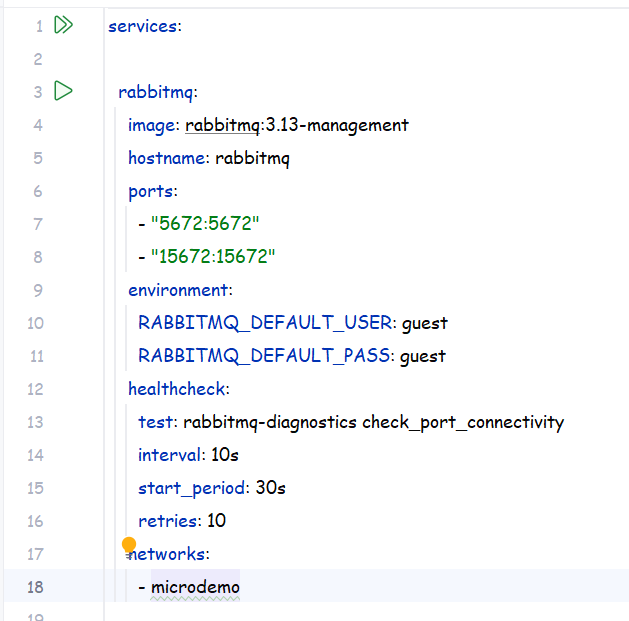
* After: 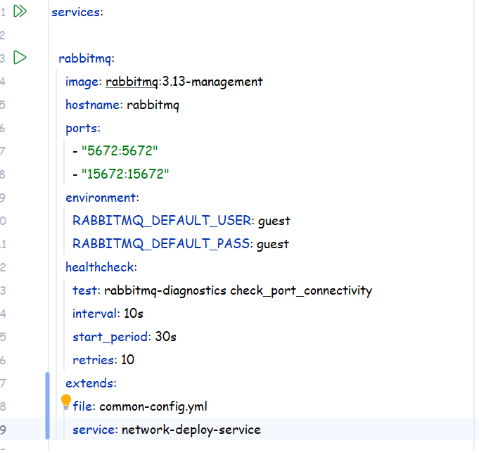 Changes that we made here.
* 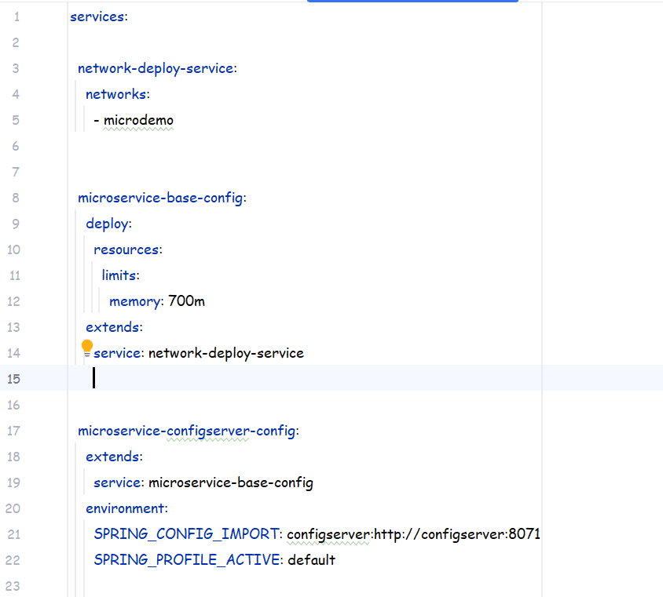 Made some changes here to the microservice-base-config.
* configserver: before: 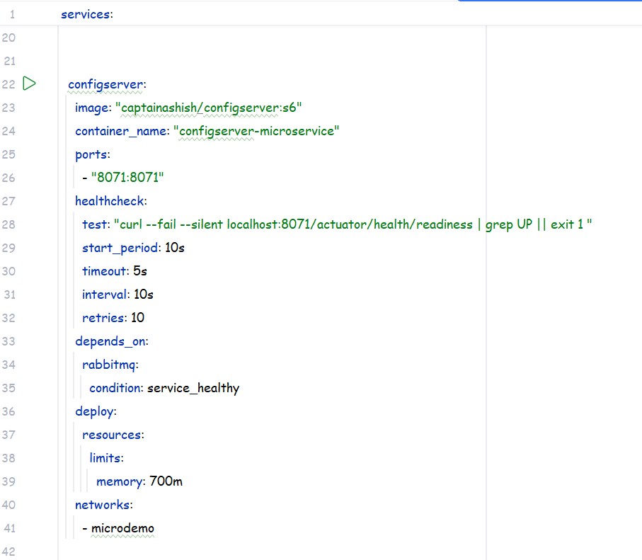
* After: 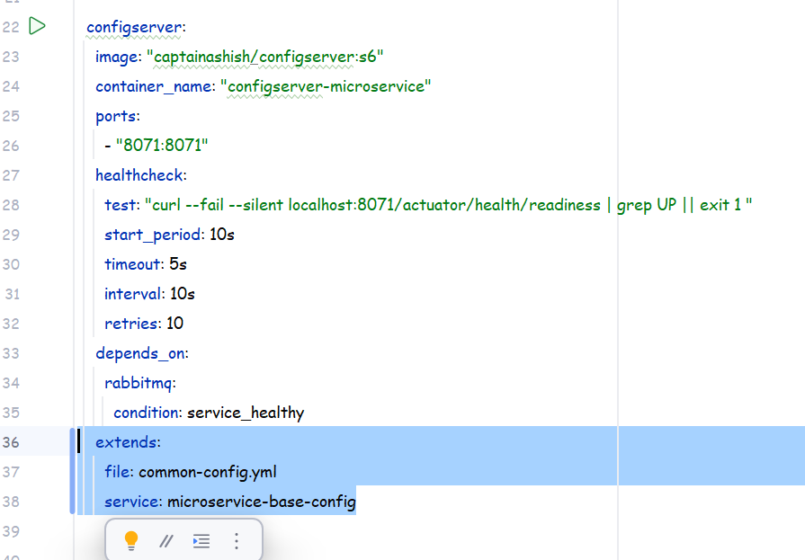
* Accounts: Before: 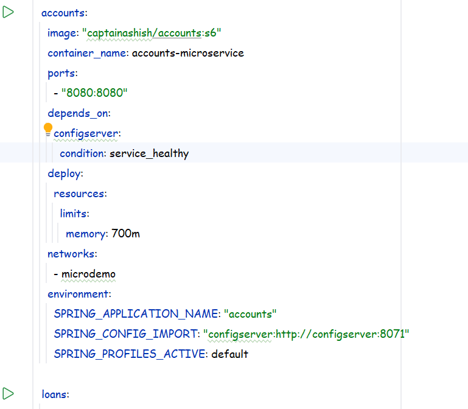
*  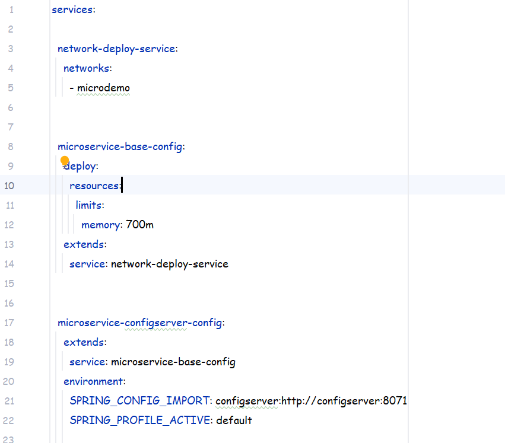 We will be importing the microservice-configserver-config as it has all that is needed.
* After: 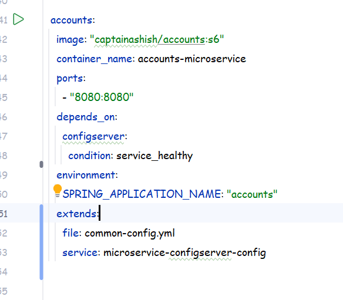 See how we have imported , in this way we will be doing to other services as well.
* Loans: Before: 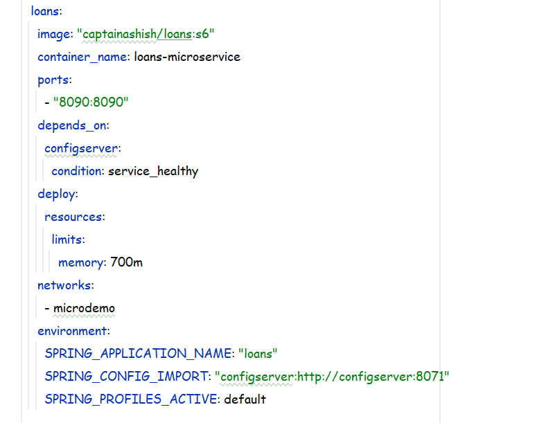
* After: 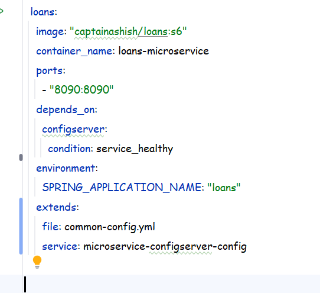
* Cards: Before: 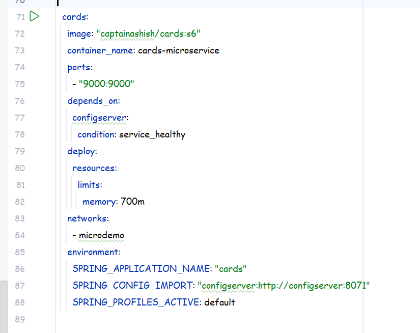
* After: 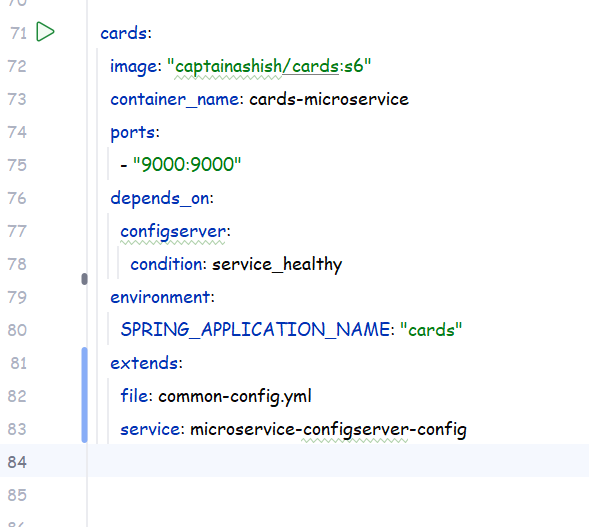
* So finally we are done with optimizing our compose file .


### 4th commit : Next lecture we will start creating and pushing our new docker images to the docker hub with the new tag s6.
### commit message: "Made optimizations to the existing docker compose file | common-config.yml | understood extends keyword "

