### First copy the docker-compose.yml from the section 5 repo:
* Start making changes there for our new images.
* First we will have to change the name of our existing images like we are using the s4 tagged images , but now since we have done so many changes to our app's so lets make them as s6.
* Before:
* 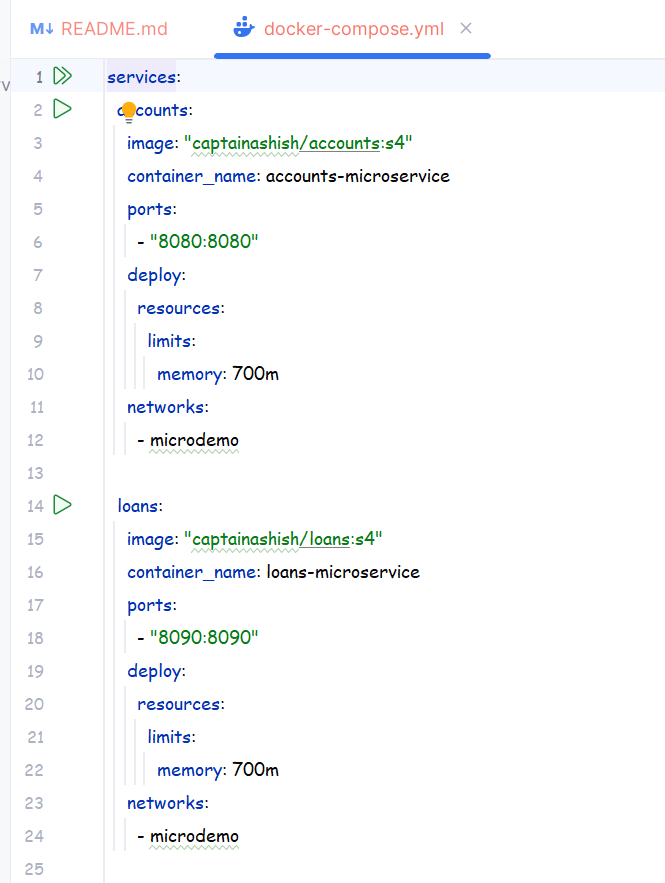 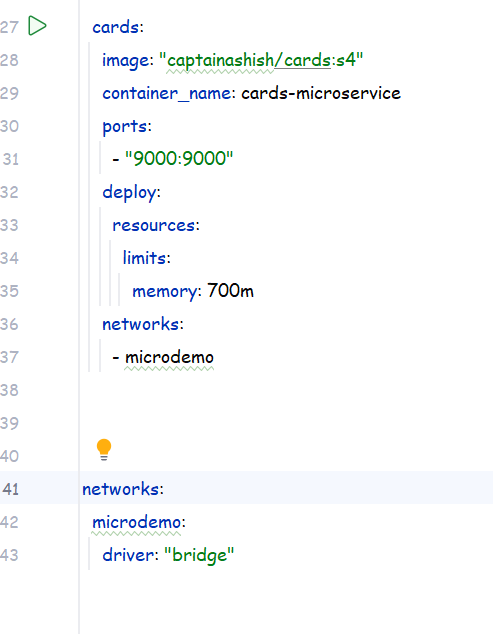
* Now we will be creating new docker images with tag as s6 but before that lets just simply change the name.
* After: 
* 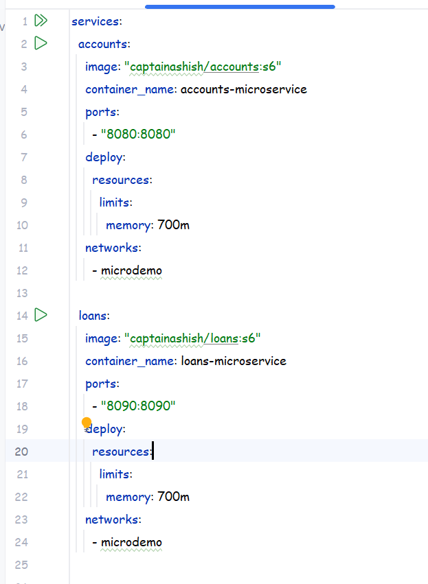
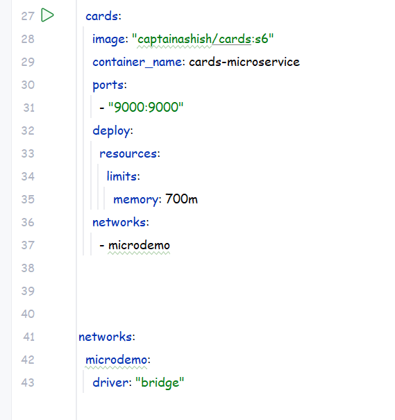
* Now lets add the configserver app too as we want all of them to be pulled and start running together.
* 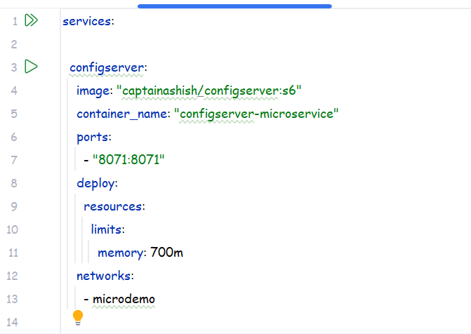
* This is the specs that we have given it .
* Now it might look ok but another thing is there is some issue with our code's.
* 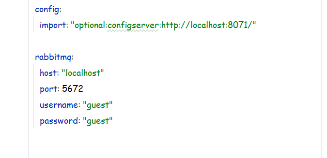 
* If you go and have a look at the default application.yml of any of our microservices then there we have hardcoded the configserver url as can be seen above .
* But the issue is do you think once our apps are going to run in their individual container they will recognize this localhost thing.
* Because configserver will be running in it's own isolated container and accounts-microservice will run in it's own one . so the thing is accounts container will never get the localhost:8071 as configserver so it will fail.
* So for this what we can do it we can set the config's manually for the services.
* Before in docker-compose under the accounts:
* 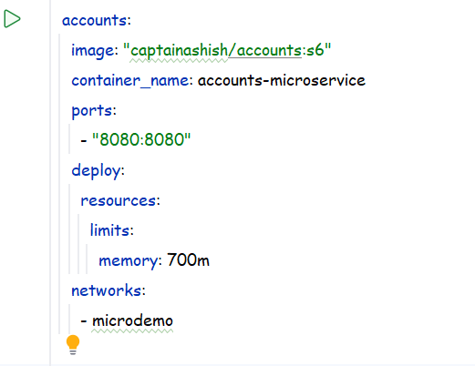
* After:
* 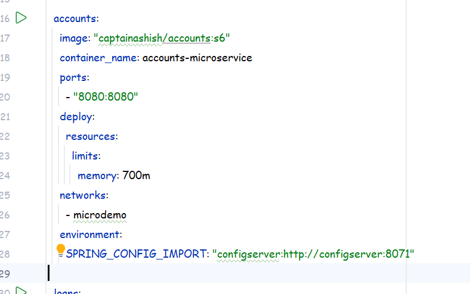
* if you observe in application.yml then you will see the configserver is set as :
* 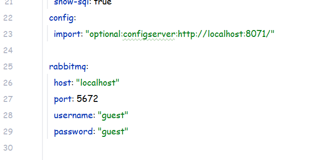
* So whenever we are setting the env values inside a docker compose file so we have to use the block lettes along with underscore thats why i have written here 
* environment: SPRING_CONFIG_IMPORT so what it does is it sets the internal property of our microservice when the container runs.
* Another thing : 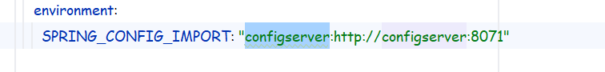
* What i have highlighted here is configserver which means we are telling our microservice that the link to the configserver is .
* But : 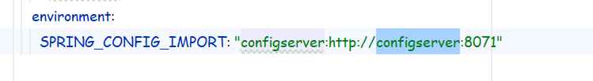 This highlighted one is the name of our docker service or image name that will be running whenever the compose file is executed.
* 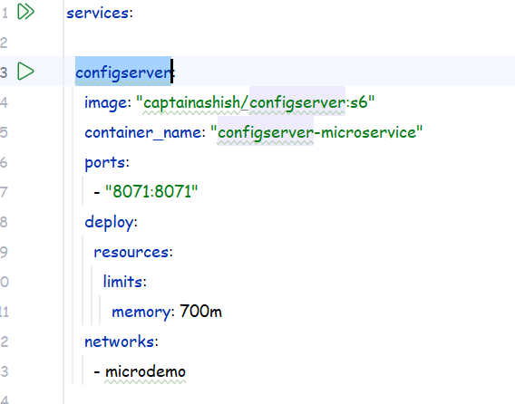 same as the above.
* And yes the networks name that we have given for all our containers should be same otherwise they cannot communicate with each other properly.
* Now lets also set the profile which our microservice needs to use when the image becomes container so for that lets set the profile as dev: lets just use default.
* default will run the default properties like the yml file present inside the microservice directory as well as the other properties like the accounts.yml from github microservice-config will also get loaded.
* 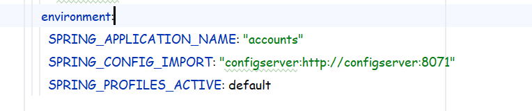 So we have set the environement values as shown here another thing is mention the application_name again because we also have a profile with the name accounts.yml in the configserver too , so it will be considered as default otherwise it may cause issue's.
* Now mention the same properties for other services too.
* 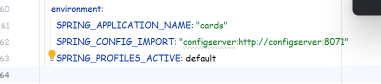
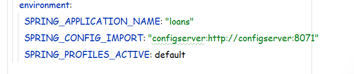
* docker compose files will be different for all the env's so lets create a directory : 
* docker-compose and then create 3 more directories default/dev , qa , prod.
* Copy the docker-compose.yml into the default directory.
* 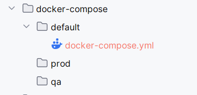 see here.
* Now we are ready with our docker compose file , when we will start the docker-compose file it will create containers in the order in which we have mentioned the images details but all of them will start asyncronously which means ,
* We dont know if configserver would have started by the time other service have started so , lets make more changes to our docker compose file inorder so that it starts properly without any error's and our ms succesfully fetches all the required config info's.

### WE did our first commit till the above point with the name:
### "Directories created | Docker-compose file created | Configserver mapped properly | Environment variables also set for individual microservices"
